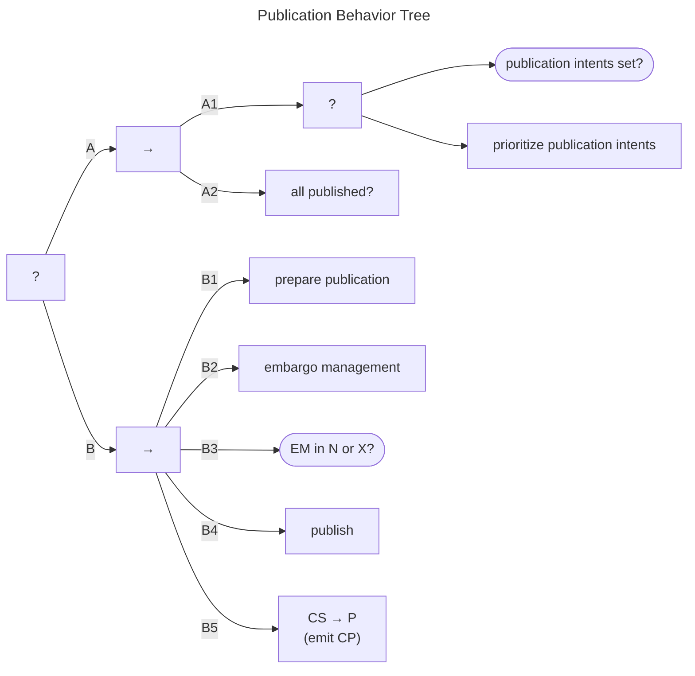
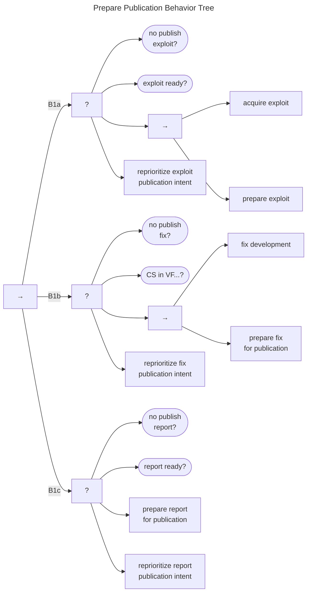

# Publication Behavior

The Publication Behavior Tree is shown in the following diagram.
(A) It begins by ensuring that the Participant knows what they intend to publish (A1), followed by a check to
see if that publication has been achieved (A2).
Assuming that work remains to be done, the main publish sequence commences on the second branch (B).

!!! tip inline end "Embargoes and Publication"

    The [embargo management](em_bt.md) task here is intended as a simple check to ensure that no
    embargo remains active prior to publication.
    However, since we describe that behavior [elsewhere](em_bt.md), we will not repeat it here.
    Note that the [EM](../process_models/em/index.md) process may result in [early termination](../process_models/em/early_termination.md) of an existing embargo 
    if the Participant has sufficient cause to do so.

(B1) The publication process begins with [preparation for publication](#prepare-publication-behavior),
described below, followed by a pre-publication [embargo check](em_bt.md) (B2 and B3 combined).

Once these subprocesses complete, the publish task (B4) fires, the case state
is updated to $q^{cs} \in P$, and a $CP$ message emits (B5).

## Prepare Publication Behavior

The Prepare Publication Behavior Tree is shown below.
Note that it continues branch (B1) from the [Publication Behavior Tree](#publication-behavior) above.

There are separate branches for
publishing exploits, fixes, and reports.

- (B1a) The publish exploit branch succeeds if either no exploit publication is intended, if it is [intended
  and ready](acquire_exploit_bt.md), or if it can be acquired and prepared for publication. 
- (B1b) The publish fix branch succeeds if the Participant does not intend to publish a fix (e.g., if they are not the Vendor), if a [fix is ready](fix_dev_bt.md), or
  if it can be developed and prepared for publication.
- (B1c) The publish report branch is the simplest and succeeds if either no publication is intended or if the report is ready to go.

Once all three branches have completed, the behavior returns *Success*.

