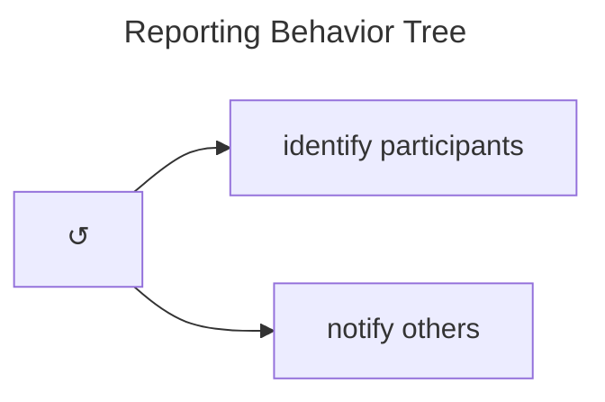
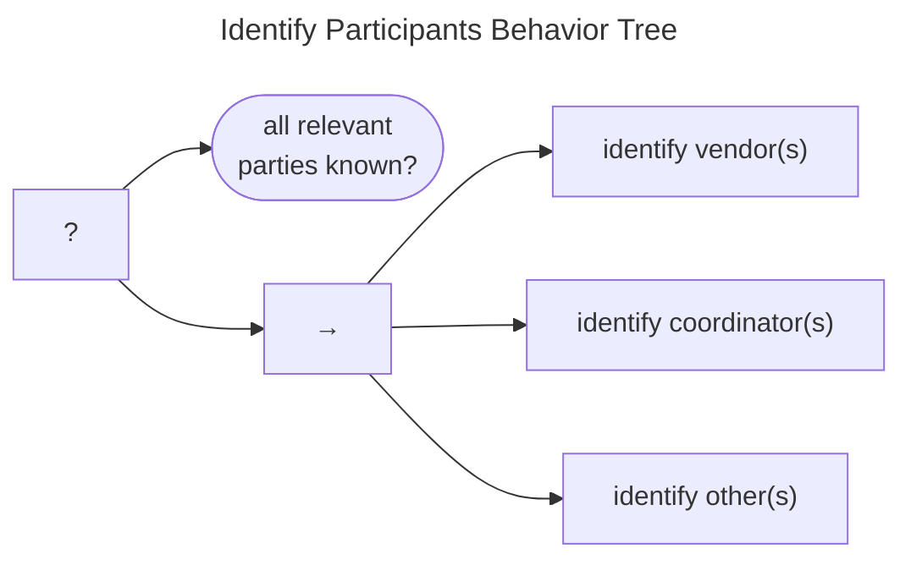
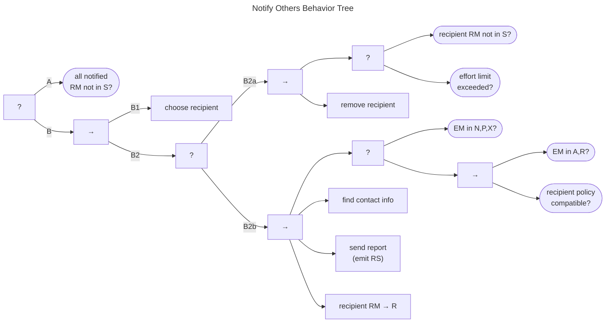

# Reporting Behavior

The [*CERT Guide to Coordinated Vulnerability Disclosure*](https://certcc.github.io/CERT-Guide-to-CVD)
describes the reporting phase as the process of identifying parties that need to be informed about the vulnerability
and then notifying them.
Reporting only works if the intended recipient has the ability to receive reports, as outlined in
our introduction of the [RM *Received* state](../process_models/rm/index.md#the-received-r-state).

The Reporting Behavior Tree is shown in the figure below.

The tree describes a Participant that performs reporting until either their effort limit is met, or they run out of
Participants to notify.

## Identify Participants Behavior

!!! tip inline end "Participant Inclusion Choices are left to Participants"

    Note that we are intentionally avoiding setting any requirements about *who* is relevant to a case.
    We leave that decision to each Participant's judgment.
    Further discussion of this topic is available in [Adding Participants](../process_models/em/working_with_others.md). 

The Identify Participants Behavior Tree, shown in the following diagram, ends when all relevant parties have been
identified.
Until that condition is met, the Participant can proceed with identifying Vendors, Coordinators, or other
parties relevant to the coordination of the case.

## Notify Others Behavior

The Notify Others Behavior Tree is shown in the figure below.

(A) The goal of this behavior tree is for all intended recipients to receive the report, thereby reaching the $q^{rm} \in R$ state.

(B) Each pass through this part of the tree chooses a Participant from a list of eligible recipients constructed in the Identify
Participants Behavior.
(B1) The method for choosing the recipient is left unspecified since Participants can prioritize recipients how they see fit.

The process proceeds to (B2a) clean up the eligible recipients list when either the recipient is already believed to be in
$q^{rm} \in R$ or if the effort expended in trying to reach the recipient has exceeded the Participant's limit.
Such limits are entirely left to the discretion of each Participant.
If the chosen recipient is pruned by this branch, the branch returns *Success*.

If the chosen recipient was not pruned, then the cleanup branch fails and execution transfers to the second branch to
notify the recipient.

(B2b) The first step in the notification branch is a check for an existing embargo.
If the embargo management state is one of $q^{em} \in \{ N,P,X\}$, there is no active embargo, and the Participant
can proceed with notification.

Otherwise, in the case of an already active embargo (i.e., $q^{em} \in \{A,R\}$), there is an additional check to
ensure that the potential recipient's policy is compatible with any existing embargo.
This check allows for a reporting Participant to skip a recipient if they are likely to cause premature termination of
an extant embargo.

Once at least one of these checks is passed, the notification sequence proceeds through finding the recipient's contact
information, sending the report, and updating the Participant's knowledge of the recipient's report management state.
