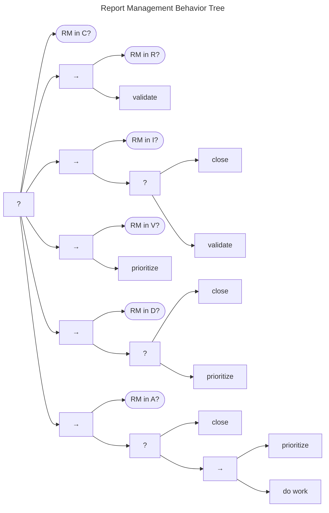
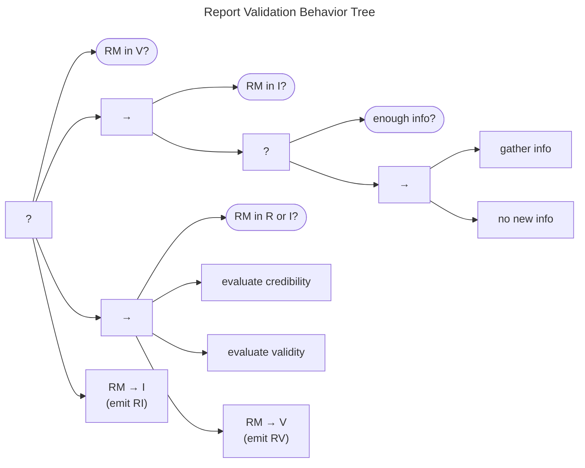
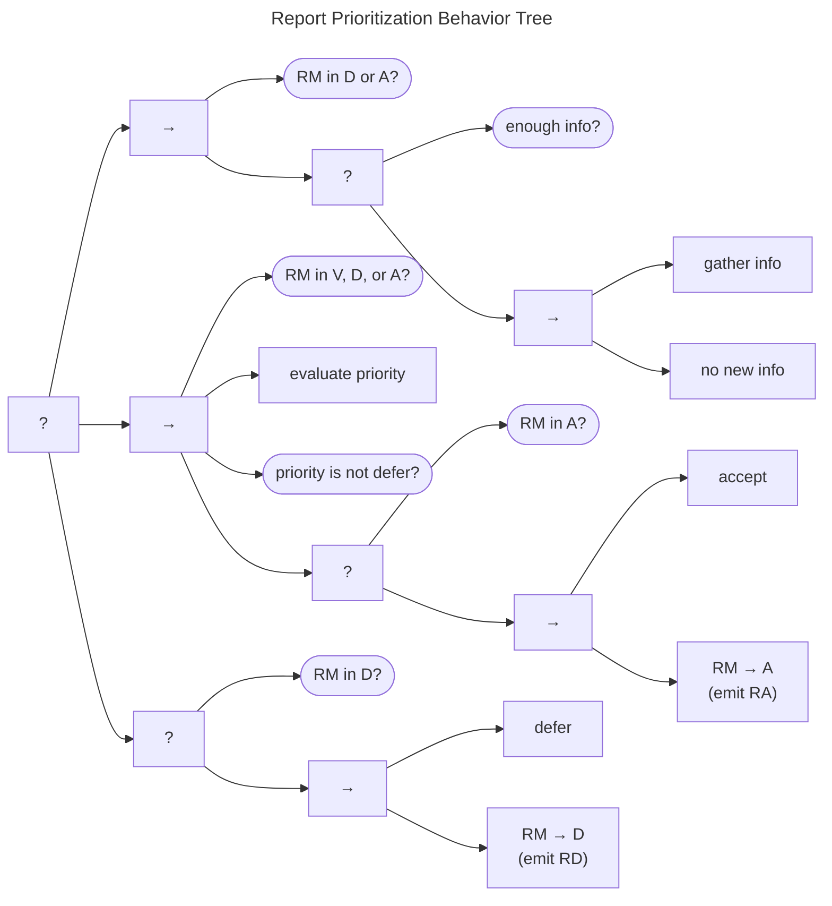
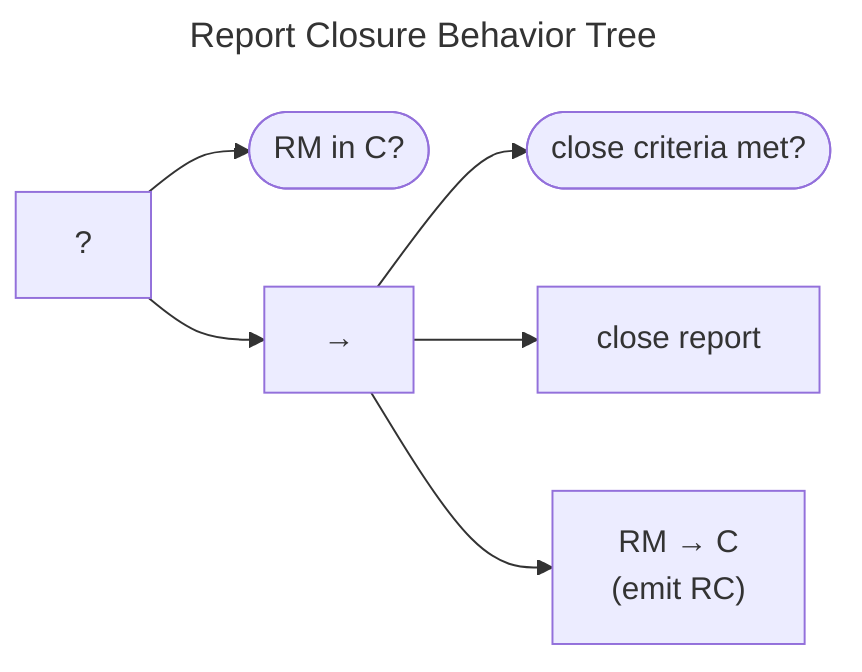

# Report Management Behavior Tree {#sec:rm_bt}

A Behavior Tree for the Report Management model is shown in the figure below.
The Report Management process is represented by a Fallback node. Note
that we assume that completing the process will require multiple *ticks*
of the Behavior Tree since each tick can complete, at most, only one
branch.

The first check is to see whether the case is already $Closed$
($q^{rm} \in C$). If that check succeeds, the branch returns *Success*,
and we're done. If it doesn't, we move on to the next branch, which
addresses reports in the *Received* state ($q^{rm} \in R$).

The only action to be taken from $q^{rm} \in R$ is to validate the
report. We address [report validation](#report-validation-behavior) below, but, for now, it is
sufficient to say that the validate report behavior returns *Success*
after moving the report to either *Valid* ($q^{rm} \xrightarrow{v} V$)
or *Invalid* ($q^{rm} \xrightarrow{i} I$).

The next branch covers reports in the *Invalid* state ($q^{rm} \in I$).
Here we have two options: either close the report (move to
$q^{rm} \xrightarrow{c} C$, as described in [report closure](#report-closure-behavior) below), or retry the validation.

For reports that have reached the *Valid* state ($q^{rm} \in V$), our
only action is to prioritize the report. [Report prioritization](#report-prioritization-behavior) is
addressed in detail below, but returns *Success* after moving the report to either *Accepted*
($q^{rm} \xrightarrow{a} A$) or *Deferred* ($q^{rm} \xrightarrow{d} D$).

Next, we reach behaviors associated with reports that have been both validated
and prioritized. *Deferred* reports ($q^{rm} \in D$) can be *Closed* or
have their priority reevaluated, but otherwise are not expected to
receive additional work.

Similarly, *Accepted* reports ($q^{rm} \in A$) can also be *Closed* or
have their priority reevaluated. However, they are also expected to
receive more effort---the *do work* task node, which we explore further
in [Do Work Behaviors](/topics/behavior_logic/do_work_bt/).
We are taking advantage of the composability of Behavior Trees to
simplify the presentation. Behaviors that appear in multiple places can
be represented as their own trees. We explore the most relevant of these
subtrees in the next few subsections.

### Report Validation Behavior

A Report Validation Behavior Tree is shown in the next figure. To begin with, if the report is already
*Valid*, no further action is needed from this behavior.

When the report has already been designated as *Invalid*, the necessary
actions depend on whether further information is necessary, or not. If
the current information available in the report is sufficient, no
further action is necessary and the entire behavior returns *Success*.
However, a previous validation pass might have left some indicator that
more information was needed. In that case, execution proceeds to the
sequence in which the *gather info* task runs. If nothing new is found,
the entire branch returns *Success*, and the report remains *Invalid*.
If new information *is* found, though, the branch fails, driving
execution over to the main validation sequence.

The main validation sequence follows when none of the above conditions
have been met. In other words, the validation sequence is triggered when
the report is in *Received* and its validity has never been evaluated or
when the report was originally determined to be *Invalid* but new
information is available to prompt reconsideration. The validation
process shown here is comprised of two main steps: a credibility check
followed by a validity check as outlined in our introduction of 
the [Received (R) state](/topics/process_models/rm#the-received-r-state).

As a reminder, a report might be in one of three categories: (a) neither
credible nor valid, (b) credible but invalid, or (c) both credible and
valid. Assuming the report passes both the credibility and validity
checks, it is deemed *Valid*, moved to $q^{rm} \xrightarrow{v} V$, and
an $RV$ message is emitted.

Should either check fail, the validation sequence fails, the report is
deemed *Invalid* and moves (or remains in) $q^{rm} \in I$. In that case,
an $RI$ message is sent when appropriate to update other Participants on
the corresponding state change.

### Report Prioritization Behavior

The Report Prioritization Behavior Tree is shown in the figure below.
It bears some structural similarity to the Report Validation Behavior Tree just described: An initial
post-condition check falls back to the main process leading toward
$accept$, which, in turn, falls back to the deferral process. If the
report is already in either the *Accepted* or *Deferred* states and no
new information is available to prompt a change, the behavior ends.

Failing that, we enter the main prioritization sequence. The
preconditions of the main sequence are that either the report has not
yet been prioritized out of the *Valid* state ($q^{rm} \in V$) or new
information has been made available to a report in either
$q^{rm} \in \{ D, A \}$ to trigger a reevaluation.

Assuming the preconditions are met, the report priority is evaluated.
For example, a Participant using [SSVC](https://github.com/CERTCC/SSVC) could insert
that process here. The evaluation task is expected to always set the
report priority. The subsequent check returns *Failure* on a defer
priority or *Success* on any non-deferral priority. On *Success*, an
*accept* task is included as a placeholder for any intake process that a
Participant might have for *Accepted* reports. Assuming that it
succeeds, the report is explicitly moved to the *Accepted*
($q^{rm} \xrightarrow{a} A$) state, and an $RA$ message is emitted.

Should any item in the main sequence fail, the case is deferred, its
state set to $q^{rm} \xrightarrow{d} D$, and an $RD$ message is emitted
accordingly. Similarly, a *defer* task is included as a callback
placeholder.

### Report Closure Behavior

The Report Closure Behavior Tree is shown below. 
As usual, the post-condition is checked before proceeding.
If the case is already *Closed* ($q^{rm} \in C$), we're done.
Otherwise, the main close sequence begins with a check for whether the report closure criteria have been met.
Report closure criteria are Participant specific and are, therefore, out of scope for this specification.
Nevertheless, once those closure criteria are met, the actual *close report* task is activated (e.g., an `OnClose` callback).
The sequence ends with setting the state to *Closed* ($q^{rm} \xrightarrow{c} C$) and emitting an $RC$ message.

