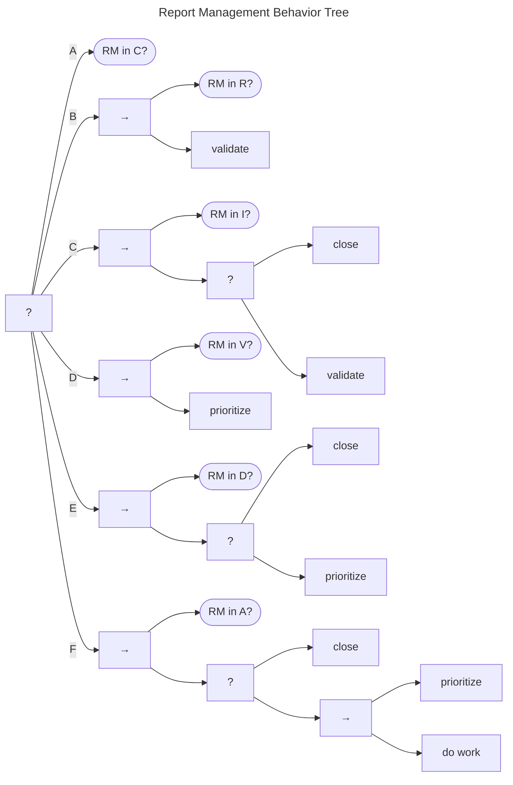

# Report Management Behavior Tree {#sec:rm_bt}

A Behavior Tree for the Report Management model is shown in the figure below.
The Report Management process is represented by a Fallback node. Note
that we assume that completing the process will require multiple *ticks*
of the Behavior Tree since each tick can complete, at most, only one
branch.

(A) The first check is to see whether the case is already $Closed$
($q^{rm} \in C$). If that check succeeds, the branch returns *Success*,
and we're done. If it doesn't, we move on to the next branch (B), which
addresses reports in the *Received* state ($q^{rm} \in R$).

!!! tip inline end "See also"

    - [Report Validation Behavior](rm_validation_bt.md)
    - [Report Prioritization Behavior](rm_prioritization_bt.md)
    - [Report Closure Behavior](rm_closure_bt.md)
    - [Do Work Behavior](do_work_bt.md)

The only action to be taken from $q^{rm} \in R$ is to validate the report.
We address [report validation](rm_validation_bt.md) shortly, but, for now, it is
sufficient to say that the validate report behavior returns *Success* 
after moving the report to either *Valid* ($q^{rm} \xrightarrow{v} V$)
or *Invalid* ($q^{rm} \xrightarrow{i} I$).

The next branch (C) covers reports in the *Invalid* state ($q^{rm} \in I$).
Here we have two options: either close the report (move to
$q^{rm} \xrightarrow{c} C$, as described in [report closure](rm_closure_bt.md), or retry the validation.

(D) For reports that have reached the *Valid* state ($q^{rm} \in V$), our
only action is to prioritize the report. [Report prioritization](rm_prioritization_bt.md) is
addressed in detail elsewhere, but returns *Success* after moving the report to either *Accepted*
($q^{rm} \xrightarrow{a} A$) or *Deferred* ($q^{rm} \xrightarrow{d} D$).

(E) Next, we reach behaviors associated with reports that have been both validated
and prioritized. *Deferred* reports ($q^{rm} \in D$) can be *Closed* or
have their priority reevaluated, but otherwise are not expected to
receive additional work.

(F) Similarly, *Accepted* reports ($q^{rm} \in A$) can also be *Closed* or
have their priority reevaluated. However, they are also expected to
receive more effort---the *do work* task node, which we explore further
in [Do Work Behaviors](do_work_bt.md).
We are taking advantage of the composability of Behavior Trees to
simplify the presentation. Behaviors that appear in multiple places can
be represented as their own trees. We explore the most relevant of these
subtrees in the next few subsections.

