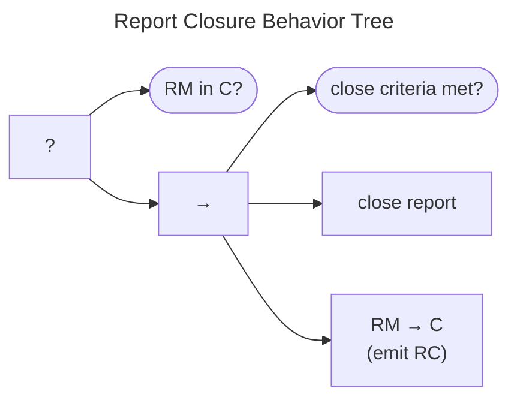

# Report Closure Behavior

The Report Closure Behavior Tree is shown below. 
As usual, the post-condition is checked before proceeding.
If the case is already *Closed* ($q^{rm} \in C$), we're done.
Otherwise, the main close sequence begins with a check for whether the report closure criteria have been met.
Report closure criteria are Participant specific and are, therefore, out of scope for this specification.
Nevertheless, once those closure criteria are met, the actual *close report* task is activated (e.g., an `OnClose` callback).
The sequence ends with setting the state to *Closed* ($q^{rm} \xrightarrow{c} C$) and emitting an $RC$ message.

