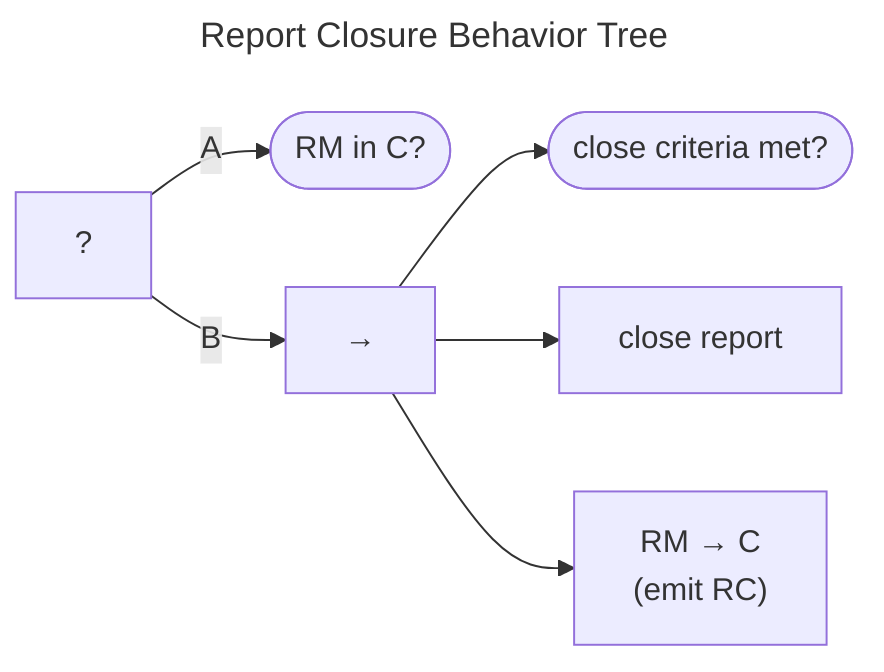

# Report Closure Behavior

## Requirements

The behavioral requirements for this tree are specified in the
[Protocol Specifications](../../reference/specs/protocol.md):

- [RMB-14](../../reference/specs/protocol.md#rmb-14) — Enter RM Closed

!!! note "Implementation approach"

    The behavior tree diagram below illustrates one conformant implementation of these requirements.
    Implementations are not required to use behavior trees — any approach that satisfies the
    requirements above is conformant.

The Report Closure Behavior Tree is shown below.
As usual, the post-condition is checked before proceeding.
(A) If the case is already *Closed* ($q^{rm} \in C$), we're done.
Otherwise, (B) the main close sequence begins with a check for whether the report closure criteria have been met.
Report closure criteria are Participant-specific and are, therefore, out of scope for this specification.
Nevertheless, once those closure criteria are met, the actual *close report* task is activated (e.g., an `OnClose` callback).
The sequence ends with setting the state to *Closed* ($q^{rm} \xrightarrow{c} C$) and emitting an $RC$ message.

```mermaid
---
title: Report Closure Behavior Tree
---
flowchart LR
    fb["?"]
    check_closed(["RM in C?"])
    fb -->|A| check_closed
    seq["&rarr;"]
    fb -->|B| seq
    close_criteria_met(["close criteria met?"])
    seq --> close_criteria_met
    close["close report"]
    seq --> close
    close_to_c["RM &rarr; C<br/>(emit RC)"]
    seq --> close_to_c
```
