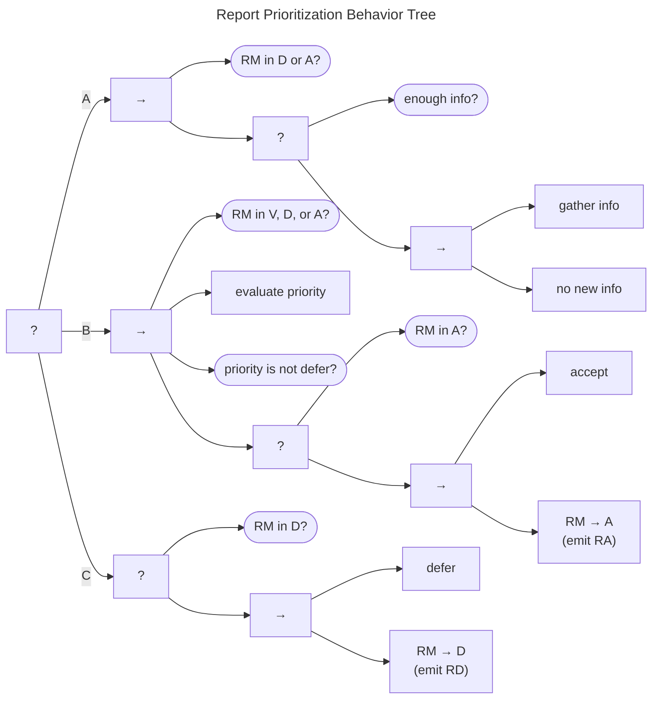

# Report Prioritization Behavior

The Report Prioritization Behavior Tree is shown in the figure below.
It bears some structural similarity to the Report Validation Behavior Tree just described: An initial
post-condition check (A) falls back to the main process (B) leading toward
$accept$, which, in turn, falls back to the deferral process (C). 

In more detail, (A) if the report is already in either the *Accepted* or *Deferred* states and no
new information is available to prompt a change, the behavior ends.

Failing that, we enter the main prioritization sequence (B). The
preconditions of the main sequence are that either the report has not
yet been prioritized out of the *Valid* state ($q^{rm} \in V$) or new
information has been made available to a report in either
$q^{rm} \in \{ D, A \}$ to trigger a reevaluation.

Assuming the preconditions are met, the report priority is evaluated.
For example, a Participant using [SSVC](https://github.com/CERTCC/SSVC) could insert
that process here. The evaluation task is expected to always set the
report priority. The subsequent check returns *Failure* on a defer
priority or *Success* on any non-deferral priority. On *Success*, an
*accept* task is included as a placeholder for any intake process that a
Participant might have for *Accepted* reports. Assuming that it
succeeds, the report is explicitly moved to the *Accepted*
($q^{rm} \xrightarrow{a} A$) state, and an $RA$ message is emitted.

(C) Should any item in the main sequence fail, the case is deferred, its
state set to $q^{rm} \xrightarrow{d} D$, and an $RD$ message is emitted
accordingly. Similarly, a *defer* task is included as a callback
placeholder.
