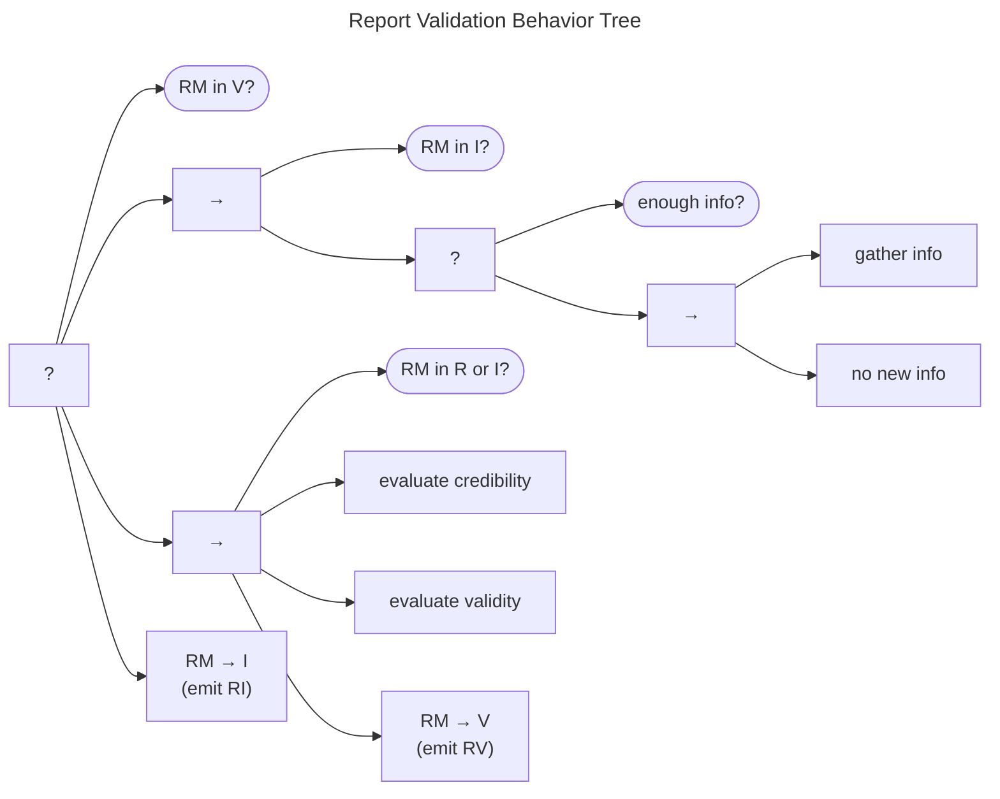

# Report Validation Behavior

A Report Validation Behavior Tree is shown in the next figure. To begin with, if the report is already
*Valid*, no further action is needed from this behavior.

When the report has already been designated as *Invalid*, the necessary
actions depend on whether further information is necessary, or not. If
the current information available in the report is sufficient, no
further action is necessary and the entire behavior returns *Success*.
However, a previous validation pass might have left some indicator that
more information was needed. In that case, execution proceeds to the
sequence in which the *gather info* task runs. If nothing new is found,
the entire branch returns *Success*, and the report remains *Invalid*.
If new information *is* found, though, the branch fails, driving
execution over to the main validation sequence.

The main validation sequence follows when none of the above conditions
have been met. In other words, the validation sequence is triggered when
the report is in *Received* and its validity has never been evaluated or
when the report was originally determined to be *Invalid* but new
information is available to prompt reconsideration. The validation
process shown here is comprised of two main steps: a credibility check
followed by a validity check as outlined in our introduction of 
the [Received (R) state]((../process_models/rm#the-received-r-state).

As a reminder, a report might be in one of three categories: (a) neither
credible nor valid, (b) credible but invalid, or (c) both credible and
valid. Assuming the report passes both the credibility and validity
checks, it is deemed *Valid*, moved to $q^{rm} \xrightarrow{v} V$, and
an $RV$ message is emitted.

Should either check fail, the validation sequence fails, the report is
deemed *Invalid* and moves (or remains in) $q^{rm} \in I$. In that case,
an $RI$ message is sent when appropriate to update other Participants on
the corresponding state change.
