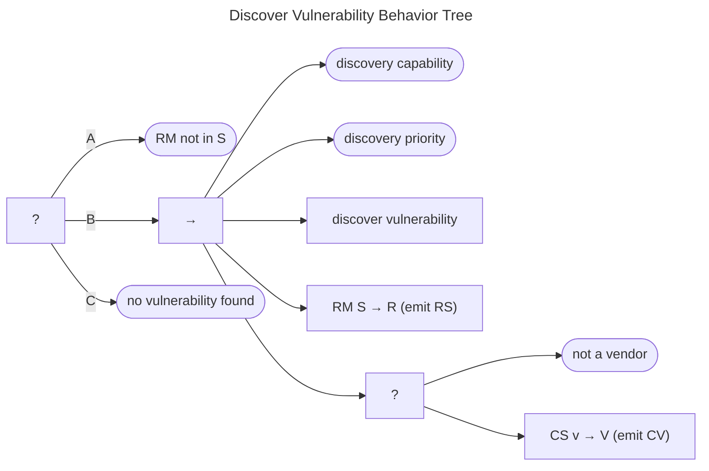

# Vulnerability Discovery Behavior

CVD is built on the idea that vulnerabilities exist to be found. There are two ways for a CVD Participant to
find out about a vulnerability. Either they discover it themselves, or they hear about it from someone else.
The discovery behavior is modeled by the Discover Vulnerability Behavior Tree shown in the figure below.
External reports are covered in the [Receive Messages](msg_intro_bt.md) Behavior Tree.

The goal of the Discover Vulnerability Behavior is for the Participant
to end up outside of the *Start* state of the Report Management process
($q^{rm} \not \in S$, branch A).

Assuming this has not already occurred, the discovery sequence (branch B) is followed.
If the Participant has both the means and the motive to find a vulnerability, they might discover it
themselves.
Should this succeed, the branch sets $q^{rm} \in S \xrightarrow{r} R$ and returns *Success*.
We also show a report submission ($RS$) message being emitted as a reminder that even internally discovered
vulnerabilities can trigger the CVD process&mdash;although, at the point of discovery, the Finder is the only
Participant, so the $RS$ message in this situation might be an internal message within the Finder organization (at most).

Should no discovery occur (branch C), the branch returns *Success* so that the parent process in
[CVD Behavior Tree](cvd_bt.md) can proceed to receive messages from others.

