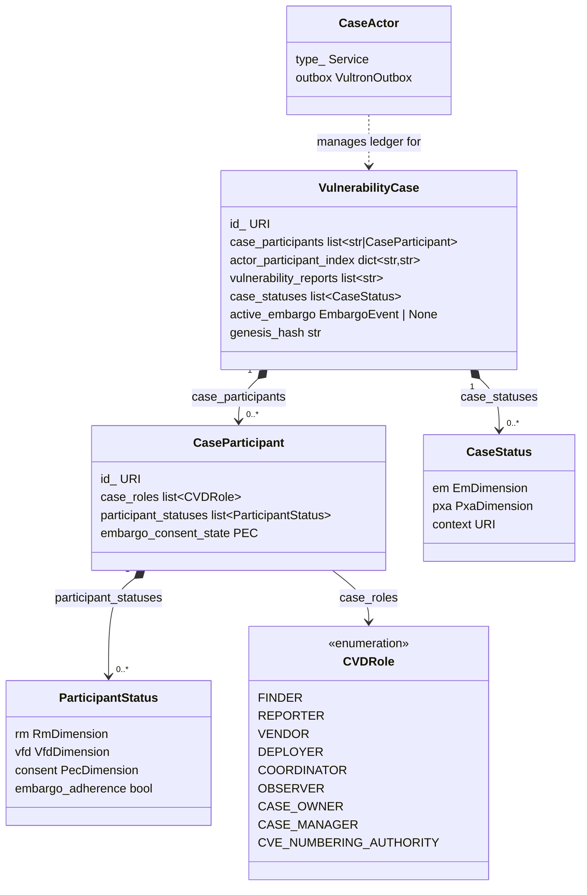

# The Case Model

This page explains the core domain objects that make up a Vultron
coordination case and how they relate to each other. It is intended
to give developers and contributors a structural understanding of the
implementation before reading source code or designing compatible systems.

## The case as distributed shared state

A Vultron **case** is a distributed coordination object. Multiple
independent organizations — a Finder, a Vendor, a Coordinator — each
maintain their own local copy of the case's state. They synchronize
those copies by exchanging ActivityStreams 2.0 messages through a
**Case Actor** service peer.

The canonical record is the **Case Actor**'s append-only, hash-chained
ledger. All other participants hold **replicas** that converge toward
that ledger via `Announce(CaseLedgerEntry)` messages.

## `VulnerabilityCase`

`VulnerabilityCase` (defined in `vultron/core/models/case.py`) is the
canonical core domain type for a coordination case. It aggregates
participants, status history, reports, embargo state, and the ledger
anchor hash.

| Field | Description |
|---|---|
| `case_participants` | `CaseParticipant` records (or their URIs) |
| `actor_participant_index` | Fast-lookup map: actor URI → participant URI |
| `vulnerability_reports` | URIs of reports associated with this case |
| `case_statuses` | Append-only history of `CaseStatus` snapshots |
| `active_embargo` | The currently active `EmbargoEvent` (at most one) |
| `proposed_embargoes` | URIs of embargoes under negotiation |
| `case_activity` | Log of Activity IDs associated with this case |
| `genesis_hash` | SHA-256 hash binding the ledger to this case's origin identity |

`VulnerabilityCase` does not carry RM state directly — that belongs to
each participant via their `ParticipantStatus` history. Only embargo
(EM) state and the case-wide public state (PXA) are recorded at the
case level, through the `CaseStatus` history.

## `CaseActor`

A `CaseActor` (defined in `vultron/core/models/case_actor.py`) is the
ActivityStreams **Service** actor that manages a case's canonical ledger
and acts as the coordination hub for all inter-participant messages.

Each case has exactly one `CaseActor`. The actor holding the
`CVDRole.CASE_MANAGER` role acts as the single-writer authority for
the canonical ledger. Embargo proposals, status updates, notes, and
participant invitations all route through the `CaseActor` so that the
ledger captures a causally-ordered record of the entire coordination.

The `CaseActor` is **not** a CVD participant in the domain sense; it is
the infrastructure peer that brokers between participants. Do not
confuse it with the `CASE_OWNER` role (the human decision-maker who
administers the case) or with the `CASE_MANAGER` role (the role that
authorizes ledger writes).

## `CaseParticipant`

A `CaseParticipant` (defined in `vultron/core/models/case_participant.py`)
is the per-case binding of an actor to their roles and protocol state.
One `CaseParticipant` record exists for each actor engaged in a case.
Because a single actor may participate in many cases and hold different
roles in each, `CaseParticipant` scopes an actor's obligations and
history to a single coordination context.

| Field | Description |
|---|---|
| `case_roles` | `list[CVDRole]` — the roles this actor holds in this case |
| `participant_statuses` | Append-only history of `ParticipantStatus` snapshots |
| `embargo_consent_state` | This participant's current PEC (Participant Embargo Consent) state |
| `accepted_embargo_ids` | URIs of embargoes the participant has accepted |
| `participant_case_name` | Optional human-readable name for this participant in this case |

Role-specific subclasses (`VendorParticipant`, `CoordinatorParticipant`,
`ObserverParticipant`, etc.) auto-set `case_roles` via model validators
for convenience. All subclasses share the same `type_` value
(`"CaseParticipant"`).

## Status objects

Vultron tracks protocol state through immutable snapshots rather than
mutable fields. New snapshots are appended to their history lists;
nothing is mutated in place. This makes the full state history auditable
and replayable.

### `CaseStatus`

`CaseStatus` (defined in `vultron/core/models/case_status.py`) records
the shared, case-level protocol state at a point in time. It is stored
in `VulnerabilityCase.case_statuses`.

| Field | Description |
|---|---|
| `em` | `EmDimension` — the current EM state (None / Proposed / Active / Revise / eXited) |
| `pxa` | `PxaDimension` — the current public state (Public / eXploit / Active-attacks) |
| `context` | The URI of the case this status belongs to |
| `attributed_to` | The actor who reported this status (optional) |

### `ParticipantStatus`

`ParticipantStatus` (defined in `vultron/core/models/participant_status.py`)
records a single participant's state at a point in time. It is stored
in `CaseParticipant.participant_statuses`.

| Field | Description |
|---|---|
| `rm` | `RmDimension` — the participant's RM state (Start → Received → … → Closed) |
| `vfd` | `VfdDimension` — Vendor/Deployer fix-path state (vfd → … → VFD) |
| `consent` | `PecDimension` — this participant's embargo consent state |
| `cvd_role` | The CVD roles this participant held at the time of the snapshot |
| `case_engagement` | Whether this participant is actively engaged |
| `embargo_adherence` | Computed `True` iff `consent.state == SIGNATORY` (ADR-0056) |

`embargo_adherence` is a `@computed_field` derived from `consent.state`
— do not set it directly.

### Dimension objects

Both `CaseStatus` and `ParticipantStatus` use **Dimension Objects**
(per ADR-0036): small, immutable `BaseModel` instances that own exactly
one state machine. This design allows each dimension (EM, PXA, RM, VFD,
PEC) to be compared, serialized, and validated independently.

Dimension objects are defined in `vultron/core/models/dimensions.py`:

| Dimension | State machine | Used in |
|---|---|---|
| `EmDimension` | EM (None/Proposed/Active/Revise/eXited) | `CaseStatus` |
| `PxaDimension` | PXA (public awareness, exploit, attacks) | `CaseStatus` |
| `RmDimension` | RM (Start → Received → … → Closed) | `ParticipantStatus` |
| `VfdDimension` | VFD (vfd → Vfd → VFd → VFD) | `ParticipantStatus` |
| `PecDimension` | PEC (consent state: NO_EMBARGO / INVITED / SIGNATORY / LAPSED / DECLINED) | `ParticipantStatus` |

## `CVDRole`

`CVDRole` (defined in `vultron/enums/roles.py`) is a `StrEnum`.
Each value represents a single, atomic role. Participants hold zero or
more roles as `list[CVDRole]`.

| Role | Meaning |
|---|---|
| `FINDER` | Discovered the vulnerability |
| `REPORTER` | Submitted the vulnerability report to others |
| `VENDOR` | Supplies the affected product; has Vendor Fix Path obligations |
| `DEPLOYER` | Deploys the vendor's fix; has VFD obligations |
| `COORDINATOR` | Neutral third party facilitating coordination |
| `OBSERVER` | Base role — admitted via Invite/Accept; no VFD obligations (ADR-0057) |
| `CASE_OWNER` | Human decision-maker who administers the case |
| `CASE_MANAGER` | Service actor role — authorized to write to the canonical ledger |
| `CVE_NUMBERING_AUTHORITY` | Holds CNA status; may assign CVE IDs directly |

!!! warning "Do not use `CVDRolesFlag`"
    `CVDRolesFlag` is a legacy bitmask enum retained only for the
    `vultron.bt` simulator layer. Always use `list[CVDRole]` in new code.

## How the objects relate

A `VulnerabilityCase` aggregates:

- One `CaseParticipant` per engaged actor, each with an append-only
  `ParticipantStatus` history
- An append-only `CaseStatus` history recording EM and PXA state over time

The `CaseActor` service peer manages the canonical ledger for the case
and brokers all inter-participant messages, but is not itself a
`CaseParticipant` in the CVD sense.

## See also

- [Process Models](process_models/index.md) — RM, EM, and CS state machines
  that drive status transitions
- [Demo Scenarios](scenarios/index.md) — how the objects evolve end-to-end
  in practice
- ADR-0036: Per-Machine Dimension Objects for `CaseStatus` and
  `ParticipantStatus`
- ADR-0041: CaseActor-Authoritative Case Initialization
- ADR-0057: Observer role (`CVDRole.OBSERVER`)
- ADR-0078: Retire `CVDRole.FINDER` — Reporter Is the Protocol-Salient
  Role
