# Worked Example



Here we give a brief worked example showing a few usage scenarios of the [protocol](../../reference/formal_protocol/index.md).
We use UML Sequence Diagrams to show the interaction between Participant roles.

## A Finder Becomes a Reporter

As mentioned in
[RM Interactions](../process_models/rm/rm_interactions.md#the-secret-lives-of-finders), Finders have a few hidden state
transitions before the CVD process really begins. An example of this
is shown in the figure below. The Finder must discover, validate, and
prioritize their finding before initiating the CVD process.

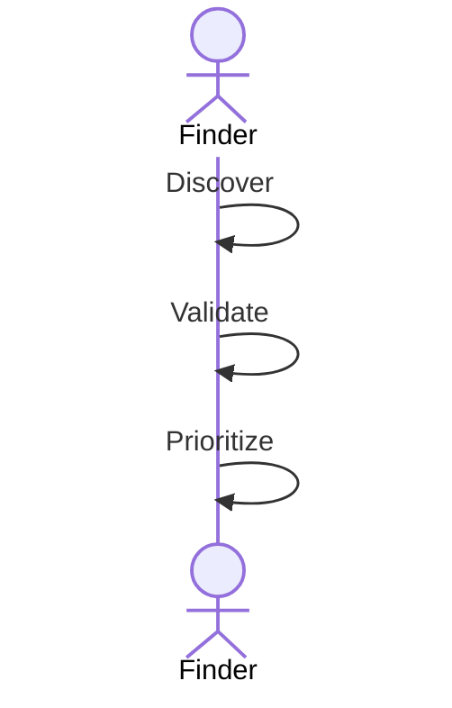

Finders become Reporters when they report a vulnerability to someone
else. The next figure shows a Finder sending a
report (*RS*) in conjunction with an embargo proposal (*EP*) to a
Vendor. The Vendor receives the report and updates their state
accordingly. Then the Vendor replies to acknowledge receipt of the
report and the embargo proposal, and confirms that they (i.e., the
Vendor) are aware of the report (*RK*, *EK*, and *CV*, respectively).
Note that the *EK* response is intended to convey receipt of the embargo
proposal (*EP*) but does not constitute acceptance of the proposal. We
will discuss that in the next subsection.

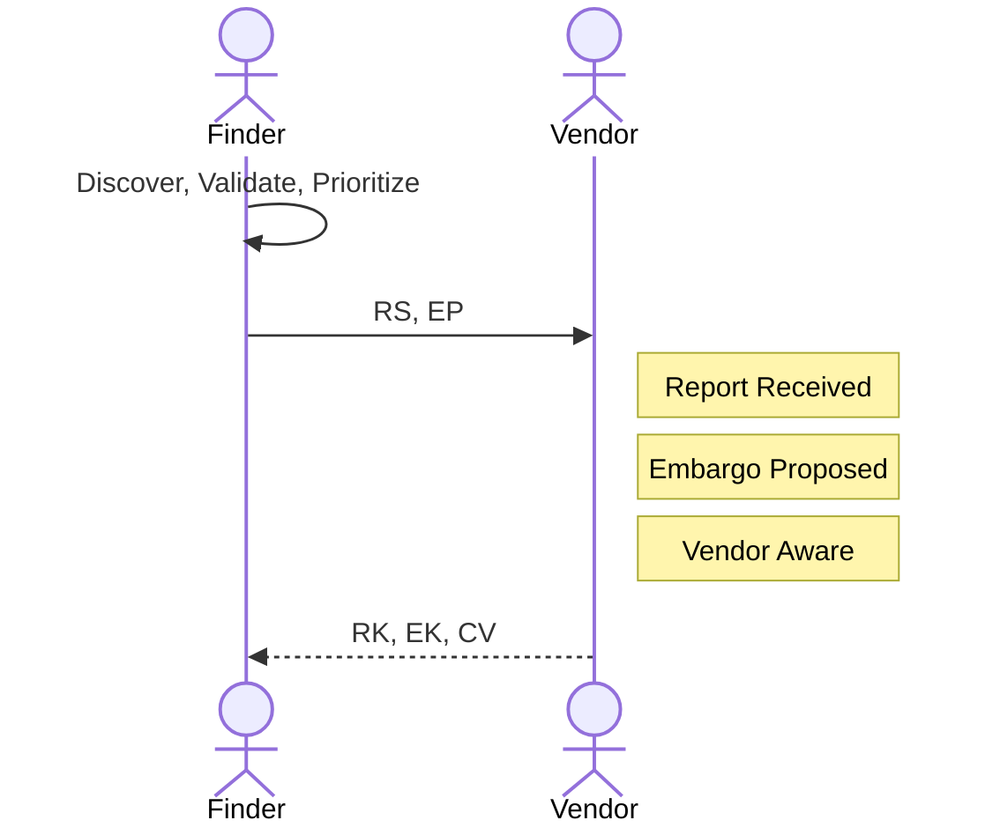

## Vendor Evaluates Embargo

In this section, we show a variety of responses a Vendor might have to an embargo proposal.

### Vendor Accepts Embargo

First is a basic accept sequence in which the Vendor accepts the proposed embargo and tells the
Reporter this through an *EA* message. The Reporter acknowledges this with an *EK* in response.

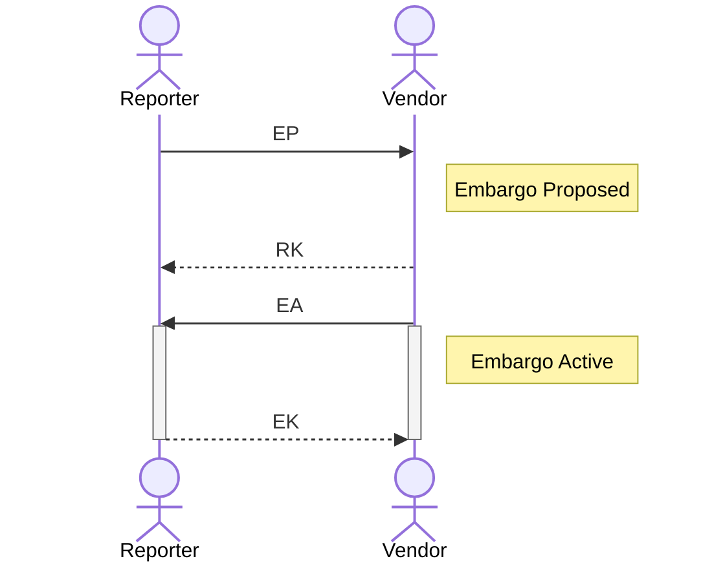

### Vendor Rejects Embargo

Next we show a rejected proposal. As above, this is a simple sequence where the Vendor indicates their rejection of the
proposal with an *ER* message, and the Reporter acknowledges this with an *EK* message.

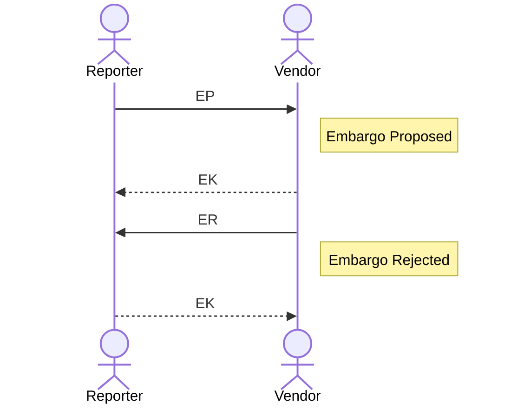

### Vendor Counterproposal

Here we demonstrate a Vendor embargo counterproposal. The Vendor responds to the Reporter's prior
*EP* message with an *EP* message of their own. The Reporter initially
acknowledges the counterproposal with an *RK* message and then evaluates
it and accepts with an *EA* message. Finally, the Vendor acknowledges
the acceptance with an *EK* message. Note, however, that there is no
active embargo until the Reporter accepts it. This method of
counterproposal might delay the establishment of an embargo.

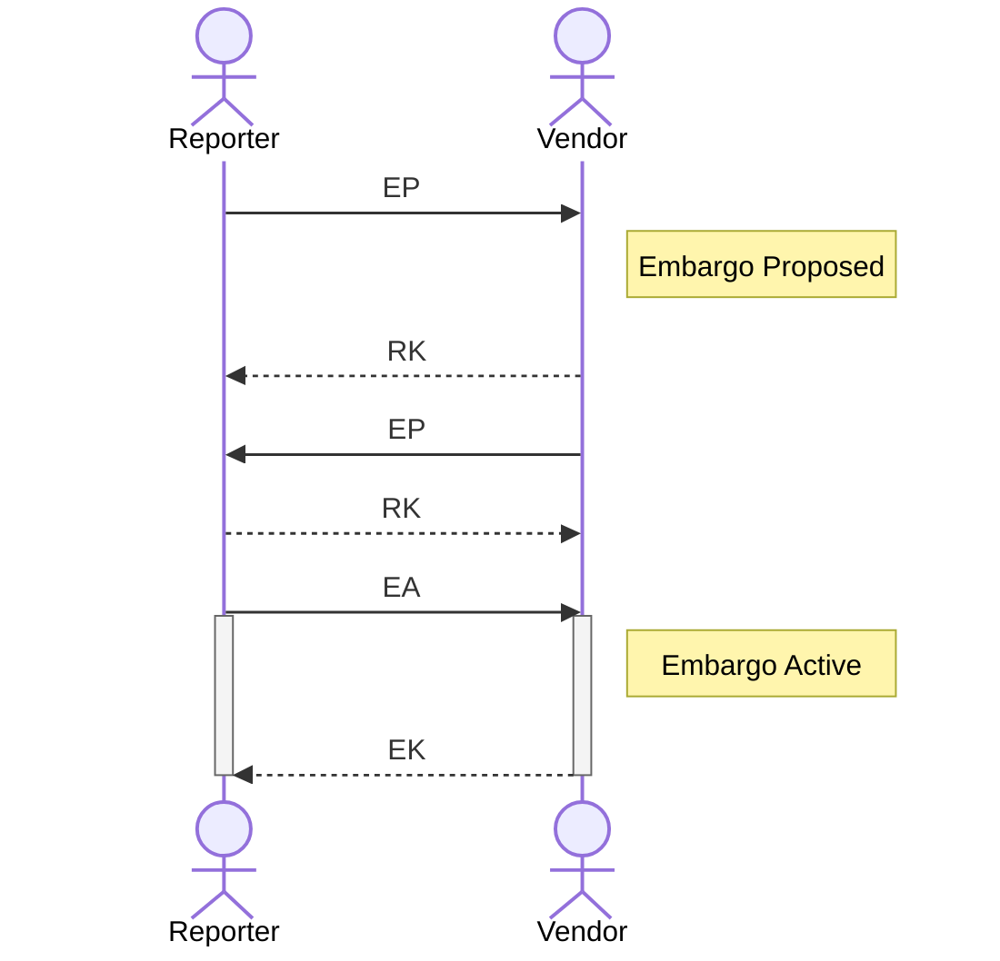

### Vendor Accepts then Proposes Revision

!!! tip inline end "Yes, And..."

    "Yes-And" is a heuristic taken from improvisational theatre in which Participants are encouraged to agree with 
    whatever their counterpart suggests and add to it rather than reject it outright. 
    It serves as a good model for cooperation among parties who share an interest in a positive outcome.

Finally, the following diagram offers what we think is a better approach than a simple counterproposal.
In this "Accept-then-Counter" sequence, we see that the Vendor initially accepts the Reporter's proposed embargo and
immediately follows up with a revision proposal of their own.
The difference is that by initially accepting the proposal, the Vendor ensures that they are in an active embargo state
before attempting to renegotiate.
The sequence shown here is intended to be consistent with the previous discussion surrounding [default embargo
strategies](../process_models/em/defaults.md).
One might think of this as the "Yes-And" rule for embargo negotiations.

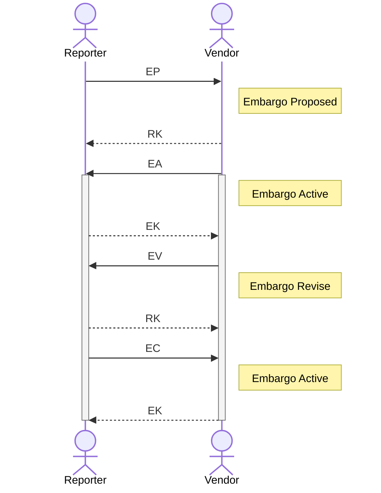

## Vendor Sets Priority

Here we show two responses from a Vendor in the course of prioritizing a report.

### Vendor Accepts Report

This figure shows a Vendor accepting the report for further work (presumably to develop a patch) with an *RA* message.

### Vendor Defers Report

On the contrary, this figure shows the Vendor deferring the report with an *RD* message.
In both cases, the Reporter acknowledges the Vendor's messages with an *RK* message.

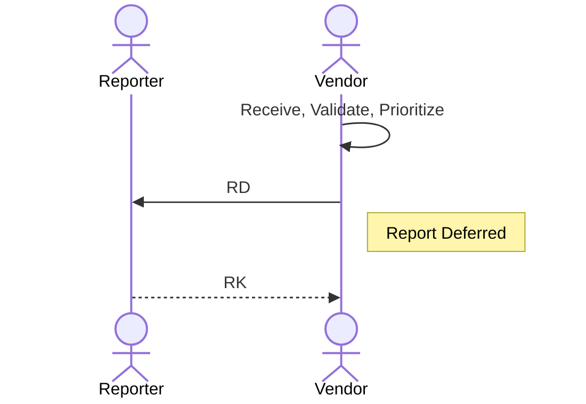

## Coordination With a Coordinator

The next two diagrams show the process of a Reporter engaging a Coordinator, who, in turn, engages a Vendor.
The process begins in the first diagram with the Reporter sending a report along with an embargo proposal to the Coordinator
($RS,EP$). The Coordinator acknowledges receipt with an $RK,EK$ response.
After evaluating the proposed embargo, the Coordinator accepts it with an *EA* message.
The Coordinator proceeds to validate and prioritize the report, emitting an *RV* and *RA* along the way.

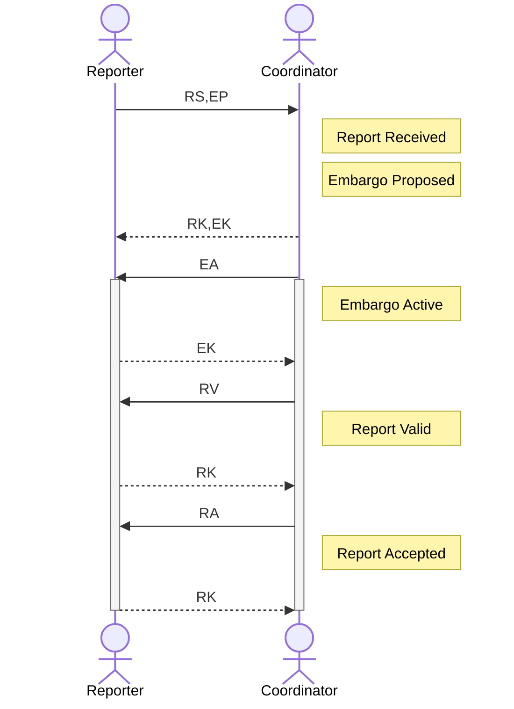

!!! tip inline end "Coordinator-as-proxy can be sub-optimal"

    In this scenario, we are showing the Coordinator acting as a proxy between the Reporter and the Vendor.
    While this reflects the way CVD has been practiced in the past, it is not necessarily the most efficient way to
    operate. CVD Platforms like [VINCE](https://kb.cert.org/vince) have demonstrated that bringing CVD case participants
    into a shared space can make the process more efficient.

In the next diagram, the Coordinator now acts as a proxy for the Reporter, notifying the Vendor and passing along
the embargo information through an $RS,EP$ message of its own.
The Vendor accepts the existing embargo (*EA*) and proceeds to validate (*RV*) and prioritize (*RA*) the report.
Relevant responses from the Vendor are passed through to the Reporter.
Having accepted the report for further work, the Vendor continues with creating a fix for the reported vulnerability.
When complete, the Vendor conveys their readiness to the Coordinator, who in turn passes this information along
to the Reporter through the *CF* message.

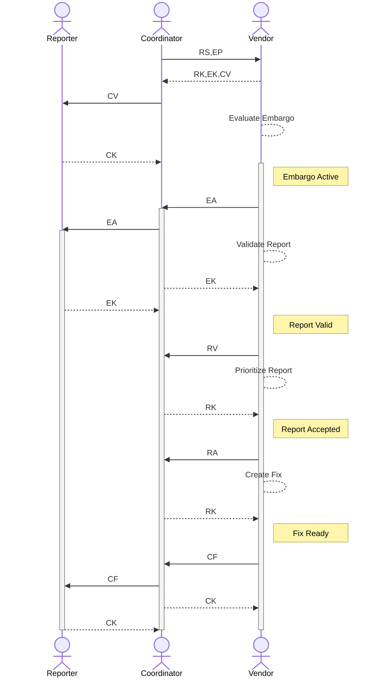

## Embargo Teardown, Publish, and Close

Any Participant can initiate an embargo teardown.
We happened to show the case where the Coordinator initiates it in the following diagram, sending an embargo
termination message (*ET*) to all parties in the case (Reporter and Vendor in this scenario).
Recipients of the *ET* message acknowledge receipt and update their EM state accordingly.

!!! tip "Embargo Teardown, Publication, and Closure Can Start with Any Participant"

    Note that for all three scenarios in this section, there is no specific order in which Participants must act.
    We could just as easily have shown the Reporter initiating an embargo teardown because of a leaked media report or the 
    Vendor exiting an embargo early because they had their fix ready sooner than expected.

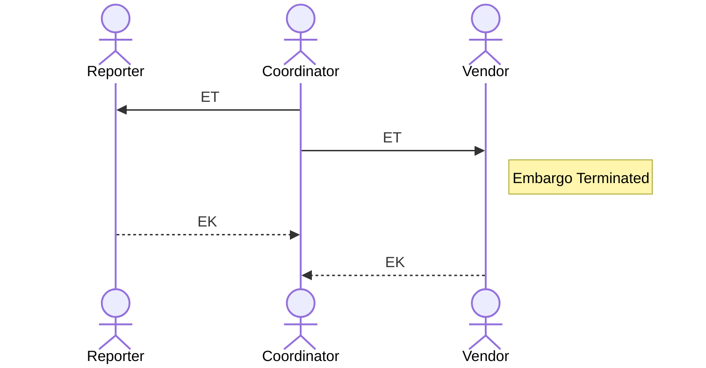

!!! tip inline end "Embargo Termination is not Publication"

    Our protocol only sets a discrete end to the embargo period, it intentionally does *not* address a publication schedule.
    Once the embargo has been exited, *any* Participant may publish at any time.
    Participants might choose to coordinate publication schedules more closely, but there is nothing in the protocol to require it.
    With the recognition that more concise publication scheduling might be needed in some situations, we revisit this 
    concern in [Process Implementation Notes](../../howto/process_implementation.md).

### Publishing After Embargo Teardown

Once the embargo has been exited, any Participant may now publish.
In the following figure, we show the Vendor publishing first.
They notify the Coordinator that they have published using a *CP* message to convey that information about the vulnerability
is now public.
The Coordinator relays this information to the Reporter.
Both the Reporter and the Coordinator publish their own reports shortly thereafter.

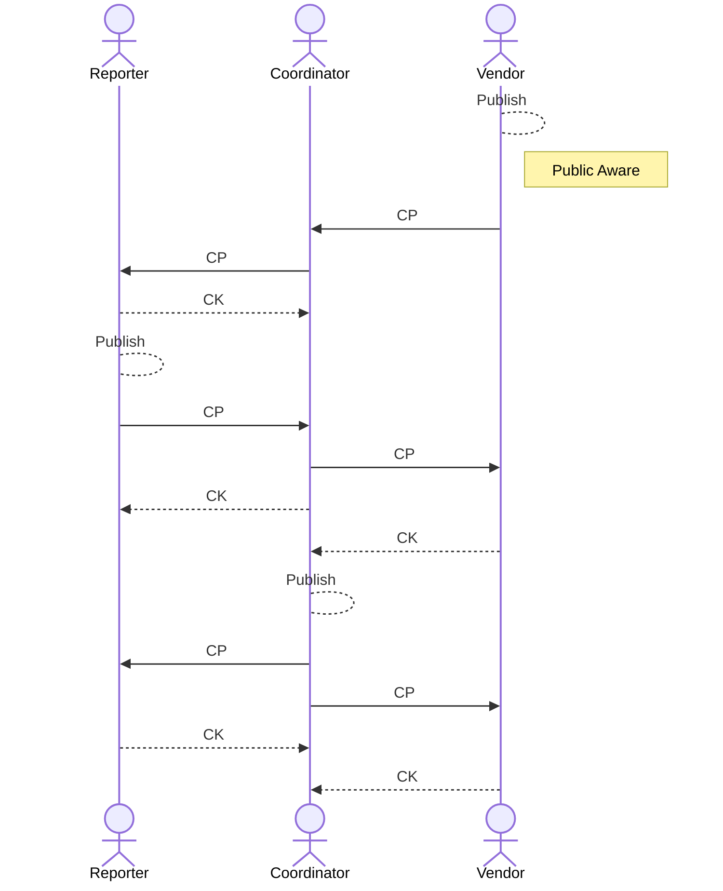

!!! tip inline end "Report Closure is a Per-Participant Choice"

    Report closure is a per-Participant choice. We chose to show a
    simple case where all Participants agreed at approximately the same time
    that there was nothing further to be done. This will not always be the
    case, nor is it necessary.

### Closing the Case

Having no further work to be done on the case, the Reporter closes their
report and tells the Coordinator using an *RC* message in the next diagram.
This prompts the Coordinator to review their outstanding tasks and decide to initiate the closure of their own report.
In turn, the Coordinator relays this to the Vendor, who also closes their report.

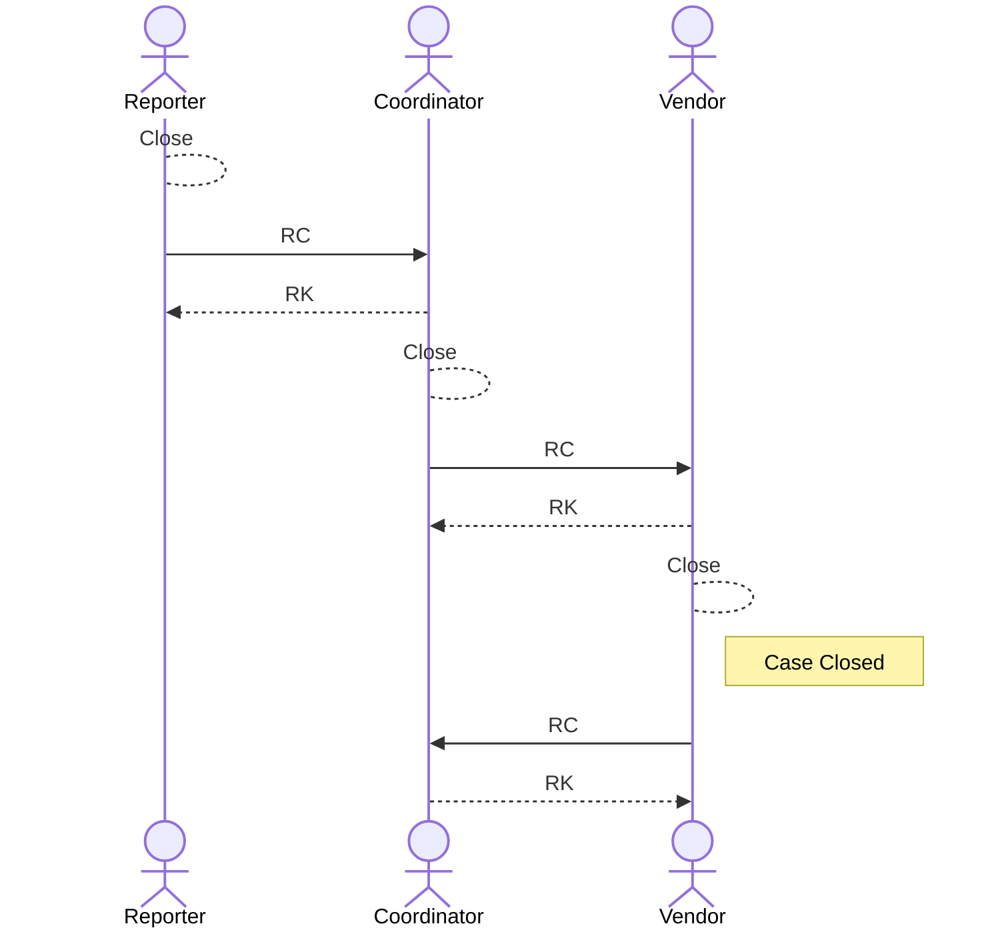
