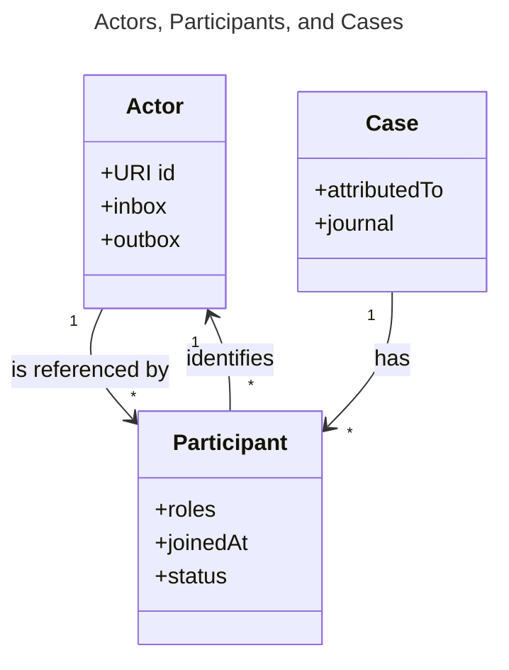
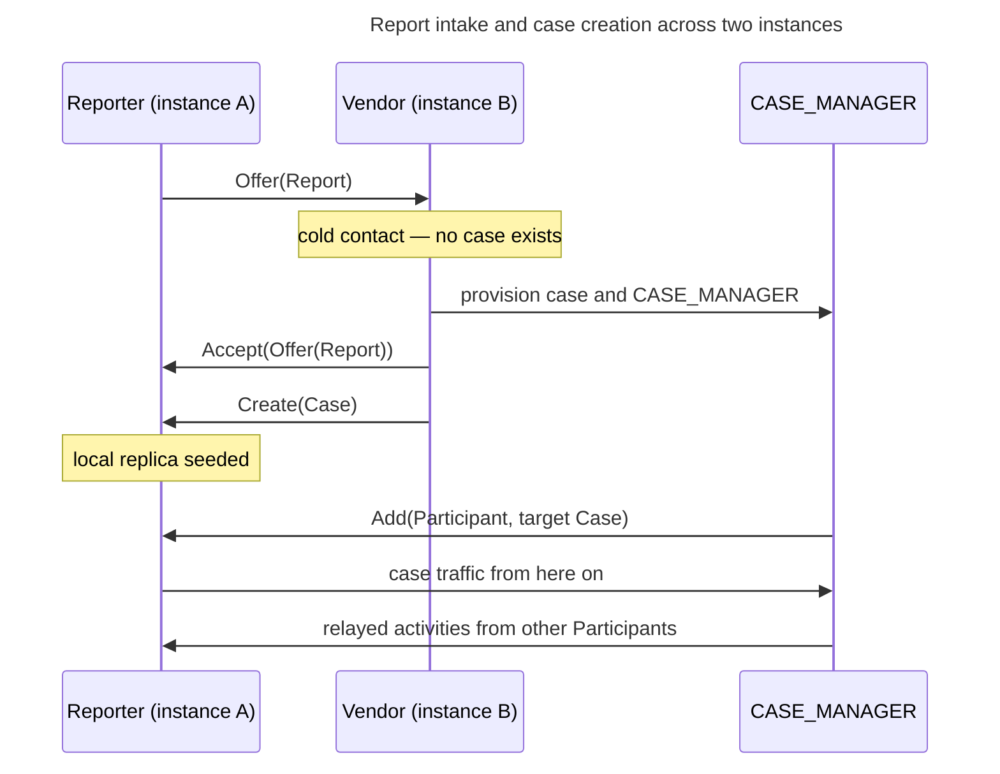

# Federation

Vultron is designed for a world in which each organization runs its own coordination service.
This page explains the federation model those services would use: what they exchange, which actor is authoritative for a case, and how two organizations come to trust each other well enough to coordinate.

None of it is implemented.
The prototype runs several actors inside a single deployment, so what follows is a design direction rather than a description of working code.
The open questions marked throughout are unresolved, and each one names where it is tracked.

---

## Federation between known peers, not open-web broadcast

The federation model is closer to email or to Matrix homeservers than to a public social network.
Each organization deploys a service that acts as a gateway between its own internal tracker and the shared Vultron protocol.
Neither side needs to know anything about the other's internal systems.
Both need to speak the same protocol.

Federation is bilateral or multilateral between parties that already know each other.
It is not open-web discovery, and it is not public broadcast.
Two organizations coordinate because a human relationship or an inbound report brought them together, and the protocol carries the coordination from there.
This shapes almost every design choice below: a closed set of known peers can rely on out-of-band trust establishment, and has no need for the machinery that public federation requires.

---

## AS2 supplies the vocabulary

Vultron uses ActivityStreams 2.0 (AS2) as the semantic vocabulary for every coordination message.
An AS2 activity is a sentence about who did what to what, and when.
Vultron's own object and activity types are declared as AS2 vocabulary extensions through a JavaScript Object Notation for Linked Data (JSON-LD) `@context`.

This is an adoption of AS2 as a message format, not an adoption of ActivityPub as a social protocol.



---

## Actors, inboxes, and outboxes

Vultron takes the AS2 actor model as its coordination primitive.
An actor is any peer identified by a Uniform Resource Identifier (URI), and it has an inbox that receives activities and an outbox that publishes them.
A deployment carries instance-level actors for peering and for first contact from strangers.

Case coordination is handled by whichever actor holds `CVDRole.CASE_MANAGER` for that case.
Authority follows the role and nothing else (ADR-0088, CM-02-011).
An actor's name, its URL shape, and where it is hosted carry no protocol meaning.

The prototype provisions a dedicated container actor for this purpose and labels it `case-actor`.
That label is a provisioning convenience (CM-02-013).
A single such actor can hold the role for many cases at once, because the case a given activity belongs to travels in the activity's `context` rather than in the actor's URI.
A deployment may instead provision one CASE_MANAGER actor per case through a case actor service.
That choice is open, and it has consequences beyond hosting — key material binds to an actor identity, so the number of cases an actor serves determines how much cryptographic separation exists between them.

---

## What a case looks like across instances

A case is a container for participants, reports, status, and history.
A Participant is a case-scoped wrapper that points at a global Actor and carries the roles and authorization that actor holds *in this case*.
The distinction matters because one actor participates in many cases, holding different roles in each.



The diagram shows that Participants are the join between long-lived Actors and individual Cases.
An Actor exists independently of any case.
A Participant exists only within one.

---

## Case ownership

The `attributed_to` field on a case designates the instance that currently owns it.
Ownership is unambiguous, because exactly one instance holds it at any moment.
Transfer follows an `Offer` and `Accept` cycle, after which `attributed_to` is updated, and the full ownership history is recoverable from the case's activity history.

Any participant instance can create a case from a report.
The creating instance owns what it created until ownership transfers.



---

## From report to case

First contact is the only exchange that happens outside a case, because no case exists yet.



The diagram shows the transition from a single cold-contact message to steady-state coordination.
After the Reporter's replica is seeded, every later message is case-scoped and routes through the CASE_MANAGER.



---

## Case traffic routes through the CASE_MANAGER

Once a case exists, all case communication consists of direct messages between individual Participant actors and the CASE_MANAGER.
Nothing is published publicly.
Participants do not message each other directly (PCR-08-001, PCR-08-002).

Routing everything through one actor buys four properties at the cost of a relay hop.
The CASE_MANAGER can enforce authorization, because it sees every message and knows every Participant's roles.
It can attest to ordering, because it assigns each entry its position.
Participants cannot spoof messages to each other, because a message that did not come from the CASE_MANAGER is not case traffic.
And every Participant's view of the case derives from one authoritative sequence rather than from whatever happened to reach it.



---

## Relaying with Announce

When the CASE_MANAGER passes a Participant's activity on to the other Participants, it wraps the original in an AS2 `Announce` and signs the wrapper.

```json
{
  "type": "Announce",
  "id": "https://vendorb.example/cases/1234/actor/outbox/relay/88",
  "actor": "https://vendorb.example/cases/1234/actor",
  "published": "2025-03-08T12:00:00Z",
  "vultron:journalSeq": 3,
  "vultron:journalPrev": "hash-of-journal-seq-2",
  "to": "https://vendora.example/users/alice",
  "object": {
    "type": "Create",
    "actor": "https://vendora.example/users/alice",
    "object": {
      "type": "Note",
      "content": "Reproduced on version 4.2"
    },
    "signature": "...the reporter's original signature..."
  },
  "signature": "...the CASE_MANAGER's signature..."
}
```

Two signatures do two jobs.
The inner signature proves the activity originated with the Participant who claims it.
The outer signature proves the authoritative hub received and relayed it, at a stated position in the case history.
A recipient verifies each independently, so a relayed message is not hearsay.

The `journalSeq` and `journalPrev` fields let a recipient place the relayed activity in its local replica immediately, without waiting for a synchronization pass.



---

## The case journal and the delivery log

The CASE_MANAGER maintains two collections, exposed as AS2 named streams, and they serve different purposes.

| Collection | Contains | Synchronized |
|---|---|---|
| Case journal (`/outbox`) | Sequenced, hash-chained record of meaningful case events | Yes — this is the replication target |
| Delivery log (`/streams/delivery`) | The `Announce` relays, recording what was sent to whom and when | No |

The case journal is append-only, and each entry carries the hash of its predecessor, which makes the log tamper-evident.
It holds the events that constitute the case: `Create`, `Update`, `Offer`, `Accept`, `Add`, `Remove`, and the rest.
Only journal entries consume sequence positions.

The delivery log is operational.
It supports debugging, retry tracking, and delivery verification, and it can be pruned or archived without affecting case integrity.
It is also much noisier than the journal: one `Note` sent to twenty Participants produces one journal entry and twenty delivery log entries.





---

## Keeping replicas consistent

Each Participant maintains a local replica of the case, and the CASE_MANAGER pushes to it.
Journal activities are delivered as they occur, carrying `journalSeq` and `journalPrev` so the recipient can order them on arrival.
Because each entry chains to its predecessor and is signed by the CASE_MANAGER, a Participant can verify the integrity and the authenticity of the stream as it arrives rather than trusting the transport.

Push is the primary path and it is not the only one.
A Participant tracks the sequence numbers it has seen, and a discontinuity means an entry is missing.
It then pulls the CASE_MANAGER's `/outbox` — a paginated AS2 `OrderedCollection` — to fill the gap.
Pull reconciliation is the fallback, and the CASE_MANAGER restricts it to active Participants of that case.



---

## Instance identity and trust

Instances communicate over Hyper Text Transfer Protocol Secure (HTTPS) with authenticated transport.
Mutual Transport Layer Security (mTLS) between instances is the preferred mechanism, because it authenticates at the transport layer without per-message overhead.
Activities are also signed with actor key pairs, so non-repudiation survives independently of how the bytes traveled.

Trust in an instance's identity is anchored in the Domain Name System (DNS), on the model of DomainKeys Identified Mail (DKIM) and Mail Exchanger (MX) records for email.

1. The operator publishes a DNS TXT record at their domain carrying the instance public key fingerprint.
2. Two operators exchange domain names out of band, through human channels.
3. The connecting instance reads the peer's DNS TXT record and notes the fingerprint.
4. It fetches `/.well-known/vultron-meta.json` for the full public key, the inbox URL, and the supported vocabulary extensions.
5. It verifies the fetched key against the fingerprint from DNS.
6. It posts a signed `Follow` activity to the peer's instance inbox.
7. The peer verifies reciprocally and answers with `Accept` or `Reject`.
8. Both sides store a local record of the peering.

The out-of-band step is the load-bearing one.
It establishes organizational trust, which is a different thing from cryptographic verification and cannot be derived from it.
An invite token is an option that automates the "did I invite this peer" check without requiring a directory: one operator generates a signed token and sends it out of band, and the other presents it with the peering request.



---

## Delivery

Outbound activities are written to a durable queue before any transmission is attempted.
Workers then attempt HTTPS delivery to peer inboxes with retry and backoff.
A prototype may satisfy this with synchronous delivery underneath, provided the architecture leaves room for asynchronous delivery with retries.

Two refinements matter at scale.
Delivery to multiple Participants on the same peer instance is deduplicated into one request rather than one per Participant.
Each instance exposes a shared inbox that accepts activities on behalf of any local actor and distributes them internally, which is what makes that deduplication possible.

---

## Connectors

The coordination service is tracker-agnostic.
It speaks the Vultron protocol and knows nothing about any particular issue tracker.
Each deployment pairs the service with a connector for its own internal tracker, and the connector translates between internal tracker events and Vultron activities in both directions.

Connectors are discovered at startup as plugins, so adding support for a new tracker does not require modifying the service.

---

## Extending the vocabulary

Vultron's object and activity types extend AS2 rather than replacing it.
An extension type is declared in a JSON-LD `@context`, which is what allows a peer to recognize a Vultron activity as a Vultron activity.



---

## Further reading

- [Actor Knowledge Model](../actor-knowledge-model.md) — what an actor is permitted to know, and why outbound activities carry full inline objects
- [Case Ledger Synchronization](../case_lifecycle/case_ledger_sync.md) — how replication works in the current single-deployment implementation
- [Ownership Transfer](../case_lifecycle/ownership_transfer.md) — the transfer sequence as it is implemented today
- [Open questions](open_questions.md) — every open question on this page, collected
