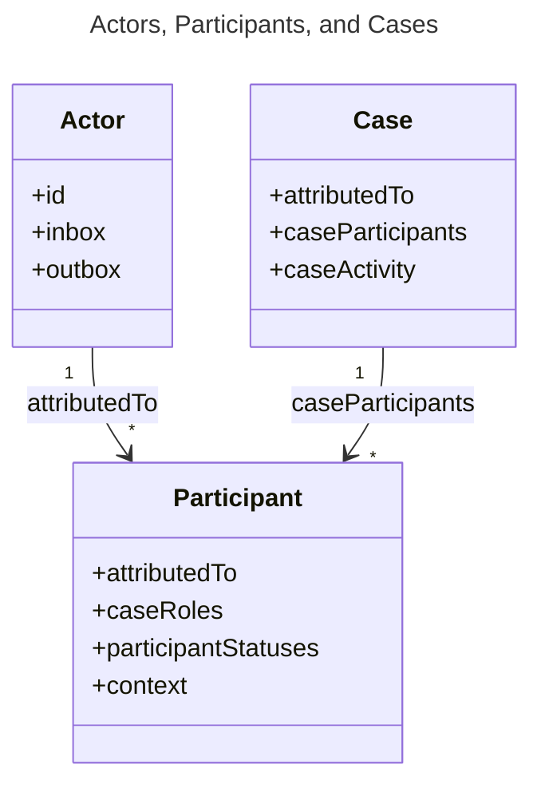
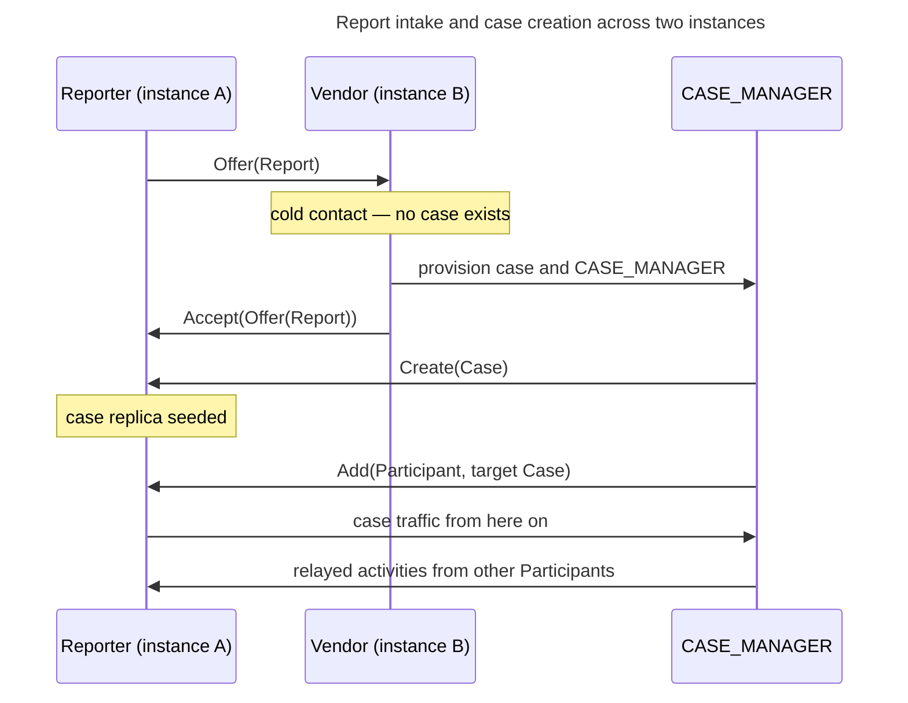

# Federation

Vultron has a design for a world in which each organization operates its own coordination service.
This page gives the federation model for those services.
It tells you which data the services interchange, which actor has authority for a case, and how two organizations build the trust that coordination needs.

The project has not built this model.
The prototype operates more than one actor in a single deployment.
Therefore this page gives a design direction, not a description of code that operates.
Each open question in the text is unresolved, and each one identifies the issue or the epic that records it.

---

## Federation between known peers, not open-web broadcast

The federation model is closer to email or to Matrix homeservers than to a public social network.
Each organization operates a service.
That service is a gateway between the internal tracker of the organization and the Vultron protocol.
Neither organization needs data about the internal systems of the other organization.
Both organizations speak the same protocol.

Federation occurs between parties that know each other.
It is not open-web discovery, and it is not public broadcast.
A human relationship or an inbound report puts two organizations together, and the protocol then carries the coordination.
This condition controls almost all of the design decisions on this page.
A closed group of known peers can use out-of-band trust, and it does not need the mechanisms of public federation.

---

## AS2 supplies the vocabulary

Vultron uses ActivityStreams 2.0 (AS2) as the semantic vocabulary for each coordination message.
An AS2 activity is a sentence: it gives the actor, the object, and the time of one event.
Vultron declares its own object types and activity types as AS2 vocabulary extensions.
It uses a JavaScript Object Notation for Linked Data (JSON-LD) `@context` for these declarations.

Vultron uses AS2 as a message format.
The prototype implements an actor and an inbox, and it implements no more of ActivityPub than that.
This is the current condition of the work, and it is not a decision against the other parts.



---

## Actors, inboxes, and outboxes

Vultron uses the AS2 actor model as its coordination primitive.
An actor is a peer with a Uniform Resource Identifier (URI).
Each actor has an inbox, which receives activities, and an outbox, which sends them.
A deployment also has instance-level actors for peering and for first contact from an unknown party.

The actor that holds `CVDRole.CASE_MANAGER` for a case coordinates that case.
Authority comes from the role and from nothing else (ADR-0088, CM-02-011).
The name of an actor, the shape of its Uniform Resource Locator (URL), and its host have no protocol meaning.

The prototype supplies a dedicated container actor for this function and gives it the name `case-actor`.
That name is a convenience (CM-02-013).
One such actor can hold the role for many cases at the same time.
The `context` field of an activity identifies the case, and the URI of the actor does not identify it.

An actor has a key pair, and the key material applies to the actor identity.

As an alternative, a deployment can use a case actor service to supply one CASE_MANAGER actor for each case.
Each case then has its own actor, and encryption becomes per-case as a result.
This is an intended use of Vultron.
It needs a ready mechanism for actors to find each other, and [actor discovery](open_questions.md#federation) is an open question.

---

## The parts of a case across instances

A case is a container for participants, reports, status, and history.
A Participant is a case-scoped record that refers to a global Actor.
It holds the roles and the authorization of that actor *in this case*.
This difference is important, because one actor participates in many cases and holds different roles in each case.



The diagram shows that a Participant connects a long-lived Actor to one Case.
An Actor exists independently of a case.
A Participant exists only in one case.
The field names are the serialized AS2 names on `as_CaseParticipant` and `as_VulnerabilityCase`, and the diagram is not notional.
The `attributedTo` of a Participant holds the Actor, and the `context` of a Participant holds the Case.

---

## Case ownership

The `attributedTo` field of a case holds an actor identifier, and it does not hold a host.
The CASE_MANAGER that makes the case is the value of that field (CP-09-001).
Ownership is unambiguous for a different reason: one Actor holds `CVDRole.CASE_OWNER` at a given time (CM-21-001).
A transfer of that role uses an `Offer` and `Accept` cycle.
The Case Activity Log gives the full history of ownership.

Any Participant Actor can accept a report and make a case from it.
The Actor that makes the case supplies the CASE_MANAGER for it.
That Actor also holds the CASE_OWNER role until a transfer occurs.
The host of an actor gives no authority, and the role gives all of it (ADR-0088).



---

## From report to case

First contact is the only interchange that occurs when no case exists.



The diagram shows the change from one cold-contact message to steady-state coordination.
After the Reporter has a replica, each subsequent message is case-scoped and goes through the CASE_MANAGER.



---

## Case traffic goes through the CASE_MANAGER

After a case exists, all case communication is a set of direct messages.
These messages go between each Participant actor and the CASE_MANAGER.
The protocol publishes no case data in public.
Participants do not send messages directly to each other (PCR-08-001, PCR-08-002).
One interchange is outside this rule.
A Reporter sends a report directly to an Actor to start the process, and no case exists at that time.

One relay through one actor gives four properties, at the cost of one more network step.
The CASE_MANAGER can apply authorization, because it sees each message and knows the roles of each Participant.
It can also attest to the sequence, because it gives each entry its position.
A Participant cannot send a message that seems to come from a different Participant, because only the CASE_MANAGER sends case traffic.
The view of each Participant also comes from the canonical recorded log, and not from the messages that arrive.



---

## Relay with Announce

The CASE_MANAGER sends the activity of one Participant to the other Participants.
It puts the initial activity in an AS2 `Announce` and signs the `Announce`.

```json
{
  "@context": "https://certcc.github.io/Vultron/ns/context.jsonld",
  "type": "Announce",
  "id": "https://vendorb.example/cases/1234/actor/outbox/relay/88",
  "actor": "https://vendorb.example/cases/1234/actor",
  "published": "2025-03-08T12:00:00Z",
  "logIndex": 3,
  "prevLogHash": "sha256-of-entry-2",
  "to": "https://vendora.example/users/alice",
  "object": {
    "type": "Create",
    "actor": "https://vendora.example/users/alice",
    "object": {
      "type": "Note",
      "content": "Reproduced on version 4.2"
    },
    "signature": "...the reporter's original signature..."
  },
  "signature": "...the CASE_MANAGER's signature..."
}
```

The two signatures have two different functions.
The inner signature shows that the activity came from the Participant that claims it.
The outer signature shows that the CASE_MANAGER received the activity and relayed it, at a known position in the case ledger.
A recipient verifies each signature independently.
A recipient can thus trust a relayed message without a direct connection to the Participant that sent it.

Each outbound message declares the Vultron JSON-LD context, and the ActivityStreams namespace alone is not sufficient (VM-10-001).
The example shows the `logIndex` and `prevLogHash` fields on the `Announce` for clarity.
The implementation carries them on the `as_CaseLedgerEntry` object instead.

The `logIndex` and `prevLogHash` fields let a recipient put the relayed activity in its replica immediately.
The recipient does not wait for a synchronization cycle.



---

## The case ledger and the delivery log

The CASE_MANAGER keeps two collections and shows them as AS2 named streams.
The two collections have different functions.

| Collection | Content | Synchronized |
|---|---|---|
| Case ledger (`/outbox`) | Hash-chained record of the case events, indexed by `logIndex` | Yes — this is the replication target |
| Delivery log (`/streams/delivery`) | The `Announce` relays, with the recipient and the time of each one | No |

The case ledger is append-only.
Each entry holds the hash of the entry before it, which keeps the ledger tamper-evident.
The case ledger holds the events of the case: `Create`, `Update`, `Offer`, `Accept`, `Add`, `Remove`, and the others.
Only ledger entries use `logIndex` positions.

The delivery log is a tool for operators.
It gives data for diagnosis, for retry control, and for delivery verification.
An operator can remove or archive the delivery log, and the integrity of the case stays correct.
The delivery log is also much larger than the case ledger.
One `Note` to twenty Participants makes one ledger entry and twenty delivery log entries.





---

## Convergence of the replicas

Each Participant keeps a Participant Case Replica, and the CASE_MANAGER pushes each change to it.
The CASE_MANAGER sends each Case Ledger Entry at the time of the event, which is ledger fanout.
Each entry holds its `logIndex` and `prevLogHash`, and the recipient uses these fields to put the entry in sequence.
Each entry also connects to the entry before it, and the CASE_MANAGER signs it.
A Participant can thus verify the integrity and the authenticity of the stream on arrival, and it does not trust the transport.

Push is the only specified path.
A Participant records the `logIndex` of each entry that it received.
A discontinuity in those values shows that an entry is absent.
Ledger reconciliation then repairs the gap.
It is a loop on the side of the CASE_MANAGER, with retry and backoff (SYNC-00-007).
The loop continues until the tail hash of the replica agrees with the tail hash of the CASE_MANAGER (SYNC-00-008).

The recipient buffers each entry that arrives out of sequence, and replay is the backstop for an entry that is genuinely lost (ADR-0037).
A read path for a Participant is a possible addition, and the protocol does not specify one.
A `GET` of the `/outbox` of the CASE_MANAGER, as a paginated AS2 `OrderedCollection`, is the expected shape of such a path.



---

## Instance identity and trust

Instances send messages on Hyper Text Transfer Protocol Secure (HTTPS) with authenticated transport.
Mutual Transport Layer Security (mTLS) between instances is the preferred mechanism.
It authenticates at the transport layer, and it adds no work to each message.
Each actor also signs its activities with its key pair.
The transport thus has no effect on non-repudiation.

The Domain Name System (DNS) holds the trust anchor for the identity of an instance.
This model follows DomainKeys Identified Mail (DKIM) and Mail Exchanger (MX) records for email.

1. The operator publishes a DNS TXT record at its domain with the fingerprint of the instance public key.
2. Two operators interchange domain names out of band, through human channels.
3. The instance that connects reads the DNS TXT record of the peer and records the fingerprint.
4. It gets `/.well-known/vultron-meta.json`, which holds the full public key, the inbox URL, and the vocabulary extensions.
5. It compares the public key against the fingerprint from DNS.
6. It sends a signed `Follow` activity to the instance inbox of the peer.
7. The peer does the same checks and answers with `Accept` or `Reject`.
8. Both instances keep a local record of the peering.

The out-of-band step is the most important step.
It makes trust between the organizations, which is different from cryptographic verification.
Cryptographic verification cannot give organizational trust.

An invite token is a possible addition.
One operator makes a signed token and sends it out of band.
The other operator sends the token with its peering request, which shows that an invitation exists.
A directory is not necessary for this check.



---

## Delivery

Each instance writes its outbound activities to a durable queue before it sends them.
Workers then send each activity to the inbox of the peer on HTTPS, with retry and backoff.
A prototype can use synchronous delivery below this interface.
But the architecture gives space for asynchronous delivery with retries.

Two refinements are important at large scale.
An instance sends one request for more than one Participant on the same peer instance, and not one request for each Participant.
A shared inbox makes this single request possible.
A shared inbox receives activities for each local actor, and it sends them to the correct actor in the instance.
The prototype does not supply one, and OX-11 gives the requirements for it.

---

## Connectors

The coordination service is independent of the issue tracker.
It speaks the Vultron protocol, and it has no data about any one tracker.
Each deployment adds a connector for its own internal tracker.
The connector translates between the events of the internal tracker and Vultron activities, in both directions.

The service finds its connectors as plugins at start-up.
Support for a new tracker thus needs no change to the service.

---

## Extension of the vocabulary

The object types and activity types of Vultron are extensions to AS2, and not replacements for it.
Vultron declares each extension type in a JSON-LD `@context`.
A peer uses that declaration to recognize a Vultron activity.



---

## Further reading

- [Glossary](../../reference/glossary.md) — definitions for CASE_MANAGER, case ledger, Case Ledger Entry, Participant Case Replica, and the other terms on this page
- [Actor Knowledge Model](../actor-knowledge-model.md) — the limits of the knowledge of an actor, and why each outbound activity holds full inline objects
- [Case Ledger Synchronization](../case_lifecycle/case_ledger_sync.md) — replication in the current single-deployment implementation
- [Ownership Transfer](../case_lifecycle/ownership_transfer.md) — the transfer sequence in the current implementation
- [Open questions](open_questions.md) — each open question on this page, collected
