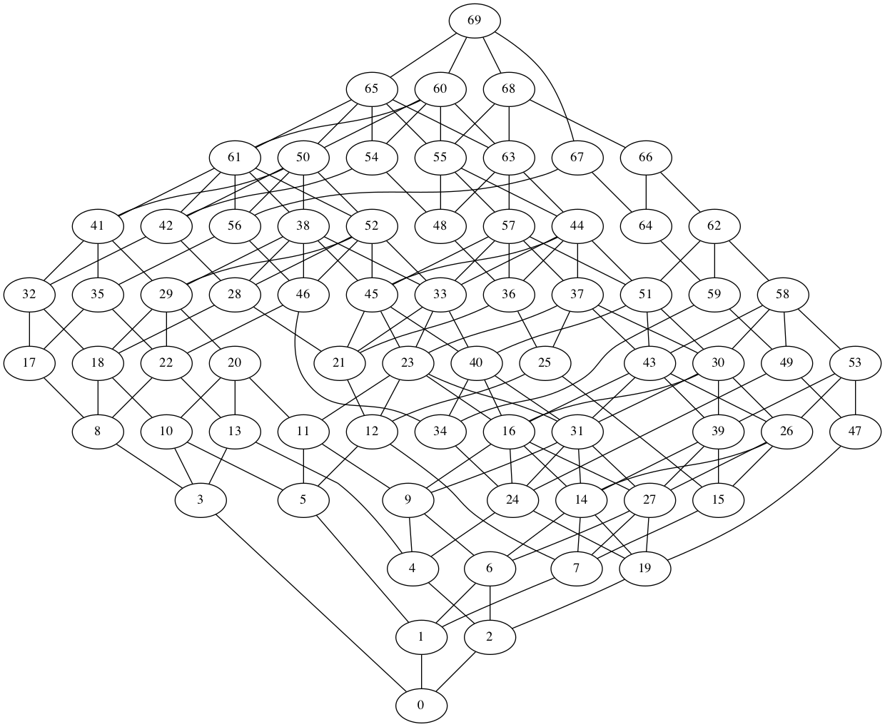

# On the Desirability of Possible Histories



All possible case histories are not equally preferable. Some are quite
bad&mdash;for
example, those in which attacks precede vendor awareness
($\mathbf{A} \prec \mathbf{V}$). Others are very desirable&mdash;for example,
those in which fixes are deployed before either an exploit is made
public ($\mathbf{D} \prec \mathbf{X}$) or attacks occur
($\mathbf{D} \prec \mathbf{A}$).

!!! info "Deriving Preferences over Histories"

    This page formalizes the desiderata for CVD histories that we introduced
    in [CVD Success Criteria](../background/cvd_success.md).

In pursuit of a way to reason about our preferences for some histories
over others, we define the following preference criteria:

!!! note "Desiderata for CVD Histories"

    History $h_a$
    is preferred over history $h_b$ if, all else being equal, a more
    desirable event $\sigma_1$ precedes a less desirable event $\sigma_2$.
    This preference is denoted as $\sigma_1 \prec \sigma_2$. 

We define the following ordering preferences:

## Vendor Awareness Ordering Preferences

| Ordering Preference | Meaning |
| :--- | :--- |
| $\mathbf{V} \prec \mathbf{P}$ | Vendor awareness precedes public awareness |
| $\mathbf{V} \prec \mathbf{X}$ | Vendor awareness precedes exploit publication |
| $\mathbf{V} \prec \mathbf{A}$ | Vendor awareness precedes attacks |

Vendors can take no action to
produce a fix if they are unaware of the vulnerability. Public
awareness prior to vendor awareness can cause increased support
costs for vendors at the same time they are experiencing increased
pressure to prepare a fix. If public awareness of the vulnerability
prior to vendor awareness is bad, then a public exploit is at least
as bad because it encompasses the former and makes it readily
evident that adversaries have exploit code available for use.
Attacks prior to vendor awareness represent a complete failure of
the vulnerability remediation process because they indicate that
adversaries are far ahead of defenders.

## Fix Availability Ordering Preferences

| Ordering Preference | Meaning |
| :--- | :--- |
| $\mathbf{F} \prec \mathbf{P}$ | Fix availability precedes public awareness |
| $\mathbf{F} \prec \mathbf{X}$ | Fix availability precedes exploit publication |
| $\mathbf{F} \prec \mathbf{A}$ | Fix availability precedes attacks |

As noted above, the public can take
no action until a fix is ready. Because public awareness also
implies adversary awareness, the vendor/adversary race becomes even
more critical if this condition is not met. When fixes exist before
exploits or attacks, defenders are better able to protect their
users.

## Fix Deployment Ordering Preferences

| Ordering Preference | Meaning |
| :--- | :--- |
| $\mathbf{D} \prec \mathbf{P}$ | Fix deployment precedes public awareness |
| $\mathbf{D} \prec \mathbf{X}$ | Fix deployment precedes exploit publication |
| $\mathbf{D} \prec \mathbf{A}$ | Fix deployment precedes attacks |

Even better than vendor awareness
and fix availability prior to public awareness, exploit publication
or attacks are scenarios in which fixes are deployed prior to one or
more of those transitions.

## Public Awareness Ordering Preferences

| Ordering Preference | Meaning |
| :--- | :--- |
| $\mathbf{P} \prec \mathbf{X}$ | Public awareness precedes exploit publication |
| $\mathbf{P} \prec \mathbf{A}$ | Public awareness precedes attacks |

In
many cases, fix deployment ($\mathbf{D}$) requires system owners to
take action, which implies a need for public awareness of the
vulnerability. We therefore prefer histories in which public
awareness happens prior to either exploit publication or attacks.

## Exploit Publication Ordering Preferences

| Ordering Preference | Meaning |
| :--- | :--- |
| $\mathbf{X} \prec \mathbf{A}$ | Exploit publication precedes attacks |

This criteria is not about whether
exploits should be published or not. It is about whether we
should prefer histories in which exploits are published *before*
attacks happen over histories in which exploits are published
*after* attacks happen. Our position is that attackers have more
advantages in the latter case than the former, and therefore we
should prefer histories in which $\mathbf{X} \prec \mathbf{A}$.

## Formalizing Event Ordering Preferences

Taking the above preferences into account, we can define a set of
desired orderings $\mathbb{D}$ as follows:

!!! note "Formalizing Desirable Orderings"

    The following equation formalizes our definition of desired orderings $\mathbb{D}$.

    $$\begin{split}
     \mathbb{D} \stackrel{\mathsf{def}}{=}\{ & \mathbf{V} \prec \mathbf{P}, \mathbf{V} \prec \mathbf{X}, \mathbf{V} \prec \mathbf{A},\\
    & \mathbf{F} \prec \mathbf{P}, \mathbf{F} \prec \mathbf{X}, \mathbf{F} \prec \mathbf{A},\\
    & \mathbf{D} \prec \mathbf{P}, \mathbf{D} \prec \mathbf{X}, \mathbf{D} \prec \mathbf{A},\\
    & \mathbf{P} \prec \mathbf{X}, \mathbf{P} \prec \mathbf{A}, \mathbf{X} \prec \mathbf{A} \}
    \end{split}$$

    An element $d \in \mathbb{D}$ is of the form
    $\sigma_i \prec \sigma_j$. More formally, $d$ is a relation of the form
    $d\left(\sigma_1, \sigma_2, \prec \right)$. 
    $\mathbb{D}$ is a set of such relations.

!!! info "Ordered Pairs of Events"

    This table displays all 36 possible orderings of
    paired transitions and whether they are considered impossible, required
    (as defined by the formalized constraints reproduced below for convenience)

    | :material-table-row: $\prec$ :material-table-column: | $\mathbf{V}$ | $\mathbf{F}$ | $\mathbf{D}$ | $\mathbf{P}$ | $\mathbf{X}$ | $\mathbf{A}$ |
    |:---------------:|:------------:|:------------:|:------------:|:------------:|:------------:|:------------:|
    |  $\mathbf{V}$   |  -  |   :material-check:   |   :material-check:   |   :material-circle:    |   :material-circle:    |   :material-circle:    |
    |  $\mathbf{F}$   |  :octicons-circle-slash-16:  |  -  |   :material-check:   |   :material-circle:    |   :material-circle:    |   :material-circle:    |
    |  $\mathbf{D}$   |  :octicons-circle-slash-16:  |  :octicons-circle-slash-16:  |  -  |   :material-circle:    |   :material-circle:    |   :material-circle:    |
    |  $\mathbf{P}$   |  :material-dots-circle:   |  :material-dots-circle:   |  :material-dots-circle:   |  -  |   :material-circle:    |   :material-circle:    |
    |  $\mathbf{X}$   |  :material-dots-circle:   |  :material-dots-circle:   |  :material-dots-circle:   |  :material-dots-circle:   |  -  |   :material-circle:    |
    |  $\mathbf{A}$   |  :material-dots-circle:   |  :material-dots-circle:   |  :material-dots-circle:   |  :material-dots-circle:   |  :material-dots-circle:   |  -  |

    Key:
    :material-check: = Required, 
    :material-circle: = Desired,
    :material-dots-circle: = Undesired,
    :octicons-circle-slash-16: = Impossible,
    :material-table-row: = row, 
    :material-table-column: = column
    $\prec$ = precedes

    

!!! tip "Ordering vs. Timing"

    Before proceeding, we note that our model focuses on the _ordering_ of
    transitions, not their _timing_. We acknowledge that in some situations,
    the interval between transitions may be of more interest than merely the
    order of those transitions, as a rapid tempo of transitions can alter
    the options available to stakeholders in their response. We discuss this
    limitation further in [Limitations](./limitations_future_work.md) however,
    the following model posits event sequence timing on a human-oriented timescale 
    measured in minutes to weeks.

### Some states are preferable to others

The desiderata defined above address the preferred ordering of transitions
in CVD histories, which imply that one should prefer to pass through some
states and avoid others.

!!! example "Preferences over states"

    For example, $\mathbf{V} \prec \mathbf{P}$ implies that we
    prefer the paths
    ${vp} \xrightarrow{\mathbf{V}} {Vp} \xrightarrow{\mathbf{P}} {VP}$ over
    the paths
    ${vp} \xrightarrow{\mathbf{P}} {vP} \xrightarrow{\mathbf{V}} {VP}$.

!!! info "Preferences over State Subsets"

    In the table below, we adapt those desiderata into specific
    subsets of states that should be preferred or avoided if the criteria is
    to be met.
    
    |     Event Precedence ($d$)     |   State Subsets to Prefer    |    State Subsets to Avoid    |
    |:------------------------------:|:----------------------------:|:----------------------------:|
    | $\mathbf{V} \prec \mathbf{X}$  | ${V\cdot\cdot\cdot x \cdot}$ | ${v\cdot\cdot\cdot X\cdot}$  |
    | $\mathbf{V} \prec \mathbf{A}$  | ${V\cdot\cdot\cdot\cdot a}$  | ${v\cdot\cdot\cdot\cdot A}$  |
    | $\mathbf{V} \prec \mathbf{P}$  | ${V\cdot\cdot p\cdot\cdot}$  | ${v\cdot\cdot P\cdot\cdot}$  |
    | $\mathbf{P} \prec \mathbf{X}$  | ${\cdot\cdot\cdot Px\cdot}$  | ${\cdot\cdot\cdot pX\cdot}$  |
    | $\mathbf{F} \prec \mathbf{X}$  |   ${VF\cdot\cdot x\cdot}$    |   ${\cdot fd\cdot X\cdot}$   |
    | $\mathbf{P} \prec \mathbf{A}$  | ${\cdot\cdot\cdot P\cdot a}$ | ${\cdot\cdot\cdot p\cdot A}$ |
    | $\mathbf{F} \prec \mathbf{A}$  |   ${VF\cdot\cdot\cdot a}$    |   ${\cdot fd\cdot\cdot A}$   |
    | $\mathbf{F} \prec \mathbf{P}$  |   ${VF\cdot p\cdot\cdot}$    |   ${\cdot fdP\cdot\cdot}$    |
    | $\mathbf{D} \prec \mathbf{X}$  |     ${VFD\cdot x\cdot}$      | ${\cdot\cdot d\cdot X\cdot}$ |
    | $\mathbf{X} \prec \mathbf{A}$  | ${\cdot\cdot\cdot\cdot Xa}$  | ${\cdot\cdot\cdot\cdot xA}$  |
    | $\mathbf{D} \prec \mathbf{A}$  |     ${VFD\cdot\cdot a}$      | ${\cdot\cdot d\cdot\cdot A}$ |
    | $\mathbf{D} \prec \mathbf{P}$  |      ${VFDp\cdot\cdot}$      | ${\cdot\cdot dP\cdot\cdot}$  |

### A partial order over possible histories

Given the desired preferences over orderings of transitions
($\mathbb{D}$ in *Formalizing Desirable Orderings* above,  we can construct
a partial ordering over all possible histories $\mathcal{H}$, as defined below.
This partial order requires a formal definition of which desiderata are met by a given history, provided by
*Formalizing Desirable Histories* below.

!!! note "Formalizing Desirable Histories"

    $$\mathbb{D}^{h} \stackrel{\mathsf{def}}{=}\{ d \in \mathbb{D} \textrm{ such that } d \textrm{ is true for } h \} \textrm{, for } h \in \mathcal{H}$$
    
    where $d\left(\sigma_1,\sigma_2,\prec\right)$  is true for $h$ if and only if:

    $$\exists \sigma_i, \sigma_j \in h \textrm{ such that } \sigma_i = 
    \sigma_1 \textrm{ and } \sigma_j = \sigma_2 \textrm{ and } h 
    \textrm {satisfies the relation } d\left(\sigma_i,\sigma_j,\prec\right) $$

!!! note "Partial Order over Possible Histories"

    The pre-order relation $>$ is defined over $\mathcal{H}$ as:
    
    $$(\mathcal{H},\leq_{H}) \stackrel{\mathsf{def}}{=}\forall h_a, h_b \in \mathcal{H}$$
    
    it is the case that $h_b \leq_{H} h_a$
    if and only if $\mathbb{D}^{h_b} \subseteq \mathbb{D}^{h_a}$

!!! tip "Extending the Partial Order"

    The partial order defined here is a simple one, in that it only requires
    that one history contain all the desiderata of another to be considered
    more desirable.
    In [Reasoning over Possible Histories](./reasoning.md)
    we will extend this model to include
    a partial order over the desiderata themselves, which will allow us to
    reason about the relative desirability of any two desiderata.
    [Discriminating Skill and Luck](./discriminating_skill_and_luck.md)
    will demonstrate that the model is amenable to analysis and
    [Benchmarking](./benchmarking.md) will lay out the criteria for extending
    it to cover MPCVD.

!!! info "The Lattice of Possible CVD Histories"

    A visualization of the resulting partially ordered set, or poset,
    $(\mathcal{H},\leq_{H})$ is shown as a Hasse Diagram in below. Hasse
    Diagrams represent the transitive reduction of a poset. Each node in the
    diagram represents an individual history $h_a$ from
    the 70 possible histories in $\mathcal{H}$; labels correspond to the index of
    the table. 
    The figure follows the partiarl order defined above, in that $h_a$ is higher in the order than
    $h_b$ when $h_a$ contains all the desiderata from $h_b$ and at least one
    more. Histories that do not share a path are incomparable (formally, two
    histories incomparable if both 
    $\mathbb{D}^{h_a} \not\supset \mathbb{D}^{h_b}$ and
    $\mathbb{D}^{h_a} \not\subset \mathbb{D}^{h_b}$).
    The diagram flows from
    least desirable histories at the bottom to most desirable at the top.

    

    !!! note "Upper and Lower Bounds of the Partially Ordered Set of Possible Histories"
    
        The poset $(\mathcal{H},\leq_{H})$, has as its upper bound
      
        $$h_{69} = (\mathbf{V}, \mathbf{F}, \mathbf{D}, \mathbf{P}, \mathbf{X}, \mathbf{A})$$
      
        while its lower bound is
      
        $$h_{0} = (\mathbf{A}, \mathbf{X}, \mathbf{P}, \mathbf{V}, \mathbf{F}, \mathbf{D})$$

    
    

