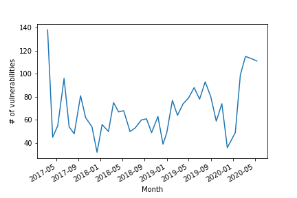
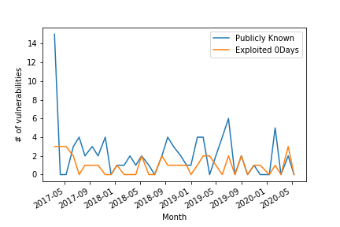
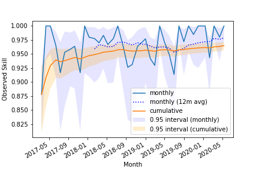
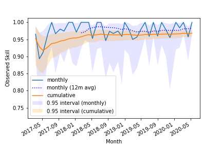
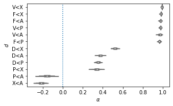
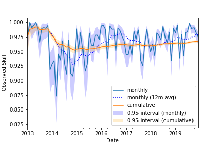
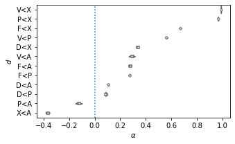

# Observing CVD in the Wild



As a proof of concept, we apply the model to two data sets:

1. Microsoft's security updates from 2017 through early 2020
2. Commodity public exploits from 2015-2019

## Microsoft 2017-2020

We are now ready to proceed with our data analysis. First, we examine
Microsoft's monthly security updates for the period between March 2017
and May 2020, as curated by the [Zero Day Initiative](https://www.zerodayinitiative.com/blog).

!!! question "Why use ZDI data instead of Microsoft's?"

    The [ZDI blog posts](https://www.zerodayinitiative.com/blog) were more directly useful than the monthly 
    Microsoft security updates because ZDI had already condensed the counts of how many vulnerabilities were known
    ($\mathbf{P}$) or exploited ($\mathbf{A}$) prior to their fix readiness $\mathbf{F}$. 
    Retrieving this data from Microsoft's published vulnerability information requires collecting it from all the
    individual vulnerabilities patched each month.
    We are grateful to ZDI for providing this summary and saving us the effort.

The figures show both the monthly totals for all vulnerabilities and the
monthly observations of vulnerabilities publicly known or attacked prior to patch availability.
The data set allowed us to compute the monthly counts for two of our
desiderata, $\mathbf{F} \prec \mathbf{P}$ and
$\mathbf{F} \prec \mathbf{A}$.

!!! info "Publicly Disclosed Microsoft Vulnerabilities 2017-2020"

    

    <figure>
    
    <figcaption>Vulnerabilities patched</figcaption>
    </figure>
    <figure>
    
    <figcaption>Vulnerabilities known or attacked prior to patch availability</figcaption>
    </figure>
    

### Measuring Skill from Observations

We can use the observations of $\mathbf{F} \prec \mathbf{P}$ and
$\mathbf{F} \prec \mathbf{A}$ to estimate the skill level of Microsoft's
CVD process.

!!! info "Skill Measurement for Microsoft 2017-2020"

    The left figure shows the trend for both the monthly observations and the cumulative estimate of $\alpha_{\mathbf{F} \prec \mathbf{P}}$.
    The right figure shows the trend for both the monthly observations and the cumulative estimate of $\alpha_{\mathbf{F} \prec \mathbf{A}}$.

    

    <figure>
    
    <figcaption>Fix Ready Before Public Awareness</figcaption>
    </figure>
    <figure>
    
    <figcaption>Fix Ready Before Attacks Observed</figcaption>
    </figure>
    

#### Observations of Fix before Public Awareness

In total, Microsoft issued patches for 2,694 vulnerabilities; 2,610 (0.97) of them met the
fix-ready-before-public-awareness ($\mathbf{F} \prec \mathbf{P}$)
objective. The mean monthly
$\alpha_{\mathbf{F} \prec \mathbf{P}} = 0.967$, with a range of \[0.878,
1.0\]. We can also use the cumulative data to estimate an overall skill
level for the observation period, which gives us a bit more precision on
$\alpha_{\mathbf{F} \prec \mathbf{P}} = 0.969$ with the 0.95 interval of
\[0.962, 0.975\].

#### Observations of Fix Ready before Attacks Observed

Meanwhile, 2,655 (0.99)
vulnerabilities met the fix-ready-before-attacks-observed
($\mathbf{F} \prec \mathbf{A}$) criteria. Thus we compute a mean monthly
$\alpha_{\mathbf{F} \prec \mathbf{A}} = 0.976$ with range \[0.893,
1.0\]. The cumulative estimate yields
$\alpha_{\mathbf{F} \prec \mathbf{A}} = 0.986$ with an interval of
\[0.980, 0.989\].

!!! tip "Inferring Histories from Observations"

    Another possible application of our model
    is to estimate unobserved $\alpha_d$ based on the cumulative
    observations of both $f_{\mathbf{F} \prec \mathbf{P}}^{obs}$ and
    $f_{\mathbf{F} \prec \mathbf{A}}^{obs}$ above. Here we estimate the
    frequency $f_d$ of the other $d \in \mathbb{D}$ for this period. Our
    procedure is as follows:

    1. For 10000 rounds, draw an $f_d^{est}$ for both
    $\mathbf{F} \prec \mathbf{P}$ and $\mathbf{F} \prec \mathbf{A}$ from
    the Beta distribution with parameters $a=S_d^{obs}$ and
    $b=T-S_d^{obs}$ where $S_d^{obs}$ is 2,610 or 2,655, respectively,
    and $T$ is 2,694.

    2. Assign each $h \in \mathcal{H}$ a weight according to standard joint
    probability based whether it meets both, either, or neither
    $A = \mathbf{F} \prec \mathbf{P}$ and
    $B = \mathbf{F} \prec \mathbf{A}$, respectively.

    $$
    w_h =
    \begin{cases}
    p_{AB} = f_A * f_B \textrm{ if } A \textrm{ and } B\\
    p_{Ab} = f_A * f_b \textrm{ if } A \textrm{ and } \lnot B\\
    p_{aB} = f_a * f_B \textrm{ if } \lnot A \textrm{ and } B\\
    p_{ab} = f_a * f_b \textrm{ if } \lnot A \textrm{ and } \lnot B
    \end{cases}
    $$ 
    where $f_a = 1 - f_A$ and $f_b = 1-f_B$

    3. Draw a weighted sample (with replacement) of size $N = 2,694$ from
    $\mathcal{H}$ according to these weights.

    4. Compute the sample frequency $f_{d}^{sample} = S_d^{sample} / N$ for
    each $d \in \mathbb{D}$, and record the median rank of all histories
    $h$ in the sample.

    5. Compute the estimated frequency as the mean of the sample
    frequencies, namely $f_{d}^{est} = \langle f_{d}^{sample} \rangle$,
    for each $d \in \mathbb{D}$.

    6. Compute $\alpha_d$ from $f_{d}^{est}$ for each $d \in \mathbb{D}$ .

    As one might expect given the causal requirement that vendor awareness
    precedes fix availability, the estimated values of $\alpha_d$ are quite
    high ($0.96-0.99$) for our desiderata involving either $\mathbf{V}$ or
    $\mathbf{F}$. We also estimate that $\alpha_d$ is positive---indicating
    that we are observing skill over and above mere luck---for all $d$
    except $\mathbf{P} \prec \mathbf{A}$ and $\mathbf{X} \prec \mathbf{A}$
    which are slightly negative. The results are shown in the figure below.
    The most common sample median history
    rank across all runs is 53, with all sample median history ranks falling
    between 51-55. The median rank of possible histories weighted according
    to the assumption of equiprobable transitions is 11. We take this as
    evidence that the observations are indicative of skill.

    

## Commodity Exploits 2015-2019

Next, we examine the overall trend in $\mathbf{P} \prec \mathbf{X}$ for
commodity exploits between 2015 and 2019. The data set is based on the
[National Vulnerability Database](https://nvd.nist.gov) (NVD), in conjunction with the CERT
[Vulnerability Data Archive](https://github.com/CERTCC/Vulnerability-Data-Archive).
Between these two databases, a number of candidate dates are available to represent the date a
vulnerability was made public. We use the minimum of these as the date for $P$.

To estimate the exploit availability ($\mathbf{X}$) date, we extracted
the date a CVE ID appeared in the git logs for
[Metasploit Framework](https://github.com/rapid7/metasploit-framework)
or the [Exploit Database](https://gitlab.com/exploit-database/exploitdb).
When multiple dates were available for a CVE
ID, we kept the earliest. Note that commodity exploit tools such as
Metasploit and Exploitdb represent a non-random sample of the exploits
available to adversaries. These observations should be taken as a lower
bounds estimate of exploit availability, and therefore an upper bounds
estimate of observed desiderata $d$ and skill $\alpha_d$.

!!! info "Skill Measurement & Estimates for Commodity Exploits 2015-2019"

    The left figure shows the trend for both the monthly observations and the cumulative estimate of $\alpha_{\mathbf{P} \prec \mathbf{X}}$.
    The right figure shows the estimated overall skill for all NVD vulnerabilities 2013-2019 based on these observations.

    

    <figure>
    
    <figcaption>Skill Measurement for Commodity Exploits 2015-2019</figcaption>
    </figure>
    <figure>
    
    <figcaption>Simulated overall skill for all NVD vuls 2013-2019 based on observations</figcaption>
    </figure>
    

During the time period from 2013-2019, the data set contains $N=73,474$
vulnerabilities. Of these, 1,186 were observed to have public exploits
($\mathbf{X}$) prior to the earliest observed vulnerability disclosure
date ($\mathbf{P}$), giving an overall success rate for
$\mathbf{P} \prec \mathbf{X}$ of 0.984. The mean monthly
$\alpha_{\mathbf{P} \prec \mathbf{X}}$ is 0.966 with a range of \[0.873,
1.0\]. The volatility of this measurement appears to be higher than that
of the Microsoft data. The cumulative
$\alpha_{\mathbf{P} \prec \mathbf{X}}$ comes in at 0.968 with an
interval spanning \[0.966, 0.970\]. A chart of the trend is shown below.

To estimate unobserved $\alpha_d$ from the commodity exploit
observations, we repeat the procedure outlined above. This time, we use $N=73,474$ and
estimate $f^{est}_{d}$ for $\mathbf{P} \prec \mathbf{X}$ with Beta
parameters $a=72,288$ and $b=1186$. As above, we find evidence of skill
in positive estimates of $\alpha_d$ for all desiderata except
$\mathbf{P} \prec \mathbf{A}$ and $\mathbf{X} \prec \mathbf{A}$, which
are negative. The most common sample median history rank in this
estimate is 33 with a range of \[32,33\], which while lower than the
median rank of 53 in the Microsoft estimate above, still beats the median rank of 11 assuming
uniform event probabilities. The results are shown in the right-hand figure above.
