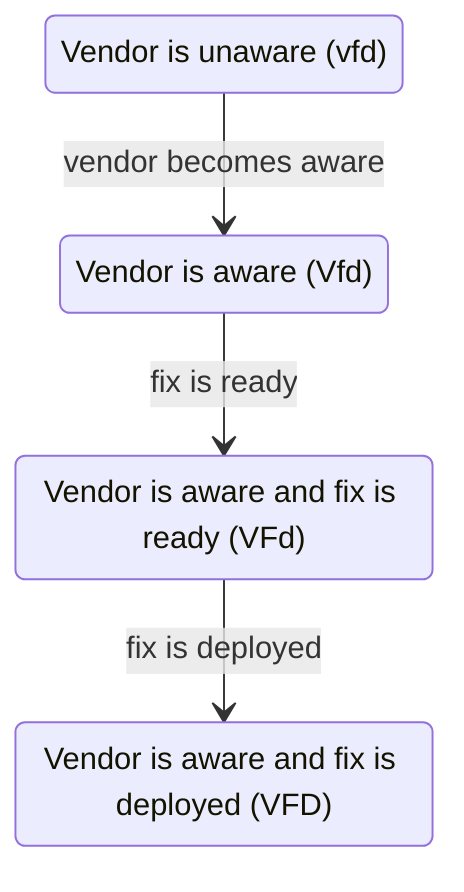
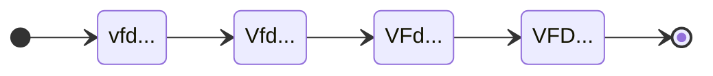
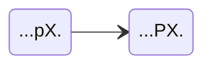
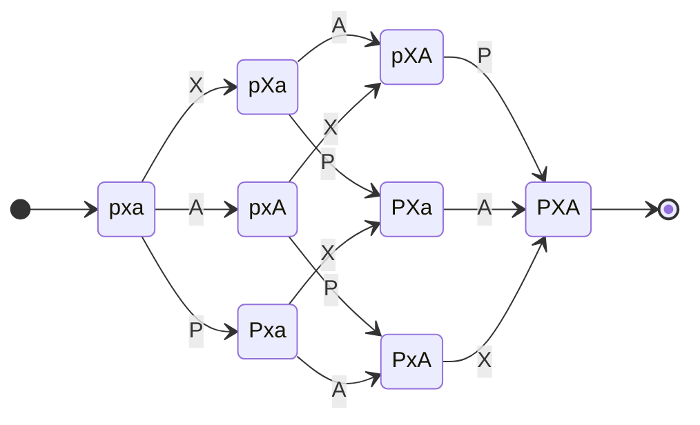

# CVD Case State Model



As in the [RM](../rm/index.md) and [EM](../em/index.md) process models, we wish to define a 5-tuple
$(\mathcal{Q},\Sigma,\delta,q_0,F)$, this time for the CS model.



In the CS model, a state $q^{cs}$ represents the status of each of the six [substates](index.md).
State labels use the substate notation at left.
For example, the state _VFdpXa_ represents Vendor is aware, fix is ready, fix not deployed, no public awareness, exploit
is public, and no attacks.
The order in which the events occurred does not matter when defining the state.
However, we will observe a notation convention keeping the letter names in the same case-insensitive order
$(v,f,d,p,x,a)$.

CS states can be any combination of statuses, provided that a number of caveats elaborated in
§[1.3](#sec:transitions){reference-type="ref"
reference="sec:transitions"} are met. 
One such caveat worth noting here is that valid states must follow what we call the *Vendor fix path*.[^1]

???+ note inline end "Vendor Fix Path Formalism"

    $$D \implies F \implies V$$

The reason is causal: For a fix to be deployed (_D_), it must have been ready (_F_) for deployment.
And for it to be ready, the Vendor must have already known (_V_) about the vulnerability. 
As a result, valid states must begin with one of the following strings: _vfd_, _Vfd_, _VFd_, or _VFD_.

The CS model is thus
composed of 32 possible states, which we define as $\mathcal{Q}^{cs}$.

???+ note "CS Model States ($\mathcal{Q}^{cs}$) Defined"

    $$
    \mathcal{Q}^{cs} = 
    \begin{Bmatrix}
        vfdpxa, & vfdPxa, & vfdpXa, & vfdPXa, \\
        vfdpxA, & vfdPxA, & vfdpXA, & vfdPXA, \\
        Vfdpxa, & VfdPxa, & VfdpXa, & VfdPXa, \\
        VfdpxA, & VfdPxA, & VfdpXA, & VfdPXA, \\
        VFdpxa, & VFdPxa, & VFdpXa, & VFdPXa, \\
        VFdpxA, & VFdPxA, & VFdpXA, & VFdPXA, \\
        VFDpxa, & VFDPxa, & VFDpXa, & VFDPXa, \\
        VFDpxA, & VFDPxA, & VFDpXA, & VFDPXA
    \end{Bmatrix}$$

## CS Start and End States

???+ note inline end "CS Model Start and End States ($q^{cs}_0$ and $\mathcal{F}^{cs}$) Defined"

    $$q^{cs}_0 = vfdpxa$$

    $$\mathcal{F}^{cs} = \{ VFDPXA \}$$

All vulnerabilities start in the base state _vfdpxa_ in which no
events have occurred.  The lone final state in which all events have
occurred is _VFDPXA_.  

### The Map is not the Territory

Note that this is a place where our
model of the vulnerability lifecycle diverges from what we expect to
observe in CVD
cases in the real world. There is ample evidence that most
vulnerabilities never have exploits published or attacks observed
[@householder2020historical; @jacobs2021exploit]. Therefore, practically
speaking, we might expect vulnerabilities to wind up in one of

$$\mathcal{F}^\prime = \{ {VFDPxa}, {VFDPxA}, {VFDPXa}, {VFDPXA} \}$$ 

at the time a report is closed (i.e., when $q^{rm} \xrightarrow{c} C$). In
fact, most count a CVD as successful when reports are closed in
$q^{cs} \in VFDPxa$ because it means that the defenders won the race
against adversaries. The distinction between the [RM](../rm/index.md) and CS processes is important; Participants can
close cases whenever their [RM](../rm/index.md) process dictates, independent of the
CS state. In other
words, it remains possible for exploits to be published or attacks to be
observed long after the [RM](../rm/index.md) process has closed a case.

!!! info "CS Model Wildcard Notation"
    
    We frequently need to refer to subsets of $\mathcal{Q}^{cs}$. To do so,
    we will use a dot (&centerdot;) to represent a single character wildcard.
    For example, $VFdP&centerdot;&centerdot;refers to the subset of $\mathcal{Q}^{cs}$ in
    which the Vendor is aware, a fix is ready but not yet deployed, and the
    public is aware of the vulnerability, yet we are indifferent to whether
    exploit code has been made public or attacks have been observed.
    Specifically,

    $${VFdP&centerdot;&centerdot;} = \{{VFdPxa}, {VFdPxA}, {VFdPXa}, {VFdPXA}\} \subset{\mathcal{Q}}^{cs}$$

## CS Transitions 

In this section, we elaborate on the input symbols and transition
functions for our CS
DFA. A row-wise
reading of {== Table
[\[tab:event_status\]](#tab:event_status){reference-type="ref"
reference="tab:event_status"} ==} implies a set of events corresponding to
each specific substate change, which we correspond to the symbols in the

DFA.

-   **V** -- A Vendor becomes aware of a vulnerability
    $vfd&centerdot;&centerdot;&centerdot; \to Vfd&centerdot;&centerdot;&centerdot;

-   **F** -- A Vendor readies a fix for a vulnerability
    $Vfd&centerdot;&centerdot;&centerdot; \to VFd&centerdot;&centerdot;&centerdot;

-   **D** -- A Deployer deploys a fix for a vulnerability
    $VFd&centerdot;&centerdot;&centerdot; \to VFD&centerdot;&centerdot;&centerdot;

-   **P** -- Information about a vulnerability becomes known to
    the public &centerdot;&centerdot;&centerdot;p&centerdot;&centerdot; \to &centerdot;&centerdot;&centerdot;P&centerdot;&centerdot;

-   **X** -- An exploit for a vulnerability is made public
    &centerdot;&centerdot;&centerdot;&centerdot;x&centerdot; \to &centerdot;&centerdot;&centerdot;&centerdot;X&centerdot;

-   **A** -- Attacks exploiting a vulnerability are observed
    &centerdot;&centerdot;&centerdot;&centerdot;&centerdot;a \to &centerdot;&centerdot;&centerdot;&centerdot;&centerdot;A

???+ note inline end "CS Model Input Symbols ($\Sigma^{cs}$) Defined"

    $$\label{eq:events}
        \Sigma^{cs} = \{\mathbf{V},\mathbf{F},\mathbf{D},\mathbf{P},\mathbf{X},\mathbf{A}\}$$

We define the set of symbols for our CS DFA as $\Sigma^{cs}$:

Here we diverge somewhat from the notation used for the
[RM](../rm/index.md) and [EM](../em/index.md) models, which use lowercase letters for transitions and
uppercase letters for states. Because CS state names already use both lowercase
and uppercase letters, here we use a bold font for the symbols of the
CS DFA to differentiate the transition from the corresponding substate it leads
to: e.g., $vfd&centerdot;&centerdot;&centerdot; \xrightarrow{\mathbf{V}} Vfd&centerdot;&centerdot;&centerdot;.

{== fix formatting to match what we're saying here if necessary ==}

For the CS model, an input symbol $\sigma^{cs} \in \Sigma^{cs}$ is "read" when a Participant
observes a change in status (a Vendor is notified and exploit code has
been published, etc.). For the sake of simplicity, we begin with the
assumption that observations are globally known---that is, a status
change observed by any CVD Participant is known to all. In the real
world, we believe the [Formal Vultron MPCVD Protocol](../../../reference/formal_protocol/index.md)
is poised to ensure eventual
consistency with this assumption through the communication of perceived
case state across coordinating parties.

## CS Transitions Defined 

Here we define the allowable transitions between states in the
CS model. A diagram
of the CS process,
including its states and transitions, is shown in Figure
[\[fig:vfdpxa_map\]](#fig:vfdpxa_map){reference-type="ref"
reference="fig:vfdpxa_map"}.

Transitions in the CS model follow a few rules described in
detail in §2.4 of the Householder and Spring 2021
report [@householder2021state], which we summarize here:

-   Because states correspond to the status of events that have or have
    not occurred, and all state transitions are irreversible (i.e., we
    assume history is immutable), the result will be an acyclic directed
    graph of states beginning at $q^{cs}_0={vfdpxa}$ and ending at
    $\mathcal{F}^{cs}=\{VFDPXA\}$ with allowed transitions as the edges.
    In practical terms for the CS model, this means there is an arrow
    of time from _vfdpxa_ through _VFDPXA_ in which each individual
    state transition changes exactly one letter from lowercase to
    uppercase.

-   The *Vendor fix path*
    ($vfd &centerdot;&centerdot;&centerdot; \xrightarrow{\mathbf{V}} Vfd &centerdot;&centerdot;&centerdot; \xrightarrow{\mathbf{F}} VFd &centerdot;&centerdot;&centerdot; \xrightarrow{\mathbf{D}} VFD &centerdot;&centerdot;&centerdot;)
    is a causal requirement as outlined in [substates](cs_model.md).

-   Vendors are presumed to know at least as much as the public does;
    therefore, $v&centerdot;&centerdot;P&centerdot;&centerdot;can only lead to $V&centerdot;&centerdot;P&centerdot;&centerdot;.

### Exploit Publication Causes Public Awareness

Exploit publication is tantamount to public awareness; therefore,
&centerdot;&centerdot;&centerdot;pX &centerdot;can only lead to &centerdot;&centerdot;&centerdot;&centerdot;PX &centerdot;.

Therefore, for all practical purposes, 

simplifies to 



### Attacks Do Not Necessarily Cause Public Awareness

In this model, attacks observed when a vulnerability is unknown to the
public (&centerdot;&centerdot;&centerdot;p&centerdot;A) need not immediately cause public awareness
(&centerdot;&centerdot;&centerdot;P&centerdot;A), although, obviously, that can and does happen.
Our reasoning for allowing states in &centerdot;&centerdot;&centerdot;p&centerdot;A to persist is
twofold:

-   First, the connection between attacks and exploited vulnerabilities
    is often made later during incident analysis. While the attack
    itself may have been observed much earlier, the knowledge of *which*
    vulnerability it targeted may be delayed until after other events
    have occurred.

-   Second, attackers are not a monolithic group. An attack from a niche
    set of threat actors does not automatically mean that the knowledge
    and capability of exploiting a particular vulnerability is widely
    available to all possible adversaries. Publication, in that case,
    might assist other adversaries more than it helps defenders.

In other words, although &centerdot;&centerdot;&centerdot;p&centerdot;A does not require an
immediate transition to &centerdot;&centerdot;&centerdot;P&centerdot;A the way
&centerdot;&centerdot;&centerdot;pX&centerdot;&nbsp;&rarr;&nbsp;&centerdot;&centerdot;&centerdot;PX&centerdot; does, it
does seem plausible that the likelihood of **P** occurring
increases when attacks are occurring. Logically, this is a result of
there being more ways for the public to discover the vulnerability when
attacks are happening than when they are not. For states in
&centerdot;&centerdot;&centerdot;p&centerdot;a, the public depends on the normal vulnerability
discovery and reporting process. States in &centerdot;&centerdot;&centerdot;p&centerdot;A include
that possibility and add the potential for discovery as a result of
security incident analysis. Hence,

!!! note ""

    Once attacks have been observed, fix development SHOULD accelerate,
    the embargo teardown process SHOULD begin, and publication and
    deployment SHOULD follow as soon as is practical.



## A Regular Grammar for the CS model

Following the complete state machine diagram in Figure
[\[fig:vfdpxa_map\]](#fig:vfdpxa_map){reference-type="ref"
reference="fig:vfdpxa_map"}, we can summarize the transition functions
of the CS model as a
right-linear grammar $\delta^{cs}$:

???+ note "CS Transition Function ($\delta^{cs}$) Defined"

    $$  \delta^{cs} =
        \begin{cases}
            vfdpxa &\to \mathbf{V}~Vfdpxa~|~\mathbf{P}~vfdPxa~|~\mathbf{X}~vfdpXa~|~\mathbf{A}~vfdpxA \\
            vfdpxA &\to \mathbf{V}~VfdpxA~|~\mathbf{P}~vfdPxA~|~\mathbf{X}~vfdpXA \\
            vfdpXa &\to \mathbf{P}~vfdPXa \\
            vfdpXA &\to \mathbf{P}~vfdPXA \\
            vfdPxa &\to \mathbf{V}~VfdPxa \\
            vfdPxA &\to \mathbf{V}~VfdPxA \\ 
            vfdPXa &\to \mathbf{V}~VfdPXa \\
            vfdPXA &\to \mathbf{V}~VfdPXA \\
            Vfdpxa &\to \mathbf{F}~VFdpxa~|~\mathbf{P}~VfdPxa~|~\mathbf{X}~VfdpXa~|~\mathbf{A}~VfdpxA \\
            VfdpxA &\to \mathbf{F}~VFdpxA ~|~ \mathbf{P}~VfdPxA ~|~ \mathbf{X}~VfdpXA \\
            VfdpXa &\to \mathbf{P}~VfdPXa \\
            VfdpXA &\to \mathbf{P}~VfdPXA \\
            VfdPxa &\to \mathbf{F}~VFdPxa ~|~ \mathbf{X}~VfdPXa ~|~ \mathbf{A}~VfdPxA \\
            VfdPxA &\to \mathbf{F}~VFdPxA ~|~ \mathbf{X}~VfdPXA \\
            VfdPXa &\to \mathbf{F}~VFdPXa ~|~ \mathbf{A}~VfdPXA \\
            VfdPXA &\to \mathbf{F}~VFdPXA \\ 
            VFdpxa &\to \mathbf{D}~VFDpxa~|~\mathbf{P}~VFdPxa ~|~ \mathbf{X}~VFdpXa ~|~ \mathbf{A}~VFdpxA \\
            VFdpxA &\to \mathbf{D}~VFDpxA ~|~ \mathbf{P}~VFdPxA ~|~ \mathbf{X}~VFdpXA \\
            VFdpXa &\to \mathbf{P}~VFdPXa \\
            VFdpXA &\to \mathbf{P}~VFdPXA \\
            VFdPxa &\to \mathbf{D}~VFDPxa ~|~ \mathbf{X}~VFdPXa ~|~ \mathbf{A}~VFdPxA \\
            VFdPxA &\to \mathbf{D}~VFDPxA ~|~ \mathbf{X}~VFDPXA \\
            VFdPXa &\to \mathbf{D}~VFDPXa ~|~ \mathbf{A}~VFdPXA \\
            VFdPXA &\to \mathbf{D}~VFDPXA \\
            VFDpxa &\to \mathbf{P}~VFDPxa ~|~ \mathbf{X}~VFDpXa ~|~ \mathbf{A}~VFDpxA \\
            VFDpxA &\to \mathbf{P}~VFDPxA ~|~ \mathbf{X}~VFDpXA \\
            VFDpXa &\to \mathbf{P}~VFDPXa \\
            VFDpXA &\to \mathbf{P}~VFDPXA \\
            VFDPxa &\to \mathbf{X}~VFDPXa ~|~ \mathbf{A}~VFDPxA \\
            VFDPxA &\to \mathbf{X}~VFDPXA \\
            VFDPXa &\to \mathbf{A}~VFDPXA \\
            VFDPXA &\to \varepsilon \\
        \end{cases}$$

A more thorough examination of the strings generated by this grammar,
their interpretation as the possible histories of all
CVD cases, and
implications for measuring the efficacy of the overall
CVD process writ
large can be found in the Householder and Spring 2021
report [@householder2021state].

# CS Model Fully Defined

In combination, the full definition of the Case State DFA
$(\mathcal{Q},q_0,\mathcal{F},\Sigma,\delta)^{cs}$ is shown below.

???+ note "Case State Model $(\mathcal{Q},q_0,\mathcal{F},\Sigma,\delta)^{cs}$ Fully Defined"

    $$\label{eq:vfdpxa_dfa}
        CS = 
        \begin{pmatrix}
                \begin{aligned}
                        \mathcal{Q}^{cs} = & 
                            \begin{Bmatrix}
                                vfdpxa, & vfdPxa, & vfdpXa, & vfdPXa, \\
                                vfdpxA, & vfdPxA, & vfdpXA, & vfdPXA, \\
                                Vfdpxa, & VfdPxa, & VfdpXa, & VfdPXa, \\
                                VfdpxA, & VfdPxA, & VfdpXA, & VfdPXA, \\
                                VFdpxa, & VFdPxa, & VFdpXa, & VFdPXa, \\
                                VFdpxA, & VFdPxA, & VFdpXA, & VFdPXA, \\
                                VFDpxa, & VFDPxa, & VFDpXa, & VFDPXa, \\
                                VFDpxA, & VFDPxA, & VFDpXA, & VFDPXA
                            \end{Bmatrix},  \\
                    q^{cs}_0 = & vfdpxa,  \\
                    \mathcal{F}^{cs} = &\{VFDPXA\},  \\
                    \Sigma^{cs} = & \{\mathbf{V},\mathbf{F},\mathbf{D},\mathbf{P},\mathbf{X},\mathbf{A}\}, \\
                        \delta^{cs} = &
        \begin{cases}
            vfdpxa &\to \mathbf{V}~Vfdpxa~|~\mathbf{P}~vfdPxa~|~\mathbf{X}~vfdpXa~|~\mathbf{A}~vfdpxA \\
            vfdpxA &\to \mathbf{V}~VfdpxA~|~\mathbf{P}~vfdPxA~|~\mathbf{X}~vfdpXA \\
            vfdpXa &\to \mathbf{P}~vfdPXa \\
            vfdpXA &\to \mathbf{P}~vfdPXA \\
            vfdPxa &\to \mathbf{V}~VfdPxa \\
            vfdPxA &\to \mathbf{V}~VfdPxA \\ 
            vfdPXa &\to \mathbf{V}~VfdPXa \\
            vfdPXA &\to \mathbf{V}~VfdPXA \\
            Vfdpxa &\to \mathbf{F}~VFdpxa~|~\mathbf{P}~VfdPxa~|~\mathbf{X}~VfdpXa~|~\mathbf{A}~VfdpxA \\
            VfdpxA &\to \mathbf{F}~VFdpxA ~|~ \mathbf{P}~VfdPxA ~|~ \mathbf{X}~VfdpXA \\
            VfdpXa &\to \mathbf{P}~VfdPXa \\
            VfdpXA &\to \mathbf{P}~VfdPXA \\
            VfdPxa &\to \mathbf{F}~VFdPxa ~|~ \mathbf{X}~VfdPXa ~|~ \mathbf{A}~VfdPxA \\
            VfdPxA &\to \mathbf{F}~VFdPxA ~|~ \mathbf{X}~VfdPXA \\
            VfdPXa &\to \mathbf{F}~VFdPXa ~|~ \mathbf{A}~VfdPXA \\
            VfdPXA &\to \mathbf{F}~VFdPXA \\ 
            VFdpxa &\to \mathbf{D}~VFDpxa~|~\mathbf{P}~VFdPxa ~|~ \mathbf{X}~VFdpXa ~|~ \mathbf{A}~VFdpxA \\
            VFdpxA &\to \mathbf{D}~VFDpxA ~|~ \mathbf{P}~VFdPxA ~|~ \mathbf{X}~VFdpXA \\
            VFdpXa &\to \mathbf{P}~VFdPXa \\
            VFdpXA &\to \mathbf{P}~VFdPXA \\
            VFdPxa &\to \mathbf{D}~VFDPxa ~|~ \mathbf{X}~VFdPXa ~|~ \mathbf{A}~VFdPxA \\
            VFdPxA &\to \mathbf{D}~VFDPxA ~|~ \mathbf{X}~VFDPXA \\
            VFdPXa &\to \mathbf{D}~VFDPXa ~|~ \mathbf{A}~VFdPXA \\
            VFdPXA &\to \mathbf{D}~VFDPXA \\
            VFDpxa &\to \mathbf{P}~VFDPxa ~|~ \mathbf{X}~VFDpXa ~|~ \mathbf{A}~VFDpxA \\
            VFDpxA &\to \mathbf{P}~VFDPxA ~|~ \mathbf{X}~VFDpXA \\
            VFDpXa &\to \mathbf{P}~VFDPXa \\
            VFDpXA &\to \mathbf{P}~VFDPXA \\
            VFDPxa &\to \mathbf{X}~VFDPXa ~|~ \mathbf{A}~VFDPxA \\
            VFDPxA &\to \mathbf{X}~VFDPXA \\
            VFDPXa &\to \mathbf{A}~VFDPXA \\
            VFDPXA &\to \varepsilon \\
        \end{cases}
                \end{aligned}
        \end{pmatrix}$$

[^1]: See §2.4 of the Householder and Spring 2021 report
    [@householder2021state] for an expanded explanation of the *Vendor
    fix path*.
