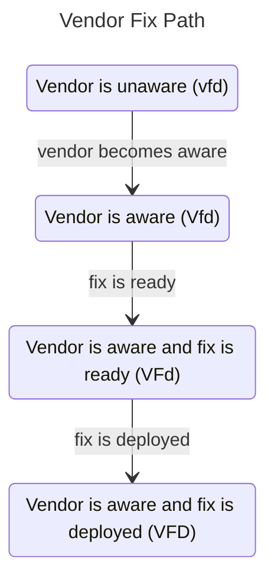

# CVD Case State Model



Here we complete the definition of the CVD Case State (CS) model begun in the [previous page](index.md).
As a reminder, this model provides a high-level view of the state of a CVD case and is
derived from [A State-Based Model for Multi-Party Coordinated Vulnerability Disclosure](https://resources.sei.cmu.edu/library/asset-view.cfm?assetid=735513){:target="_blank"}.

---



As in the [RM](../rm/index.md) and [EM](../em/index.md) process models, we wish to define a 5-tuple
$(\mathcal{Q},\Sigma,\delta,q_0,F)$, this time for the CS model.

!!! example inline "Example CS State"

    The state $q^{cs} \in VFdpXa$ represents that:

    - the Vendor is aware
    - the fix is ready
    - the fix is not deployed
    - no public awareness
    - an exploit is public
    - no attacks have been observed

In the CS model, a state $q^{cs}$ represents the status of each of the six [substates](index.md).
State labels use the substate notation given in the table below.

The order in which the events occurred does not matter when defining the state.
However, we will observe a notation convention keeping the letter names in the same case-insensitive order
$(v,f,d,p,x,a)$.

The CS model builds upon the CVD substates defined in the [Case State introduction](index.md), summarized
in the table below.



???+ note inline end "Vendor Fix Path Formalism"

    $$D \implies F \implies V$$

CS states can be any combination of statuses, provided that a number of caveats elaborated in
[CS Transitions](#cs-transitions) are met.
One such caveat worth noting here is that valid states must follow what we call the *Vendor fix path*.

The reason is causal: For a fix to be deployed (*D*), it must have been ready (*F*) for deployment.
And for it to be ready, the Vendor must have already known (*V*) about the vulnerability.
As a result, valid states must begin with one of the following strings: *vfd*, *Vfd*, *VFd*, or *VFD*.

!!! tip inline end "See also"

    See §2.4 of [A State-Based Model for Multi-Party Coordinated Vulnerability Disclosure](https://resources.sei.cmu.edu/library/asset-view.cfm?assetid=735513){:target="_blank"}
    for an expanded explanation of the *Vendor fix path*.

The CS model is thus
composed of 32 possible states, which we define as $\mathcal{Q}^{cs}$.

???+ note "CS Model States ($\mathcal{Q}^{cs}$) Defined"

    $$
    \mathcal{Q}^{cs} = 
    \begin{Bmatrix}
        vfdpxa, & vfdPxa, & vfdpXa, & vfdPXa, \\
        vfdpxA, & vfdPxA, & vfdpXA, & vfdPXA, \\
        Vfdpxa, & VfdPxa, & VfdpXa, & VfdPXa, \\
        VfdpxA, & VfdPxA, & VfdpXA, & VfdPXA, \\
        VFdpxa, & VFdPxa, & VFdpXa, & VFdPXa, \\
        VFdpxA, & VFdPxA, & VFdpXA, & VFdPXA, \\
        VFDpxa, & VFDPxa, & VFDpXa, & VFDPXa, \\
        VFDpxA, & VFDPxA, & VFDpXA, & VFDPXA
    \end{Bmatrix}$$

???+ note inline end "CS Model Start and End States ($q^{cs}_0$ and $\mathcal{F}^{cs}$) Defined"

    $$q^{cs}_0 = vfdpxa$$

    $$\mathcal{F}^{cs} = \{ VFDPXA \}$$

## CS Start and End States

All vulnerability cases start in the base state *vfdpxa* in which no
events have occurred.

The lone final state in which all events have occurred is *VFDPXA*.  

!!! tip "The Map is not the Territory"

    Note that this is a place where our
    model of the vulnerability lifecycle diverges from what we expect to
    observe in CVD
    cases in the real world. There is ample evidence that most
    vulnerabilities never have exploits published or attacks observed.
    See for example:
    
    - [Historical Analysis of Exploit Availability Timelines](https://www.usenix.org/conference/cset20/presentation/householder){:target="_blank"}
    - [Exploit Prediction Scoring System (EPSS)](https://dl.acm.org/doi/pdf/10.1145/3436242)
    
    Therefore, practically speaking, we might expect vulnerabilities to wind up in one of
    
    $$\mathcal{F}^\prime = \{ {VFDPxa}, {VFDPxA}, {VFDPXa}, {VFDPXA} \}$$ 
    
    at the time a report is closed (i.e., when $q^{rm} \xrightarrow{c} C$). In
    fact, most count a CVD as successful when reports are closed in
    $q^{cs} \in VFDPxa$ because it means that the defenders won the race
    against adversaries. The distinction between the [RM](../rm/index.md) and CS processes is important; Participants can
    close cases whenever their [RM](../rm/index.md) process dictates, independent of the
    CS state. In other
    words, it remains possible for exploits to be published or attacks to be
    observed long after the [RM](../rm/index.md) process has closed a case.

We frequently need to refer to subsets of $\mathcal{Q}^{cs}$. To do so,
we will use a dot ($\cdot$) to represent a single character wildcard.

!!! example "CS Model Wildcard Notation Example"

    For example, $VFdP \cdot \cdot$ refers to the subset of $\mathcal{Q}^{cs}$ in
    which the Vendor is aware, a fix is ready but not yet deployed, and the
    public is aware of the vulnerability, yet we are indifferent to whether
    exploit code has been made public or attacks have been observed.
    Specifically,

    $${VFdP\cdot\cdot} = \{{VFdPxa}, {VFdPxA}, {VFdPXa}, {VFdPXA}\} \subset{\mathcal{Q}}^{cs}$$
