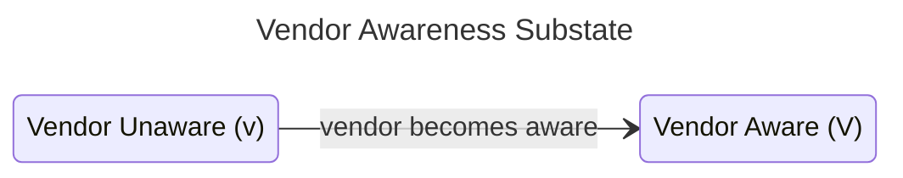
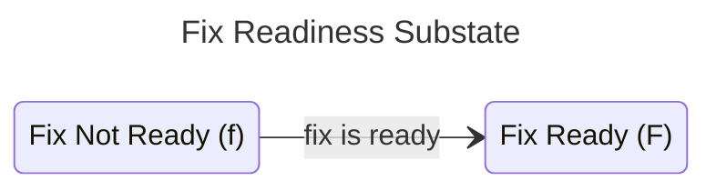
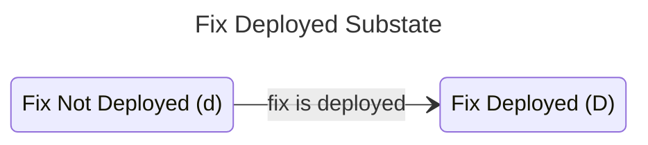
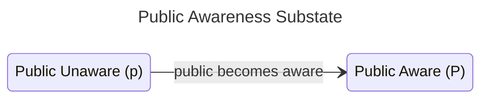
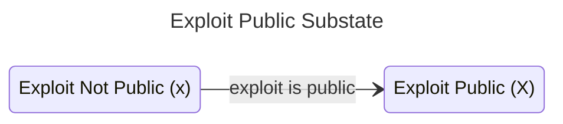
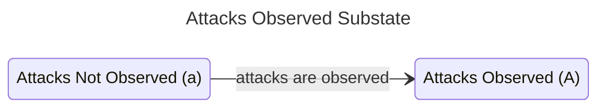
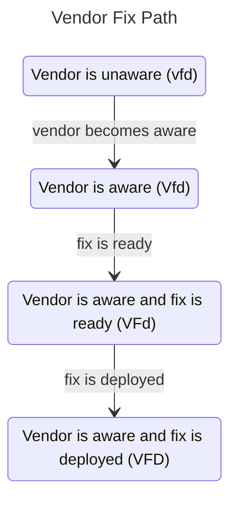

# CVD Case State Model



This page defines the states of the Coordinated Vulnerability Disclosure (CVD) Case State (CS) model.
It is for developers implementing the model and for researchers reasoning with it.
The [CS model introduction](index.md) says what the model is for; the [Vultron Protocol Specification §8](../../../reference/vultron-spec/index.md#8-case-state-cs-dimensions-n) is its normative definition.
The model is derived from [A State-Based Model for Multi-Party Coordinated Vulnerability Disclosure](https://resources.sei.cmu.edu/library/asset-view.cfm?assetid=735513){:target="_blank"}.

---

## CVD Case Substates

The state of a case records which events in the vulnerability lifecycle have occurred.
Each of the six events is a substate with two values.
A letter stands for each substate: lowercase means the event has not occurred, and uppercase means it has.
For example, *v* means the Vendor is not aware and *V* means the Vendor is aware.



The model is not concerned with *how* an event came about, only with whether it has occurred.
Each substate below says what counts as its event.
[Relationship to earlier lifecycle models](#relationship-to-earlier-lifecycle-models) maps each one to the event it corresponds to in the literature.

### The *Vendor Awareness* Substate (*v*, *V*)

The *Vendor Awareness* substate records whether the Vendor knows the vulnerability exists.
How the Vendor found out does not matter: internal testing, a report received through a CVD process, and incident or malware analysis all count.

```mermaid
---
title: Vendor Awareness Substate
---
stateDiagram-v2
    direction LR
    v : Vendor Unaware (v)
    V : Vendor Aware (V)
    v --> V : vendor becomes aware
```

### The *Fix Readiness* Substate (*f*, *F*)

The *Fix Readiness* substate records whether the Vendor has a fix that *could* be deployed to a vulnerable system *if* the system owner knew of it.
It records the fix's *readiness* for release, not its *release*.
Fix release is a goal of the CVD process, while fix readiness is a milestone on the way to it, and the model needs to represent the states that lead up to disclosure.

```mermaid
---
title: Fix Readiness Substate
---
stateDiagram-v2
    direction LR
    f : Fix Not Ready (f)
    F : Fix Ready (F)
    f --> F : fix is ready
```

### The *Fix Deployed* Substate (*d*, *D*)

The *Fix Deployed* substate records whether an existing fix has been deployed.
The original model treated it as a single binary state for the whole case.
Vultron relaxes that: each Participant keeps its own value, so each Deployer records its own deployment status.
It remains a binary value for each Deployer, which is still a simplification.

```mermaid
---
title: Fix Deployed Substate
---
stateDiagram-v2
    direction LR
    d : Fix Not Deployed (d)
    D : Fix Deployed (D)
    d --> D : fix is deployed
```

!!! tip "Software delivery models affect fix readiness and deployment timing relative to public awareness"

    The model includes *Fix Ready*, *Fix Deployed*, and *Public Awareness* as separate events to accommodate two common modes of software delivery.

    - *Shrinkwrap* is the traditional mode, in which the Vendor and the Deployer are distinct.
      Deployers must learn of the fix before they can deploy it, so both *Fix Ready* and *Public Awareness* are necessary for *Fix Deployed*.
    - *Software as a Service (SaaS)* is the mode in which the Vendor is also the Deployer.
      *Fix Ready* can lead directly to *Fix Deployed*, with no dependency on *Public Awareness*.

    A *silent fix* can deploy a fix without public awareness even when the Vendor is not the Deployer.
    So *Fix Deployed* can occur before *Public Awareness* in the shrinkwrap mode, although that is unlikely.
    *Public Awareness* can also occur before *Fix Deployed* in the SaaS mode, and that is somewhat more likely.

### The *Public Awareness* Substate (*p*, *P*)

The *Public Awareness* substate records whether the public knows of the vulnerability.
The public might learn of it from the Vendor's announcement of a fix, a news report about a breach, a conference presentation, a comparison of released software versions (as in [Xu et al. (2020)](https://doi.org/10.1145/3395363.3397361){:target="_blank"} and [Xiao et al. (2020)](https://www.usenix.org/conference/usenixsecurity20/presentation/xiao){:target="_blank"}), or other means.

```mermaid
---
title: Public Awareness Substate
---
stateDiagram-v2
    direction LR
    p : Public Unaware (p)
    P : Public Aware (P)
    p --> P : public becomes aware
```

### The *Exploit Public* Substate (*x*, *X*)

The *Exploit Public* substate records whether a method of exploiting the vulnerability has been made public in enough detail for others to reproduce it.
Posting proof-of-concept code to a widely available site meets this criterion, and so does including the exploit in a commonly available exploit tool.
Privately held exploits do not.

```mermaid
---
title: Exploit Public Substate
---
stateDiagram-v2
    direction LR
    x : Exploit Not Public (x)
    X : Exploit Public (X)
    x --> X : exploit is public
```

### The *Attacks Observed* Substate (*a*, *A*)

The *Attacks Observed* substate records whether attacks exploiting the vulnerability have been observed.
It requires evidence that the vulnerability was exploited, from which the existence of exploit code can be presumed whether or not the exploit is public.
Analysis of malware from an incident might meet *Attacks Observed* but not *Exploit Public*, depending on how closely the attacker holds the malware.
Use of a public exploit in an attack meets both.

```mermaid
---
title: Attacks Observed Substate
---
stateDiagram-v2
    direction LR
    a : Attacks Not Observed (a)
    A : Attacks Observed (A)
    a --> A : attacks are observed
```

---

## CS Model States



As in the [RM](../rm/index.md) and [EM](../em/index.md) process models, we define a 5-tuple $(\mathcal{Q},\Sigma,\delta,q_0,F)$, this time for the CS model.
This page defines the states $\mathcal{Q}^{cs}$, the start state $q^{cs}_0$, and the final states $\mathcal{F}^{cs}$.
[CS Transitions](transitions.md) defines the input symbols $\Sigma^{cs}$ and the transition function $\delta^{cs}$.

!!! example inline "Example CS State"

    The state $q^{cs} \in VFdpXa$ represents that:

    - the Vendor is aware
    - the fix is ready
    - the fix is not deployed
    - no public awareness
    - an exploit is public
    - no attacks have been observed

In the CS model, a state $q^{cs}$ records the value of each of the six [substates](#cvd-case-substates).
State labels use the substate notation from the table above.

The order in which the events occurred does not matter when defining the state.
By convention, the letters always appear in the same case-insensitive order $(v,f,d,p,x,a)$.

???+ note inline end "Vendor Fix Path Formalism"

    $$D \implies F \implies V$$

CS states can be any combination of substate values, provided that the caveats set out in [CS Transitions](./transitions.md) are met.
One caveat matters here: valid states must follow what we call the *Vendor fix path*.

The reason is causal.
For a fix to be deployed (*D*), it must have been ready (*F*) for deployment.
For it to be ready, the Vendor must already have known (*V*) about the vulnerability.
As a result, valid states begin with one of the strings *vfd*, *Vfd*, *VFd*, or *VFD*.

!!! tip inline end "See also"

    See §2.4 of [A State-Based Model for Multi-Party Coordinated Vulnerability Disclosure](https://resources.sei.cmu.edu/library/asset-view.cfm?assetid=735513){:target="_blank"}
    for an expanded explanation of the *Vendor fix path*.

The diagram below shows the four Vendor fix path states and the events that move a case along them.

```mermaid
---
title: Vendor Fix Path
---
stateDiagram-v2
    vfd : Vendor is unaware (vfd)
    Vfd : Vendor is aware (Vfd)
    VFd : Vendor is aware and fix is ready (VFd)
    VFD : Vendor is aware and fix is deployed (VFD)
    vfd --> Vfd : vendor becomes aware
    Vfd --> VFd : fix is ready
    VFd --> VFD : fix is deployed
```

The four Vendor fix path prefixes combine with the eight combinations of the public, exploit, and attack substates.
The CS model therefore has 32 possible states, which we define as $\mathcal{Q}^{cs}$.

???+ note "CS Model States ($\mathcal{Q}^{cs}$) Defined"

    $$
    \mathcal{Q}^{cs} = 
    \begin{Bmatrix}
        vfdpxa, & vfdPxa, & vfdpXa, & vfdPXa, \\
        vfdpxA, & vfdPxA, & vfdpXA, & vfdPXA, \\
        Vfdpxa, & VfdPxa, & VfdpXa, & VfdPXa, \\
        VfdpxA, & VfdPxA, & VfdpXA, & VfdPXA, \\
        VFdpxa, & VFdPxa, & VFdpXa, & VFdPXa, \\
        VFdpxA, & VFdPxA, & VFdpXA, & VFdPXA, \\
        VFDpxa, & VFDPxa, & VFDpXa, & VFDPXa, \\
        VFDpxA, & VFDPxA, & VFDpXA, & VFDPXA
    \end{Bmatrix}$$

???+ note inline end "CS Model Start and End States ($q^{cs}_0$ and $\mathcal{F}^{cs}$) Defined"

    $$q^{cs}_0 = vfdpxa$$

    $$\mathcal{F}^{cs} = \{ VFDPXA \}$$

## CS Start and End States

All vulnerability cases start in the base state *vfdpxa*, in which no events have occurred.

The lone final state, in which all events have occurred, is *VFDPXA*.

!!! tip "The Map is not the Territory"

    Here our model of the vulnerability lifecycle diverges from what we expect to observe in real CVD cases.
    There is ample evidence that most vulnerabilities never have exploits published or attacks observed.
    See for example:
    
    - [Historical Analysis of Exploit Availability Timelines](https://www.usenix.org/conference/cset20/presentation/householder){:target="_blank"}
    - [Exploit Prediction Scoring System (EPSS)](https://dl.acm.org/doi/pdf/10.1145/3436242)
    
    In practice, then, we might expect vulnerabilities to wind up in one of
    
    $$\mathcal{F}^\prime = \{ {VFDPxa}, {VFDPxA}, {VFDPXa}, {VFDPXA} \}$$ 
    
    at the time a report is closed (that is, when $q^{rm} \xrightarrow{c} C$).
    Most count a CVD case as successful when its report is closed in $q^{cs} \in VFDPxa$, because it means the defenders won the race against adversaries.
    The distinction between the [Report Management (RM)](../rm/index.md) and CS processes is important.
    Participants can close cases whenever their RM process dictates, independent of the CS state.
    Exploits can still be published, or attacks observed, long after the RM process has closed a case.

We frequently need to refer to subsets of $\mathcal{Q}^{cs}$.
To do so, we use a dot ($\cdot$) as a single-character wildcard.

!!! example "CS Model Wildcard Notation Example"

    For example, $VFdP \cdot \cdot$ refers to the subset of $\mathcal{Q}^{cs}$ in
    which the Vendor is aware, a fix is ready but not yet deployed, and the
    public is aware of the vulnerability, yet we are indifferent to whether
    exploit code has been made public or attacks have been observed.
    Specifically,

    $${VFdP\cdot\cdot} = \{{VFdPxa}, {VFdPxA}, {VFdPXa}, {VFdPXA}\} \subset{\mathcal{Q}}^{cs}$$

---

## Relationship to earlier lifecycle models

!!! note "This section is not normative"

    It records where the CS model came from and does not add to its definition.

The six substates build on earlier models of the vulnerability lifecycle: those of [Arbaugh, Fithen, and McHugh](https://doi.org/10.1109/2.889093){:target="_blank"}, [Frei et al.](https://doi.org/10.1007/978-1-4419-6967-5_6){:target="_blank"}, and [Bilge and Dumitraş](https://doi.org/10.1145/2382196.2382284){:target="_blank"}.
P. S. Lewis gives a more thorough literature review in [The global vulnerability discovery and disclosure system: a thematic system dynamics approach](http://dspace.lib.cranfield.ac.uk/handle/1826/12665){:target="_blank"}.
The CS model keeps only events that the Participants in a CVD case can usually observe.
The table below compares the events of each model; the CS model's symbols are defined in [CS Transitions](transitions.md).

| [Arbaugh et al.](https://doi.org/10.1109/2.889093){:target="_blank"} | [Frei et al.](https://doi.org/10.1007/978-1-4419-6967-5_6){:target="_blank"} | [Bilge et al.](https://doi.org/10.1145/2382196.2382284){:target="_blank"} | CS model |
| --- | --- | --- | --- |
| Birth | creation ($t_{creat}$) | introduced ($t_c$) | (implied) |
| Discovery | discovery ($t_{disco}$) | n/a | (implied) |
| Disclosure | n/a | discovered by vendor ($t_d$) | Vendor Awareness ($\mathbf{V}$) |
| n/a | patch availability ($t_{patch}$) | n/a | Fix Ready ($\mathbf{F}$) |
| Fix Release | n/a | patch released ($t_p$) | Fix Ready and Public Awareness |
| Publication | public disclosure ($t_{discl}$) | disclosed publicly ($t_0$) | Public Awareness ($\mathbf{P}$) |
| n/a | patch installation ($t_{insta}$) | patch deployment completed ($t_a$) | Fix Deployed ($\mathbf{D}$) |
| Exploit Automation | exploit availability ($t_{explo}$) | exploit released in wild ($t_e$) | n/a |
| Exploit Automation | n/a | n/a | Exploit Public ($\mathbf{X}$) |
| Exploit Automation | n/a | n/a | Attacks Observed ($\mathbf{A}$) |
| n/a | n/a | anti-virus signatures released ($t_s$) | n/a |

Because the model covers only the disclosure process, it assumes that the vulnerability exists and that someone knows of it.
It therefore omits the *birth* and *discovery* events, which are implied at the start of every disclosure history.
It also omits Bilge and Dumitraş's *anti-virus signatures released* event, because it does not model vulnerability management operations in detail.

The CS model differs from all three earlier models in two places.
First, they record the *release* of a fix, where the CS model records its *readiness*, as the [Fix Readiness](#the-fix-readiness-substate-f-f) substate explains.
Their *fix release* corresponds to the shrinkwrap case, in which both fix readiness and public awareness are needed before a fix can be deployed.

Second, the CS model treats exploits and attacks differently.
Attacks and exploit publication are often discretely observable events, so Arbaugh et al.'s broader *exploit automation* is not precise enough.
Frei et al. (*exploit availability*) and Bilge and Dumitraş (*exploit released in wild*) both record that an exploit is known to exist.
Attackers' incentive to stay hidden makes that event hard to observe.
An exploit can come to be known for two distinct reasons, which the CS model separates into [*Exploit Public*](#the-exploit-public-substate-x-x) and [*Attacks Observed*](#the-attacks-observed-substate-a-a).

A hidden *exploit exists* event is a causal predecessor of both.
Even so, the model asserts no causal relationship between *Exploit Public* and *Attacks Observed*.
The choice favors observability: *exploit exists* is hard to observe on its own, and its occurrence is nearly always inferred from one of the other two.
