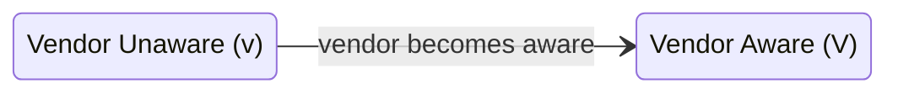
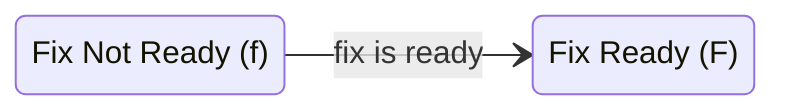
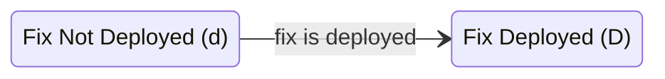
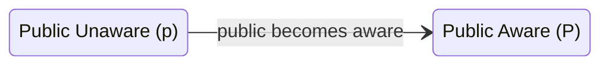
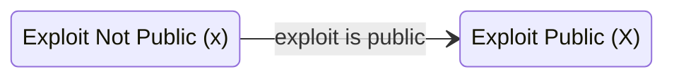
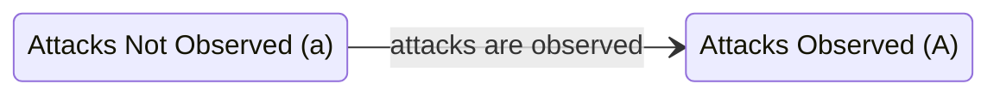

# CVD Case State Model Introduction



Here we revisit the CS model from [A State-Based Model for Multi-Party Coordinated Vulnerability Disclosure](https://resources.sei.cmu.edu/library/asset-view.cfm?assetid=735513){:target="_blank"}.
<!-- start_excerpt -->
The CVD Case State (CS) model provides a high-level view of the state of a CVD case.
In it we model two main aspects of the case:

1. A Participant-specific *Vendor Fix Path* from initial vendor awareness through the deployment of a fix.
2. A Participant-agnostic *Public State* summarizing both public and attacker awareness of the vulnerability.

These processes run in parallel, and the CS model captures the interactions between them.
<!-- end_excerpt -->
A complete derivation of the CS model can be found in [that report](https://resources.sei.cmu.edu/library/asset-view.cfm?assetid=735513){:target="_blank"}.
Here, we are primarily interested in the final model, which comprises 32 states and their transitions.

However, due to the size of the final CS model, we begin with some necessary
background on the substates of the model in
[CVD Case Substates](#cvd-case-substates)
prior to defining the Case States in
[CVD Case States](cs_model.md).

## CVD Case Substates

In our model, the state of the world is a specification of the current
status of all the events in the vulnerability lifecycle model described
in [A State-Based Model for Multi-Party Coordinated Vulnerability Disclosure](https://resources.sei.cmu.edu/library/asset-view.cfm?assetid=735513){:target="_blank"}.
We describe the relevant factors as substates below.
For notational purposes, each substate status is represented by a letter for that part
of the state of the world. For example, *v* means no Vendor awareness
and *V* means the Vendor is aware. The complete set of status labels is
shown in the table below.



!!! tip "References"
  
    In defining these substates, we draw on the following sources:

    - [Windows of Vulnerability: A Case Study analysis](https://doi.org/10.1109/2.889093){:target="_blank"} by Arbaugh, Fithen, and McHugh
    - [Modeling the Security Ecosystem&mdash;The Dynamics of (In)Security](https://doi.org/10.1007/978-1-4419-6967-5_6) by Frei et al.
    - [Before we knew it: an empirical study of zero-day attacks in the real world](https://doi.org/10.1145/2382196.2382284){:target="_blank"} by Bilge and Dumitraş

### The *Vendor Awareness* Substate (*v*, *V*)

The *Vendor Awareness* substate corresponds to *Disclosure* in the
Arbaugh, Fithen, and McHugh article, [Windows of Vulnerability: A Case
Study analysis](https://doi.org/10.1109/2.889093){:target="_blank"} and *vulnerability discovered by
Vendor* in Bilge and Dumitraş's article, [Before we knew it: an
empirical study of zero-day attacks in the real
world](https://doi.org/10.1145/2382196.2382284){:target="_blank"}.
In the interest of model simplicity, we are
not concerned with *how* the Vendor finds out about the vulnerability's
existence&mdash;whether it was found via internal testing, reported within a
CVD process, or noticed as the result of incident or malware analysis.

!!! tip inline end "Software Delivery Models Affect Fix Readiness and Deployment Timing Relative to Public Awareness"

    We chose to include the *Fix Ready*, *Fix Deployed*, and *Public Awareness* events so that our model could better 
    accommodate two common modes of modern software deployment:

    -   *shrinkwrap* is a traditional distribution mode where the Vendor and
        Deployer are distinct entities, and Deployers must be made aware of
        the fix before it can be deployed. In this case, both *Fix Ready*
        and *Public Awareness* are necessary for *Fix Deployment* to occur.
    -   *SAAS* is a more recent delivery mode where the Vendor also plays the role of 
      Deployer. In this distribution mode, *Fix Ready* can lead directly
      to *Fix Deployed* with no dependency on *Public Awareness*.

    We note that so-called *silent fixes* by Vendors can sometimes result in
    a fix being deployed without public awareness even if the Vendor is not
    the Deployer. Thus, it is possible (but unlikely) for *Fix Deployed* to
    occur before *Public Awareness* even in the shrinkwrap mode above. It is
    also possible, and somewhat more likely, for *Public Awareness* to occur
    before *Fix Deployed* in the SAAS mode as well.

### The *Fix Readiness* Substate (*f*, *F*)

The *Fix Readiness* substate refers to the Vendor's creation and possession of a fix that *could* be deployed to a
vulnerable system *if* the system owner knew of its existence.
Here we differ somewhat from previous models
([1](https://doi.org/10.1109/2.889093){:target="_blank"}, [2](https://doi.org/10.1007/978-1-4419-6967-5_6){:target="_blank"}, and [3](https://doi.org/10.1145/2382196.2382284){:target="_blank"})&mdash;their
models address the *release* of the fix rather than its *readiness* for release.
This distinction is necessary because we are interested in modeling the activities and states leading up to disclosure.
Fix *release* is a goal of the CVD process, whereas fix *readiness* is a significant process milestone along the way.

### The *Fix Deployed* Substate (*d*, *D*)

The *Fix Deployed* substate reflects the deployment status of an
existing fix. The model in [A State-Based Model for Multi-Party Coordinated Vulnerability Disclosure](https://resources.sei.cmu.edu/library/asset-view.cfm?assetid=735513){:target="_blank"} was initially designed to treat this substate as
a singular binary state for a case, but we intend to relax that here to
reflect a more realistic perspective in which each Deployer maintains
their own instance of this state value. It remains a binary state for
each Deployer, which, however, is still a simplification.

### The *Public Awareness* Substate (*p*, *P*)

The *Public Awareness* substate corresponds to *Publication* in the
Arbaugh, Fithen, and McHugh [article](https://doi.org/10.1109/2.889093){:target="_blank"}, *time of
public disclosure* in Frei et al.'s article [Modeling the Security
Ecosystem&mdash;The Dynamics of (In)Security](https://doi.org/10.1007/978-1-4419-6967-5_6) and
*vulnerability disclosed publicly* in Bilge and Dumitraş's [article](https://doi.org/10.1145/2382196.2382284){:target="_blank"}.
The public might find out about a vulnerability through the Vendor's announcement of a fix, a news report about a
security breach, a conference presentation by a researcher, or a variety of other means.
As above, we are primarily concerned with the occurrence of the event itself rather than the details of *how* the public
awareness event arises.

### The *Exploit Public* Substate (*x*, *X*)

The *Exploit Public* substate reflects whether the method of exploiting
a vulnerability has been made public in sufficient detail to be
reproduced by others. Posting PoC code to a widely available site or
including the exploit code in a commonly available exploit tool meets
this criteria; privately held exploits do not.

### The *Attacks Observed* Substate (*a*, *A*)

The *Attacks Observed* substate reflects whether attacks have been
observed in which the vulnerability was exploited. This substate
requires evidence that the vulnerability was exploited; we can then
presume the existence of exploit code regardless of its availability to
the public. Analysis of malware from an incident might meet
*Attacks Observed* but not *Exploit Public*, depending on how closely
the attacker holds the malware. Use of a public exploit in an attack
meets both *Exploit Public* and *Attacks Observed*.

