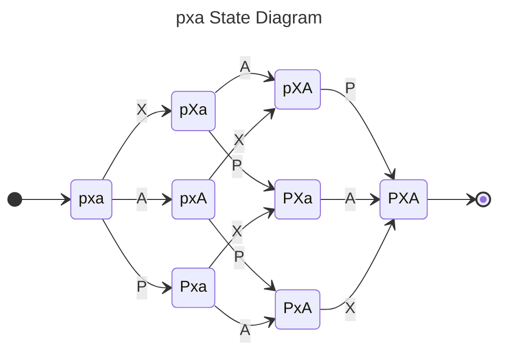

```mermaid
---
title: pxa State Diagram
---
stateDiagram-v2
    direction LR
    [*] --> pxa

    pxa --> Pxa : P
    pxa --> pXa : X
    pxa --> pxA : A
    
    pXa --> PXa : P
    pXa --> pXA : A
    
    pxA --> PxA : P
    pxA --> pXA : X

    Pxa --> PxA : A
    Pxa --> PXa : X
    
    pXA --> PXA : P
    PXa --> PXA : A
    PxA --> PXA : X
    PXA --> [*]
```
