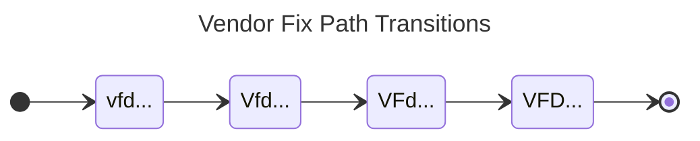
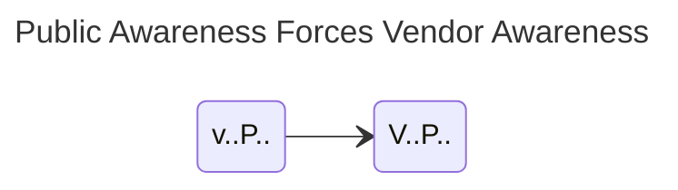
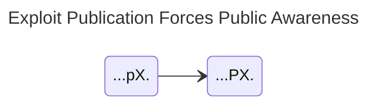

# CS Transitions



This page defines the transitions of the Coordinated Vulnerability Disclosure (CVD) Case State (CS) model: the events that move a case from one state to another, the rules that restrict them, and the transition grammar.
It builds on [CS States](cs_model.md), which defines the six substates and the 32 case states.
The normative definition is in the [Vultron Protocol Specification §8](../../../reference/vultron-spec/index.md#8-case-state-cs-dimensions-n).

---

## CS Input Symbols

Each row of the [CVD case substates table](cs_model.md#cvd-case-substates) implies an event that changes that substate from lowercase to uppercase.
These events are the input symbols of the CS deterministic finite automaton (DFA).

<!-- for spacing -->
 





We define the set of symbols for the CS DFA as $\Sigma^{cs}$ at right.

For the CS model, an input symbol $\sigma^{cs} \in \Sigma^{cs}$ is "read" when a Participant observes a change in status, such as a Vendor being notified or exploit code being published.
For simplicity, we begin with the assumption that observations are globally known: a status change observed by any CVD Participant is known to all.
In the real world, we believe the [Formal Vultron Protocol](../../../reference/formal_protocol/index.md) is poised to ensure eventual consistency with this assumption, by communicating perceived case state among coordinating parties.

## CS Transitions Defined

This section defines the allowable transitions between states in the CS model.
They follow a few rules, described in detail in §2.4 of [A State-Based Model for Multi-Party Coordinated Vulnerability Disclosure](https://resources.sei.cmu.edu/library/asset-view.cfm?assetid=735513){:target="_blank"} and summarized here.

### Each Transition Records One Event

States record events that have or have not occurred, and history is immutable, so every transition is irreversible.
The result is an acyclic directed graph of states, beginning at $q^{cs}_0={vfdpxa}$ and ending at $\mathcal{F}^{cs}=\{VFDPXA\}$, with the allowed transitions as its edges.
In practical terms, there is an arrow of time from *vfdpxa* to *VFDPXA*, and each transition changes exactly one letter from lowercase to uppercase.

### The Vendor Fix Path Is Ordered

The *Vendor fix path* ($vfd \cdot\cdot\cdot \xrightarrow{\mathbf{V}} Vfd \cdot\cdot\cdot \xrightarrow{\mathbf{F}} VFd \cdot\cdot\cdot \xrightarrow{\mathbf{D}} VFD \cdot\cdot\cdot$) is a causal requirement, set out in [CS States](cs_model.md#cs-model-states).
The diagram below shows that the fix path moves in one direction, through its four prefixes in a fixed order.

### Public Awareness Implies Vendor Awareness

Vendors are presumed to know at least as much as the public does.
Therefore $v\cdot\cdot P \cdot\cdot$ can only lead to $V\cdot\cdot P \cdot\cdot$: once the public is aware, the next event must be Vendor awareness.
The diagram below shows this single permitted exit.

### Exploit Publication Causes Public Awareness

Exploit publication is tantamount to public awareness.
Therefore $\cdot\cdot\cdot pX \cdot$ can only lead to $\cdot\cdot\cdot PX \cdot$: once an exploit is public, the next event must be public awareness.
The diagram below shows this single permitted exit.

States in $v\cdot\cdot P \cdot\cdot$ and $\cdot\cdot\cdot pX \cdot$ are therefore unstable: a case passes through them rather than resting in them.

For all practical purposes, this rule lets us simplify the full $pxa \rightarrow PXA$ diagram:



down to the following:



### Attacks Do Not Necessarily Cause Public Awareness

In this model, attacks observed while the public is unaware of the vulnerability ($\cdot\cdot\cdot p \cdot A$) need not immediately cause public awareness ($\cdot\cdot\cdot P \cdot A$), although that can and does happen.
We allow states in $\cdot\cdot\cdot p \cdot A$ to persist for two reasons.

1. The connection between an attack and the vulnerability it exploited is often made later, during incident analysis.
    The attack itself may have been observed much earlier, but knowledge of *which* vulnerability it targeted may be delayed until after other events have occurred.
2. Attackers are not a monolithic group.
    An attack by a niche set of threat actors does not mean that the knowledge and capability to exploit the vulnerability is available to all possible adversaries.
    Publication in that case might help other adversaries more than it helps defenders.

So although $\cdot\cdot\cdot p \cdot A$ does not require an immediate transition to $\cdot\cdot\cdot P \cdot A$ the way $\cdot\cdot\cdot pX \cdot \xrightarrow{\mathbf{P}} \cdot\cdot\cdot PX \cdot$ does, it is plausible that **P** becomes more likely while attacks are occurring.

???+ note "Formalism"

    The probability $P$ of _public awareness_ given _attacks observed_ is greater than the probability of _public awareness_ without _attacks observed_.

    $$
    P(\mathbf{P} \mid \cdot\cdot\cdot p \cdot A) > P(\mathbf{P} \mid \cdot\cdot\cdot p \cdot a)
    $$

The reason is that there are more ways for the public to discover the vulnerability when attacks are happening than when they are not.
For states in $\cdot\cdot\cdot p \cdot a$, public awareness depends on the normal process of vulnerability discovery and reporting.
States in $\cdot\cdot\cdot p \cdot A$ add the possibility of discovery through security incident analysis.
Hence:

!!! note ""

    Once attacks have been observed, fix development SHOULD accelerate, the embargo teardown process SHOULD begin, and publication and deployment SHOULD follow as soon as is practical.

## CS Model Diagrams

The two diagrams below put these rules together.

### The simplified CS model diagram

The simplified diagram shows only the parallelism between the Participant-specific Vendor fix path and the Participant-agnostic public, exploit, and attack substates.
It omits the interactions between the two, which the rules above impose.



### The full CS model diagram

The full diagram shows all 32 states and every allowed transition.
Each point along the Vendor fix path corresponds to an instance of the public, exploit, and attack diagram, drawn as one of four macrostates embedded in the larger model.



The four macrostates behave differently.

| Macrostate | Behavior |
|---|---|
| *Vendor Unaware* (*vfd*) | The least stable of the four. Many of its internal transitions are disallowed, owing to the instability of both [$vP$](#public-awareness-implies-vendor-awareness) and [$pX$](#exploit-publication-causes-public-awareness), so a case is more likely to leave it than to leave the others. In practice, Vendors are likely to become aware of vulnerabilities in their products unless adversaries work hard to prevent it. |
| *Vendor Aware* (*Vfd*) | The Vendor is aware of the vulnerability, but the fix is not yet ready. A case remains in *Vfd* until the Vendor produces a fix. |
| *Fix Available* (*VFd*) | A fix is available but not yet deployed. Many publicly disclosed vulnerabilities spend a sizable amount of time here, awaiting action by system owners or Deployers. |
| *Fix Deployed* (*VFD*) | A sink: once reached, there are no exits. Attacks attempted here are expected to fail. The more systems one is concerned with, the less certain one can be of having reached it: one patched instance is easy to confirm, but the last of thousands across an enterprise is not. |

## A Regular Grammar for the CS model

The [full CS model diagram](#the-full-cs-model-diagram) above can be summarized as a right-linear grammar $\delta^{cs}$.
Each rule lists the events that can fire from one state and the state each event leads to.
The grammar and the diagram describe the same set of transitions.

???+ note "CS Transition Function ($\delta^{cs}$) Defined"

    $\delta^{cs} =
        \begin{cases}
            vfdpxa &\to \mathbf{V}~Vfdpxa~|~\mathbf{P}~vfdPxa~|~\mathbf{X}~vfdpXa~|~\mathbf{A}~vfdpxA \\
            vfdpxA &\to \mathbf{V}~VfdpxA~|~\mathbf{P}~vfdPxA~|~\mathbf{X}~vfdpXA \\
            vfdpXa &\to \mathbf{P}~vfdPXa \\
            vfdpXA &\to \mathbf{P}~vfdPXA \\
            vfdPxa &\to \mathbf{V}~VfdPxa \\
            vfdPxA &\to \mathbf{V}~VfdPxA \\ 
            vfdPXa &\to \mathbf{V}~VfdPXa \\
            vfdPXA &\to \mathbf{V}~VfdPXA \\
            Vfdpxa &\to \mathbf{F}~VFdpxa~|~\mathbf{P}~VfdPxa~|~\mathbf{X}~VfdpXa~|~\mathbf{A}~VfdpxA \\
            VfdpxA &\to \mathbf{F}~VFdpxA ~|~ \mathbf{P}~VfdPxA ~|~ \mathbf{X}~VfdpXA \\
            VfdpXa &\to \mathbf{P}~VfdPXa \\
            VfdpXA &\to \mathbf{P}~VfdPXA \\
            VfdPxa &\to \mathbf{F}~VFdPxa ~|~ \mathbf{X}~VfdPXa ~|~ \mathbf{A}~VfdPxA \\
            VfdPxA &\to \mathbf{F}~VFdPxA ~|~ \mathbf{X}~VfdPXA \\
            VfdPXa &\to \mathbf{F}~VFdPXa ~|~ \mathbf{A}~VfdPXA \\
            VfdPXA &\to \mathbf{F}~VFdPXA \\ 
            VFdpxa &\to \mathbf{D}~VFDpxa~|~\mathbf{P}~VFdPxa ~|~ \mathbf{X}~VFdpXa ~|~ \mathbf{A}~VFdpxA \\
            VFdpxA &\to \mathbf{D}~VFDpxA ~|~ \mathbf{P}~VFdPxA ~|~ \mathbf{X}~VFdpXA \\
            VFdpXa &\to \mathbf{P}~VFdPXa \\
            VFdpXA &\to \mathbf{P}~VFdPXA \\
            VFdPxa &\to \mathbf{D}~VFDPxa ~|~ \mathbf{X}~VFdPXa ~|~ \mathbf{A}~VFdPxA \\
            VFdPxA &\to \mathbf{D}~VFDPxA ~|~ \mathbf{X}~VFdPXA \\
            VFdPXa &\to \mathbf{D}~VFDPXa ~|~ \mathbf{A}~VFdPXA \\
            VFdPXA &\to \mathbf{D}~VFDPXA \\
            VFDpxa &\to \mathbf{P}~VFDPxa ~|~ \mathbf{X}~VFDpXa ~|~ \mathbf{A}~VFDpxA \\
            VFDpxA &\to \mathbf{P}~VFDPxA ~|~ \mathbf{X}~VFDpXA \\
            VFDpXa &\to \mathbf{P}~VFDPXa \\
            VFDpXA &\to \mathbf{P}~VFDPXA \\
            VFDPxa &\to \mathbf{X}~VFDPXa ~|~ \mathbf{A}~VFDPxA \\
            VFDPxA &\to \mathbf{X}~VFDPXA \\
            VFDPXa &\to \mathbf{A}~VFDPXA \\
            VFDPXA &\to \varepsilon \\
        \end{cases}$

Together with the states $\mathcal{Q}^{cs}$, start state $q^{cs}_0$, and final states $\mathcal{F}^{cs}$ defined in [CS States](cs_model.md#cs-model-states), the input symbols $\Sigma^{cs}$ and this grammar complete the CS model's 5-tuple.

???+ note "Case State Model $(\mathcal{Q},q_0,\mathcal{F},\Sigma,\delta)^{cs}$ Fully Defined"

    $$CS = \begin{pmatrix}
        \begin{aligned}
            \mathcal{Q}^{cs} = & \text{the 32 states } vfdpxa \dots VFDPXA \text{ of CS States}, \\
            q^{cs}_0 = & vfdpxa, \\
            \mathcal{F}^{cs} = & \{VFDPXA\}, \\
            \Sigma^{cs} = & \{\mathbf{V},\mathbf{F},\mathbf{D},\mathbf{P},\mathbf{X},\mathbf{A}\}, \\
            \delta^{cs} = & \text{the grammar above}
        \end{aligned}
    \end{pmatrix}$$

!!! tip "For more information"

    [Possible Histories](../../measuring_cvd/possible_histories.md) examines the strings this grammar generates as the possible histories of CVD cases.
    Their implications for measuring the efficacy of the CVD process are developed further in [A State-Based Model for Multi-Party Coordinated Vulnerability Disclosure](https://resources.sei.cmu.edu/library/asset-view.cfm?assetid=735513){:target="_blank"}.
