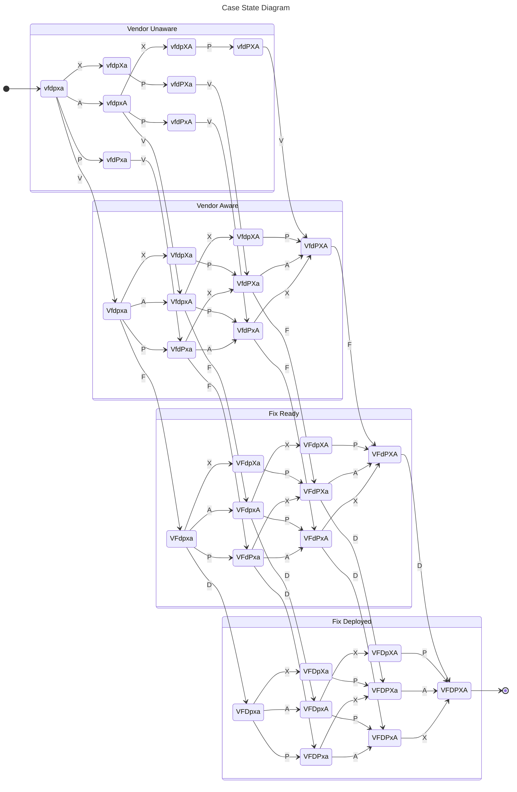

```mermaid
---
title: Case State Diagram
---
stateDiagram-v2
    direction LR
    VendorUnaware: Vendor Unaware
    VendorAware: Vendor Aware
    FixReady: Fix Ready
    FixDeployed: Fix Deployed
    state VendorUnaware {
        vfdpxa
        vfdPxa
        vfdpXa 
        vfdPXa
        vfdpxA
        vfdPxA
        vfdpXA
        vfdPXA 
   }
   state VendorAware {
        Vfdpxa
        VfdPxa
        VfdpXa 
        VfdPXa
        VfdpxA
        VfdPxA
        VfdpXA
        VfdPXA 
   } 
   state FixReady {
        VFdpxa
        VFdPxa
        VFdpXa 
        VFdPXa
        VFdpxA
        VFdPxA
        VFdpXA
        VFdPXA
   }
   state FixDeployed {
        VFDpxa
        VFDPxa
        VFDpXa 
        VFDPXa
        VFDpxA
        VFDPxA
        VFDpXA
        VFDPXA
    }
    [*] --> vfdpxa
    vfdpxa --> vfdPxa : P
    vfdpxa --> vfdpXa : X
    vfdpXa --> vfdPXa : P
    vfdpxa --> vfdpxA : A
    vfdpxA --> vfdPxA : P
    vfdpxA --> vfdpXA : X
    vfdpXA --> vfdPXA : P
    vfdpxa --> Vfdpxa : V
    vfdpxA --> VfdpxA : V
    vfdPxa --> VfdPxa : V
    vfdPXa --> VfdPXa : V
    vfdPxA --> VfdPxA : V
    vfdPXA --> VfdPXA : V
    Vfdpxa --> VfdPxa : P
    Vfdpxa --> VfdpXa : X
    VfdpXa --> VfdPXa : P
    Vfdpxa --> VfdpxA : A
    VfdpxA --> VfdPxA : P
    VfdpxA --> VfdpXA : X
    VfdpXA --> VfdPXA : P
    VfdPxa --> VfdPxA : A
    VfdPxa --> VfdPXa : X
    VfdPXa --> VfdPXA : A
    VfdPxA --> VfdPXA : X
    Vfdpxa --> VFdpxa : F
    VfdpxA --> VFdpxA : F
    VfdPxa --> VFdPxa : F
    VfdPXa --> VFdPXa : F
    VfdPxA --> VFdPxA : F
    VfdPXA --> VFdPXA : F
    VFdpxa --> VFdPxa : P
    VFdpxa --> VFdpXa : X
    VFdpXa --> VFdPXa : P
    VFdpxa --> VFdpxA : A
    VFdpxA --> VFdPxA : P
    VFdpxA --> VFdpXA : X
    VFdpXA --> VFdPXA : P
    VFdPxa --> VFdPxA : A
    VFdPxa --> VFdPXa : X
    VFdPXa --> VFdPXA : A
    VFdPxA --> VFdPXA : X
    VFdpxa --> VFDpxa : D
    VFdpxA --> VFDpxA : D
    VFdPxa --> VFDPxa : D
    VFdPXa --> VFDPXa : D
    VFdPxA --> VFDPxA : D
    VFdPXA --> VFDPXA : D
    VFDpxa --> VFDPxa : P
    VFDpxa --> VFDpXa : X
    VFDpXa --> VFDPXa : P
    VFDpxa --> VFDpxA : A
    VFDpxA --> VFDPxA : P
    VFDpxA --> VFDpXA : X
    VFDpXA --> VFDPXA : P
    VFDPxa --> VFDPxA : A
    VFDPxa --> VFDPXa : X
    VFDPXa --> VFDPXA : A
    VFDPxA --> VFDPXA : X
    VFDPXA --> [*]
```
