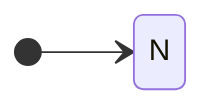
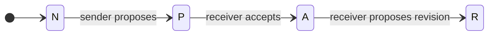
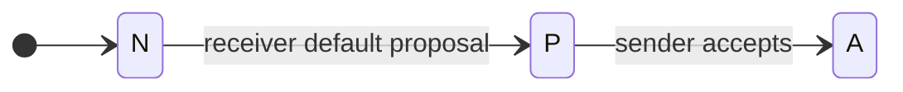
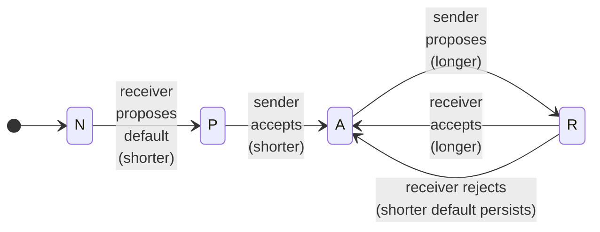
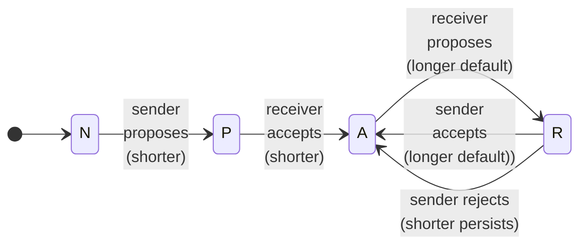

# Default Embargoes



As described in the [EM process model](index.md#sec:em_grammar), the EM process has the potential for unbounded
*propose-reject* churn. To reduce the potential for this churn and
increase the likelihood that *some* embargo is established rather than a
stalemate of unaccepted proposals, we offer the following guidance.

## Declaring Defaults

First, we note that all CVD Participants (including Reporters) are
free to establish their own default embargo period in a published
vulnerability disclosure policy. In particular, we recommend that
CVD report
recipients (typically Vendors and Coordinators) do so.

!!! note ""  

    Participants MAY include a default embargo period as part of a
    published Vulnerability Disclosure Policy.

!!! note ""  

    Report Recipients SHOULD post a default embargo period as part of their
    Vulnerability Disclosure Policy to set expectations with potential
    Reporters.

## Using Defaults

Next, we work through the possible interactions of published policies
with proposed embargoes. Each of the following scenarios assumes a
starting state of $q^{em} \in N$, and a negotiation between two parties.
We cover the extended situation (adding parties to an existing embargo)
in [Adding Participants](working_with_others.md). For now, we begin with the simplest
case and proceed in an approximate order of ascending complexity.

In each of the following, subscripts on transitions indicate the
Participant whose proposal is being acted upon, not the Participant who
is performing the action. For example, $a_{sender}$ indicates acceptance
of the Sender's proposal, even if it is the Receiver doing the
accepting.

### No Defaults, No Proposals

???+ note inline end "Formalism"

    $$q^{em} \in N$$

We begin with the simplest case, in which neither party has a default and no
embargo has been proposed.



!!! note ""  

    If neither Sender nor Receiver proposes an embargo, _and_ no policy
    defaults apply, no embargo SHALL exist.

### Sender Proposes When Receiver Has No Default Embargo

Next, we consider the case where the Sender has a default embargo or otherwise proposes an embargo
and the Receiver has no default embargo specified by policy.



!!! note ""  

    ???+ note inline end "Formalism"

        $$q^{em} \in N \xrightarrow{p_{sender}} P \xrightarrow{a_{sender}} A$$

    If the Sender proposes an embargo and the Receiver has no default
    embargo specified by policy, the Receiver SHOULD accept the Sender's
    proposal.

!!! note ""  

    ???+ note inline end "Formalism"

        $$q^{em} \in A \xrightarrow{p_{receiver}} R$$

    The Receiver MAY then propose a revision.

### Receiver Has Default Embargo, Sender Implies Acceptance

The next scenario is where the Receiver has a default embargo specified by
policy and the Sender does not propose an embargo.



!!! note ""  

    ???+ note inline end "Formalism"

        $$q^{em} \in N \xrightarrow{p_{receiver}} P$$

    A Receiver's default embargo specified in its vulnerability
    disclosure policy SHALL be treated as an initial embargo proposal.

!!! note ""  

    ???+ note inline end "Formalism"

        $$q^{em} \in N \xrightarrow{p_{receiver}} P \xrightarrow{p_{sender}} P$$

    If the Receiver has declared a default embargo in its vulnerability
    disclosure policy and the Sender proposes nothing to the contrary,
    the Receiver's default embargo SHALL be considered as an accepted
    proposal.

### Sender Proposes an Embargo Longer than the Receiver Default

Now we consider the case where the Sender proposes an embargo longer
than the Receiver's default.



!!! note ""  

    If the Sender proposes an embargo *longer* than the Receiver's
    default embargo, the Receiver's default SHALL be taken as accepted
    and the Sender's proposal taken as a proposed revision.

    ???+ note "Formalism"

        $$q^{em} \in N \xrightarrow{p_{receiver}} P \xrightarrow{p_{sender}} P \xrightarrow{a_{receiver}} A \xrightarrow{r_{sender}} R$$

!!! note ""  

    ???+ note inline end "Formalism"

        $$q^{em} \in \begin{cases}
            R \xrightarrow{a_{sender}} A \\
            R \xrightarrow{r_{sender}} A
            \end{cases}$$

    The Receiver MAY then *accept* or *reject* the proposed extension.

### Sender Proposes an Embargo Shorter than the Receiver Default

Finally, we reach a common scenario in which the Sender proposes an
embargo shorter than the Receiver's default.



!!! note ""  

    If the Sender proposes an embargo *shorter* than the Receiver's
    default embargo, the Sender's proposal SHALL be taken as accepted
    and the Receiver's default taken as a proposed revision.

    ???+ note "Formalism"
    
        $$q^{em} \in N \xrightarrow{p_{receiver}} P \xrightarrow{p_{sender}} P \xrightarrow{a_{sender}} A \xrightarrow{r_{receiver}} R$$

!!! note ""  

    ???+ note inline end "Formalism"

        $$q^{em} \in \begin{cases}
            R \xrightarrow{a_{receiver}} A \\
            R \xrightarrow{r_{receiver}} A
            \end{cases}$$

    The Sender MAY then *accept* or *reject* the proposed extension.

## Rationale for Accepting the Shortest Proposed Embargo

Here we provide two arguments for why a Participant should accept the
shorter of two proposed embargoes, with the option to propose a revision
to lengthen it.

!!! info "A Game Theory Argument for Accepting the Shortest Proposed Embargo"

    Readers may notice that we have taken a _shortest proposal wins_
    approach to the above guidance. This is intentional, and it results
    directly from the asymmetry mentioned in
    [Negotiating Embargoes](#negotiating-embargoes)
    The Receiver is faced with a
    choice to either *accept* the Reporter's proposal and attempt to extend
    it or to *reject* the proposal and end up with no embargo at all.
    Therefore, if we take the stance that for a vulnerability with no fix
    available, *any* embargo is better than *no* embargo, it should be
    obvious that it is in the Receiver's interest to *accept* even a short
    proposed embargo before immediately working to revise it.
    
    The alternative is impractical because the Reporter is not obligated to
    provide the report to the Receiver at all. In the scenario where a
    Reporter *proposes* a short embargo and the Receiver *rejects* it
    because it is not long enough, the Reporter might choose to exit the
    negotiation entirely and publish whenever they choose without ever
    providing the report to the Receiver. That is not to say that we
    recommend this sort of behavior from Reporters. In fact, we specifically
    recommend the opposite in
    [Negotiating Embargoes](#negotiating-embargoes). Rather, it once more
    acknowledges the time-dependent informational asymmetry inherent to the
    CVD process.

!!! info "A Logical Argument for Accepting the Shortest Proposed Embargo"

    Perhaps the above reasoning comes across as too Machiavellian for some
    readers. Here is a different perspective: Say a Reporter proposes an
    embargo of _n_ days, while the Vendor would prefer _m_ days. If _n_ and
    _m_ are given in units of days, we can look at them as a series of
    individual agreements, each of 1 day in length. We will represent each
    Participant as a vector representing that Participant's willingness to
    perpetuate the embargo on each day. Embargo willingness will be
    represented as a _1_ if the Participant is willing to commit to keeping
    the embargo on that day, and a _0_ if they are not. For simplicity's
    sake, we assume that each Participant is willing to maintain the embargo
    up to a certain point, and then their willingness goes away. In other
    words, each vector will be a series of zero or more _1_s followed by
    zero or more _0_s. For example, $[1,1,1,1,0,0,0]$ represents a
    Participant's willingness to engage in a 4-day embargo.
    
    For our two Participants, let $\mathbf{x}_ and _\mathbf{y}$ be
    zero-indexed vectors of length $max(n,m)$.
    
    $$\begin{aligned}
        |\mathbf{x}| &= max(n,m) \\
        |\mathbf{y}| &= max(n,m)
    \end{aligned}$$
    
    The elements of each vector represent each respective Participant's
    willingness for the embargo to persist on each consecutive day.
    
    $$\begin{aligned}
        \label{eq:x_i}
        \mathbf{x} = 
            \begin{bmatrix} x_i :
            x_i = 
            \begin{cases}
                1 &\text{if }i < n \\
                0 &\text{otherwise} \\
            \end{cases}
            & \text{for } 0 \leq i < max(n,m)
            \end{bmatrix} \\
        \label{eq:y_i}
        \mathbf{y} =
            \begin{bmatrix} y_i : 
            y_i = 
            \begin{cases}
                1 &\text{if }i < m \\
                0 &\text{otherwise}
            \end{cases}
            & \text{ for } 0 \leq i < max(n,m)
        \end{bmatrix}
    \end{aligned}$$
    
    Note that we have constructed these vectors so that each vector's scalar
    sum is just the length of embargo they prefer.
    
    $$\begin{aligned}
        \Sigma(\mathbf{x}) &= n \\
        \Sigma(\mathbf{y}) &= m 
    \end{aligned}$$
    
    Now we can define an agreement vector $\mathbf{z}$ as the pairwise
    logical *AND* ($\wedge$) of elements from $\mathbf{x}_ and _\mathbf{y}$:
    
    $$\begin{aligned}
        \label{eq:z_i}
        \mathbf{z} = 
        \begin{bmatrix} z_i : 
            z_i = x_i \land y_i
            & \text{for }0 \leq i < max(n,m)
        \end{bmatrix}
    \end{aligned}$$
    
    For example, if one party prefers an embargo of length $n=4$ days while
    another prefers one of length $m=7$ days, we can apply
    [\[eq:x_i\]](#eq:x_i){== TODO fix ref to eq:x_i ==},
    [\[eq:y_i\]](#eq:y_i){== TODO fix ref to eq:y_i ==}, and
    [\[eq:z_i\]](#eq:z_i){== TODO fix ref to eq:z_i ==} as
    follows:
    
    $$\begin{split}
        \mathbf{x} &= [1,1,1,1,0,0,0] \\
        \wedge~\mathbf{y} &= [1,1,1,1,1,1,1] \\
        \hline
        \mathbf{z} &= [1,1,1,1,0,0,0]
        \end{split}$$
    
    From this, we can see that the scalar sum of the agreement vector---and
    therefore the longest embargo acceptable to both parties---is simply the
    lesser of _n_ and _m_:
    
    $$\Sigma ( \mathbf{z} ) = min(n,m)$$

As an example:

!!! example "The Shortest Proposed Embargo Wins"

    If a Reporter proposes a 90-day embargo, but the Vendor
    prefers a 30-day embargo, we can think of this as a series of 1-day
    agreements in which both parties agree to the first 30 days of the
    embargo and disagree beyond that. By accepting the shorter 30-day
    embargo, the Reporter now has 30 days to continue negotiations with the
    Vendor to extend the embargo. Even if those continued negotiations fail,
    both parties get at least the 30-day embargo period they agreed on in
    the first place. This should be preferable to both parties versus the
    alternative of no embargo at all were they to simply reject the shorter
    proposal.

    ```mermaid
    ---
    title: Embargo Agreement in a Nutshell
    ---
    stateDiagram-v2
        direction LR
        dots: ...
        state Agreement {
            direction LR
            [*] --> 1
            1 --> 2
            2 --> dots
            dots --> 30
            negotiate: negotiate extension
            [*] --> negotiate
            negotiate --> 30
        }
        30 --> 31
        state Disagreement {
            dots2: ...
            31 --> dots2
            dots2 --> 90
        }
    ```

    Typically it is the Reporter who desires a shorter embargo than the Vendor.
    We chose our example to demonstrate that this analysis works between any two parties, regardless of which party wants the
    shorter embargo.

!!! info "Resolving Multiple Proposals at Once"

    On our way to making this principle explicit, we immediately came across
    a second scenario worth a brief diversion: What to do when multiple
    revisions are up for negotiation simultaneously? Based on the idea of
    extending the above to an efficient pairwise evaluation of multiple
    proposals, we suggest the following heuristic:

    1.  Sort the proposals in order from earliest to latest according to
    their expiration date.
    2.  Set the current candidate to the earliest proposal.
    3.  Loop over each remaining (later) proposal, evaluating it against the
    current candidate.
    4.  If the newly evaluated proposal is accepted, it becomes the current
    candidate and the loop repeats.
    5.  Otherwise, the loop exits at the first *reject*ed proposal.
    6.  The current candidate (i.e., the latest *accept*ed proposal) becomes
    the new *Active* embargo.
    7.  If the earliest proposed revision is rejected---implying that none
    of the later ones would be acceptable either---then the existing
    *Active* embargo remains intact.

## Resolving Proposals and Revisions

Summarizing the principles just laid out as rules

!!! note ""

    When two or more embargo proposals are open (i.e., none have yet
    been accepted) and $q^{em} \in P$, Participants SHOULD accept the
    shortest one and propose the remainder as revisions.

!!! note ""

    When two or more embargo revisions are open (i.e., an embargo is
    active yet none of the proposals have been decided) and
    $q^{em} \in R$, Participants SHOULD *accept* or *reject* them
    individually, in earliest to latest expiration order.
