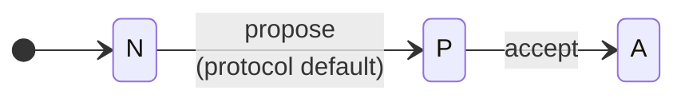
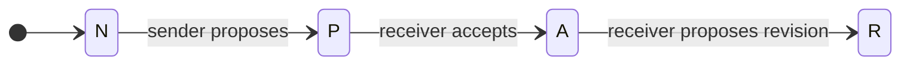
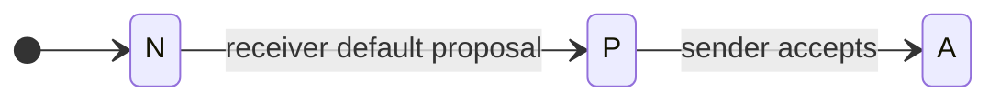
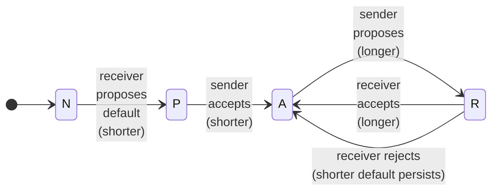
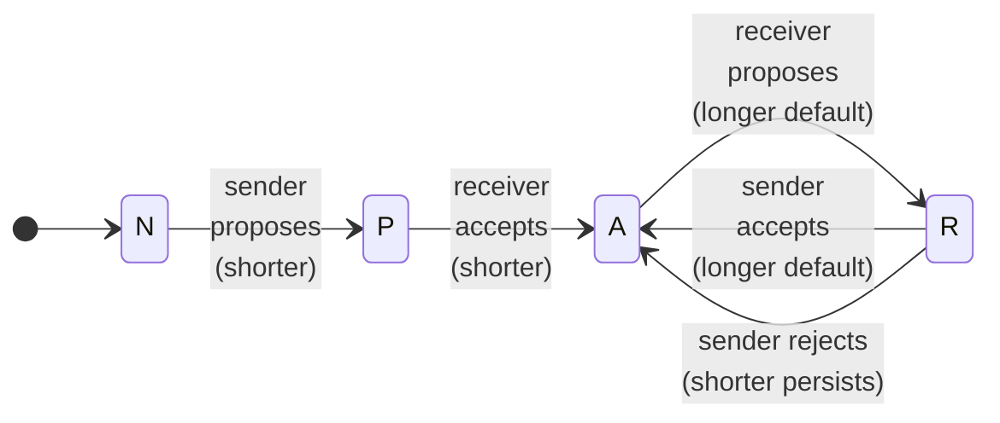

# Default Embargoes



Embargo negotiation can go around in circles: one side proposes, the other rejects, and the case sits with no embargo at all.
Defaults exist to stop that.
They make sure that *some* embargo is in force from the moment a case exists, and leave the parties free to negotiate a better one from there.

## Declaring Defaults

Any CVD Participant, Reporters included, can publish a default embargo period in their vulnerability disclosure policy.
Report recipients, usually Vendors and Coordinators, are encouraged to do so.

!!! note ""

    Participants MAY include a default embargo period as part of a published Vulnerability Disclosure Policy.

!!! note ""

    Report Recipients SHOULD post a default embargo period as part of their Vulnerability Disclosure Policy to set expectations with potential Reporters.

## Embargoes Are Active at Case Creation

The scenarios below describe embargo agreement as an exchange between two parties.
In the most common situation, however, no exchange is visible at all: a case is created and it *already* has an active embargo.
This section explains why.

Embargo Management (EM) begins when the case is created; there is no embargo phase before a case exists ([ADR-0096: A Protocol Default Embargo Replaces the Pre-Case Phase](../../../adr/0096-protocol-default-embargo.md)).
A Reporter who wants particular terms attaches a proposed embargo to the report they submit.
Those terms, and the Recipient's published default, are weighed together when the Recipient creates the case.

When a Report Recipient has published a default embargo period (see [Declaring Defaults](#declaring-defaults)), that default acts as a **standing proposal**.
A Reporter who submits a report without proposing different terms has, by not objecting, **tacitly accepted** that standing proposal.
So by the time the case is created, both parties have already stated their position: the Recipient by publishing the policy, the Reporter by not contradicting it.

Because the agreement is already in place, nothing remains to negotiate.
The embargo is *Active* from the moment the case is created.

!!! note ""

    When a case is created and a published default embargo applies with no contrary proposal, the embargo SHALL begin in the *Active* state.

The same holds when *nobody* has published anything: a short [protocol default](#no-defaults-no-proposals-the-protocol-default) applies instead.
So an embargo-eligible case always begins with an *Active* embargo, whatever the parties have or have not declared.
Reaching a case with no embargo through mutual silence is the outcome the EM process exists to avoid.

### Why *Active* and Not *Proposed*?

The *Proposed* state represents an embargo that has been offered but not yet agreed, an open question awaiting a decision.
On the default path there is no open question.
The published default supplies the *propose* action and the Reporter's silence supplies the *accept* action.
The protocol applies the two together when the case is created, so the case never rests in *Proposed* and nobody ever sees it there.

Leaving a newly created case in *Proposed* would misrepresent a settled agreement as an unresolved one, and would imply that some party still owes a response.
This is why a protocol trace of the happy path shows an *Active* embargo with no preceding *propose* or *accept* message between the parties.
The absence of that exchange is intentional and correct; it is not a skipped step.

### The Case Owner Is a Signatory from the Start

The party who creates the case is its Case Owner.
The Case Owner brings the active embargo into being, so it would be incoherent to treat them as not yet bound by it.
Each Participant's own agreement to the embargo is tracked separately from the case's embargo state, by Participant Embargo Consent (PEC).
The Case Owner starts there as a *Signatory*, and so does a Reporter whose submission accepted the terms, without either having been sent an invitation.
[Embargo Lifecycle](../../behavior_logic/use-cases/embargo-lifecycle.md) explains how the two scopes fit together, and [§9.3 of the Vultron Protocol Specification](../../../reference/vultron-spec/index.md#93-what-unbound-means) specifies consent without an invitation.

### When a Counter-Proposal Is Present

The default path applies only when the Reporter proposes nothing to the contrary.
If the Reporter proposes different terms, the case follows the negotiated path instead; see [Sender Proposes an Embargo Longer than the Receiver Default](#sender-proposes-an-embargo-longer-than-the-receiver-default) and [Sender Proposes an Embargo Shorter than the Receiver Default](#sender-proposes-an-embargo-shorter-than-the-receiver-default) below.
Even then, the shorter proposal is taken as accepted and the longer one as a proposed revision.
The case therefore still reaches an *Active* embargo at once, rather than stalling in negotiation.

## Using Defaults

The scenarios below work through how published defaults interact with proposed terms, from the simplest to the most involved.
Each one describes two parties, a Sender who submits a report and a Receiver who creates the case from it.
[Adding Participants to an Embargoed Case](working_with_others.md) covers bringing further parties into an existing embargo.

Each scenario starts when the Receiver creates the case, with both parties' positions already known: the Receiver's published default, if any, and any terms the Sender attached to the report.
The diagrams show the EM path up to the first *Active* state and any revision that follows it.
Where a default applies, the steps up to *Active* happen together when the case is created.

Each scenario also gives the path in the EM shorthand defined in the [EM formal model](formal_model.md#em-states), where N, P, A and R stand for *None*, *Proposed*, *Active* and *Revise*.
Subscripts on transitions name the Participant whose proposal is being acted on, not the Participant acting.
For example, $a_{sender}$ is acceptance of the Sender's proposal, even when the Receiver is the one accepting.

### No Defaults, No Proposals — the Protocol Default

The simplest case is one in which neither party has a default and nobody proposes an embargo.
Even here an embargo is established, at a short duration fixed by the protocol itself.


```mermaid
stateDiagram-v2
    direction LR
    [*] --> N
    N --> P : propose<br/>(protocol default)
    P --> A : accept
```

As on the other default paths, the two transitions are applied together at case creation, and *Proposed* is never observable (see [Why *Active* and Not *Proposed*?](#why-active-and-not-proposed) above).
The only difference is where the duration comes from: the protocol, rather than either party.

The protocol default lasts between 72 hours and 5 days; each deployment configures the exact value.
[§7.2 of the Vultron Protocol Specification](../../../reference/vultron-spec/index.md#72-transitions-and-guards) states these rules normatively.

The protocol default is deliberately short.
Its purpose is not to provide a comfortable embargo; it is to reward publishing a default embargo period.
A Participant who publishes nothing gets a few days, while one who publishes a considered period gets the period they asked for.
A generous fallback would remove the reason to publish at all.

!!! warning "The Protocol Default Is Not a Proposal"

    The protocol default does **not** take part in the *shortest proposal wins* comparison described below.
    It is the value applied when there are no candidates, never a candidate itself.

    This distinction is load-bearing.
    A 3-day protocol default that competed under shortest-wins would win against every longer proposal and cap every embargo in the system at 3 days, so no longer embargo could ever be agreed.

    Two different things are called a *default*, and they behave differently:

    | Term | What it is | Competes under shortest-wins? |
    |---|---|---|
    | **Actor default** | A duration from an Actor's published `EmbargoPolicy` — a *standing proposal* | **Yes** |
    | **Protocol default** | The fallback when no proposal and no actor default applies | **No** |

Nor is the protocol default a *minimum*.
A Participant who proposes terms shorter than it gets the terms they proposed; the range above bounds what the fallback may be set to, not what parties may agree.

One exception applies.
An embargo on a vulnerability that is already public protects nothing, so no protocol default embargo is created for a case that is no longer embargo-eligible.
Where the vulnerability is already public, exploit code is public, or attacks have been observed, the case stays at *None*.

### Sender Proposes When Receiver Has No Default Embargo

Here the Sender attaches proposed terms to the report, and the Receiver has published no default embargo.


```mermaid
stateDiagram-v2
    direction LR
    [*] --> N
    N --> P : sender proposes
    P --> A : receiver accepts
    A --> R : receiver proposes revision
```

!!! note ""

    ???+ note inline end "Formalism"

        $$q^{em} \in N \xrightarrow{p_{sender}} P \xrightarrow{a_{sender}} A$$

    If the Sender proposes an embargo and the Receiver has no default embargo specified by policy, the Receiver SHOULD accept the Sender's proposal.

!!! note ""

    ???+ note inline end "Formalism"

        $$q^{em} \in A \xrightarrow{p_{receiver}} R$$

    The Receiver MAY then propose a revision.

### Receiver Has Default Embargo, Sender Implies Acceptance

Here the Receiver has published a default embargo and the Sender proposes nothing.


```mermaid
stateDiagram-v2
    direction LR
    [*] --> N
    N --> P : receiver default proposal
    P --> A : sender accepts
```

!!! note ""

    ???+ note inline end "Formalism"

        $$q^{em} \in N \xrightarrow{p_{receiver}} P$$

    A Receiver's default embargo specified in its vulnerability disclosure policy SHALL be treated as an initial embargo proposal.

!!! note ""

    ???+ note inline end "Formalism"

        $$q^{em} \in N \xrightarrow{p_{receiver}} P \xrightarrow{a_{receiver}} A$$

    If the Receiver has declared a default embargo in its vulnerability disclosure policy and the Sender proposes nothing to the contrary, the Receiver's default embargo SHALL be considered as an accepted proposal.

### Sender Proposes an Embargo Longer than the Receiver Default

Here the Sender proposes an embargo longer than the Receiver's default.


```mermaid
stateDiagram-v2
    direction LR
    [*] --> N
    N --> P : receiver<br/>proposes<br/>default<br/>(shorter)
    P --> A : sender<br/>accepts<br/>(shorter)
    A --> R : sender<br/>proposes<br/>(longer)
    R --> A : receiver<br/>accepts<br/>(longer)
    R --> A : receiver rejects<br/>(shorter default persists)
```

!!! note ""

    If the Sender proposes an embargo *longer* than the Receiver's default embargo, the Receiver's default SHALL be taken as accepted and the Sender's proposal taken as a proposed revision.

    ???+ note "Formalism"

        $$q^{em} \in N \xrightarrow{p_{receiver}} P \xrightarrow{p_{sender}} P \xrightarrow{a_{receiver}} A \xrightarrow{p_{sender}} R$$

!!! note ""

    ???+ note inline end "Formalism"

        $$q^{em} \in \begin{cases}
            R \xrightarrow{a_{sender}} A \\
            R \xrightarrow{r_{sender}} A
            \end{cases}$$

    The Receiver MAY then *accept* or *reject* the proposed extension.

### Sender Proposes an Embargo Shorter than the Receiver Default

A common scenario is one in which the Sender proposes an embargo shorter than the Receiver's default.


```mermaid
stateDiagram-v2
    direction LR
    [*] --> N
    N --> P : sender<br/>proposes<br/>(shorter)
    P --> A : receiver<br/>accepts<br/>(shorter)
    A --> R : receiver<br/>proposes<br/>(longer default)
    R --> A : sender<br/>accepts<br/>(longer default)
    R --> A : sender rejects<br/>(shorter persists)
```

!!! note ""

    If the Sender proposes an embargo *shorter* than the Receiver's default embargo, the Sender's proposal SHALL be taken as accepted and the Receiver's default taken as a proposed revision.

    ???+ note "Formalism"

        $$q^{em} \in N \xrightarrow{p_{receiver}} P \xrightarrow{p_{sender}} P \xrightarrow{a_{sender}} A \xrightarrow{p_{receiver}} R$$

!!! note ""

    ???+ note inline end "Formalism"

        $$q^{em} \in \begin{cases}
            R \xrightarrow{a_{receiver}} A \\
            R \xrightarrow{r_{receiver}} A
            \end{cases}$$

    The Sender MAY then *accept* or *reject* the proposed extension.

## Rationale for Accepting the Shortest Proposed Embargo

Why should a Participant accept the shorter of two proposed embargoes, and then propose a revision to lengthen it?
There are two reasons.

**Refusing a short embargo usually means getting none.**
A Reporter is not obliged to give the report to the Receiver at all, and holds the information until they do; this is the asymmetry described in [Negotiating Embargoes](negotiating.md).
If the Receiver rejects a proposal as too short, the Reporter may walk away and publish when they choose.
[Negotiating Embargoes](negotiating.md) recommends that Reporters not do that, but a Receiver cannot count on it.
When no fix is available, *any* embargo is better than *no* embargo, so the Receiver does better to accept the short one and work to extend it.

**The shorter embargo is exactly what both parties already agree on.**
Think of an embargo as a series of one-day agreements.
Two parties who want 30 and 90 days both agree to keep days 1 through 30 quiet, and disagree only about days 31 through 90.
The longest embargo both will accept is therefore the shorter of the two.
The [EM formal model](formal_model.md#why-the-shortest-proposal-wins) states this argument formally.

!!! example "The Shortest Proposed Embargo Wins"

    If a Reporter proposes a 90-day embargo but the Vendor prefers 30 days, both parties agree to the first 30 days and disagree beyond that.
    By accepting the shorter 30-day embargo, the Reporter now has 30 days to continue negotiating an extension with the Vendor.
    Even if those negotiations fail, both parties get at least the 30 days they agreed on in the first place.
    That is better for both than having no embargo at all, which is what rejecting the shorter proposal would risk.

    ```mermaid
    ---
    title: Embargo Agreement in a Nutshell
    ---
    stateDiagram-v2
        direction LR
        dots: ...
        state Agreement {
            direction LR
            [*] --> 1
            1 --> 2
            2 --> dots
            dots --> 30
            negotiate: negotiate extension
            [*] --> negotiate
            negotiate --> 30
        }
        30 --> 31
        state Disagreement {
            dots2: ...
            31 --> dots2
            dots2 --> 90
        }
    ```

    Typically it is the Reporter who wants a shorter embargo than the Vendor.
    The example is the other way round to show that the reasoning holds whichever party wants the shorter embargo.

## Resolving Proposals and Revisions

The same reasoning extends to several proposals at once.

!!! note ""

    When two or more embargo proposals are open (i.e., none have yet been accepted) and $q^{em} \in P$, Participants SHOULD accept the shortest one and propose the remainder as revisions.

!!! note ""

    When two or more embargo revisions are open (i.e., an embargo is active yet none of the proposals have been decided) and $q^{em} \in R$, Participants SHOULD *accept* or *reject* them individually, in earliest to latest expiration order.

Working through several open revisions in order looks like this:

1. Sort the proposals from earliest to latest end date.
2. Take the earliest as the current candidate.
3. Evaluate each later proposal in turn against the current candidate.
4. If a proposal is accepted, it becomes the current candidate, and the next one is evaluated.
5. Stop at the first proposal that is rejected.
6. The current candidate, the latest accepted proposal, becomes the new *Active* embargo.
7. If even the earliest revision is rejected, the later ones would be too, and the existing *Active* embargo stays as it is.

Shortest-wins is a recommendation, not a requirement.
An implementation may instead leave the choice to the Case Owner or apply its own organizational policy; see [§7.2 of the Vultron Protocol Specification](../../../reference/vultron-spec/index.md#72-transitions-and-guards).

## Doing It on the Wire

- [How to Establish an Embargo](../../../howto/activitypub/activities/establish_embargo.md) shows how an embargo is proposed, accepted and activated, including adding one outright when a published policy already applies.
- [How to Revise or Terminate an Embargo](../../../howto/activitypub/activities/manage_embargo.md) shows how the longer proposal is put forward as a revision and accepted or rejected.
