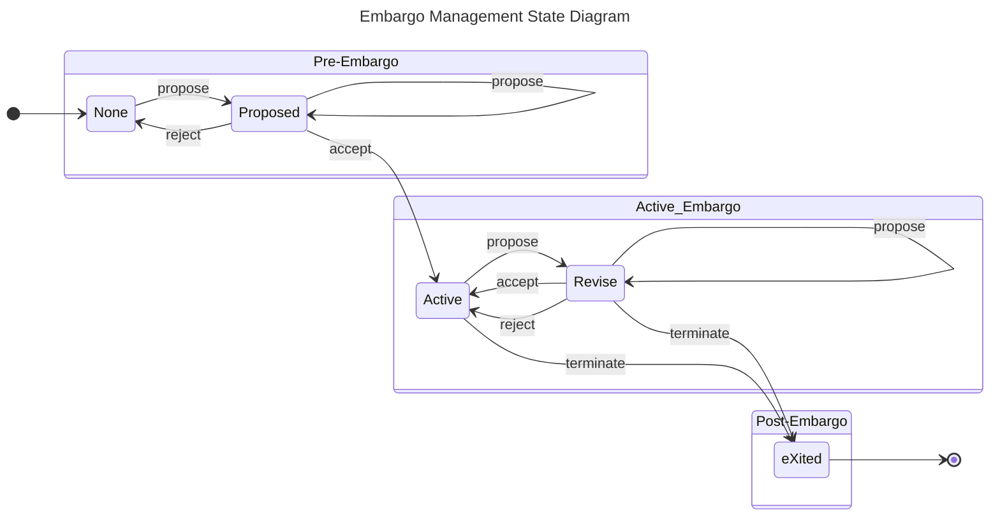

<!-- em-state-machine-start -->

```mermaid
---
title: Embargo Management State Diagram
---
stateDiagram-v2
    direction LR
    [*] --> None
    state Pre-Embargo {
        None --> Proposed : propose
        Proposed --> Proposed : propose
        Proposed --> None : reject
        Proposed --> Active : accept
    }
    state Active_Embargo {
        Active --> Revise : propose
        Revise --> Active : accept
        Revise --> Active : reject
        Revise --> Revise : propose
        Revise --> eXited : terminate
        Active --> eXited : terminate
    }
    state Post-Embargo {
        eXited
    }
    eXited --> [*]
```
<!-- em-state-machine-end -->
