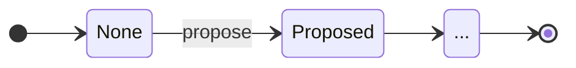
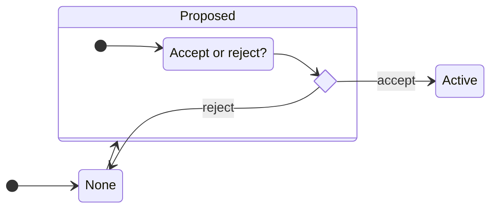
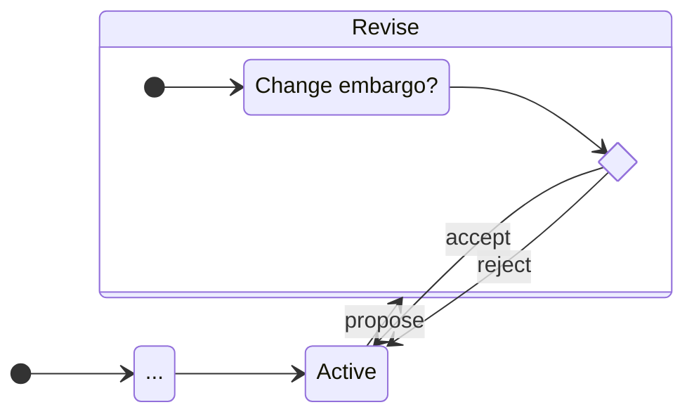
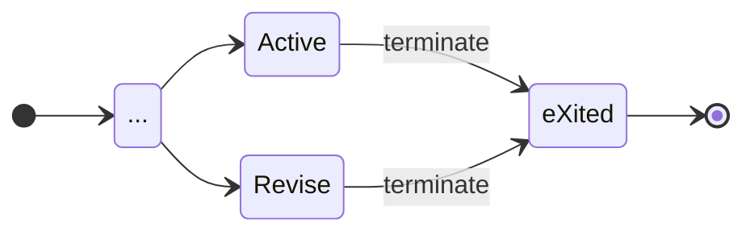
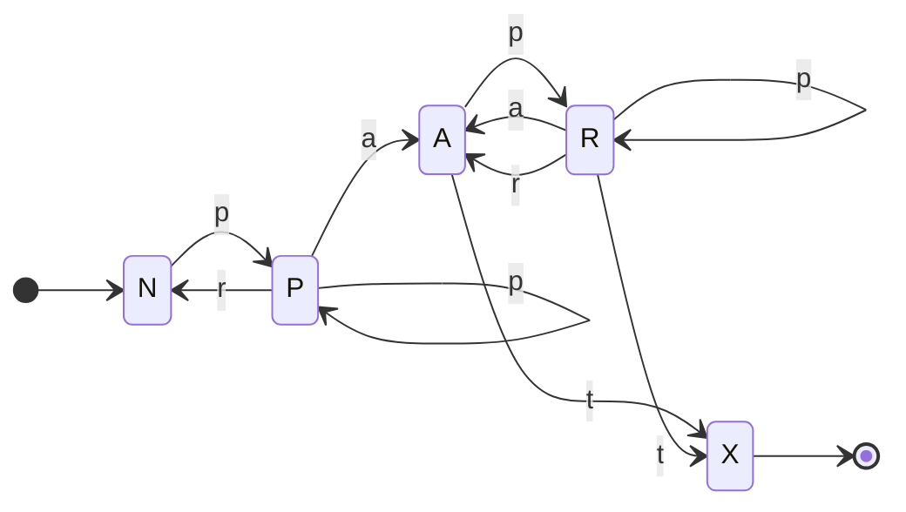

# EM Formal Model

This page defines the Embargo Management (EM) process as a deterministic finite automaton (DFA).
It is for readers who want the formal model behind the [EM process model](index.md), which describes each state and transition in practitioner terms.
The [formal protocol](../../../reference/formal_protocol/index.md) builds on the definitions given here.

The normative EM states and transitions are specified in [§7 of the Vultron Protocol Specification](../../../reference/vultron-spec/index.md#7-embargo-management-em-state-machine-n).
The [states table (§7.1)](../../../reference/vultron-spec/index.md#71-states) and the [transitions table (§7.2)](../../../reference/vultron-spec/index.md#72-transitions-and-guards) are the authority.
This page restates them in DFA notation and adds what the specification does not carry: the symbol set, a right-linear grammar, a regular expression for every possible history, and the shortest histories.

!!! note "State names"

    The specification names two states *Revised* and *Exited*.
    The process-model pages call them *Revise* and *eXited*, so that the underlined capital gives the one-letter shorthand used below.
    They are the same states.

---

## The DFA notation



A DFA is a 5-tuple of states, an initial state, a set of final states, a set of input symbols, and a transition function.
The inset at right defines each element.
The sections below give each element for the EM process in turn.

## EM states

???+ note inline end "EM States ($\mathcal{Q}^{em}$) Defined"

    $\begin{split}
        \mathcal{Q}^{em} = \{ & \underline{N}one, \\
        & \underline{P}roposed, \\
        & \underline{A}ctive, \\
        & \underline{R}evise, \\
        & e\underline{X}ited \}
    \end{split}$

A case is either under an active embargo or it is not.
Because embargo management coordinates several Participants, the model separates two further situations from those two.

- *Proposed* sits between *None* and *Active*: an embargo has been proposed but not yet accepted or rejected.
- *Revise* sits alongside *Active*: an embargo is in force and a change to it has been proposed but not yet accepted or rejected.

The model also separates the case that has never had an embargo (*None*) from the case whose embargo has ended (*eXited*).
Combining these gives the five states of $\mathcal{Q}^{em}$, shown at right.

The underlined capital letters are the shorthand used for EM states in the rest of this documentation.

!!! warning "Check which model a shorthand letter belongs to"

    $q^{em} \in A$ is distinct from $q^{rm} \in A$.
    An embargo can be *Active* while a report is [*Accepted*](../rm/index.md#the-accepted-a-state), and the two are independent.

## Start and final states

???+ note inline end "EM Start and Final States Defined"

    $q^{em}_0 = None$

    $\mathcal{F}^{em} = \{None,~eXited\}$

The EM process starts in *None*.
It ends in one of two states.
If an embargo is ever agreed, the process ends in *eXited* once that embargo ends.
If no embargo is ever agreed, the process ends in *None*.

## EM symbols

???+ note inline end "EM Symbols ($\Sigma^{em}$) Defined"

    $$\begin{split}
        \Sigma^{em} = \{
         ~\underline{p}ropose,
         ~\underline{r}eject,
         ~\underline{a}ccept,
         ~\underline{t}erminate
        \}
    \end{split}$$

Four actions drive the machine.

- An embargo MAY be *proposed*.
- Once proposed, it MAY be *accepted* or *rejected*.
- Once accepted, revisions MAY be *proposed*, and each MAY in turn be *accepted* or *rejected*.
- An accepted embargo MUST eventually *terminate*.

The underlined lowercase letters are the shorthand for EM transitions in the rest of this documentation.

## EM state transitions

The diagram in the [EM process model](index.md#em-state-transitions) shows the whole machine.
The four subsections below take each part of it in turn.

### Propose embargo

A new embargo is proposed when none exists.

### Accept or reject an embargo proposal

Once an embargo is proposed, it is accepted or rejected.
A further proposal while the first is outstanding supersedes it, leaving the case at *Proposed*; the diagram omits that loop.

### Embargo revision

An active embargo is renegotiated by proposing a new one.
The active embargo stays in force until an accepted revision replaces it.
If the revision is accepted, it replaces the old terms.
If the revision is rejected, the old terms stand and the case returns to *Active*, not to *None*.

!!! tip "Revisions do not interrupt active embargoes"

    Coverage never breaks during a revision.
    The existing embargo remains in effect until an accepted revision replaces it.

### Terminate embargo

An embargo terminates when its timer expires, or for the other reasons given in [Early Termination](early_termination.md).
Termination can happen while a revision is still open.

## A regular grammar for EM

???+ note inline end "EM Transition Function ($\delta^{em}$) Defined"

    $\delta^{em} =
        \begin{cases}
               N \to ~pP~|~\epsilon \\
               P \to ~pP~|~rN~|~aA \\
               A \to ~pR~|~tX \\
               R \to ~pR~|~aA~|~rA~|~tX \\
               X \to ~\epsilon \\
        \end{cases}$

The transitions above define the EM transition function $\delta^{em}$ as the production rules of a right-linear grammar, written in the one-letter shorthand in the box at right.
The same machine in shorthand is shown below.

## Possible histories

The machine has loops at *Proposed*, at *Revise*, and between *Active* and *Revise*.
The grammar can therefore generate arbitrarily long histories.
Every complete history matches the regular expression `(p+r)*(p+a(p+[ar])*p*t)?`.
The first group is any number of proposals that end in rejection.
The optional second group is a proposal that is accepted, followed by any number of revisions that are accepted or rejected, followed by termination, which may come while one last revision is open.

Here is every complete non-empty history of seven or fewer actions:

> *pr*, *pat*, *ppr*, *ppat*, *papt*, *prpr*, *pppr*, *ppppr*, *pprpr*,
> *prppr*, *pappt*, *ppapt*, *pppat*, *papat*, *paprt*, *prpat*,
> *pppppr*, *papppt*, *prpppr*, *ppprpr*, *ppappt*, *pppapt*, *prprpr*,
> *papapt*, *pprppr*, *pappat*, *paprpt*, *prppat*, *prpapt*, *ppaprt*,
> *pprpat*, *ppapat*, *papprt*, *ppppat*, *pprprpr*, *prprppr*,
> *paprppt*, *prpprpr*, *pappprt*, *papppat*, *ppppapt*, *prpaprt*,
> *papappt*, *pappapt*, *pppappt*, *pprpppr*, *pppprpr*, *prppppr*,
> *ppprppr*, *ppapppt*, *ppaprpt*, *papprpt*, *ppapprt*, *ppappat*,
> *prpppat*, *prpapat*, *ppprpat*, *ppppppr*, *pprppat*, *papapat*,
> *paprpat*, *ppapapt*, *prprpat*, *paprprt*, *prppapt*, *pppapat*,
> *pprpapt*, *pppaprt*, *pppppat*, *prpappt*, *papaprt*, *pappppt*

EM is a scheduling process run by people, and people tolerate only so much churn in a negotiation.
Most histories in practice should therefore be near the short end of this list.
[Reward Functions](../../measuring_cvd/reward_functions.md) sketches a reward function over EM histories.

For example, it is usually better for a Vendor to accept the embargo the Reporter proposes and then propose a revision to their preferred timeline than for the two to trade proposals and rejections without ever establishing an embargo.
In the worst case, where the Reporter declines to extend, a short embargo is usually better than none.
That implies a preference for histories beginning *pap* (propose, accept, propose a revision) over those beginning *ppa* or *prpa*.
[Default Embargoes](defaults.md) and the [worked protocol example](../../../tutorials/worked_example.md#vendor-accepts-then-proposes-revision) return to this idea.

## Why the shortest proposal wins

[Default Embargoes](defaults.md#rationale-for-accepting-the-shortest-proposed-embargo) recommends accepting the shorter of two proposed embargoes and proposing the longer as a revision.
This section gives the argument formally.

Suppose one Participant proposes an embargo of $n$ days and another prefers $m$ days.
Treat the embargo as a series of one-day agreements, and represent each Participant as a vector of their willingness to keep the embargo on each day: $1$ if they are willing on that day, $0$ if not.
Each Participant is assumed willing up to some point and not after, so each vector is zero or more $1$s followed by zero or more $0$s.
For example, $[1,1,1,1,0,0,0]$ is a willingness to keep a 4-day embargo.

Let $\mathbf{x}$ and $\mathbf{y}$ be the two Participants' vectors, zero-indexed and of length $max(n,m)$:

$$\begin{aligned}
    \mathbf{x} =
        \begin{bmatrix} x_i :
        x_i =
        \begin{cases}
            1 &\text{if }i < n \\
            0 &\text{otherwise} \\
        \end{cases}
        & \text{for } 0 \leq i < max(n,m)
        \end{bmatrix} \\
    \mathbf{y} =
        \begin{bmatrix} y_i :
        y_i =
        \begin{cases}
            1 &\text{if }i < m \\
            0 &\text{otherwise}
        \end{cases}
        & \text{ for } 0 \leq i < max(n,m)
    \end{bmatrix}
\end{aligned}$$

Each vector's scalar sum is the embargo length its Participant prefers:

$$\begin{aligned}
    \Sigma(\mathbf{x}) &= n \\
    \Sigma(\mathbf{y}) &= m
\end{aligned}$$

Define the agreement vector $\mathbf{z}$ as the pairwise logical *AND* ($\wedge$) of $\mathbf{x}$ and $\mathbf{y}$:

$$\mathbf{z} =
    \begin{bmatrix} z_i :
        z_i = x_i \land y_i
        & \text{for }0 \leq i < max(n,m)
    \end{bmatrix}$$

For example, with $n=4$ and $m=7$:

$$\begin{split}
    \mathbf{x} &= [1,1,1,1,0,0,0] \\
    \wedge~\mathbf{y} &= [1,1,1,1,1,1,1] \\
    \hline
    \mathbf{z} &= [1,1,1,1,0,0,0]
\end{split}$$

The scalar sum of the agreement vector, and so the longest embargo acceptable to both parties, is the lesser of $n$ and $m$:

$$\Sigma ( \mathbf{z} ) = min(n,m)$$

## EM DFA fully defined

Taken together, the complete DFA specification for the EM process is shown below.

???+ note "EM DFA $(\mathcal{Q},q_0,\mathcal{F},\Sigma,\delta)^{em}$ Fully Defined"

    $EM =
        \begin{pmatrix}
                \begin{aligned}
                    \mathcal{Q}^{em} = & \{ N,P,A,R,X \}, \\
                    q^{em}_0 = & N, \\
                    \mathcal{F}^{em} = &\{ N,X \},  \\
                    \Sigma^{em} = &\{ p,r,a,t \}, \\
                    \delta^{em} = &
                        \begin{cases}
                           N \to ~pP~|~\epsilon \\
                           P \to ~pP~|~rN~|~aA \\
                           A \to ~pR~|~tX \\
                           R \to ~pR~|~aA~|~rA~|~tX \\
                           X \to ~\epsilon \\
                        \end{cases}
                \end{aligned}
        \end{pmatrix}$
