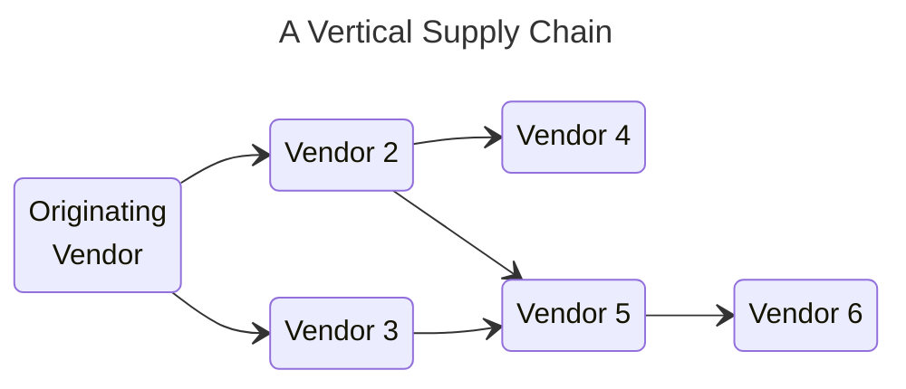
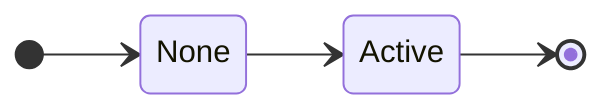
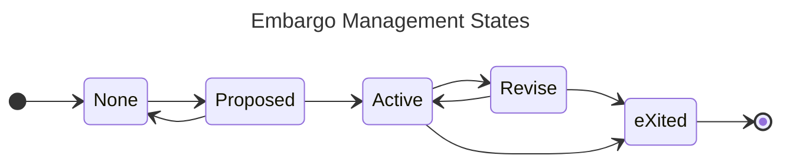
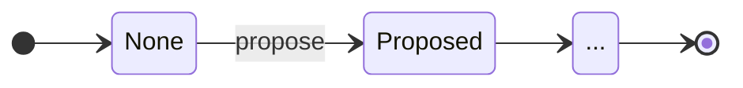
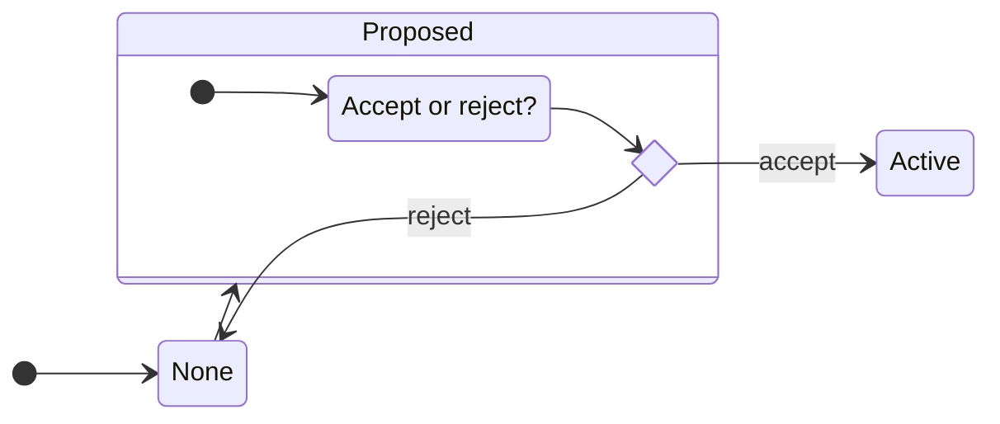
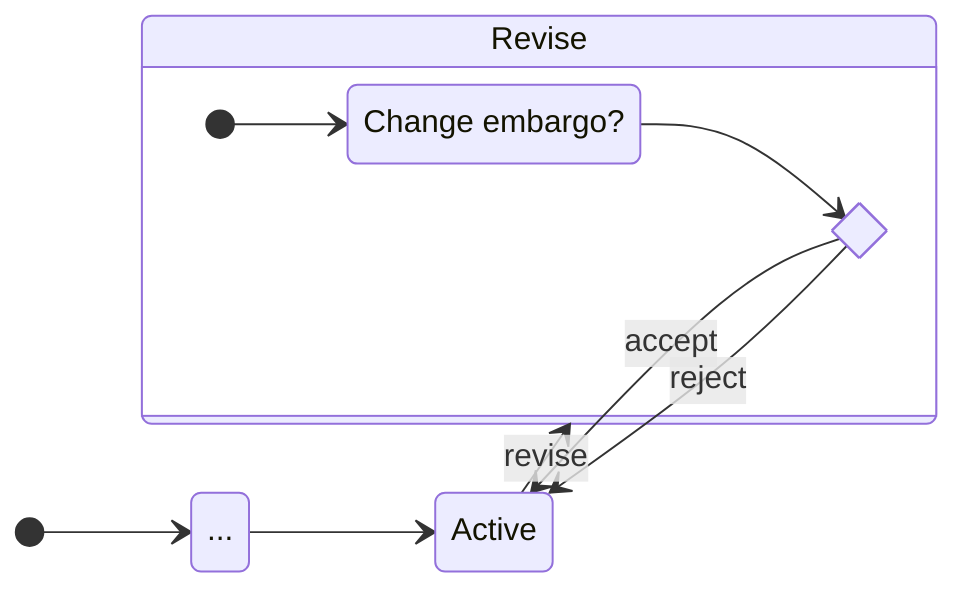
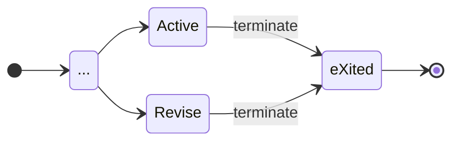
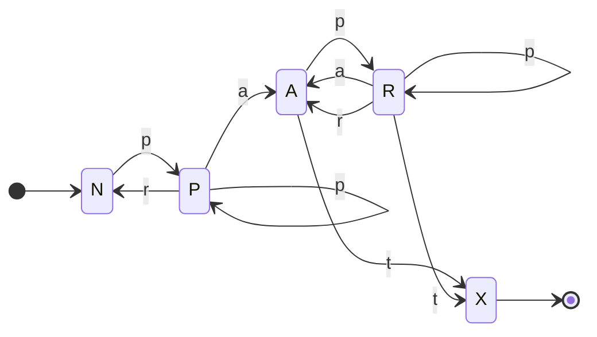

# Embargo Management Process Model



Here we describe the basic primitives necessary for the CVD Embargo Management (EM) process.
<!-- start_excerpt -->
For our purposes, an embargo is an *informal* agreement among peer
CVD case Participants to refrain from publishing information about a vulnerability until some future point in time
relative to the report at hand. Once an embargo has expired, there is no further restriction on publishing information
about the vulnerability.
<!-- end_excerpt -->

!!! tip inline end "Reminder"

    Exploits are information about vulnerabilities too.

CVD case Participants must be able to propose, accept, and reject embargo timing
proposals according to their individual needs.
Additionally, Participants may want to attempt to gain agreement that enables specific
details about a vulnerability to be shared with other Participants or
made public.
Such content considerations are outside the scope of this proposal.
We focus our discussion on the *when* of an embargo, not the *what*.



Unlike the [RM](../rm/index.md) model, in which each Participant has their own instance of the
[RM](../rm/index.md) DFA, EM states are a global property of a CVD case.

!!! note ""
    A CVD case SHALL NOT have more than one active embargo at a time.

(We define the term *active* below.)

Even in an MPCVD case having a [vertical supply chain](https://vuls.cert.org/confluence/display/CVD/5.4+Multiparty+CVD)&mdash;in which Vendors must wait on their upstream suppliers to produce fixes before they can take action on
their own, as in the figure below&mdash;our intent is that the embargo
period terminates when as many Vendors as possible have been given an
adequate opportunity to produce a fix.



## EM State Machine

As with our definition of the [RM](../rm/index.md) model, we describe our
EM model using DFA notation.



### EM States

CVD cases are either subject to an active embargo or they are not.
We begin with a simple two-state model for the embargo state:

However, because embargo management is a process of coordinating across
Participants, it will be useful to distinguish between the *None* state
and an intermediate state in which an embargo has been proposed but not
yet accepted or rejected. We might call this the *None + Proposed*
state, but we shortened it to *Proposed*.

???+ note inline end "EM States ($\mathcal{Q}^{em}$) Defined"

    $\begin{split}
        \mathcal{Q}^{em} = \{ & \underline{N}one, \\
        & \underline{P}roposed, \\
        & \underline{A}ctive, \\
        & \underline{R}evise, \\
        & e\underline{X}ited \}
    \end{split}$

Similarly, we want to be able to discriminate between an *Active*
embargo state and one in which a revision has been proposed but is not
yet accepted or rejected, which we will denote as the *Active + Revise*
state, shortened to *Revise*. Finally, we wish to distinguish between
the state in which no embargo has ever been established (*None*), and
the final state after an active embargo has ended (*eXited*). Combining
these, we get the following set of EM states, which we denote as
$\mathcal{Q}^{em}$.

We address the [state transitions](#em-state-transitions) in detail below.

As a reminder, we use the underlined capital letters as shorthand for
EM state names later in this documentation.

!!! Warning "Note on Shorthand Notation"

    Note that $q^{em} \in A$ is distinct from
    $q^{rm} \in A$. An embargo can be _Active_, while a Report can be
    [_Accepted_](../rm/index.md#the-accepted-a-state), and these are independent states. Be sure to check which
    model a state's shorthand notation is referring to.

#### Start and Final States

???+ note inline end "EM Start and Final States Defined"
    $q^{em}_0 = None$

    $\mathcal{F}^{em} = \{None,~eXited\}$

The EM process starts in the *None* state. The process ends in one of two states: If an
embargo agreement is eventually reached, the EM process ends in the *eXited* state.
Otherwise, if no agreement is ever reached, the EM process ends in the *None* state. Formal
definitions of each are shown in the box at right.

### EM State Transitions



The symbols of our EM DFA correspond to the actions that cause transitions between the states:

!!! note ""
    An embargo MAY be *proposed*.

!!! note ""
    Once proposed, it MAY be *accepted* or *rejected*.

!!! note ""
    Once accepted, revisions MAY be *proposed*, which MAY, in turn, be
    *accepted* or *rejected*.

!!! note ""
    Finally, accepted embargoes MUST eventually *terminate*.

A summary of the available actions is shown as $\Sigma^{em}$ below.

???+ note "EM Symbols ($\Sigma^{em}$) Defined"

    $$   \begin{split}
            \Sigma^{em} = \{
             ~\underline{p}ropose, 
             ~\underline{r}eject, 
             ~\underline{a}ccept, 
             ~\underline{t}erminate
            \}
        \end{split}$$

Once again, the underlined lowercase letters will be used as shorthand
for the EM
transition names in the remainder of this documentation.

#### EM Transitions Defined

Now we define the possible state transitions.
The diagram below summarizes the EM process DFA states and transitions.



We will discuss each of the transitions in turn.

##### Propose Embargo

Propose a new embargo when none exists:

##### Accept or Reject Embargo Proposal

Once proposed, Participants can accept or reject the proposed embargo.
Although we do not show it in the diagram, Participants can also
propose a second embargo while the first is still pending.

##### Embargo Revision

An existing embargo can also be renegotiated by proposing a new embargo.
The existing embargo remains active until it is replaced by accepting
the revision proposal.
If the newly proposed embargo is accepted, then the old one is
abandoned. On the other hand, if the newly proposed embargo is rejected,
the old one remains accepted.

!!! tip "Revisions do not interrupt active embargoes"

    The revision process laid out here ensures that there is no break in active embargo coverage.
    The existing active embargo remains in effect until it is replaced by an accepted revision proposal.

##### Terminate Embargo

Existing embargoes can terminate due to timer expiration or other reasons discussed in [Early Termination](early_termination.md).
Termination can occur even if there is an open revision proposal.

#### A Regular Grammar for EM

???+ note inline end "EM Transition Function ($\delta^{em}$) Defined"

    $\delta^{em} = 
        \begin{cases}
            % \epsilon \to & N \\
                   N \to ~pP~|~\epsilon \\
                   P \to ~pP~|~rN~|~aA \\
                   A \to ~pR~|~tX \\
                   R \to ~pR~|~aA~|~rA~|~tX \\
                   X \to ~\epsilon \\
        \end{cases}$

Based on the actions and corresponding state transitions just described,
we define the transition function $\delta^{em}$ for the
EM process as a set of production rules for the right-linear grammar using our
single-character shorthand in the box at right.
For convenience, we repeat the resulting state machine below using our shorthand notation.

Due to the numerous loops in the DFA shown in the state machine diagram above,
the EM grammar is capable of generating arbitrarily long strings of *propose*-*propose* and *propose*-*reject*
histories matching the regular expression `(p*r)*(pa(p*r)*(pa)?t)?`. As
an example, here is an exhaustive list of all the possible traces of
length seven or fewer:

> *pr*, *pat*, *ppr*, *ppat*, *papt*, *prpr*, *pppr*, *ppppr*, *pprpr*,
> *prppr*, *pappt*, *ppapt*, *pppat*, *papat*, *paprt*, *prpat*,
> *pppppr*, *papppt*, *prpppr*, *ppprpr*, *ppappt*, *pppapt*, *prprpr*,
> *papapt*, *pprppr*, *pappat*, *paprpt*, *prppat*, *prpapt*, *ppaprt*,
> *pprpat*, *ppapat*, *papprt*, *ppppat*, *pprprpr*, *prprppr*,
> *paprppt*, *prpprpr*, *pappprt*, *papppat*, *ppppapt*, *prpaprt*,
> *papappt*, *pappapt*, *pppappt*, *pprpppr*, *pppprpr*, *prppppr*,
> *ppprppr*, *ppapppt*, *ppaprpt*, *papprpt*, *ppapprt*, *ppappat*,
> *prpppat*, *prpapat*, *ppprpat*, *ppppppr*, *pprppat*, *papapat*,
> *paprpat*, *ppapapt*, *prprpat*, *paprprt*, *prppapt*, *pppapat*,
> *pprpapt*, *pppaprt*, *pppppat*, *prpappt*, *papaprt*, *pappppt*

However, because EM
is a human-oriented scheduling process, our experience suggests that we
should expect there to be a natural limit on CVD Participants' tolerance for churn during
embargo negotiations. Hence, we expect most paths through the
EM DFA to be on the short end of this list in practice. We offer some thoughts on a
potential reward function over EM DFA strings in [Future Work](../../future_work/reward_functions.md).

For example, it is often preferable for a Vendor to accept whatever embargo the Reporter initially proposes followed
closely by proposing a revision to their preferred timeline than it is for the Vendor and Reporter to ping-pong
proposals and rejections without ever establishing an embargo in the first place.
In the worst case (i.e., where the Reporter declines to extend their embargo), a short embargo is usually preferable to
none at all.
This implies a preference for strings starting with *par* over strings starting with *ppa* or *prpa*, among others.
We will come back to this idea in [Default Embargoes](#default-embargoes) and in the
[worked protocol example](../../formal_protocol/worked_example.md#vendor-accepts-then-proposes-revision).

### EM DFA Fully Defined

Taken together, the complete DFA specification for the EM process is shown below.

???+ note "EM DFA $(\mathcal{Q},q_0,\mathcal{F},\Sigma,\delta)^{em}$ Fully Defined"

    $EM = 
        \begin{pmatrix}
                \begin{aligned}
                    \mathcal{Q}^{em} = & \{ N,P,A,R,X \}, \\
                    q^{em}_0 = & N, \\
                    \mathcal{F}^{em} = &\{ N,X \},  \\
                    \Sigma^{em} = &\{ p,r,a,t \}, \\
                    \delta^{em} = &
                        \begin{cases}
                           N \to ~pP~|~\epsilon \\
                           P \to ~pP~|~rN~|~aA \\
                           A \to ~pR~|~tX \\
                           R \to ~pR~|~aA~|~rA~|~tX \\
                           X \to ~\epsilon \\
                        \end{cases}
                \end{aligned}
        \end{pmatrix}$
