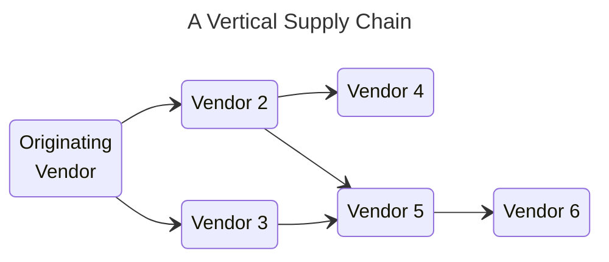
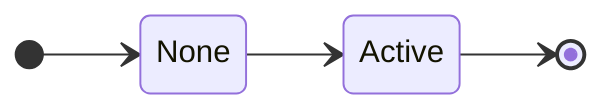
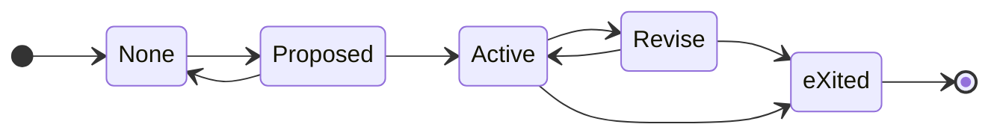
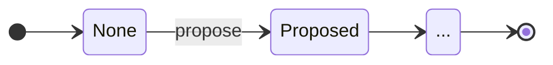
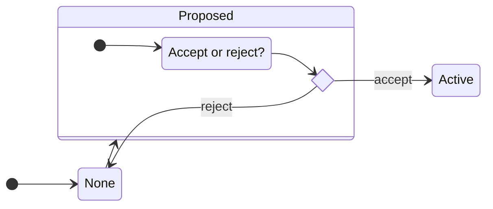
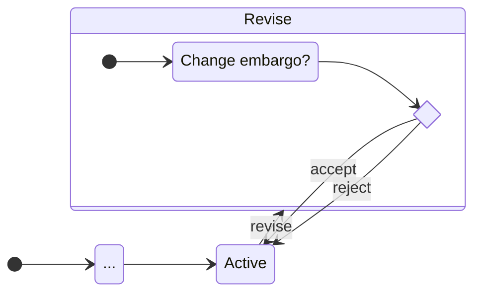
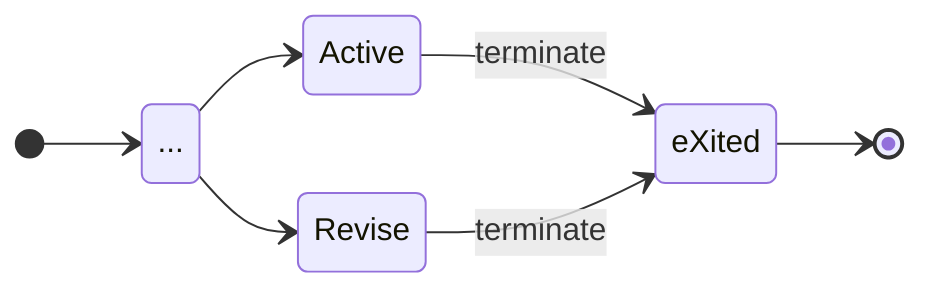
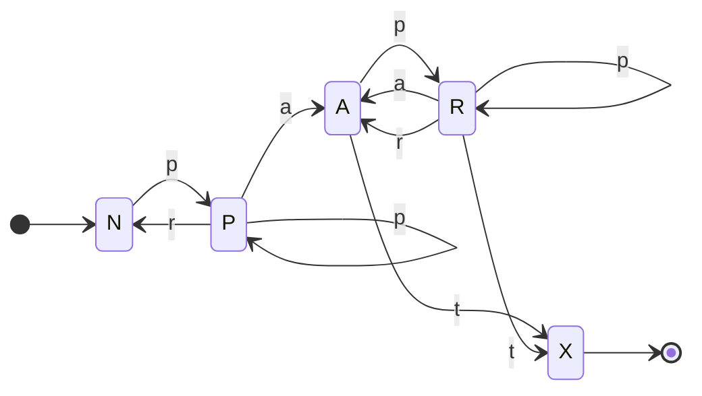

# Embargo Management Process Model

Here we describe the basic primitives necessary for the CVD Embargo Management (em/index.md) process.
<!-- start_excerpt -->
For our purposes, an embargo is an *informal* agreement among peer
CVD case Participants to refrain from publishing information about a vulnerability until some future point in time
relative to the report at hand. Once an embargo has expired, there is no further restriction on publishing information
about the vulnerability.
<!-- end_excerpt -->

!!! tip inline end "Reminder"

    Exploits are information about vulnerabilities too.

CVD case Participants must be able to propose, accept, and reject embargo timing
proposals according to their individual needs. Additionally,
Participants may want to attempt to gain agreement that enables specific
details about a vulnerability to be shared with other Participants or
made public. Such content considerations are outside the scope of this
proposal. We focus our discussion on the *when* of an embargo, not the
*what*.

Unlike the [RM](../rm/) model, in which each Participant has their own instance of the
[RM](../rm/) DFA, EM states are a global property of a CVD case. 

!!! note ""
    A CVD case SHALL NOT have more than one active embargo at a time.

Even in an MPCVD case having a [vertical supply chain](https://vuls.cert.org/confluence/display/CVD/5.4+Multiparty+CVD)&mdash;in which Vendors must wait on their upstream suppliers to produce fixes before they can take action on
their own, as in the figure below&mdash;our intent is that the embargo
period terminates when as many Vendors as possible have been given an
adequate opportunity to produce a fix.



## EM State Machine

As with our definition of the [RM](../rm/) model, we describe our
EM model using DFA notation.



### EM States

CVD cases are either subject to an active embargo or they are not. 
We begin with a simple two-state model for the embargo state:

However, because embargo management is a process of coordinating across
Participants, it will be useful to distinguish between the _None_ state
and an intermediate state in which an embargo has been proposed but not
yet accepted or rejected. We might call this the _None + Proposed_
state, but we shortened it to _Proposed_.

Similarly, we want to be able to discriminate between an _Active_
embargo state and one in which a revision has been proposed but is not
yet accepted or rejected, which we will denote as the _Active + Revise_
state, shortened to _Revise_. Finally, we wish to distinguish between
the state in which no embargo has ever been established (_None_), and
the final state after an active embargo has ended (_eXited_). Combining
these, we get the following set of EM states, which we denote as
$\mathcal{Q}^{em}$.

???+ note inline end "EM States ($\mathcal{Q}^{em}$) Defined"
    $\label{eq:em_states}
    \begin{split}
        \mathcal{Q}^{em} = \{ & \underline{N}one, \\
        & \underline{P}roposed, \\
        & \underline{A}ctive, \\
        & \underline{R}evise, \\
        & e\underline{X}ited \}
    \end{split}$

As a reminder, we use the underlined capital letters as shorthand for
EM state names later in the document. Also note that $q^{em} \in A$ is distinct from
$q^{rm} \in A$. An embargo can be _Active_, while a Report can be
_Accepted_, and these are independent states. Be sure to check which
model a state's shorthand notation is referring to.

##### Start and Final States.

???+ note inline end "EM Start and Final States Defined"
    $q^{em}_0 = None$
    
    $\mathcal{F}^{em} = \{None,~eXited\}$

The EM process starts in the _None_ state. The process ends in one of two states: If an
embargo agreement is eventually reached, the EM process ends in the _eXited_ state.
Otherwise, if no agreement is ever reached, the EM process ends in the _None_ state. Formal
definitions of each are shown in the box at right.

### EM State Transitions



The symbols of our EM DFA are the actions that cause transitions
between the states:

!!! note ""
    An embargo MAY be _proposed_.

!!! note ""
    Once proposed, it MAY be _accepted_ or _rejected_.

!!! note ""
    Once accepted, revisions MAY be _proposed_, which MAY, in turn, be
    _accepted_ or _rejected_.

!!! note ""
    Finally, accepted embargoes MUST eventually _terminate_.

A summary of the available actions is shown as $\Sigma^{em}$ below.

???+ note "EM Symbols ($\Sigma^{em}$) Defined"
    $\label{eq:em_symbols}
        \begin{split}
            \Sigma^{em} = \{
             ~\underline{p}ropose, 
             ~\underline{r}eject, 
             ~\underline{a}ccept, 
             ~\underline{t}erminate
            \}
        \end{split}$

Once again, the underlined lowercase letters will be used as shorthand
for the EM
transition names in the remainder of the document.

#### EM Transitions Defined

Now we define the possible state transitions. Figure
[\[fig:em_states_dense\]](#fig:em_states_dense){reference-type="ref"
reference="fig:em_states_dense"} summarizes the EM process DFA states and transitions.



##### Propose Embargo

Propose a new embargo when none exists:

##### Accept or Reject Embargo Proposal

Accept or reject a proposed embargo:

##### Embargo Revision

An existing embargo can also be renegotiated by proposing a new embargo.
The existing embargo remains active until it is replaced by accepting
the revision proposal.
If the newly proposed embargo is accepted, then the old one is
abandoned. On the other hand, if the newly proposed embargo is rejected,
the old one remains accepted.

##### Terminate Embargo

Existing embargoes can terminate due to timer expiration or other reasons discussed in [Early Termination](early_termination.md).
Termination can occur even if there is an open revision proposal.

#### A Regular Grammar for EM {#sec:em_grammar}

???+ note inline end "EM Transition Function ($\delta^{em}$) Defined"

    $\label{eq:em_transition_function}
        \delta^{em} = 
        \begin{cases}
            % \epsilon \to & N \\
                   N \to ~pP~|~\epsilon \\
                   P \to ~pP~|~rN~|~aA \\
                   A \to ~pR~|~tX \\
                   R \to ~pR~|~aA~|~rA~|~tX \\
                   X \to ~\epsilon \\
        \end{cases}$

Based on the actions and corresponding state transitions just described,
we define the transition function $\delta^{em}$ for the
EM process as a set of production rules for the right-linear grammar using our
single-character shorthand in the box at right.
For convenience, we repeat the resulting state machine below using our shorthand notation.

Due to the numerous loops in the DFA shown in the state machine diagram above,
the EM grammar is capable of generating arbitrarily long strings of _propose_-_propose_ and _propose_-_reject_
histories matching the regular expression `(p*r)*(pa(p*r)*(pa)?t)?`. As
an example, here is an exhaustive list of all the possible traces of
length seven or fewer:

> _pr_, _pat_, _ppr_, _ppat_, _papt_, _prpr_, _pppr_, _ppppr_, _pprpr_,
> _prppr_, _pappt_, _ppapt_, _pppat_, _papat_, _paprt_, _prpat_,
> _pppppr_, _papppt_, _prpppr_, _ppprpr_, _ppappt_, _pppapt_, _prprpr_,
> _papapt_, _pprppr_, _pappat_, _paprpt_, _prppat_, _prpapt_, _ppaprt_,
> _pprpat_, _ppapat_, _papprt_, _ppppat_, _pprprpr_, _prprppr_,
> _paprppt_, _prpprpr_, _pappprt_, _papppat_, _ppppapt_, _prpaprt_,
> _papappt_, _pappapt_, _pppappt_, _pprpppr_, _pppprpr_, _prppppr_,
> _ppprppr_, _ppapppt_, _ppaprpt_, _papprpt_, _ppapprt_, _ppappat_,
> _prpppat_, _prpapat_, _ppprpat_, _ppppppr_, _pprppat_, _papapat_,
> _paprpat_, _ppapapt_, _prprpat_, _paprprt_, _prppapt_, _pppapat_,
> _pprpapt_, _pppaprt_, _pppppat_, _prpappt_, _papaprt_, _pappppt_

However, because EM
is a human-oriented scheduling process, our experience suggests that we
should expect there to be a natural limit on CVD Participants' tolerance for churn during
embargo negotiations. Hence, we expect most paths through the
EM DFA to be on the short end of this list in practice. We offer some thoughts on a
potential reward function over EM DFA strings in [Future Work](../../future_work.md).

For example, it is often preferable for a Vendor to accept whatever
embargo the Reporter initially proposes followed closely by proposing a
revision to their preferred timeline than it is for the Vendor and
Reporter to ping-pong proposals and rejections without ever establishing
an embargo in the first place. In the worst case (i.e., where the
Reporter declines to extend their embargo), a short embargo is
preferable to none at all. This implies a preference for strings
starting with _par_ over strings starting with _ppa_ or _prpa_, among
others. We will come back to this idea in [Default Embargoes](#default-embargoes)
and in the [worked protocol example](../../formal_protocol/worked_example/#vendor-accepts-then-proposes-revision).

### EM DFA Fully Defined

Taken together, the complete DFA specification for the
EM process is shown below.

???+ note "EM DFA $(\mathcal{Q},q_0,\mathcal{F},\Sigma,\delta)^{em}$ Fully Defined"

    $$EM = 
        \begin{pmatrix}
                \begin{aligned}
                    \mathcal{Q}^{em} = & \{ N,P,A,R,X \}, \\
                    q^{em}_0 = & N, \\
                    \mathcal{F}^{em} = &\{ N,X \},  \\
                    \Sigma^{em} = &\{ p,r,a,t \}, \\
                    \delta^{em} = &
                        \begin{cases}
                           N \to ~pP~|~\epsilon \\
                           P \to ~pP~|~rN~|~aA \\
                           A \to ~pR~|~tX \\
                           R \to ~pR~|~aA~|~rA~|~tX \\
                           X \to ~\epsilon \\
                        \end{cases}
                \end{aligned}
        \end{pmatrix}$$

