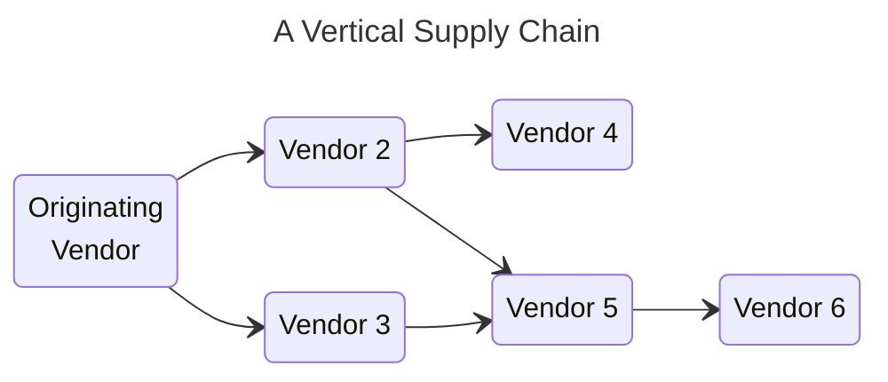

# Embargo Management Process Model



This section describes the Embargo Management (EM) process for Coordinated Vulnerability Disclosure (CVD).
<!-- start_excerpt -->
For our purposes, an embargo is an *informal* agreement among peer CVD case Participants to refrain from publishing information about a vulnerability until some future point in time relative to the report at hand.
Once an embargo has expired, there is no further restriction on publishing information about the vulnerability.
<!-- end_excerpt -->

!!! tip inline end "Reminder"

    Exploits are information about vulnerabilities too.

CVD case Participants must be able to propose, accept, and reject embargo timing proposals according to their individual needs.
Participants may also want to agree that specific details about a vulnerability can be shared with other Participants or made public.
Such content considerations are outside the scope of this documentation.
We focus on the *when* of an embargo, not the *what*.



Unlike the [Report Management (RM)](../rm/index.md) model, in which each Participant has their own RM state, EM state is a property of the CVD case as a whole.

!!! note ""
    A CVD case SHALL NOT have more than one active embargo at a time.

Some multi-party CVD (MPCVD) cases have a [vertical supply chain](https://certcc.github.io/CERT-Guide-to-CVD/howto/coordination/mpcvd/){:target="_blank"}, in which Vendors must wait for their upstream suppliers to produce fixes before they can act, as in the figure below.
Even then, the intent is that the embargo ends once as many Vendors as possible have had an adequate opportunity to produce a fix.

```mermaid
---
title: A Vertical Supply Chain
---
stateDiagram-v2
    direction LR
    v1: Originating<br/>Vendor
    v2: Vendor 2
    v3: Vendor 3
    v4: Vendor 4
    v5: Vendor 5
    v6: Vendor 6
    
    v1 --> v2
    v1 --> v3
    v2 --> v4
    v3 --> v5
    v2 --> v5
    v5 --> v6
```



## EM states

An embargo moves through five states.
The state belongs to the case as a whole, not to any one Participant.

| State | What it means |
|---|---|
| *None* | No embargo is in force, and none has ever been agreed for this case. |
| *Proposed* | An embargo has been proposed and not yet accepted or rejected. |
| *Active* | An embargo is in force. |
| *Revise* | An embargo is in force, and a change to it has been proposed but not yet accepted or rejected. |
| *eXited* | The embargo has ended. |

The underlined-capital shorthand for these states (N, P, A, R, X) is introduced in the [EM formal model](formal_model.md#em-states).
The Vultron Protocol Specification names *Revise* and *eXited* as *Revised* and *Exited*.

!!! warning "Check which model a state name belongs to"

    An embargo can be *Active* while a report is [*Accepted*](../rm/index.md#the-accepted-a-state).
    The EM and RM states are independent.

## EM state transitions

Four actions move a case between EM states: *propose*, *accept*, *reject* and *terminate*.



- Proposing an embargo when none exists moves the case to *Proposed*.
  A further proposal while one is outstanding supersedes it.
- Accepting the proposal makes the embargo *Active*.
  Rejecting it returns the case to *None*.
- Proposing a change to an active embargo moves the case to *Revise*.
  The existing embargo stays in force until a revision is accepted.
  Rejecting the revision returns the case to *Active*, with the old terms standing, not to *None*.
- An active embargo MUST eventually *terminate*, whether or not a revision is open.
  Termination moves the case to *eXited*.

The normative transitions table is [§7.2 of the Vultron Protocol Specification](../../../reference/vultron-spec/index.md#72-transitions-and-guards).

!!! note "EM begins when the case is created"

    There is no EM phase before a case exists.
    A Reporter proposes terms by attaching them to the report they submit, and those terms are evaluated once the case is created.
    If nobody proposes anything, an embargo-eligible case still starts under a short protocol-default embargo.
    See [Default Embargoes](defaults.md) and [ADR-0096: A Protocol Default Embargo Replaces the Pre-Case Phase](../../../adr/0096-protocol-default-embargo.md).

## The case embargo and each Participant's consent

The EM state says whether the *case* has an embargo.
Whether each *Participant* has agreed to its current terms is a separate question, tracked per Participant by [Participant Embargo Consent (PEC)](../../behavior_logic/use-cases/embargo-lifecycle.md#which-messages-move-consent).
A case can be *Active* while a Participant who joined later, or who declined, is not bound.

The two are linked at two points:

- when the case enters *Revise*, every Participant who had agreed to the old terms must agree again;
- when the case enters *eXited*, every Participant's consent resets, because there is no longer an embargo to agree to.

[Embargo Lifecycle](../../behavior_logic/use-cases/embargo-lifecycle.md) explains how the case and Participant scopes interact.
The normative PEC states and transitions are [§9 of the Vultron Protocol Specification](../../../reference/vultron-spec/index.md#9-participant-embargo-consent-pec-state-machine-n).

## In this section

- [Embargo Principles](principles.md) — what an embargo is for, and the norms Participants follow while one is in force.
- [Negotiating Embargoes](negotiating.md) — when an embargo can be proposed, accepted or rejected, and how long it can reasonably last.
- [Default Embargoes](defaults.md) — how published defaults and the protocol default start an embargo without a negotiation.
- [Adding Participants to an Embargoed Case](working_with_others.md) — adding Participants to a case under embargo.
- [Early Termination](early_termination.md) — the events that end an embargo before its agreed time.
- [Case Splitting and Merging](split_merge.md) — what happens to embargoes when cases are split or merged.
- [EM Formal Model](formal_model.md) — the EM process as a [deterministic finite automaton](../../../reference/formal_protocol/index.md), with its grammar and every possible history.

## Doing it on the wire

- [How to Establish an Embargo](../../../howto/activitypub/activities/establish_embargo.md) — propose, accept, reject and activate an embargo.
- [How to Revise or Terminate an Embargo](../../../howto/activitypub/activities/manage_embargo.md) — change the terms of an active embargo or end it.
