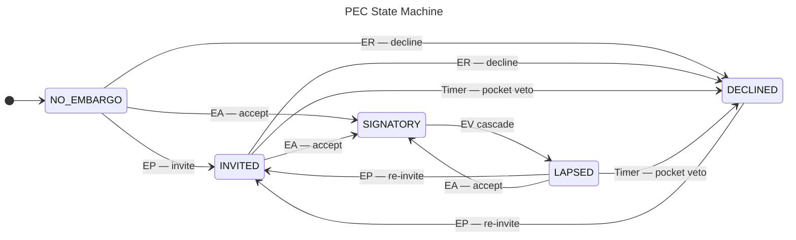

# Participant Embargo Consent



*Normative requirements: `specs/message-semantics-mapping.yaml` MSM-07.
Implementation design notes: `notes/participant-embargo-consent.md`.*

This page describes the **Participant Embargo Consent (PEC)** state machine:
the per-participant record tracking each actor's individual relationship to
the current active embargo. PEC complements the shared
[Embargo Management (EM) state machine](index.md), which tracks the
case-level embargo lifecycle.

!!! note "PEC is participant-local; EM is case-global"

    A case has exactly one EM state at any moment. Every participant in
    that case has their own PEC state, recording their individual
    position relative to the current embargo terms.

The `embargo_adherence` property on a participant record is derived from
PEC: it is `True` if and only if the participant's consent state is
`SIGNATORY`.

---

## The Five PEC States

| State | Meaning |
|---|---|
| `NO_EMBARGO` | No embargo in scope for this participant (initial state) |
| `INVITED` | Received an embargo invitation; awaiting response |
| `SIGNATORY` | Accepted the current embargo terms |
| `LAPSED` | Was a signatory; embargo terms changed; prior consent no longer applies |
| `DECLINED` | Explicitly declined, or timed out without responding |

!!! note "`NO_EMBARGO` means absence, not pre-consent"

    `NO_EMBARGO` means no embargo is currently in scope for this
    participant — not "has not yet responded to an invitation."
    Acceptance (`EA`) and decline (`ER`) are valid directly from
    `NO_EMBARGO`, because some participants consent without a formal
    invitation — for example, the case owner who initialises the
    default embargo at case creation.

> **`ET` reset cascade (not shown above for clarity):** When EM enters
> `EXITED` via an `ET` activity, the CaseActor resets every participant's
> PEC state to `NO_EMBARGO` regardless of their current state. See the
> [full transition table](#full-transition-table) below.

---

## CaseActor Sets PEC — Participants Do Not Self-Report

This is the key distinction between PEC and the other per-participant
state machines:

| State machine | Who sets it |
|---|---|
| RM state | Self-reported by the participant |
| VF/D state | Self-reported by the vendor or deployer |
| **PEC state** | **Set by the CaseActor, based on observed behaviour** |

The participant never declares "I am now `SIGNATORY`." Instead, the
CaseActor observes an inbound `Accept(Invite(EmbargoEvent))` activity
and records `SIGNATORY` for the sending actor. A `Reject(...)` produces
`DECLINED`. A deadline lapse produces `DECLINED` with a CaseActor-authored
ledger entry that distinguishes it from an explicit refusal.

!!! note "No dedicated PEC wire messages (MSM-07-001)"

    PEC transitions have no dedicated wire messages and no formal
    shorthands in the 28-shorthand protocol message set. All PEC
    transitions are side-effects of EM wire activities, internal
    cascades, or timer events.

---

## How EM Wire Activities Drive PEC

### EP — Embargo Proposal

An `EP` message (`Invite(EmbargoEvent)[context=VulnerabilityCase]`)
invites one or more participants to accept an embargo.

!!! note ""
    On receiving an `EP`, the CaseActor MUST apply the `INVITE` PEC trigger
    to each named participant, advancing their consent state from
    `NO_EMBARGO`, `DECLINED`, or `LAPSED` to `INVITED`. (MSM-07-002)

Participants already in `SIGNATORY` are unaffected by `EP`.

### EA — Embargo Accept

An `EA` message (`Accept(Invite(EmbargoEvent))`) has two effects that
MUST both be applied:

!!! note ""
    1. **Case-owner path**: if the accepting actor is the case owner,
       the shared EM state advances from `PROPOSED` to `ACTIVE` (or
       from `REVISE` to `ACTIVE` for a revision accept).
    2. **All accepting actors**: the CaseActor MUST apply the `ACCEPT`
       PEC trigger, advancing the actor's consent state from `INVITED`,
       `NO_EMBARGO`, or `LAPSED` to `SIGNATORY`. (MSM-07-003)

The same wire activity simultaneously drives the case-level EM machine
(for the case owner) and the participant-level PEC machine (for the
accepting actor). Both machines MUST be updated.

### ER — Embargo Reject

An `ER` message (`Reject(Invite(EmbargoEvent))`) also has two effects:

!!! note ""
    1. **Case-owner path**: if the rejecting actor is the case owner,
       the shared EM state advances from `PROPOSED` to `NONE`.
    2. **All rejecting actors**: the CaseActor MUST apply the `DECLINE`
       PEC trigger, advancing the actor's consent state from `INVITED`,
       `NO_EMBARGO`, or `LAPSED` to `DECLINED`. (MSM-07-004)

### EV — Embargo Revision Proposed

An `EV` message signals that the current active embargo is under
revision, transitioning shared EM from `ACTIVE` to `REVISE`.

!!! note ""
    When EM enters `REVISE`, the CaseActor MUST automatically apply the
    `REVISE` PEC trigger to every participant currently in `SIGNATORY`,
    advancing them to `LAPSED`. No separate wire message is emitted for
    these PEC transitions; the cascade is an internal side-effect of the
    shared EM state change. (MSM-07-005)

`LAPSED` means "I accepted the prior embargo terms, but those terms have
changed and my prior consent no longer applies."

!!! tip "Revisions suspend all signatories simultaneously"

    Because the `EV` cascade is atomic with the EM transition, no
    participant remains `SIGNATORY` while EM is in `REVISE`. All prior
    signatories must re-accept or be re-invited before any can return
    to `SIGNATORY`.

### ET — Embargo Termination

An `ET` message terminates the active embargo, advancing shared EM to
`EXITED`.

!!! note ""
    When EM enters `EXITED`, the CaseActor MUST automatically apply the
    `RESET` PEC trigger to every participant, advancing all consent
    states to `NO_EMBARGO`. No separate wire message is emitted; the
    cascade is an internal side-effect of embargo termination. (MSM-07-006)

---

## Timer-Based Transitions: The Pocket Veto

If an invited participant does not respond within the invitation window,
inaction is recorded as rejection.

!!! note ""
    The `INVITED → DECLINED` and `LAPSED → DECLINED` transitions MUST be
    enforced lazily by the CaseActor with no outbound wire message emitted
    for the PEC state change itself. The CaseActor MUST author a
    case-ledger entry recording the lapse so the transition is visible in
    the canonical ledger. (MSM-07-007)

The invitation window has two forms:

| Form | Source | Precedence |
|---|---|---|
| **Explicit** | `Invite.end_time` on the invitation activity | Higher — overrides the policy default |
| **Implicit** | Configurable CaseActor policy (default 7 days; minimum floor 72 hours) | Lower — applies when no explicit deadline is present |

When `Invite.end_time` is present it is authoritative; the policy default
applies only for invitations that omit it.

!!! warning "`LAPSED` is not the timer destination"

    Timer transitions end at `DECLINED`, not `LAPSED`. `LAPSED` is
    reached only from `SIGNATORY` via the `EV` cascade — it means "terms
    changed, prior consent no longer applies." Do not conflate a timed-out
    invitee with a lapsed-terms signatory; the two reach `DECLINED` for
    different reasons, and the canonical ledger distinguishes them.

### Late acceptance is never refused

A participant who accepts after the deadline has signalled willingness to
coordinate. A missed deadline MUST NOT result in their acceptance being
refused.

!!! note ""
    If a late `Accept` matches the current active embargo, the CaseActor
    MUST honour it and advance PEC to `SIGNATORY`. If the accepted embargo
    is stale (terms have since been revised), the CaseActor MUST send a
    fresh invitation carrying the current embargo terms instead.
    (EMB-17-002, EMB-17-003)

---

## Trigger Source Taxonomy

Each PEC transition is driven by one of three sources:

| Source | Description | Examples |
|---|---|---|
| **Wire** | An inbound EM wire activity observed by the CaseActor | EP → `INVITED`; EA → `SIGNATORY`; ER → `DECLINED` |
| **Cascade** | Automatic side-effect of a shared EM state change | EV → `LAPSED` for all signatories; ET → `NO_EMBARGO` for all |
| **Timer** | Pocket-veto deadline enforced lazily by the CaseActor | `INVITED → DECLINED`; `LAPSED → DECLINED` after deadline |

Wire transitions correspond to explicit participant choices. Cascade
transitions are automatic and require no participant action. Timer
transitions result from inaction.

---

## Full Transition Table

| From | Trigger | To | Source | Spec |
|---|---|---|---|---|
| `NO_EMBARGO` | EP received | `INVITED` | Wire | MSM-07-002 |
| `NO_EMBARGO` | EA received | `SIGNATORY` | Wire | MSM-07-003 |
| `NO_EMBARGO` | ER received | `DECLINED` | Wire | MSM-07-004 |
| `INVITED` | EA received | `SIGNATORY` | Wire | MSM-07-003 |
| `INVITED` | ER received | `DECLINED` | Wire | MSM-07-004 |
| `INVITED` | Deadline passed | `DECLINED` | Timer | MSM-07-007 |
| `SIGNATORY` | EM enters `REVISE` (EV) | `LAPSED` | Cascade | MSM-07-005 |
| `LAPSED` | EP received | `INVITED` | Wire | MSM-07-002 |
| `LAPSED` | EA received | `SIGNATORY` | Wire | MSM-07-003 |
| `LAPSED` | Deadline passed | `DECLINED` | Timer | MSM-07-007 |
| `DECLINED` | EP received | `INVITED` | Wire | MSM-07-002 |
| Any | EM enters `EXITED` (ET) | `NO_EMBARGO` | Cascade | MSM-07-006 |

---

## Embargo Meta-Protocol Delivery

Embargo coordination messages MUST reach participants regardless of their
PEC state, to avoid a deadlock where a `DECLINED` or `LAPSED` participant
can never receive the information needed to re-engage.

!!! note ""
    The following message types MUST be delivered to all case participants,
    including those in `DECLINED` or `LAPSED` state:

    - `Invite(EmbargoEvent)` — embargo invitation (EP)
    - `Offer(EmbargoEvent)` — embargo proposal
    - `Announce(EmbargoEvent)` — embargo status notification
    - `Accept`, `Reject`, and `TentativeReject` in response to the above

Only restricted case content (vulnerability details, fix status, technical
notes with sensitive information) is gated on `embargo_adherence = True`.

---

## Further Reading

- [Embargo Management](index.md) — the shared EM state machine
- [Negotiating Embargoes](negotiating.md) — how EP, EA, and ER messages
  are exchanged
- [Adding Participants](working_with_others.md) — PEC initialisation when
  a new participant joins an active embargo
- [Early Termination](early_termination.md) — how ET drives the PEC RESET
  cascade
