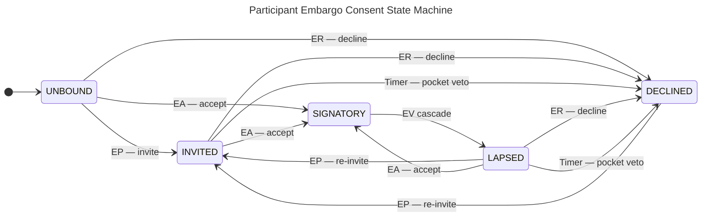

```mermaid
---
title: Participant Embargo Consent State Machine
---
stateDiagram-v2
    direction LR
    [*] --> UNBOUND
    UNBOUND --> INVITED: EP — invite
    UNBOUND --> SIGNATORY: EA — accept
    UNBOUND --> DECLINED: ER — decline
    INVITED --> SIGNATORY: EA — accept
    INVITED --> DECLINED: ER — decline
    INVITED --> DECLINED: Timer — pocket veto
    SIGNATORY --> LAPSED: EV cascade
    LAPSED --> INVITED: EP — re-invite
    LAPSED --> SIGNATORY: EA — accept
    LAPSED --> DECLINED: ER — decline
    LAPSED --> DECLINED: Timer — pocket veto
    DECLINED --> INVITED: EP — re-invite
```
