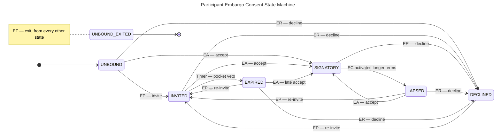

```mermaid
---
title: Participant Embargo Consent State Machine
---
stateDiagram-v2
    direction LR
    [*] --> UNBOUND
    UNBOUND --> INVITED: EP — invite
    UNBOUND --> SIGNATORY: EA — accept
    UNBOUND --> DECLINED: ER — decline
    INVITED --> SIGNATORY: EA — accept
    INVITED --> DECLINED: ER — decline
    INVITED --> EXPIRED: Timer — pocket veto
    SIGNATORY --> LAPSED: EC activates longer terms
    SIGNATORY --> DECLINED: ER — decline
    LAPSED --> INVITED: EP — re-invite
    LAPSED --> SIGNATORY: EA — accept
    LAPSED --> DECLINED: ER — decline
    DECLINED --> INVITED: EP — re-invite
    EXPIRED --> INVITED: EP — re-invite
    EXPIRED --> SIGNATORY: EA — late accept
    EXPIRED --> DECLINED: ER — decline
    UNBOUND_EXITED --> [*]
    note left of UNBOUND_EXITED: ET — exit, from every other state
```

Every state except `UNBOUND_EXITED` also moves to `UNBOUND_EXITED` by the exit trigger when the embargo enters `EXITED` (ET); those edges are omitted for legibility.
