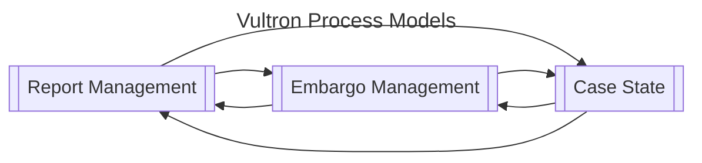
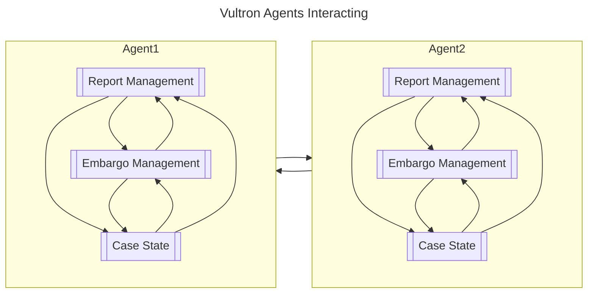

# Vultron Process Models

The Vultron Protocol defines three main processes in terms of deterministic finite automata (DFAs):

A CVD case is coordinated by multiple agents (Reporters, Vendors, Coordinators, etc.),
each running these processes in parallel and interacting with each other.

## [Report Management process](rm/index.md)





[Read More...](rm/index.md)

## [Embargo Management process](em/index.md)





[Read More...](em/index.md)

## [Case State process](cs/index.md)





[Read More...](cs/index.md)