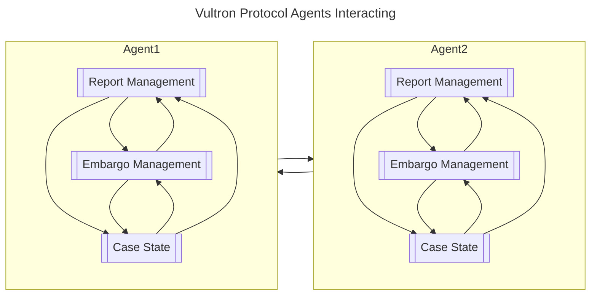

# Vultron Process Models

!!! info inline end "Vultron Process Models"

    ```mermaid
    ---
    title: Each Process Interacts With the Other Two
    ---
    flowchart TD
        RM[[Report Management]]
        EM[[Embargo Management]]
        CS[[Case State]]
        RM --> EM
        RM --> CS
        EM --> RM
        EM --> CS
        CS --> EM
        CS --> RM
    ```

The Vultron Protocol describes a Coordinated Vulnerability Disclosure (CVD) case with three process models:

- [Report Management (RM)](rm/index.md) tracks each Participant's handling of the report.
- [Embargo Management (EM)](em/index.md) tracks whether the case has an agreement to keep the vulnerability private for a time.
- [Case State (CS)](cs/index.md) tracks what has happened to the vulnerability itself, such as whether a fix is ready or the public is aware.

Each model is a [deterministic finite automaton (DFA)](../../reference/formal_protocol/index.md): a state machine with a fixed set of states in which every action leads from one state to exactly one next state.
The inset at right shows that each process interacts with the other two in the context of a CVD case.

A CVD case is coordinated by multiple agents, such as Reporters, Vendors, and Coordinators, each running these processes in parallel and interacting with each other.
The diagram below shows two such agents, each running all three processes and exchanging messages with the other.


```mermaid
---
title: Vultron Protocol Agents Interacting
---
flowchart LR
    subgraph Agent2
        RM2[[Report Management]]
        EM2[[Embargo Management]]
        CS2[[Case State]]
    end
    subgraph Agent1
        RM1[[Report Management]]
        EM1[[Embargo Management]]
        CS1[[Case State]]
    end
    RM1 --> EM1
    RM1 --> CS1
    EM1 --> RM1
    EM1 --> CS1
    CS1 --> EM1
    CS1 --> RM1
    RM2 --> EM2
    RM2 --> CS2
    EM2 --> RM2
    EM2 --> CS2
    CS2 --> EM2
    CS2 --> RM2
    Agent1 --> Agent2
    Agent2 --> Agent1
```

## [Report Management process](rm/index.md)

The RM process covers how each Participant receives, validates, prioritizes, works on, and closes a report.
Each Participant has its own RM state, and only that Participant changes it.
Anyone familiar with IT service management workflows, such as incident or problem management, will recognize its shape.
The diagram below shows the seven RM states and the actions that move a report between them.



[Read more about Report Management](rm/index.md)

## [Embargo Management process](em/index.md)

The EM process covers how the Participants propose, agree to, revise, and end an embargo.
There is one EM state per case, shared by all its Participants.
An embargo-eligible case begins with an *Active* embargo when the case is created.
The diagram below shows the EM states and the actions that move the case between them.



[Read more about Embargo Management](em/index.md)

## [Case State process](cs/index.md)

The CS model tracks six facts about a vulnerability: whether the Vendor is aware of it, whether a fix is ready, whether the fix is deployed, whether the public is aware, whether an exploit is public, and whether attacks have been observed.
The first three are tracked per Vendor, while the last three are facts about the case as a whole.
The diagram below shows the two parts side by side.



[Read more about the Case State model](cs/index.md)

## How the models fit together

[Model Interactions](model_interactions/index.md) describes the constraints the three models place on each other, such as when an embargo may be negotiated relative to a report's validation.
The [formal protocol](../../reference/formal_protocol/index.md) builds on all three models and their interactions to define the messages Participants exchange.
The [Vultron Protocol Specification](../../reference/vultron-spec/index.md) is the normative source for each model's states and transitions.
