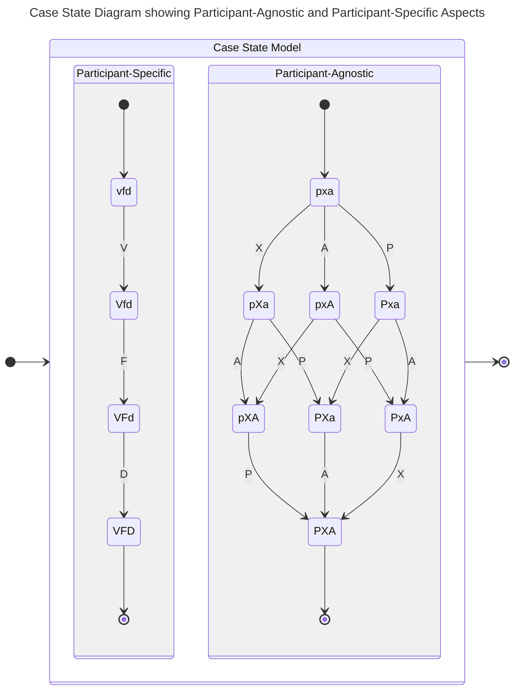

```mermaid
---
title: Case State Diagram showing Participant-Agnostic and Participant-Specific Aspects
---
stateDiagram-v2
    direction LR
    CS: Case State Model
    state CS {
        ps: Participant-Specific
        state ps {
            [*] --> vfd
            vfd --> Vfd : V
            Vfd --> VFd : F
            VFd --> VFD : D
            VFD --> [*]
        }
        g: Participant-Agnostic 
        state g {
            [*] --> pxa
        
            pxa --> Pxa : P
            pxa --> pXa : X
            pxa --> pxA : A
            
            pXa --> PXa : P
            pXa --> pXA : A
            
            pxA --> PxA : P
            pxA --> pXA : X
        
            Pxa --> PxA : A
            Pxa --> PXa : X
            
            pXA --> PXA : P
            PXa --> PXA : A
            PxA --> PXA : X
            PXA --> [*]
        }
    }
    [*] --> CS
    CS --> [*]
```
