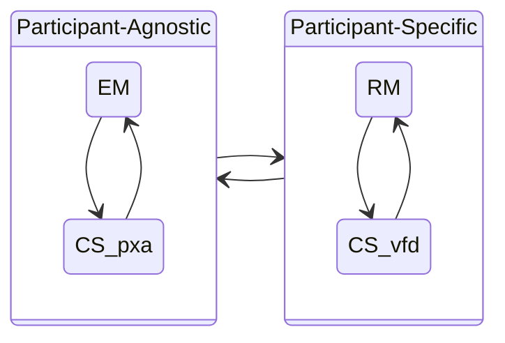

# Model Interactions {#ch:interactions}

Here we reflect on the interactions between the [RM](../rm/), [EM](../em/index.md), and [CS](../cs/index.md) models within the
overall MPCVD process.

## Participant-Agnostic vs Participant-Specific Aspects

!!! tip inline end "This sounds like SSVC"

    In [SSVC](https://github.com/CERTCC/SSVC), we distinguish between stakeholder-specific and
    stakeholder-agnostic decision points when describing vulnerability response decisions.
    Here, we carry a similar distinction into the CVD process.
    Some facts about a case are participant-specific, while others are global to the case, or participant-agnostic.

Some aspects of the MPCVD process are Participant-agnostic (i.e., they represent a global state of the case),
while others are specific to a Participant.
Specifically, the [RM](../rm/) process is unique to each Participant, while the
[EM](../em/index.md) process is global to all Participants in a case.
The [CS](../cs/index.md) process is a hybrid: some aspects are Participant-agnostic, while others are
Participant-specific, which we will discuss in more detail below.
Interactions between all these processes affect the overall MPCVD process for a case. 
The following diagram illustrates this distinction.

### Global vs. Participant-Specific Aspects of the CS Model.

The [CS model](../cs/index.md) encompasses both Participant-specific and Participant-agnostic aspects of a
CVD case. In particular, the Vendor fix path substates&mdash;Vendor unaware (_vfd_),
Vendor aware (_Vfd_), fix ready (_VFd_), and fix deployed (_VFD_)&mdash;are
specific to each Vendor Participant in a case. On the other hand, the
remaining substates represent Participant-agnostic facts about the case
status&mdash;public awareness (_p,P_), exploit public (_x,X_), and attacks
observed (_a,A_). This distinction in perspectives will become
important in the [Formal Protocol](../../formal_protocol/) definition.



