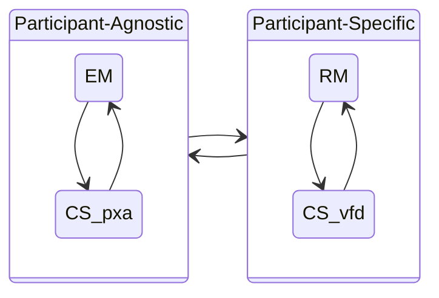

# Model Interactions



Here we reflect on the interactions between the [RM](../rm/index.md), [EM](../em/index.md), and [CS](../cs/index.md) models within the
overall Vultron process.

## Participant-Agnostic vs Participant-Specific Aspects

!!! tip inline end "This sounds like SSVC"

    In [SSVC](https://github.com/CERTCC/SSVC), we distinguish between stakeholder-specific and
    stakeholder-agnostic decision points when describing vulnerability response decisions.
    Here, we carry a similar distinction into the CVD process.
    Some facts about a case are participant-specific, while others are global to the case, or participant-agnostic.

Some aspects of the Vultron process are Participant-agnostic (i.e., they represent a global state of the case),
while others are specific to a Participant.
Specifically, the [RM](../rm/index.md) process is unique to each Participant, while the
[EM](../em/index.md) process is global to all Participants in a case.
The [CS](../cs/index.md) process is a hybrid: some aspects are Participant-agnostic, while others are
Participant-specific, which we will discuss in more detail below.

Interactions between all these processes affect the overall MPCVD process for a case.
The following diagram illustrates this distinction.

### Global vs. Participant-Specific Aspects of the CS Model

The [CS model](../cs/index.md) encompasses both Participant-specific and Participant-agnostic aspects of a
CVD case. In particular, the Vendor fix path substates&mdash;Vendor unaware (*vfd*),
Vendor aware (*Vfd*), fix ready (*VFd*), and fix deployed (*VFD*)&mdash;are
specific to each Vendor Participant in a case. On the other hand, the
remaining substates represent Participant-agnostic facts about the case
status&mdash;public awareness (*p,P*), exploit public (*x,X*), and attacks
observed (*a,A*). This distinction in perspectives will become
important in the [Formal Protocol](../../formal_protocol/index.md) definition.



## Summary

!!! note "Participant-Agnostic Aspects"

    Participant-agnostic aspects of the MPCVD process are those that represent facts about the world with respect to a 
    case.

!!! example "Participant-Agnostic Examples"

    - The [Embargo Management](../em/index.md) process is global to all Participants in a case
    - As is the Public State portion of the [Case State](../cs/index.md) process

!!! note "Participant-Specific Aspects"

    Participant-specific aspects of the MPCVD process are those that represent facts about a Participant's
    internal state with respect to a case.

!!! example "Participant-Specific Examples"

    - The [Report Management](../rm/index.md) process is unique to each Participant.
    - So is the Vendor Fix Path portion of the [Case State](../cs/index.md) process.
