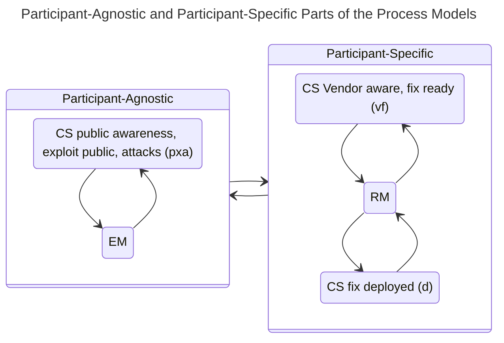

# Model Interactions

The three Vultron process models constrain each other.
Those models are the [Report Management (RM)](../rm/index.md), [Embargo Management (EM)](../em/index.md), and [Case State (CS)](../cs/index.md) models.
This section describes those constraints.
Read the three model pages first, because the constraints are stated in terms of their states and transitions.

## Which parts belong to whom

The models differ in whose state they describe:

- The RM process is specific to each Participant, and each Participant has its own RM state.
- The EM process is global to the case, and all Participants share one EM state.
- The CS model is a hybrid.
  Its Vendor fix path (Vendor aware, fix ready, fix deployed) is tracked per Vendor, while public awareness, exploit publication, and attacks observed are facts about the case as a whole.

The diagram below groups the models by that distinction.
The arrows show that the Participant-specific and the Participant-agnostic parts influence each other.
Each CS box is labeled with the [case state](../cs/cs_model.md) letters it holds.

```mermaid
---
title: Participant-Agnostic and Participant-Specific Parts of the Process Models
---
stateDiagram-v2
    direction LR
    PA: Participant-Agnostic
    CS_pxa: CS public awareness, exploit public, attacks (pxa)
    CS_vf: CS Vendor aware, fix ready (vf)
    CS_d: CS fix deployed (d)
    state PA {
        EM
        CS_pxa
        EM --> CS_pxa
        CS_pxa --> EM
    }
    PS: Participant-Specific
    state PS {
        RM
        CS_vf
        CS_d
        RM --> CS_vf
        RM --> CS_d
        CS_vf --> RM
        CS_d --> RM
    }
    PA --> PS
    PS --> PA
```

This split matters most when one Participant's action meets a shared state.
For example, one Participant closing their report does not end the embargo that every Participant shares.

## Pages in this section

- [Interactions Between the RM and EM Models](rm_em.md) covers when embargoes are negotiated relative to report validation and prioritization, and what report closure means while an embargo is active.
- [CVD Case State Interactions with the RM and EM Process Models](rm_em_cs.md) covers how each CS event, such as Vendor notification, fix readiness, or public awareness, constrains the RM and EM processes.
  It also details which parts of the CS model are global to a case.

The [formal protocol](../../../reference/formal_protocol/index.md) combines all three models into one protocol definition and builds on these interactions.
