# Interactions Between the RM and EM Models



This page lists the constraints on how the [Report Management (RM)](../rm/index.md) and [Embargo Management (EM)](../em/index.md) processes interact.
The RM process is specific to each Participant, while the EM process is global to the case, so most constraints describe which RM states a Participant should be in when it takes part in an EM transition.
Formulas on this page use $q^{rm}$ for a Participant's RM state and $q^{em}$ for the case's EM state, with the single-letter state abbreviations from each model.
For how an embargo runs from start to finish, see the [Embargo Lifecycle](../../behavior_logic/use-cases/embargo-lifecycle.md) explanation.

## Start Embargo Negotiations As Early as Possible

A Sender often wants to know the embargo terms *before* handing over a report.
The protocol serves that need, but not by running the EM process ahead of the report.
The EM process is *per case*, so before a case exists there is no EM state machine for a transition to occur in.

Two mechanisms give the Sender what they need instead:

1. **Read the Recipient's published default.**
   A Report Recipient's published default embargo period is a [standing proposal](../em/defaults.md#embargoes-are-active-at-case-creation).
   A Sender can know the terms in advance by reading it, with no exchange at all.
   Where the Recipient has published nothing, the short [protocol default](../em/defaults.md#no-defaults-no-proposals-the-protocol-default) applies, so the Sender still knows the floor.

2. **State terms with the report.**
   A Sender proposes its own terms by including a proposed embargo with the report submission.
   Where the two differ, the [shortest proposal wins](../em/defaults.md#rationale-for-accepting-the-shortest-proposed-embargo) and the longer becomes a proposed revision, so agreement is reached at case creation rather than negotiated beforehand.

!!! note ""

    The [EM](../em/index.md) process SHALL NOT begin before a case exists.
    A Sender that wishes to fix terms before sharing a report SHALL either rely on the Recipient's published default embargo period or include a proposed embargo with the report submission.

!!! info "This Guidance Changed"

    Earlier versions of this page stated that the EM process MAY begin, with the initial _propose_ transition $q^{em} \in N \xrightarrow{p} P$, before the report was sent to a potential Participant ($q^{rm} \in S$).
    [ADR-0096: A Protocol Default Embargo Replaces the Pre-Case Phase](../../../adr/0096-protocol-default-embargo.md) withdrew that.

    The **motivation** was sound and is preserved above: a Participant may well wish to ensure acceptable embargo terms before sharing a report with a potential recipient.
    The **mechanism** was not.
    EM is a global per-case state machine, so a $N \xrightarrow{p} P$ transition before any case exists names a machine instance that cannot exist.
    The two mechanisms above deliver the same assurance without a pre-case phase.

!!! note ""

    The [EM](../em/index.md) process SHALL begin when a recipient reaches RM _Received_ ($q^{rm} \in R$), because that is when the case exists.
    For an embargo-eligible case this is not merely a SHOULD: an embargo is established at case creation, from the Recipient's published default, the Sender's proposal, or the [protocol default](../em/defaults.md#no-defaults-no-proposals-the-protocol-default).

The diagram below shows the EM process beginning when the case is created.

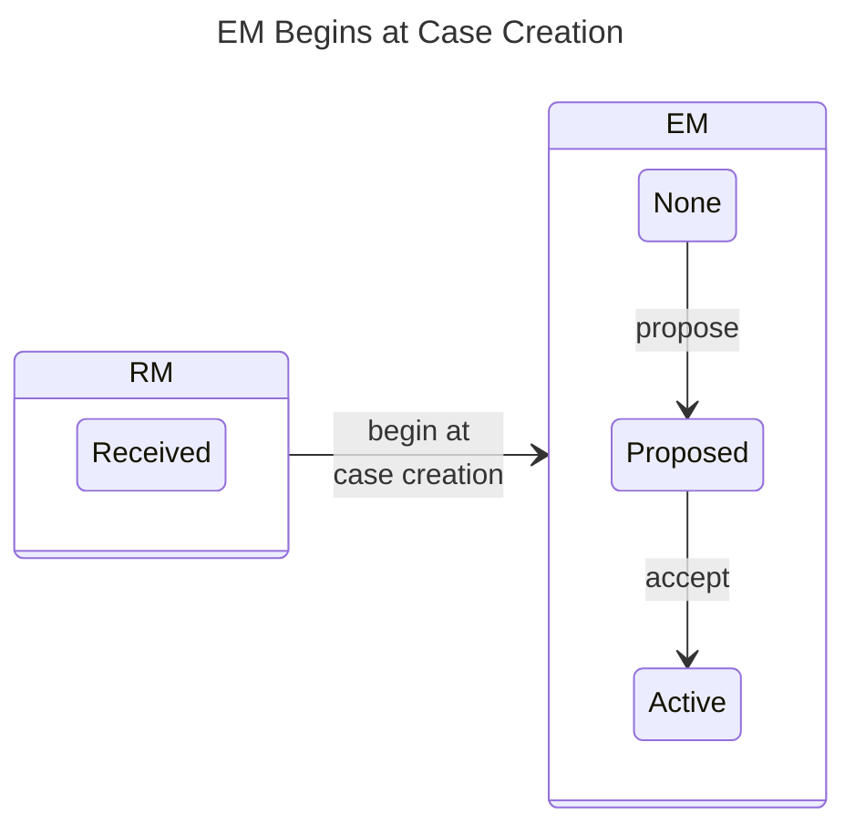
```mermaid
---
title: EM Begins at Case Creation
---
stateDiagram-v2
    direction LR
    state RM {
        Received
    }
    state EM {
        None --> Proposed : propose
        Proposed --> Active : accept
    }
    RM --> EM : begin at<br/>case creation
```

The *propose* and *accept* transitions above are applied atomically at case creation, and the intermediate *Proposed* state is never externally observable ([EP-04-002](../em/defaults.md#why-active-and-not-proposed)).

## Negotiate Embargoes for Active Reports

Because an embargo-eligible case already starts with an *Active* embargo, later proposals are revisions ($q^{em} \in A \xrightarrow{p} R$).
A case still at EM *None* after creation is one that was not embargo-eligible, and no embargo may be proposed for it while it stays that way (VP-06-001).
A proposal from *None* ($q^{em} \in N \xrightarrow{p} P$) would need a case at *None* to become embargo-eligible after creation, and nothing in the protocol does that today ([ADR-0096](../../../adr/0096-protocol-default-embargo.md)).
The constraints below apply to either kind of proposal, and the diagrams show the *None* to *Proposed* step.
Every rule on this page that mentions EM *Proposed* governs only that later step: the case-creation traversal never rests in *Proposed*, so no Participant can observe it there or act on it (EP-04-002).

!!! note ""

    A Participant MAY propose embargo terms in any of the active RM states ($q^{rm} \in \{ R,V,A \}$).

The first diagram shows the active RM states, from which proposing is allowed.

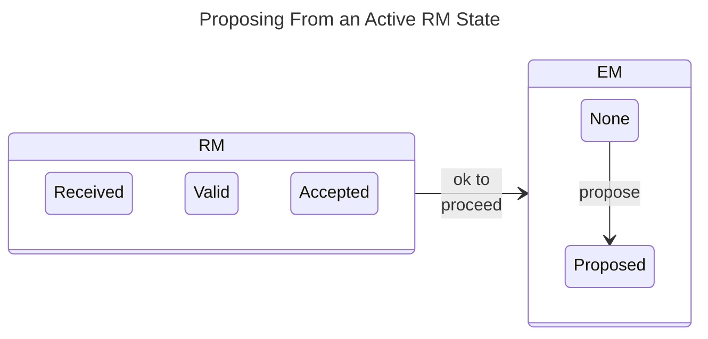
```mermaid
---
title: Proposing From an Active RM State
---
stateDiagram-v2
    direction LR
    state RM {
        Received
        Valid
        Accepted
    }
    state EM {
        None --> Proposed : propose
    }
    RM --> EM : ok to<br/>proceed
```

!!! note ""

    A Participant SHOULD NOT propose embargo terms from an inactive RM state ($q^{rm} \in \{ I,D,C \}$).

The second diagram shows the inactive RM states, from which proposing should be avoided.

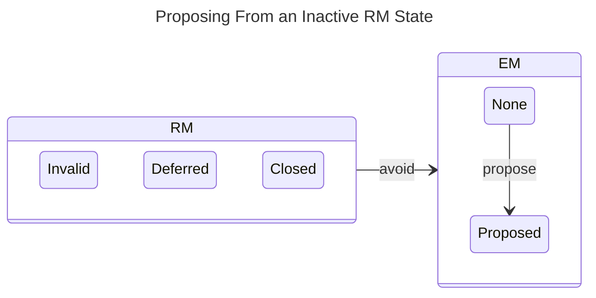
```mermaid
---
title: Proposing From an Inactive RM State
---
stateDiagram-v2
    direction LR
    state RM {
        Invalid
        Deferred
        Closed
    }
    state EM {
        None --> Proposed : propose
    }
    RM --> EM : avoid
```

The active and inactive sets are defined in the [RM state subsets](../rm/formal_model.md#rm-state-subsets).

## Negotiate Embargoes Through Validation and Prioritization

!!! note ""

    Embargo Management MAY run in parallel to validation ($q^{rm} \in \{R,I\} \xrightarrow{\{v,i\}} \{V,I\}$) and prioritization ($q^{rm} \in V \xrightarrow{\{a,d\}} \{A,D\}$) activities.

## Renegotiate Embargoes While Reports Are Valid Yet Unclosed

!!! note ""

    EM revision proposals ($q^{em} \in A \xrightarrow{p} R$) and acceptance or rejection of those proposals (${q^{em} \in R \xrightarrow{\{a,r\}} A}$) MAY occur during any of the [valid yet unclosed](../rm/formal_model.md#rm-state-subsets) RM states (${q^{rm} \in \{ V,A,D \} }$).

The diagram below shows the revision cycle running while the report is valid yet unclosed.
Both accepting and rejecting a revision return the case to *Active*: rejection keeps the prior terms in force rather than ending the embargo.

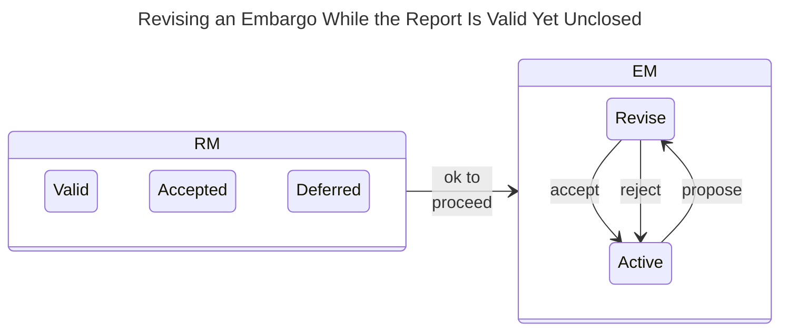
```mermaid
---
title: Revising an Embargo While the Report Is Valid Yet Unclosed
---
stateDiagram-v2
    direction LR
    state RM {
        Valid
        Accepted
        Deferred
    }
    state EM {
        Revise --> Active : accept
        Revise --> Active : reject
        Active --> Revise : propose
    }
    RM --> EM : ok to<br/>proceed
```

## Avoid Embargoes for Invalid Reports

!!! note ""

    A Participant in RM _Invalid_ ($q^{rm} \in I$) SHOULD NOT propose embargo terms.

The diagram below shows the proposal to avoid.

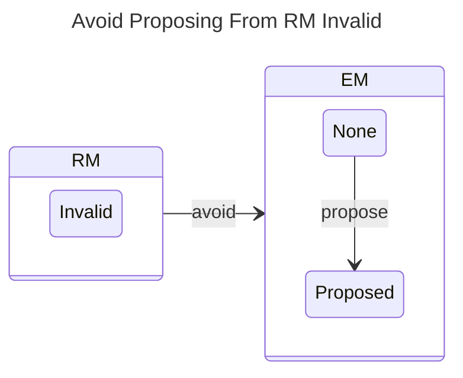
```mermaid
---
title: Avoid Proposing From RM Invalid
---
stateDiagram-v2
    direction LR
    state RM {
        Invalid
    }
    state EM {
        None --> Proposed : propose
    }
    RM --> EM : avoid
```

## ...but Don't Lose Momentum if Validation Is Pending

!!! note ""

    Outstanding embargo negotiations ($q^{em} \in P \xrightarrow{\{r,p\}} \{N,P\}$) MAY continue in RM _Invalid_ ($q^{rm} \in I$), for example if additional information is expected that may promote the report from _Invalid_ to _Valid_ ($q^{rm} \in I \xrightarrow{v} V$).

As noted [above](#negotiate-embargoes-for-active-reports), an outstanding proposal in *Proposed* has no producer at present, so this rule would govern only a case at *None* that later became embargo-eligible.
The diagram below shows an outstanding proposal that can still be superseded or rejected while the report waits in *Invalid*.

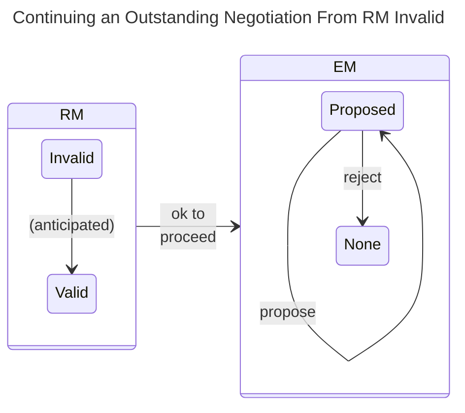
```mermaid
---
title: Continuing an Outstanding Negotiation From RM Invalid
---
stateDiagram-v2
    direction LR
    state RM {
        Invalid --> Valid: (anticipated)
    }
    state EM {
        Proposed --> Proposed : propose
        Proposed --> None : reject
    }
    RM --> EM : ok to<br/>proceed
```

## Only Accept Embargoes for Possibly Valid Yet Unclosed Reports

!!! note ""

    Embargo Management MAY proceed from EM _Proposed_ to EM _Active_ ($q^{em} \in P \xrightarrow{a} A$) when RM is neither _Invalid_ nor _Closed_ ($q^{rm} \in \{R,V,A,D\}$).

As above, this is the acceptance of a proposal made after case creation; the case-creation acceptance is atomic, and the case owner is then in RM *Received*, which this rule allows anyway.
The diagram below shows the RM states from which accepting a proposal is allowed.

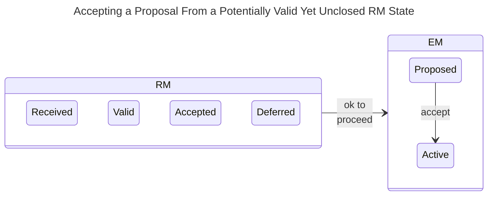
```mermaid
---
title: Accepting a Proposal From a Potentially Valid Yet Unclosed RM State
---
stateDiagram-v2
    direction LR
    state RM {
        Received
        Valid
        Accepted
        Deferred
    }
    state EM {
        Proposed --> Active : accept
    }
    RM --> EM : ok to<br/>proceed
```

!!! note ""

    Embargo Management SHOULD NOT proceed from EM _Proposed_ to EM _Active_ when RM is _Invalid_ or _Closed_ ($q^{rm} \in \{I,C\}$).

The diagram below shows the RM states from which accepting a proposal should be avoided.

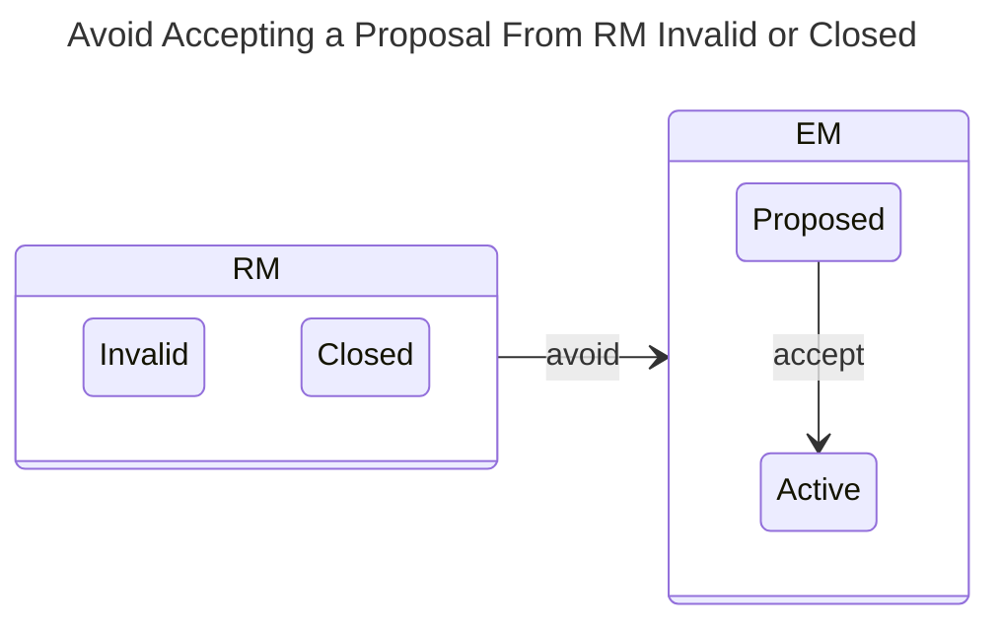
```mermaid
---
title: Avoid Accepting a Proposal From RM Invalid or Closed
---
stateDiagram-v2
    direction LR
    state RM {
        Invalid
        Closed
    }
    state EM {
        Proposed --> Active : accept
    }
    RM --> EM : avoid
```

!!! note ""

    Embargo Management MAY proceed from EM _Proposed_ to EM _None_ ($q^{em} \in P \xrightarrow{r} N$) when RM is _Invalid_ or _Closed_.

The diagram below shows rejection as the allowed outcome from those states.

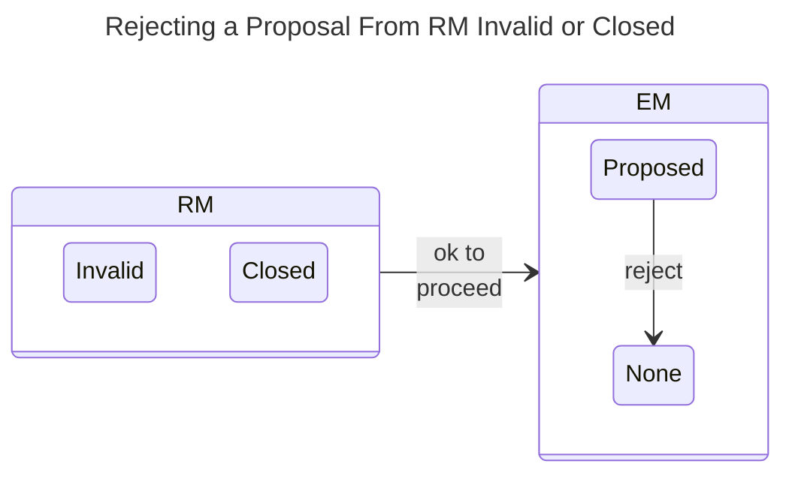
```mermaid
---
title: Rejecting a Proposal From RM Invalid or Closed
---
stateDiagram-v2
    direction LR
    state RM {
        Invalid
        Closed
    }
    state EM {
        Proposed --> None : reject
    }
    RM --> EM : ok to<br/>proceed
```

## Report Closure, Deferral, and Active Embargoes

Each Participant's RM process can interact with the case-level EM process in several ways, described below.

!!! note ""

    Participants SHOULD NOT close reports ($q^{rm} \in \{I,D,A\} \xrightarrow{c} C$) while an embargo is active ($q^{em} \in \{ A,R \}$).

The diagram below shows the closures to avoid while the embargo is *Active* or being revised.

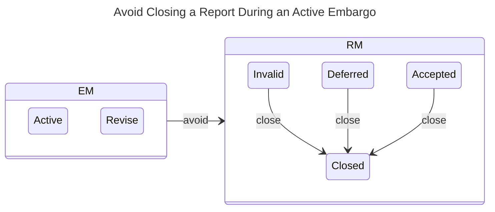
```mermaid
---
title: Avoid Closing a Report During an Active Embargo
---
stateDiagram-v2
    direction LR
    state RM {
        Invalid --> Closed: close
        Deferred --> Closed: close
        Accepted --> Closed: close
    }
    state EM {
        Active
        Revise
    }
    EM --> RM : avoid
```

Instead,

!!! note ""

    Reports with no further tasks SHOULD be held in either _Deferred_ or _Invalid_ (${q^{rm} \in \{ D,I\}}$), depending on the report validity status, until the embargo has terminated (${q^{em} \in X}$).

This allows Participants to stop work on a report but still maintain their participation in an extant embargo.
Notwithstanding the above,

!!! note ""

    Participants who choose to close a report ($q^{rm} \in \{I,D,A\} \xrightarrow{c} C$) while an embargo remains in force ($q^{em} \in \{A,R\}$) SHOULD communicate their intent to either continue to adhere to the embargo or terminate their compliance with it.

Report closure or deferral alone does not terminate an embargo.

!!! note ""

    A Participant's closure or deferral ($q^{rm} \in \{C,D\}$) of a report while an embargo remains active ($q^{em} \in \{A,R\}$) and while other Participants remain engaged ($q^{rm} \in \{R,V,A\}$) SHALL NOT automatically terminate the embargo.

The diagram below shows that the RM closures do not imply the EM *terminate* transition.

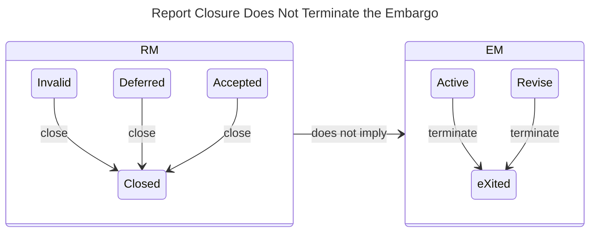
```mermaid
---
title: Report Closure Does Not Terminate the Embargo
---
stateDiagram-v2
    direction LR
    state RM {
        Invalid --> Closed: close
        Deferred --> Closed: close
        Accepted --> Closed: close
    }
    state EM {
        Active --> eXited: terminate
        Revise --> eXited: terminate
    }
    RM --> EM : does not imply
```

Participants are expected to continue to adhere to the embargo until it is explicitly terminated.
However,

!!! note ""

    Participants MAY choose to terminate their compliance with an embargo at any time.

While this is usually an undesirable development, it must be communicated to other Participants so that they can make informed decisions about the viability of the extant embargo.

!!! note ""

    Any changes to a Participant's intention to adhere to an active embargo SHOULD be communicated in addition to any necessary notifications regarding RM or EM state changes.

!!! note ""

    Upon receipt of a Participant's notification of intent to end their compliance with an embargo, other Participants MAY choose to terminate the embargo.

### Closing a Case While an Embargo Is Active

Because the RM process is specific to each Participant but the EM process is global to the case, one Participant's closure leaves the shared embargo in force for everyone else ([VP-13](../../../reference/specs/protocol.md#vp-13)).

The [Case Owner](../../../reference/glossary.md#cvd-roles-and-participants) is different, because the Case Owner's departure closes the case for every Participant.
While the embargo is *Active* or being revised, the [CASE_MANAGER](../../../reference/glossary.md#cvd-roles-and-participants) declines the Case Owner's request to leave, and the case stays open with the embargo in force ([CM-23](../../../reference/specs/protocol.md#cm-23)).
The Case Owner terminates the embargo first, for example once the vulnerability is public, and then leaves.
[Close your participation](../../../howto/activitypub/activities/manage_case.md#close-your-participation) in the case-management how-to shows the messages involved.
