# Interactions Between the RM and EM Models {#sec:rm_em_interactions}



There are additional constraints on how the [RM](../rm/index.md) and [EM](../em/index.md) processes interact.

## Start Embargo Negotiations As Early as Possible

!!! note ""

    The [EM](../em/index.md) process MAY begin (i.e., the initial _propose_ transition $q^{em} \in N \xrightarrow{p} P$)
    prior to the report being sent to a potential Participant ($q^{rm} \in S$)

!!! question "Why Propose before Reporting?"

    Beginning an embargo negotiation before providing a report can be useful in cases where a Participant wishes to
    ensure acceptable embargo terms prior to sharing a report with a potential recipient.

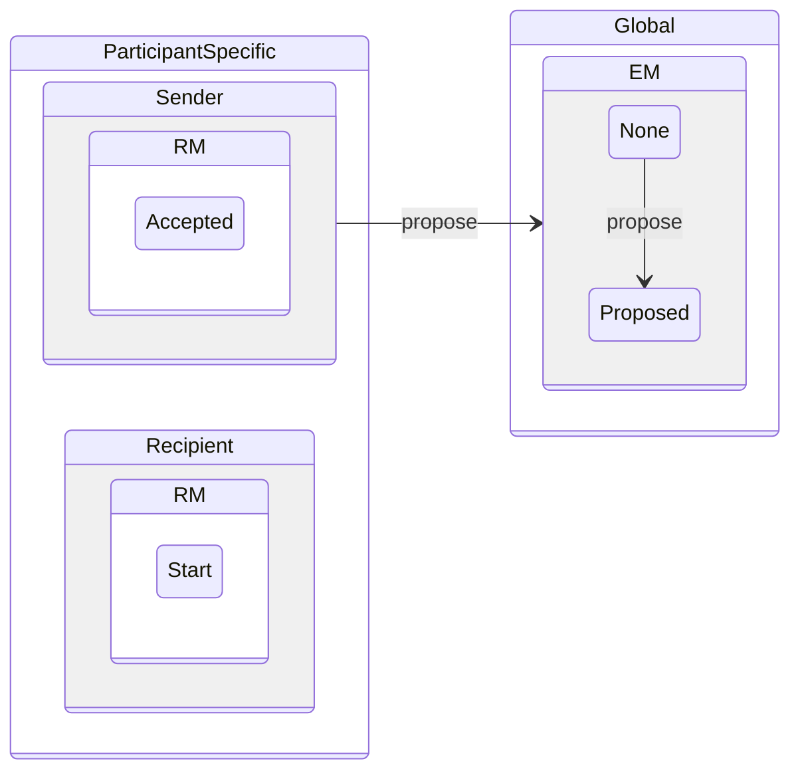

!!! note ""

    If it has not already begun, the [EM](../em/index.md) process SHOULD begin when a recipient
    is in RM _Received_ ($q^{rm} \in R$) whenever possible.

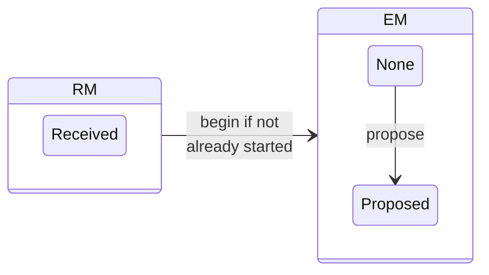

## Negotiate Embargoes for Active Reports

!!! note ""

    Embargo Management MAY begin in any of the active RM states
    ($q^{rm} \in \{ R,V,A \}$).

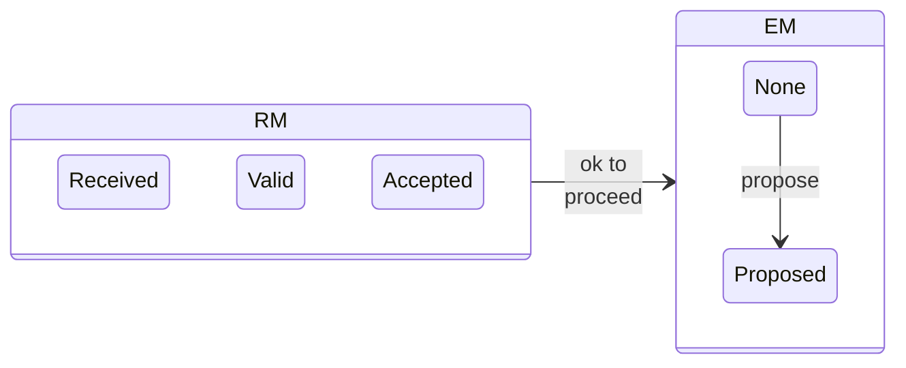

!!! note ""

    Embargo Management SHOULD NOT begin in an inactive RM state
    ($q^{rm} \in \{ I,D,C \}$).

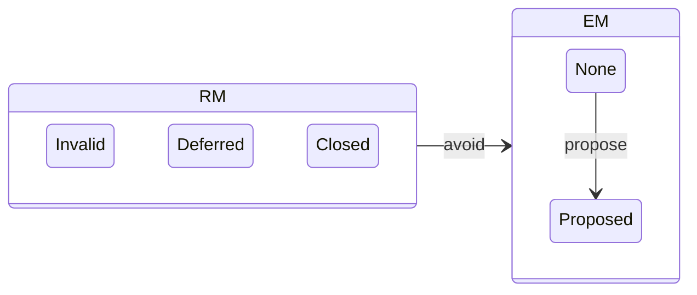

## Negotiate Embargoes Through Validation and Prioritization

!!! note ""

    Embargo Management MAY run in parallel to validation
    ($q^{rm} \in \{R,I\} \xrightarrow{\{v,i\}} \{V,I\}$) and
    prioritization ($q^{rm} \in V \xrightarrow{\{a,d\}} \{A,D\}$)
    activities.

## Renegotiate Embargoes While Reports Are Valid Yet Unclosed

!!! note ""

    EM revision proposals ($q^{em} \in A \xrightarrow{p} R$) and
    acceptance or rejection of those proposals
    (${q^{em} \in R \xrightarrow{\{a,r\}} A}$) MAY occur during any of
    the valid yet unclosed RM states (${q_{rm} \in \{ V,A,D \} }$).

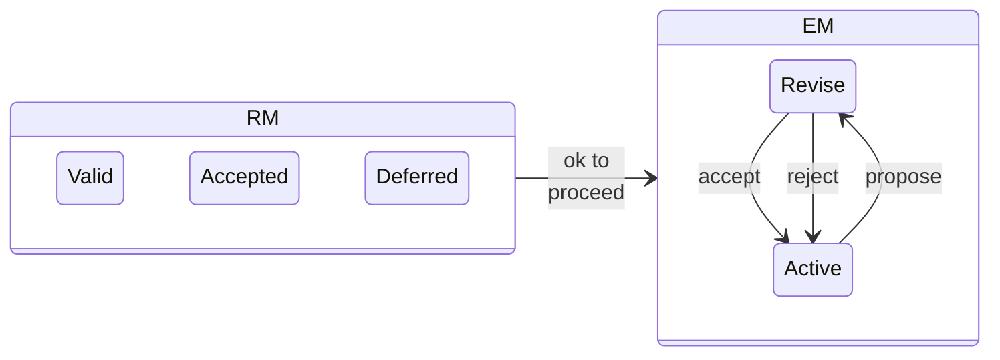

## Avoid Embargoes for Invalid Reports

!!! note ""

    Embargo Management SHOULD NOT begin with a proposal from a
    Participant in RM _Invalid_ ($q^{rm} \in I$).

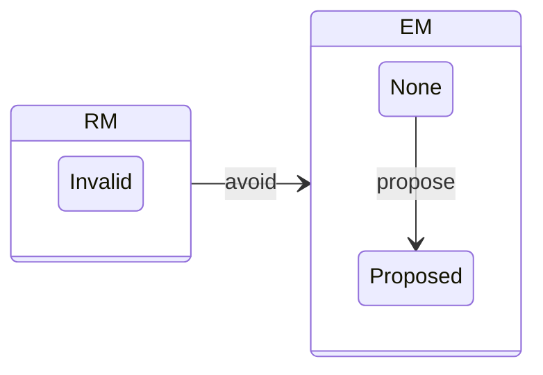

## ...but Don't Lose Momentum if Validation Is Pending

!!! note ""

    Outstanding embargo negotiations
    ($q^{em} \in P \xrightarrow{\{r,p\}} \{N,P\}$) MAY continue in
    RM _Invalid_
    ($q^{rm} \in I$) (e.g., if it is anticipated that additional
    information may be forthcoming to promote the report from _Invalid_
    to _Valid_) ($q^{rm} \in I \xrightarrow{v} V$).

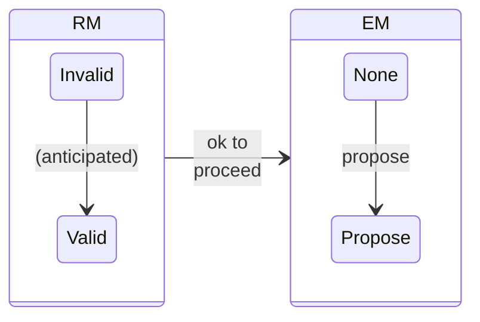

## Only Accept Embargoes for Possibly Valid Yet Unclosed Reports

!!! note ""

    Embargo Management MAY proceed from EM _Proposed_ to EM _Accepted_
    ($q^{em} \in P \xrightarrow{a} A$) when RM is neither _Invalid_ nor _Closed_
    ($q^{rm} \in \{R,V,A,D\}$).

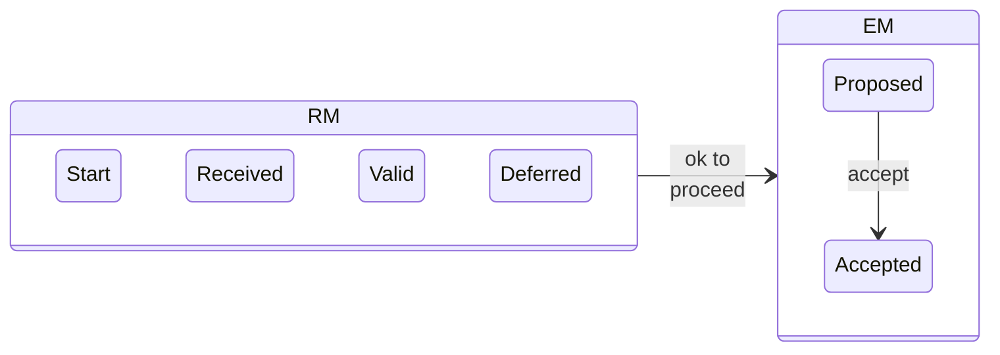

!!! note ""

    Embargo Management SHOULD NOT proceed from EM _Proposed_ to EM _Accepted_ when
    RM is _Invalid_
    or _Closed_ ($q^{rm} \in \{I,C\}$).

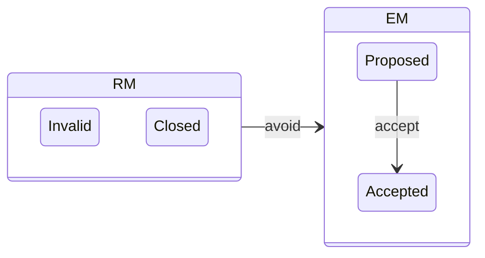

!!! note ""

    Embargo Management MAY proceed from EM _Proposed_ to EM _None_
    ($q^{em} \in P \xrightarrow{r} N$) when RM is _Invalid_ or _Closed_.

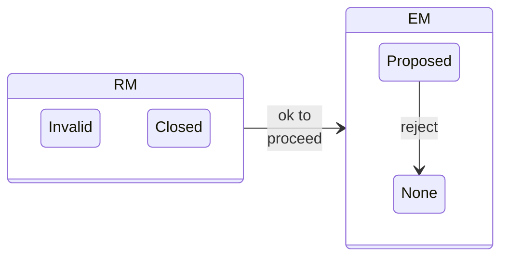

## Report Closure, Deferral, and Active Embargoes

Participants' individual Report Management processes can interact with the Embargo Management process at the case level
in a number of ways.
We describe these interactions below.

!!! note ""

    Participants SHOULD NOT close reports ($q^{rm} \in \{I,D,A\} \xrightarrow{c} C$) while an embargo is
    active ($q^{em} \in \{ A,R \}$).

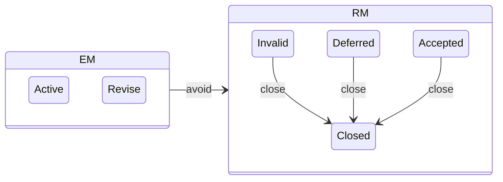

Instead,

!!! note ""
  
    Reports with no further tasks SHOULD be held in either
    _Deferred_ or _Invalid_ (${q^{rm} \in \{ D,I\}}$) (depending on the
    report validity status) until the embargo has terminated
    (${q^{em} \in X}$).

This allows Participants to stop work on a report but still maintain their participation in an extant embargo.
Notwithstanding the above,

!!! note ""

    Participants who choose to close a report ($q^{rm} \in \{I,D,A\} \xrightarrow{c} C$) while an embargo remains
    in force ($q^{em} \in \{A,R\}$) SHOULD communicate their intent to either continue to adhere to the embargo or 
    terminate their compliance with it.

Report closure or deferral alone does not terminate an embargo.

!!! note ""

    A Participant's closure or deferral ($q^{rm} \in \{C,D\}$) of a report
    while an embargo remains active ($q^{em} \in \{A,R\}$) and while
    other Participants remain engaged ($q^{rm} \in \{R,V,A\}$) SHALL NOT
    automatically terminate the embargo.

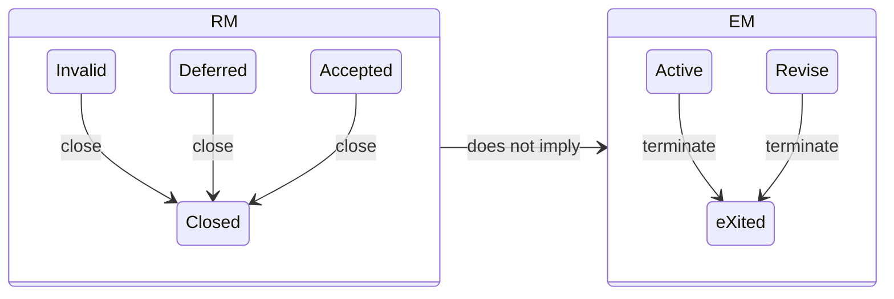

It is expected that Participants will continue to adhere to the embargo until it is explicitly terminated.
However,

!!! note ""

    Participants MAY choose to terminate their compliance with an embargo at any time.

While this is usually an undesirable development, it is important that it be clearly communicated to other Participants
so that they can make informed decisions about the viability of the extant embargo.

!!! note ""

    Any changes to a Participant's intention to adhere to an active
    embargo SHOULD be communicated clearly in addition to any necessary
    notifications regarding RM or EM state changes.

!!! note ""

    Upon receipt of a Participant's notification of intent to end their compliance with an embargo,
    other Participants MAY choose to terminate the embargo.
