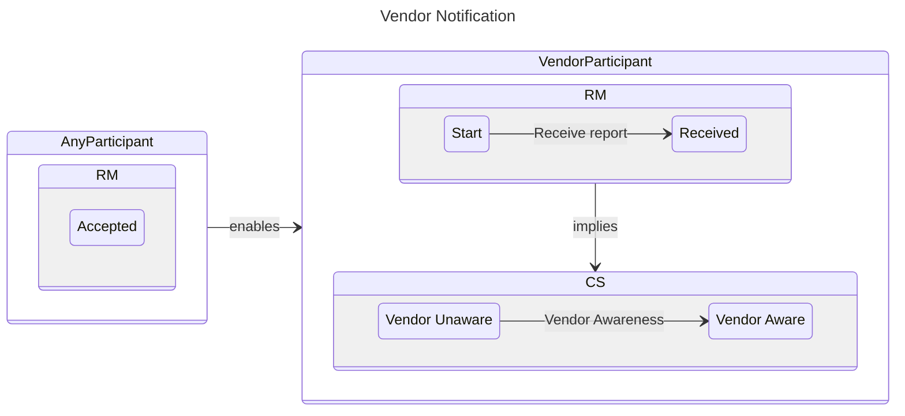
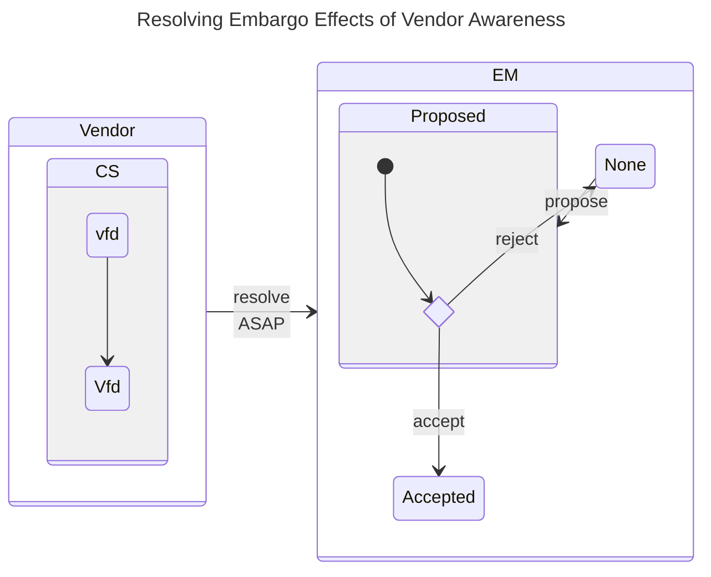
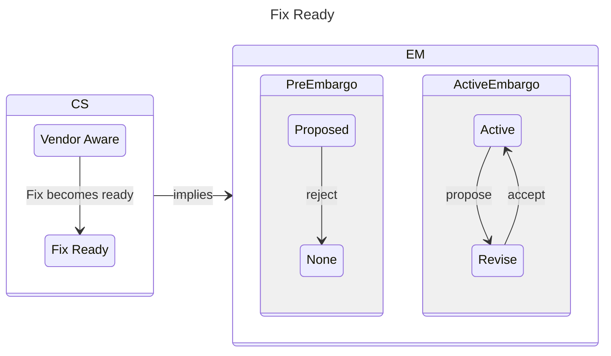
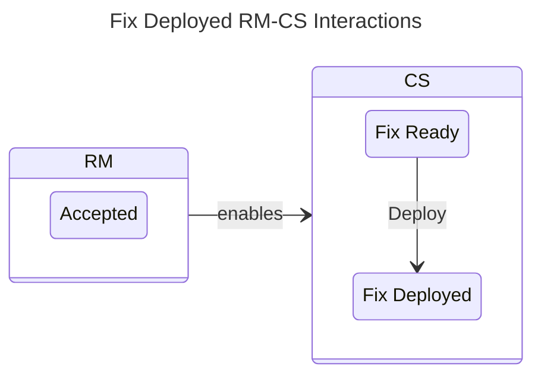
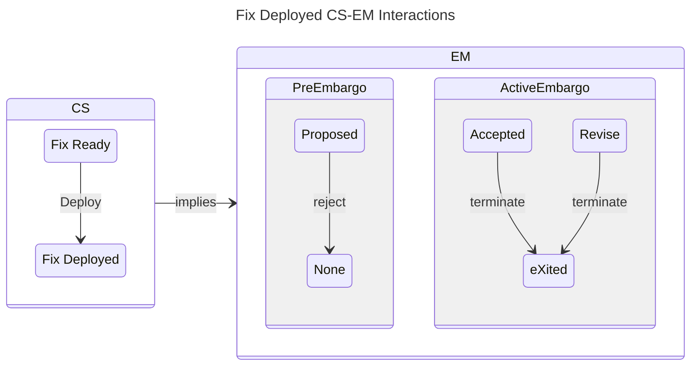
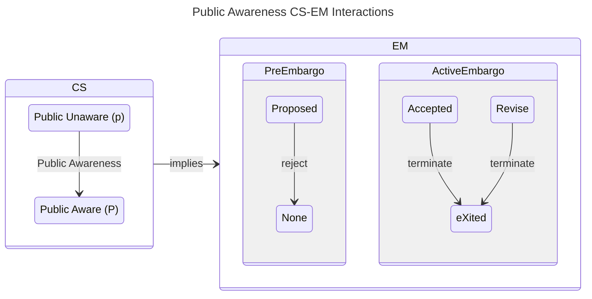
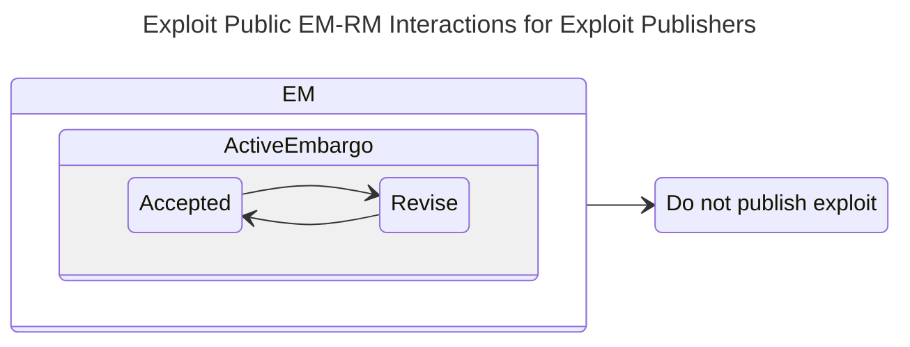
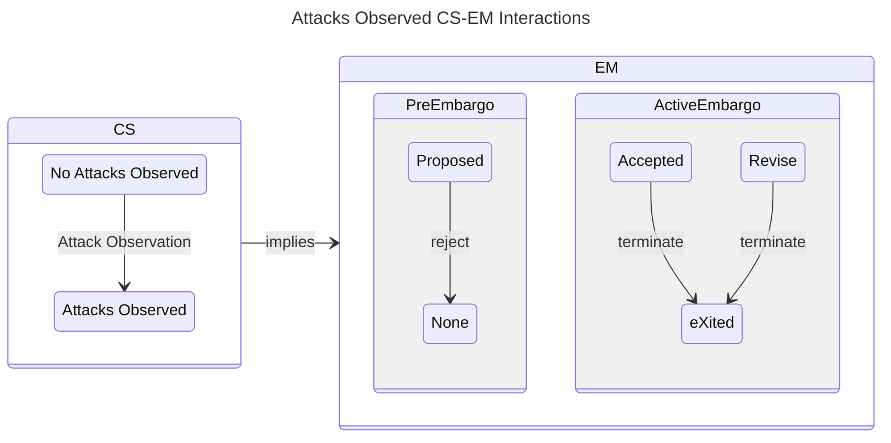

# CVD Case State Interactions with the RM and EM Process Models



The [RM](../rm/index.md) and [EM](../em/index.md) models interact with the [Case State Model](../cs/index.md).
Here we will review the constraints arising from the interaction of the [RM](../rm/index.md) and [EM](../em/index.md)
models with each of the CS transition events represented by its symbols.

We have organized this page according to how each CS model [substate](../cs/index.md) interacts with the
[RM](../rm/index.md) and [EM](../em/index.md) models.

???+ note inline end "CS Transition Symbols Defined"

    $\Sigma^{cs} = \{ \mathbf{V},~\mathbf{F},~\mathbf{D},~\mathbf{P},~\mathbf{X},~\mathbf{A} \}$

As a reminder, a list of the CS model transition symbols is reproduced in the inset at right.

## Vendor Notification

???+ note inline end "Vendor Notification Formalized"

    $$q^{rm} \in S \xrightarrow{r} R$$

    $$q^{cs} \in vfd\cdot\cdot\cdot \xrightarrow{\mathbf{V}} Vfd\cdot\cdot\cdot$$

Vendor Awareness (**V**) occurs when a Participant&mdash;typically a
Finder, Coordinator, or another Vendor&mdash;is in RM *Accepted* and notifies the Vendor.
In turn, the Vendor starts in $q^{rm} = Received$ and proceeds to follow their validation and prioritization routines.
We previously outlined this in [RM Interactions Between CVD Participants](../rm/rm_interactions.md).

---

Depending on which parties are involved in a CVD case, the [EM](../em/index.md) process might already be underway prior
to Vendor notification (e.g., $q^{em} \in \{P,A,R\}$). For example, a
Reporter and Coordinator might have already agreed to a disclosure
timeline. Or, in an MPCVD case, other Vendors may have already been
coordinating the case under an embargo and only recently realized the
need to engage with a new Vendor on the case. The latter example is
consistent with [public narratives](https://www.techtarget.com/searchsecurity/news/252446638/Meltdown-and-Spectre-disclosure-suffered-extraordinary-miscommunication){:target="_blank"} about the Meltdown/Spectre
vulnerabilities.

!!! note ""

    Once a case has reached $q^{cs} \in Vfdpxa$ for at least one Vendor,
    if the EM process has not started, it SHOULD begin as soon as possible.

!!! note ""

    Any proposed embargo SHOULD be decided (_accept_, _reject_) soon
    after the first Vendor is notified.

???+ note "Embargo Effects of Vendor Awareness Formalized"

    $$q^{cs} \in Vfdpxa \implies q^{em} \in
        \begin{cases}
            None \xrightarrow{propose} Proposed \\
            Proposed \begin{cases}
                \xrightarrow{reject} None \\
                \xrightarrow{accept} Accepted \\
            \end{cases} \\
            Accepted \\
            Revise \\
        \end{cases}$$

## Fix Ready

Fix Readiness (**F**) can occur only when a Vendor is in the
*Accepted* state. As a reminder, in MPCVD cases, each affected Vendor has their own
[RM](../rm/index.md) state, so this constraint applies to each Vendor individually.

---

With respect to [EM](../em/index.md), when the case state is $q^{cs} \in VF\cdot pxa$, it's usually too late to
start a new embargo.

!!! note ""

     Once a case has reached _Fix Ready_ ($q^{cs} \in VF\cdot pxa$),

    - New embargo negotiations SHOULD NOT start.
    - Proposed but not-yet-agreed-to embargoes SHOULD be rejected.
    - Existing embargoes ($q^{em} \in \{Active,~Revise\}$) MAY continue but SHOULD prepare to _terminate_ soon.

???+ note "Embargo Effects of Fix Readiness Formalized"

    $$q^{cs} \in VF\cdot pxa \implies q^{em} \in
        \begin{cases}
            None \\
            Proposed \xrightarrow{reject} None \\
            Accepted \\
            Revise \\
        \end{cases}$$

!!! note ""

    In MPCVD cases, where some Vendors are likely to reach $q^{cs} \in VF\cdot\cdot\cdot\cdot$
    before others,

    -   Participants MAY propose an embargo extension to allow trailing
    Vendors to catch up before publication.
    -   Participants SHOULD accept reasonable extension proposals for such
    purposes when possible (e.g., when other constraints could still be
    met by the extended deadline).

## Fix Deployed

For vulnerabilities in systems where the Vendor controls deployment, the
Fix Deployment (**D**) event can only occur if the Vendor is in
$q^{rm} = Accepted$.

For vulnerabilities in systems whose software delivery model dictates that Public Awareness must precede
Deployment ($\mathbf{P} \prec \mathbf{D}$), the Vendor status at the time of deployment might be
irrelevant&mdash;assuming, of course, that they at least passed through $q^{rm} = Accepted$ at some point as is required
for Fix Ready (**F**), which, in turn, is a prerequisite for deployment (**D**).

---

As regards [EM](../em/index.md),

!!! note ""

    By the time a fix has been deployed ($q^{cs} \in VFD\cdot\cdot\cdot$),
    
    -   New embargoes SHOULD NOT be sought.
    -   Any existing embargo SHOULD terminate.

???+ note "Embargo Effects on reaching Fix Deployment Formalized"

    $$q^{cs} \in {VFD} \cdot\cdot\cdot \implies q^{em} \in
        \begin{cases}
            None \\
            Proposed \xrightarrow{reject} None \\
            Accepted \xrightarrow{terminate} eXited \\
            Revise \xrightarrow{terminate} eXited \\
        \end{cases}$$

As with the *Fix Ready* scenario [above](#sec:cs_f_em), MPCVD cases may have Vendors in varying states of *Fix Deployment*.
Therefore the embargo extension caveats from that section apply to the *Fix Deployed* state as well.

## Public Awareness

Within the context of a coordinated publication process, (**P**)
requires at least one Participant to be in the $q^{rm} = Accepted$ state
because Participants are presumed to publish only on cases they have
accepted. Ideally, the Vendor is among those Participants, but as
outlined in the [*CERT Guide to Coordinated Vulnerability Disclosure*](https://certcc.github.io/CERT-Guide-to-CVD){:target="_blank"},
that is not strictly necessary.

That said, the publishing party might be outside of *any* existing
coordination process. For example, this is the situation when a report
is already in the midst of a CVD process and a party outside the
CVD case reveals the vulnerability publicly (e.g., parallel discovery, embargo leaks).

---

As for [EM](../em/index.md), the whole point of an embargo is to prevent **P** from occurring until
other objectives (e.g., $q^{cs} \in VF\cdot px \cdot$) have been met. Therefore,

!!! note ""

    Once _Public Awareness_ has happened and the case state reaches
    $q^{cs} \in \cdot\cdot\cdot P \cdot\cdot$,

    -   New embargoes SHALL NOT be sought.
    -   Any existing embargo SHALL terminate.

???+ note "Embargo Effects on reaching Public Awareness Formalized"

    $$q^{cs} \in \cdot\cdot\cdot P \cdot\cdot \implies q^{em} \in
        \begin{cases}
            None \\
            Proposed \xrightarrow{reject} None \\
            Accepted \xrightarrow{terminate} eXited \\
            Revise \xrightarrow{terminate} eXited \\
        \end{cases}$$

## Exploit Public

Exploit publishers may also be presumed to have a similar [RM](../rm/index.md) state model for their own work.
Therefore, we can expect them to be in an RM *Accepted* state at the time of exploit code publication (**X**).
However, we cannot presume that those who publish exploit code will be Participants in a pre-public CVD process.
That said,

!!! note ""  

    Exploit Publishers who *are* Participants in pre-public CVD cases ($q^{cs} \in \cdot\cdot\cdot p \cdot\cdot$)
    SHOULD comply with the protocol described here, especially when they also fulfill other roles 
    (e.g., Finder, Reporter, Coordinator, Vendor) in the process.

For example, as described in
[A State-Based Model for Multi-Party Coordinated Vulnerability Disclosure](https://resources.sei.cmu.edu/library/asset-view.cfm?assetid=735513){:target="_blank"},
the preference for $\mathbf{P} \prec \mathbf{X}$ dictates that

!!! note ""

    Exploit Publishers SHOULD NOT release exploit code while an embargo
    is active ($q^{em} \in \{A,R\}$).

In the [Case State model](../cs/cs_model.md#cs-transitions-defined), we have already established that
public exploit code is either preceded by Public Awareness (**P**) or immediately leads to it.
Therefore,

!!! note ""

    Once Exploit Publication has occurred and the case state reaches $q^{cs} \in \cdot\cdot\cdot\cdot X \cdot$,
    
    - New embargoes SHALL NOT be sought.
    - Any existing embargo SHALL terminate.

???+ note "Embargo Effects on reaching Exploit Public Formalized"

    $$q^{cs} \in \cdot\cdot\cdot\cdot X \cdot \implies q^{em} \in
        \begin{cases}
            None \\
            Proposed \xrightarrow{reject} None \\
            Accepted \xrightarrow{terminate} eXited \\
            Revise \xrightarrow{terminate} eXited \\
        \end{cases}$$

## Attacks Observed

Nothing in this or any other CVD process model should be interpreted as
constraining adversary activity.

!!! note ""

    Participants MUST treat attacks as an event that could occur at any
    time and adapt their process as needed in light of the available
    information.

As we outlined in [Early Termination](../em/early_termination.md), when attacks are occurring,
embargoes can often be of more benefit to adversaries than defenders.
However, we also acknowledged in
[CS Transitions](../cs/cs_model.md#attacks-do-not-necessarily-cause-public-awarenesss) that narrowly scoped attacks need
not imply widespread adversary knowledge of the vulnerability.
In such scenarios, it is possible that early embargo termination&mdash;leading to publication&mdash;might be of more
assistance to other adversaries than it is to defenders.
Thus, we need to allow room for Participant judgment based on their case-specific situation awareness.
Formally,

!!! note ""

    Once Attacks have been observed and the case state reaches $q^{cs} \in \cdot\cdot\cdot\cdot\cdot A$,

    - New embargoes SHALL NOT be sought.
    - Any existing embargo SHOULD terminate.

???+ note "Embargo Effects on reaching Attacks Observed Formalized"
    $$q^{cs} \in \cdot\cdot\cdot\cdot\cdot A \implies q^{em} \in
        \begin{cases}
            None \\
            Proposed \xrightarrow{reject} None \\
            Accepted \xrightarrow{terminate} eXited \\
            Revise \xrightarrow{terminate} eXited \\
        \end{cases}$$
