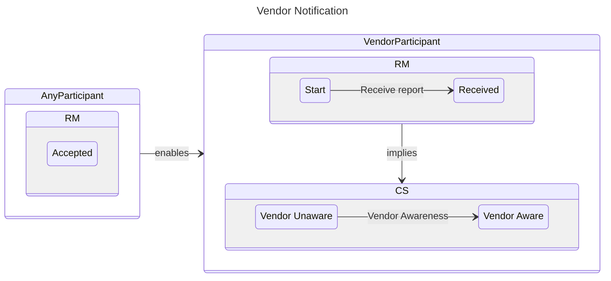
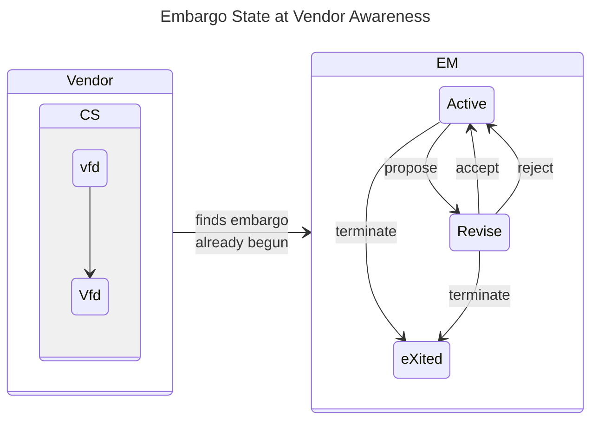
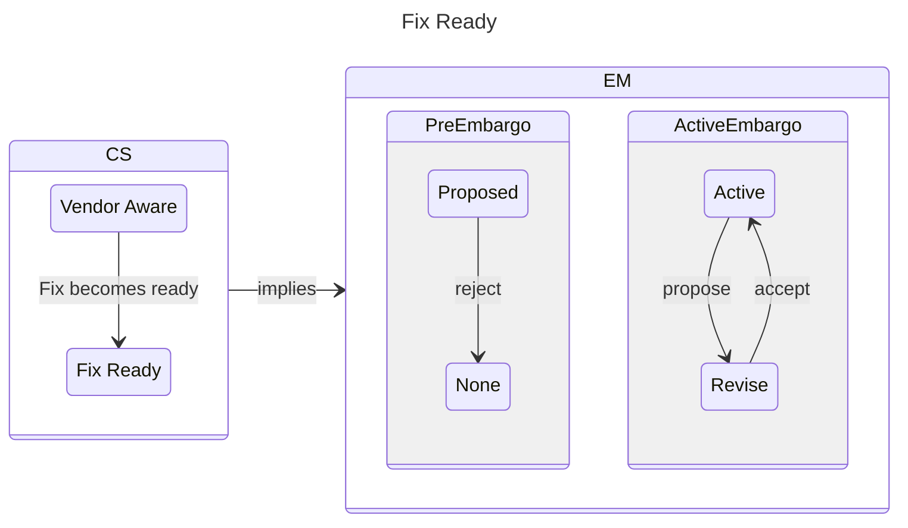
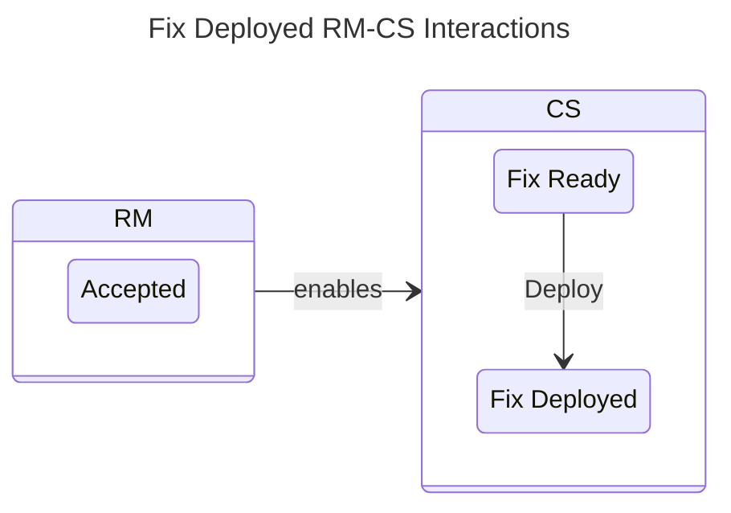
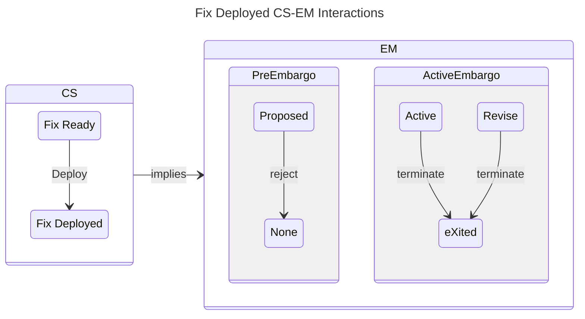
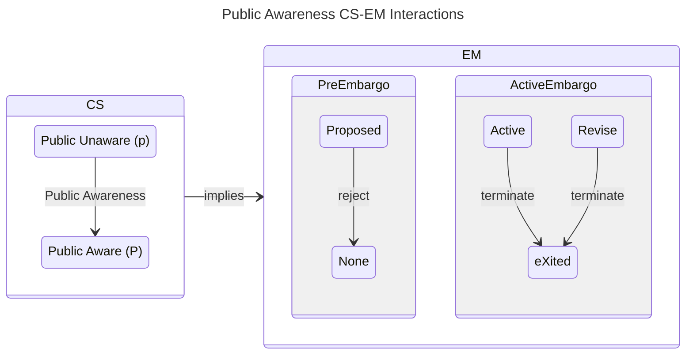
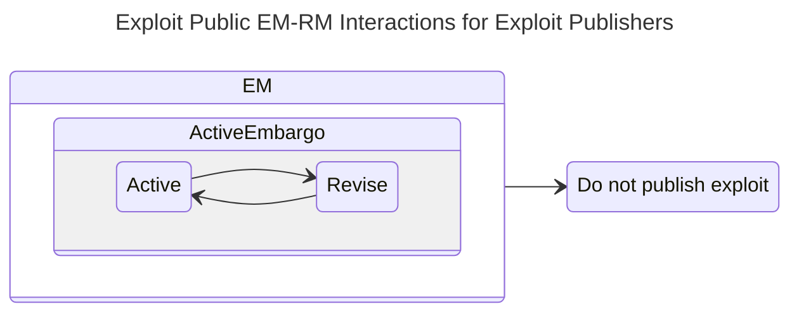
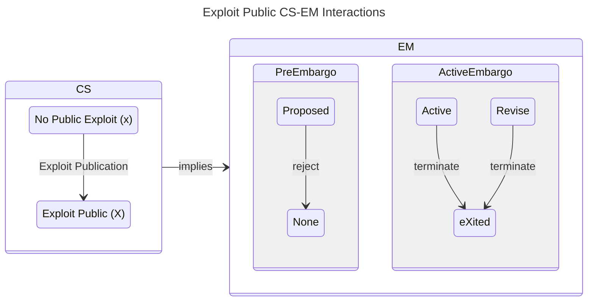
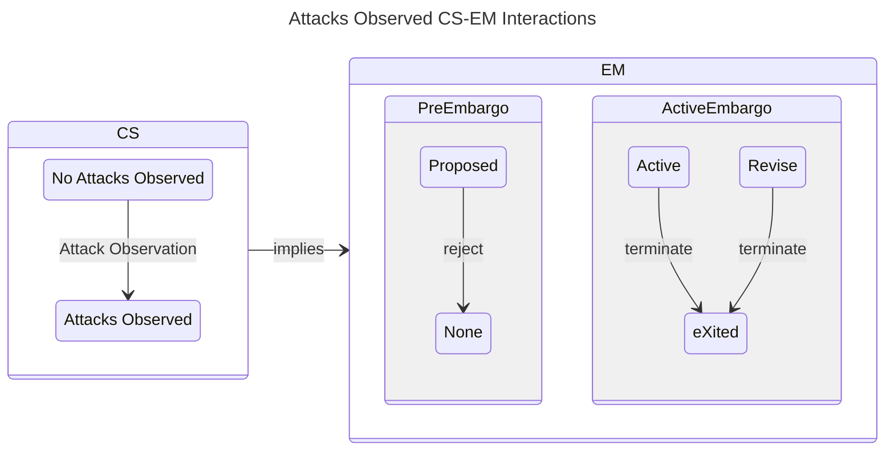

# CVD Case State Interactions with the RM and EM Process Models



The [Report Management (RM)](../rm/index.md) and [Embargo Management (EM)](../em/index.md) models interact with the [Case State (CS) model](../cs/index.md) of a Coordinated Vulnerability Disclosure (CVD) case.
This page reviews the constraints that arise when each CS transition event occurs.
It is organized by CS event, and each section covers how that event interacts with the RM and EM models.
Formulas use $q^{rm}$ for a Participant's RM state, $q^{em}$ for the case's EM state, and $q^{cs}$ for the case state.

???+ note inline end "CS Transition Symbols Defined"

    $\Sigma^{cs} = \{ \mathbf{V},~\mathbf{F},~\mathbf{D},~\mathbf{P},~\mathbf{X},~\mathbf{A} \}$

The CS model transition symbols are reproduced in the inset at right.
They stand for Vendor awareness (**V**), fix ready (**F**), fix deployed (**D**), public awareness (**P**), exploit public (**X**), and attacks observed (**A**).

## Global vs. Participant-Specific Aspects of the CS Model

The CS model has both Participant-specific and Participant-agnostic parts.
The Vendor fix path substates are specific to each Vendor Participant in a case: Vendor unaware (*vfd*), Vendor aware (*Vfd*), fix ready (*VFd*), and fix deployed (*VFD*).
The remaining substates are Participant-agnostic facts about the case: public awareness (*p,P*), exploit public (*x,X*), and attacks observed (*a,A*).
So the **V**, **F**, and **D** events below happen once per Vendor, while **P**, **X**, and **A** happen once per case.
This distinction matters in the [Formal Protocol](../../../reference/formal_protocol/index.md) definition.

The diagram below shows the two parts of the CS model side by side.



## Vendor Notification

???+ note inline end "Vendor Notification Formalized"

    $$q^{rm} \in S \xrightarrow{r} R$$

    $$q^{cs} \in vfd\cdot\cdot\cdot \xrightarrow{\mathbf{V}} Vfd\cdot\cdot\cdot$$

Vendor Awareness (**V**) occurs when a Participant (typically a Finder, Coordinator, or another Vendor) is in RM *Accepted* and notifies the Vendor.
In turn, the Vendor starts in $q^{rm} = Received$ and proceeds to follow their validation and prioritization routines.
[RM Interactions Between CVD Participants](../rm/rm_interactions.md) describes this in more detail.

The diagram below shows how the notifying Participant's RM state enables the Vendor's RM transition, which in turn implies the CS Vendor Awareness event.

```mermaid
---
title: Vendor Notification
---
stateDiagram-v2
    direction LR
    state AnyParticipant {
        state RM {
            A: Accepted
        }
    }
    state VendorParticipant {
        RM2: RM
        state RM2 {
            direction LR
            Start --> Received : Receive report
        }

        state CS {
            direction LR
            vfd: Vendor Unaware
            Vfd: Vendor Aware
            vfd --> Vfd : Vendor Awareness
        }
        RM2 --> CS: implies
    }
    AnyParticipant --> VendorParticipant: enables
```

---

The EM process begins when the case is created, not when a Vendor is notified ([ADR-0096: A Protocol Default Embargo Replaces the Pre-Case Phase](../../../adr/0096-protocol-default-embargo.md)).
An embargo-eligible case begins with an *Active* embargo at case creation, from the recipient's published default, the sender's proposed terms, or the protocol default ([Vultron Protocol Specification §7.2](../../../reference/vultron-spec/index.md#72-transitions-and-guards)).
When a Vendor is notified, the embargo's state therefore depends on who created the case:

- If the Vendor is the first recipient of the report, the case and its embargo begin with this notification.
- If a Coordinator or other Vendors created the case earlier, the embargo is already *Active* or being revised, and the newly notified Vendor is invited to consent to its terms ([§9, Participant Embargo Consent](../../../reference/vultron-spec/index.md#9-participant-embargo-consent-pec-state-machine-n)).

For example, a Reporter and Coordinator might have already agreed to a disclosure timeline.
Or, in a multi-party CVD case, other Vendors may have already been coordinating the case under an embargo and only recently realized the need to engage with a new Vendor.
The latter example is consistent with [public narratives](https://www.techtarget.com/searchsecurity/news/252446638/Meltdown-and-Spectre-disclosure-suffered-extraordinary-miscommunication){:target="_blank"} about the Meltdown/Spectre vulnerabilities.

An embargo may also have ended early, before a later Vendor is notified, so *Exited* is possible too.
A case that was not embargo-eligible when it was created stays in EM *None*.

!!! note ""

    Any outstanding embargo revision SHOULD be decided (_accept_, _reject_) soon after a newly notified Vendor joins the case.

The diagram below shows the embargo states a Vendor can find when it becomes aware of the case.

```mermaid
---
title: Embargo State at Vendor Awareness
---
stateDiagram-v2
    direction LR
    state Vendor {
        state CS {
            vfd --> Vfd
        }
    }
    state EM {
        Active --> Revise : propose
        Revise --> Active : accept
        Revise --> Active : reject
        Active --> eXited : terminate
        Revise --> eXited : terminate
    }
    Vendor --> EM: finds embargo<br/>already begun
```

???+ note "Embargo State at Vendor Awareness Formalized"

    For an embargo-eligible case,

    $$q^{cs} \in Vfd\cdot\cdot\cdot \implies q^{em} \in
        \begin{cases}
            Active \\
            Revise \begin{cases}
                \xrightarrow{accept} Active \\
                \xrightarrow{reject} Active \\
            \end{cases} \\
            eXited \\
        \end{cases}$$

## Fix Ready

Fix Readiness (**F**) can occur only when a Vendor is in the RM *Accepted* state.
In multi-party cases, each affected Vendor has their own [RM](../rm/index.md) state, so this constraint applies to each Vendor individually.

---

With respect to [EM](../em/index.md), when the case state is $q^{cs} \in VF\cdot pxa$, it's usually too late to start a new embargo.

!!! note ""

    Once a case has reached _Fix Ready_ ($q^{cs} \in VF\cdot pxa$),

    - New embargo negotiations SHOULD NOT start.
    - Proposed but not-yet-agreed-to embargoes SHOULD be rejected.
    - Existing embargoes ($q^{em} \in \{Active,~Revise\}$) MAY continue but SHOULD prepare to _terminate_ soon.

The diagram below shows the EM transitions that remain available once a fix is ready.

```mermaid
---
title: Fix Ready
---
stateDiagram-v2
    direction LR
    state CS {
        Vfd: Vendor Aware
        VFd: Fix Ready
        Vfd --> VFd : Fix becomes ready
    }
    state EM {
        state PreEmbargo{
            P: Proposed
            N: None
            P --> N: reject
        }
        state ActiveEmbargo {
            A: Active
            R: Revise
            A --> R: propose
            R --> A: accept
        }
    }
    CS --> EM: implies
```

???+ note "Embargo Effects of Fix Readiness Formalized"

    $$q^{cs} \in VF\cdot pxa \implies q^{em} \in
        \begin{cases}
            None \\
            Proposed \xrightarrow{reject} None \\
            Active \\
            Revise \\
        \end{cases}$$

!!! note ""

    In multi-party cases, where some Vendors are likely to reach $q^{cs} \in VF\cdot\cdot\cdot\cdot$ before others,

    - Participants MAY propose an embargo extension to allow trailing Vendors to catch up before publication.
    - Participants SHOULD accept reasonable extension proposals for such purposes when possible (e.g., when other constraints could still be met by the extended deadline).

## Fix Deployed

For vulnerabilities in systems where the Vendor controls deployment, the Fix Deployment (**D**) event can only occur if the Vendor is in $q^{rm} = Accepted$.

The diagram below shows the Vendor's RM *Accepted* state enabling deployment.

```mermaid
---
title: Fix Deployed RM-CS Interactions
---
stateDiagram-v2
    direction LR
    state RM {
        Accepted
    }
    state CS {
        VFd: Fix Ready
        VFD: Fix Deployed

        VFd --> VFD : Deploy
    }
    RM --> CS: enables
```

For vulnerabilities in systems whose software delivery model dictates that Public Awareness must precede Deployment ($\mathbf{P} \prec \mathbf{D}$), the Vendor status at the time of deployment might be irrelevant.
This assumes the Vendor at least passed through $q^{rm} = Accepted$ at some point, as is required for Fix Ready (**F**), which, in turn, is a prerequisite for deployment (**D**).

---

As regards [EM](../em/index.md),

!!! note ""

    By the time a fix has been deployed ($q^{cs} \in VFD\cdot\cdot\cdot$),

    -   New embargoes SHOULD NOT be sought.
    -   Any existing embargo SHOULD terminate.

The diagram below shows the EM transitions implied by fix deployment.

```mermaid
---
title: Fix Deployed CS-EM Interactions
---
stateDiagram-v2
    direction LR
    state CS {
        VFd: Fix Ready
        VFD: Fix Deployed

        VFd --> VFD : Deploy
    }
    state EM {
        state PreEmbargo{
            Proposed --> None: reject
        }
        state ActiveEmbargo {
            Active --> eXited: terminate
            Revise --> eXited: terminate
        }
    }
    CS --> EM: implies
```

???+ note "Embargo Effects on reaching Fix Deployment Formalized"

    $$q^{cs} \in {VFD} \cdot\cdot\cdot \implies q^{em} \in
        \begin{cases}
            None \\
            Proposed \xrightarrow{reject} None \\
            Active \xrightarrow{terminate} eXited \\
            Revise \xrightarrow{terminate} eXited \\
        \end{cases}$$

As with the *Fix Ready* scenario above, multi-party cases may have Vendors in varying states of *Fix Deployment*.
Therefore the embargo extension caveats from that section apply to the *Fix Deployed* state as well.

## Public Awareness

Within the context of a coordinated publication process, (**P**) requires at least one Participant to be in the $q^{rm} = Accepted$ state, because Participants are presumed to publish only on cases they have accepted.
Ideally, the Vendor is among those Participants, but as outlined in the [*CERT Guide to Coordinated Vulnerability Disclosure*](https://certcc.github.io/CERT-Guide-to-CVD){:target="_blank"}, that is not strictly necessary.

That said, the publishing party might be outside of *any* existing coordination process.
For example, this is the situation when a report is already in the midst of a CVD process and a party outside the CVD case reveals the vulnerability publicly (e.g., parallel discovery, embargo leaks).

---

As for [EM](../em/index.md), the whole point of an embargo is to prevent **P** from occurring until other objectives (e.g., $q^{cs} \in VF\cdot px \cdot$) have been met.
Therefore,

!!! note ""

    Once _Public Awareness_ has happened and the case state reaches $q^{cs} \in \cdot\cdot\cdot P \cdot\cdot$,

    -   New embargoes SHALL NOT be sought.
    -   Any existing embargo SHALL terminate.

The diagram below shows the EM transitions implied by public awareness.

```mermaid
---
title: Public Awareness CS-EM Interactions
---
stateDiagram-v2
    direction LR
    state CS {
        p: Public Unaware (p)
        P: Public Aware (P)

        p --> P : Public Awareness
    }
    state EM {
        state PreEmbargo{
            Proposed --> None: reject
        }
        state ActiveEmbargo {
            Active --> eXited: terminate
            Revise --> eXited: terminate
        }
    }
    CS --> EM: implies
```

???+ note "Embargo Effects on reaching Public Awareness Formalized"

    $$q^{cs} \in \cdot\cdot\cdot P \cdot\cdot \implies q^{em} \in
        \begin{cases}
            None \\
            Proposed \xrightarrow{reject} None \\
            Active \xrightarrow{terminate} eXited \\
            Revise \xrightarrow{terminate} eXited \\
        \end{cases}$$

## Exploit Public

Exploit publishers may also be presumed to have a similar [RM](../rm/index.md) state model for their own work.
Therefore, they can be expected to be in an RM *Accepted* state at the time of exploit code publication (**X**).
However, those who publish exploit code cannot be presumed to be Participants in a pre-public CVD process.
That said,

!!! note ""

    Exploit Publishers who *are* Participants in pre-public CVD cases ($q^{cs} \in \cdot\cdot\cdot p \cdot\cdot$) SHOULD comply with the protocol described here, especially when they also fulfill other roles (e.g., Finder, Reporter, Coordinator, Vendor) in the process.

For example, as described in [A State-Based Model for Multi-Party Coordinated Vulnerability Disclosure](https://resources.sei.cmu.edu/library/asset-view.cfm?assetid=735513){:target="_blank"}, the preference for $\mathbf{P} \prec \mathbf{X}$ dictates that

!!! note ""

    Exploit Publishers SHOULD NOT release exploit code while an embargo is active ($q^{em} \in \{A,R\}$).

The diagram below shows that an *Active* or revising embargo rules out exploit publication.

```mermaid
---
title: Exploit Public EM-RM Interactions for Exploit Publishers
---
stateDiagram-v2
    direction LR
    state EM {
        state ActiveEmbargo {
            direction LR
            Active
            Revise
            Revise --> Active
            Active --> Revise
        }
    }
    nox: Do not publish exploit
    EM --> nox
```

The [CS transitions](../cs/transitions.md#exploit-publication-causes-public-awareness) establish that public exploit code is either preceded by Public Awareness (**P**) or immediately leads to it.
Therefore,

!!! note ""

    Once Exploit Publication has occurred and the case state reaches $q^{cs} \in \cdot\cdot\cdot\cdot X \cdot$,

    - New embargoes SHALL NOT be sought.
    - Any existing embargo SHALL terminate.

The diagram below shows the EM transitions implied by exploit publication.

```mermaid
---
title: Exploit Public CS-EM Interactions
---
stateDiagram-v2
    direction LR
    state CS {
        x: No Public Exploit (x)
        X: Exploit Public (X)

        x --> X : Exploit Publication
    }
    state EM {
        state PreEmbargo{
            Proposed --> None: reject
        }
        state ActiveEmbargo {
            Active --> eXited: terminate
            Revise --> eXited: terminate
        }
    }
    CS --> EM: implies
```

???+ note "Embargo Effects on reaching Exploit Public Formalized"

    $$q^{cs} \in \cdot\cdot\cdot\cdot X \cdot \implies q^{em} \in
        \begin{cases}
            None \\
            Proposed \xrightarrow{reject} None \\
            Active \xrightarrow{terminate} eXited \\
            Revise \xrightarrow{terminate} eXited \\
        \end{cases}$$

## Attacks Observed

Nothing in this or any other CVD process model should be interpreted as constraining adversary activity.

!!! note ""

    Participants MUST treat attacks as an event that could occur at any time and adapt their process as needed in light of the available information.

As [Early Termination](../em/early_termination.md) explains, when attacks are occurring, embargoes can often be of more benefit to adversaries than defenders.
However, the [CS transitions](../cs/transitions.md#attacks-do-not-necessarily-cause-public-awareness) also note that narrowly scoped attacks need not imply widespread adversary knowledge of the vulnerability.
In such scenarios, early embargo termination, leading to publication, might be of more assistance to other adversaries than it is to defenders.
The protocol therefore leaves room for Participant judgment based on their case-specific situation awareness.
Formally,

!!! note ""

    Once Attacks have been observed and the case state reaches $q^{cs} \in \cdot\cdot\cdot\cdot\cdot A$,

    - New embargoes SHALL NOT be sought.
    - Any existing embargo SHOULD terminate.

The diagram below shows the EM transitions implied by observed attacks.

```mermaid
---
title: Attacks Observed CS-EM Interactions
---
stateDiagram-v2
    direction LR
    state CS {
        a: No Attacks Observed
        A: Attacks Observed

        a --> A : Attack Observation
    }
    state EM {
        state PreEmbargo{
            Proposed --> None: reject
        }
        state ActiveEmbargo {
            Active --> eXited: terminate
            Revise --> eXited: terminate
        }
    }
    CS --> EM: implies
```

???+ note "Embargo Effects on reaching Attacks Observed Formalized"

    $$q^{cs} \in \cdot\cdot\cdot\cdot\cdot A \implies q^{em} \in
        \begin{cases}
            None \\
            Proposed \xrightarrow{reject} None \\
            Active \xrightarrow{terminate} eXited \\
            Revise \xrightarrow{terminate} eXited \\
        \end{cases}$$
