# Report Management Process Model



Here we describe a high-level workflow for the CVD Report Management (RM) process.
<!-- start_excerpt -->
The RM process should be reasonably familiar to anyone familiar with [IT Service Management](https://en.wikipedia.org/wiki/IT_service_management){:target="_blank"} (ITSM) workflows such as problem, change,
incident or service request management.
In particular, any workflow in which work items (e.g., incident reports, problem tickets, change requests) are received, validated, prioritized, and work is subsequently
completed, should map onto the RM process outlined here.
<!-- end_excerpt -->

!!! tip "Vultron Does Not Dictate Internal Processes"

    In the interest of maintaining the potential for interoperability among different organizations' internal processes, our protocol does not
    specify intra-organizational subprocesses within each state, although we give examples of such subprocesses in 
    [Do Work Behavior](../../behavior_logic/do_work_bt.md).

    For further reference, [ISO/IEC 30111:2019(E)](https://www.iso.org/standard/69725.html) provides recommendations for Vendors' *internal* processes
    that can be mapped into the RM process. We provide such a mapping in our [ISO Crosswalk](../../../reference/iso_crosswalks/index.md).

## RM State Machine



In this section, we first cover the states themselves before proceeding
to a discussion of the transitions between them.
[Elsewhere](rm_interactions.md) , we provide a
discussion of the Participant-specific semantics of the state
transitions. We use Deterministic Finite Automata (DFA) notation to describe our
RM model (see inset).

### RM States

Our proposed RM DFA models a report lifecycle containing seven states, defined below.



???+ note inline end "RM States $\mathcal{Q}^{rm}$ Defined"

    $\begin{split}
        \mathcal{Q}^{rm} = \{ & \underline{S}tart, \\
                              & \underline{R}eceived,\\
                              & \underline{I}nvalid, \\
                              & \underline{V}alid, \\
                              & \underline{A}ccepted, \\
                              & \underline{D}eferred, \\
                              & \underline{C}losed \}
        \end{split}$

By convention, we will use the underlined capital letters in the box at right as a shorthand for
the state names. Each Participant in a CVD case will have their own RM state.

!!! info "RM States vs. CVD Case States"

    RM states are not the same as CVD case states. Case states follow the Householder-Spring model summarized
    in [Case State Model](../cs/index.md). Further discussion of the interactions of the RM and CS models is found
    in [Model Interactions](../model_interactions/index.md).

#### The *Start* (*S*) State

The *Start* state is a simple placeholder state for reports that have
yet to be received. It is, in effect, a null state that no
CVD Participant would be expected to reflect in their report tracking system. We include
it here because it is useful when modeling coordination
that spans multiple Participants in the [formal protocol](../../formal_protocol/index.md).
Otherwise, the discussion until then will mostly ignore it.

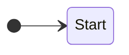

#### The *Received* (*R*) State

Reports initially arrive in the *Received* state.

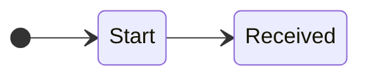

Vendors lacking the ability to receive reports will find it exceedingly
difficult if not impossible to participate in the
CVD process. Therefore,

!!! note ""

    Vendors SHOULD have a clearly defined and publicly available 
    mechanism for receiving reports.

Similarly, those who coordinate others' responses to vulnerability
reports also need to have a report receiving capability; otherwise, they
are not capable of coordinating vulnerability disclosures. Hence,

!!! note ""

    Coordinators MUST have a clearly defined and publicly available
    mechanism for receiving reports.

Exiting the *Received* state requires a Participant to assess the
validity of a report. Note that validation is distinct from
prioritization, as covered in our description of the [*Valid*](#the-valid-v-state) state.
In other words, the *Received* state corresponds to the
[Validation phase](https://certcc.github.io/CERT-Guide-to-CVD/topics/phases/validation){:target="_blank"}
of the [*CERT Guide to Coordinated Vulnerability Disclosure*](https://certcc.github.io/CERT-Guide-to-CVD){:target="_blank"}.

!!! note ""

    Participants SHOULD subject each _Received_ report to some sort
    of validation process, resulting in the report being designated as
    _valid_ or _invalid_ based on the Participant's particular criteria.

Validity criteria need not be limited to technical analysis. For
instance, a Coordinator might only accept reports within their specific
scope of concern and consider reports outside their scope to be
*Invalid* even if they believe the report accurately describes a real
vulnerability. Alternatively, a Vendor might institute a policy
designating reports unaccompanied by a working proof-of-concept exploit
as *Invalid* by default.

!!! note ""

    Participants SHOULD have a clearly defined process for
    validating reports in the _Received_ state.

!!! note ""

    Participants SHOULD have a clearly defined process for
    transitioning reports from the _Received_ state to the _Valid_ or
    _Invalid_ states.

!!! note ""

    Participants MAY perform a more technical report validation process
    before exiting the _Received_ state.

!!! note ""

    Regardless of the technical rigor applied in the validation process,
    Participants SHOULD proceed only after validating the reports they
    receive.

!!! note ""

    Participants SHOULD transition all valid reports to the _Valid_
    state and all invalid reports to the _Invalid_ state.

!!! note ""

    Regardless of the content or quality of the initial report, once a
    Vendor confirms that a reported vulnerability affects one or more of
    their product(s) or service(s), the Vendor SHOULD designate the
    report as _Valid_.

!!! note ""

    Participants MAY create a case object to track any report in the _Received_ state.

#### The *Invalid* (*I*) State

Reports in the *Invalid* state have been evaluated and found lacking by
the recipient. This state allows time for the Reporter to provide
additional information and for the receiver to revisit the validation
before moving the report to *Closed*.

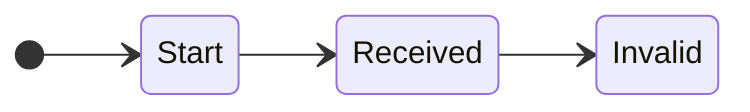

The reasons for a report to be put in this state will vary based on each
recipient's validation criteria, and their technical capability and
available resources. The *Invalid* state is intended to be used as a
temporary holding place to allow for additional evidence to be sought to
contradict that conclusion.

!!! note ""

    Participants SHOULD temporarily hold reports that they cannot
    validate pending additional information.

!!! note ""

    Participants SHOULD provide Reporters an opportunity to update their
    report with additional information in support of its validity before
    closing the report entirely.

!!! note ""

    Participants MAY set a timer to move reports from _Invalid_ to
    _Closed_ after a set period of inactivity.

#### The *Valid* (*V*) State

Reports in the *Valid* state are ready to be prioritized for possible
future work. The result of this prioritization process will be to either
accept the report for follow-up or defer further effort.
The *Valid* state is equivalent to the [Prioritization
(Triage)](https://certcc.github.io/topics/phases/prioritization) phase
of the [*CERT Guide to Coordinated Vulnerability Disclosure*](https://certcc.github.io/CERT-Guide-to-CVD){:target="_blank"}.
As an example, a Vendor might later choose to *defer* further response on a *Valid* report due to other priorities.

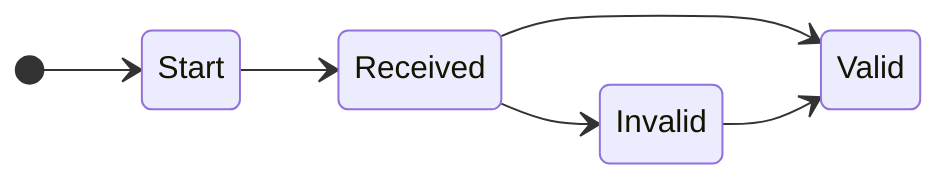

!!! note ""

    For _Valid_ reports, the Participant SHOULD perform a prioritization
    evaluation to decide whether to _accept_ or _defer_ the report for
    further work.

!!! note ""

    If one does not already exist, Participants SHOULD create a case from
    reports entering the _Valid_ state to track the report's subsequent progress through the CVD process.

!!! note ""

    Participants MAY choose to
    perform a shallow technical analysis on _Valid_ reports to prioritize any further
    effort relative to other work.

!!! note ""

    Participants SHOULD have a bias toward accepting rather than
    deferring _Valid_ cases up to their work capacity limits.

In other words, prioritization is only necessary if the workload
represented by active valid reports exceeds the organization's capacity
to process those reports.

Prioritization schemes, such as [SSVC](https://github.com/CERTCC/SSVC){:target="_blank"} or the
[CVSS](https://first.org/cvss){:target="_blank"}, are commonly used to
prioritize work within the CVD process; however, specific details are
left to Participant-specific implementation.
The SSVC model is illustrative here, although any prioritization scheme could be
substituted as long as it emits a result that can be mapped onto the
semantics of "continue work" or "defer further
action".
[SSVC Crosswalk](../../../reference/ssvc_crosswalk.md) takes a closer look at how
SSVC fits into the protocol we are defining.

#### The *Accepted* (*A*) State

The *Accepted* state is where the bulk of the work for a given
CVD Participant
occurs. Reports reach this state for a Participant only once the
Participant has deemed the report to be both valid and of sufficient
priority to warrant further action. The *Accepted* state has a different
meaning for each different Participant.

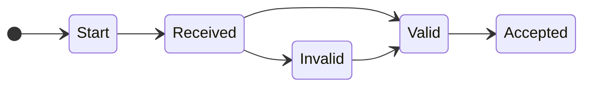

- For our purposes, Finders/Reporters enter the *Accepted* state only
    for reports that they intend to put through the
    CVD process. If
    they have no intention of pursuing CVD, there is no need for them to track
    their actions using this protocol. See [the secret lives of finders](rm_interactions.md#the-secret-lives-of-finders) for more.

- Vendors usually do root cause analysis, understand the problem, and
    produce a fix or mitigation.

- Coordinators typically identify potentially affected Vendors, notify
    them, and possibly negotiate embargoes.

We provide additional elaboration on the sorts of activities that might
happen in the *Accept* state in [Do Work Behavior](../../behavior_logic/do_work_bt.md).

!!! note ""

    A report MAY enter and exit the _Accepted_ state a number of times
    in its lifespan as a Participant resumes or pauses work (i.e.,
    transitions to/from the _Deferred_ state).

#### The *Deferred* (*D*) State

The *Deferred* state is reserved for valid, unclosed reports that are
otherwise not being actively worked on (i.e., those in *Accepted*). It
parallels the *Invalid* state for reports that fail to meet the
necessary validation criteria in that both states are awaiting closure
once it is determined that no further action is necessary.

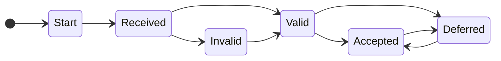

For example, a Participant might use the *Deferred* state when a valid
report fails to meet their [prioritization criteria](#prioritize-report), or when a higher priority task takes
precedence over an active case.

!!! note ""

    A report MAY enter and exit the _Deferred_ state a number of times
    in its lifespan as a Participant pauses or resumes work (i.e.,
    transitions from/to the _Accepted_ state).

!!! note ""

    Reports SHOULD exit the _Deferred_ state when work is resumed (to _Accepted_),
    or when the Participant has determined that no further action will be taken (to _Closed_).

!!! note ""

    CVD Participants MAY set a policy timer on reports in the _Deferred_
    state to ensure they are moved to _Closed_ after a set period of
    inactivity.

#### The *Closed* (*C*) State

The *Closed* state implies no further work is to be done; therefore, any
pre-closure review (e.g., for quality assurance purposes) should be
performed before the case moves to the *Closed* state (i.e., while the
report is in *Invalid*, *Deferred*, or *Accepted*).

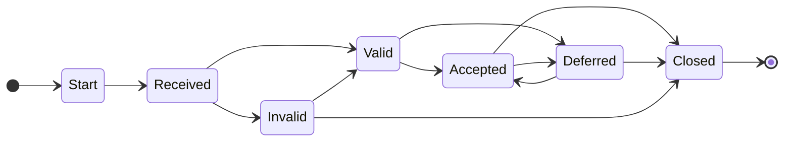

!!! note ""

    Reports SHOULD be moved to the _Closed_ state once a Participant has
    completed all outstanding work tasks and is fairly sure that they
    will not be pursuing any further action on it.
    For example

    - reports or cases that have been in _Invalid_ or _Deferred_ for some length of time,
    - cases in _Accepted_ where all necessary tasks are complete.

???+ note "RM Start and End States ($q^{rm}_0, \mathcal{F}^{rm}$) Defined"

    The RM process
    starts in the _Start_ state.
    
    $$q^{rm}_0 = Start$$
    
    The RM process ends
    in the _Closed_ state.
    
    $$\mathcal{F}^{rm} = \{Closed\}$$

### RM State Transitions

A Participant's RM process begins when the Participant receives a report.
The actions performed in the RM process represent the allowed state
transitions in the corresponding DFA.

???+ note inline end "RM Symbols ($\Sigma^{rm}$) Defined"
    These actions constitute the set of symbols for the
    RM DFA.

    $\begin{align*}
      \Sigma^{rm} = \{ & \underline{r}eceive, \\
                       & \underline{v}alidate, \\
                       & \underline{i}nvalidate, \\
                       & \underline{a}ccept, \\
                       & \underline{d}efer, \\
                       & \underline{c}lose \}
    \end{align*}$

#### RM Transitions Defined

In this section, we define the allowable transitions between states in
the RM process model. The RM process, including its states and transitions, is depicted in the following diagram.
State transitions represent messaging opportunities to communicate CVD
case status among Participants. This point is the lynchpin that makes the RM model point toward a technical
protocol. Every state transition implies a different message type.



!!! note ""

    CVD Participants SHOULD announce their RM state transitions to the other
    Participants in a case.

##### Receive Report

To begin, a Participant must receive a report. Recall that the *Start*
state is a placeholder, so this action simply puts the receiving
Participant into the *Received* state at the beginning of their
involvement in the case.

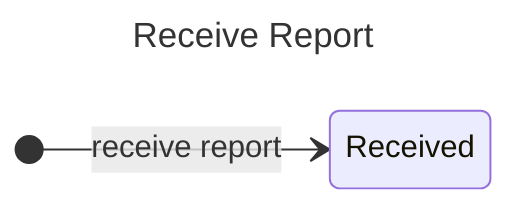

##### Validate Report

The Participant must validate the report to exit the *Received* state.
Depending on the validation outcome, the report will be in either the
*Valid* or *Invalid* state. *Invalid* reports are often waiting for
additional information from the reporter, but they may also be reports
that are not in scope for the Participant. Some Participants may choose
to close *Invalid* reports immediately, while others may choose to
periodically revalidate them to see if they have become *Valid*.

!!! note ""

    Participants SHOULD create a case for all _Valid_ reports. 

!!! note ""

    Paricipants MAY create a case for _Invalid_ reports.

!!! note ""

    Participants MAY periodically revalidate _Invalid_ reports to
    determine if they have become _Valid_.

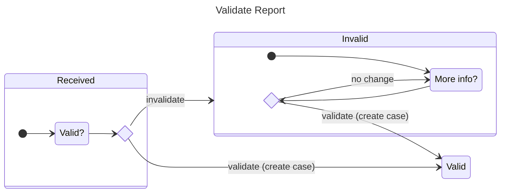

##### Prioritize Report

Once a report has been validated (i.e., it is in the
RM *Valid* state,
$q^{rm} \in V$), the Participant must prioritize it to determine what
further effort, if any, is necessary.

!!! note ""

    Participants MUST prioritize _Valid_ cases.

Our [SSVC Crosswalk](../../../reference/ssvc_crosswalk.md) contains an example of how the
SSVC model can be applied here, although any prioritization scheme could be substituted.
Prioritization ends with the report in either the *Accepted* or *Deferred* state.

A Participant might choose to pause work on a previously *Accepted*
report after revisiting their prioritization decision. When this
happens, the Participant moves the report to the *Deferred* state.
Similarly, a Participant might resume work on a *Deferred* report,
moving it to the *Accepted* state.

!!! note ""

    Participants MAY re-prioritize _Accepted_ or _Deferred_ cases.

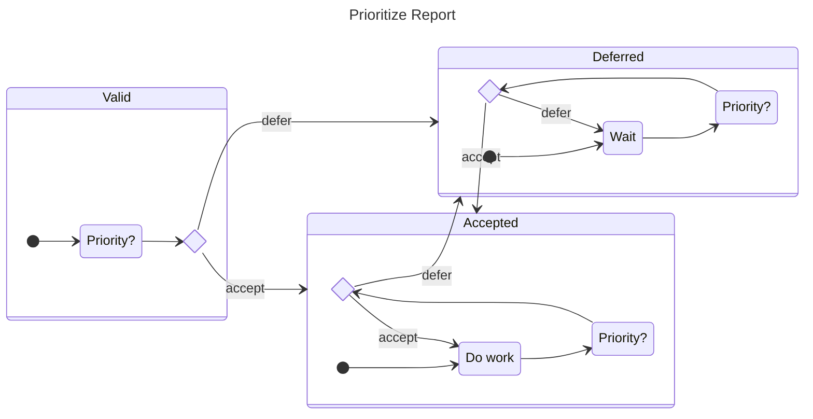

##### Participants Interact from the Accepted State

Some Participants (e.g., Finders and Coordinators) need to engage
someone else (e.g., a Vendor) to resolve a case. To do this, the
*sender* Participants must also be in the *Accepted* state; otherwise,
why are they working on the case? In the following diagram, we show the interaction between two
instances of the RM model: the left side represents the *sender* while the right side represents the *recipient*.
Although the *sender*'s state does not change, the *recipient*'s state moves from *Start* to *Received*.

!!! note ""

    Participants initiating CVD with others MUST do so from the _Accepted_ state.

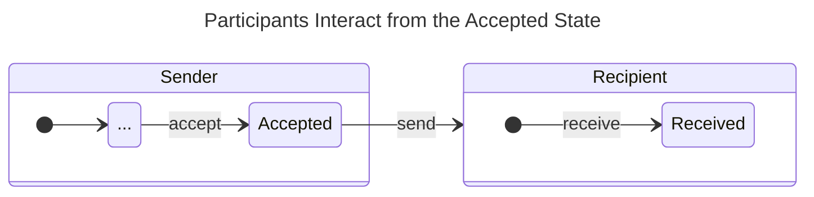

##### Case Closure

Finally, a Participant can complete work on an *Accepted* report or
abandon further work on an *Invalid* or *Deferred* report.

!!! note ""

    Participants MAY close _Accepted_ or _Deferred_ cases or _Invalid_ reports.

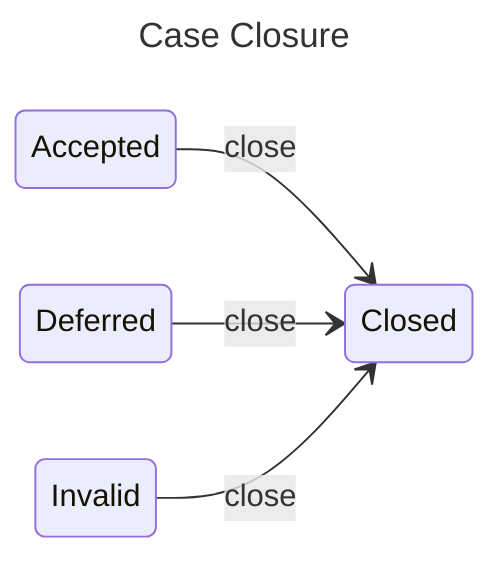

Our model assumes that *Valid* reports cannot be closed directly without
first passing through either *Accepted* or *Deferred*. It is reasonable
to wonder why *close* is not a valid transition from the *Valid* state.
The answer is that we wanted to allow prioritization and closure to be
distinct activities; deferral is reversible, whereas closure is not.
Often a Participant might initially *defer* a case only to resume work
later, once more information has arrived. However, there is nothing
stopping a Participant from instituting a process that goes from *Valid*
to *Deferred* to *Closed* in rapid (even immediate) succession.

!!! note ""

    Participants MUST NOT close cases or reports from the _Valid_ state.

#### Possible Report Management Histories

???+ note inline end "RM Transition Function ($\delta^{rm}$) Defined"

    Following the state machine diagram above, we represent the RM process model as a right-linear grammar:
    
    $$\delta^{rm} = 
    \begin{cases}
    S & \to rR \\
    R & \to vV~|~iI \\
    I & \to vV~|~cC \\
    V & \to aA~|~dD \\
    A & \to dD~|~cC \\
    D & \to aA~|~cC \\
    C & \to \epsilon \\
    \end{cases}$$

The strings generated in the language defined by this grammar can be
useful for exploring the possible sequences of states each report might
encounter for each Participant. The 15 shortest paths are *ric*, *rvac*,
*rvdc*, *rivac*, *rivdc*, *rvadc*, *rvdac*, *rivadc*, *rvadac*,
*rvdadc*, *rivdac*, *rivdadc*, *rvdadac*, *rivadac*, and *rvadadc*. Due
to the structure of the RM DFA, longer strings just add more
*defer*-*accept* (*da*) or *accept*-*defer* (*ad*) cycles prior to
closure (*c*). The usually limited duration of the
RM process coupled
with the tendency for CVD Participants to prefer to avoid frequent
starts and stops means that we expect the vast majority of reports to
follow one of the above paths, with the remainder falling into marginal
extensions.

<!-- HR for vertical spacing -->
----

!!! tip "See also"

    Further discussion of a [reward function](../../future_work/reward_functions.md) to evaluate RM DFA strings is discussed as future work in
    [Reward Functions](../../future_work/reward_functions.md).

## RM DFA Fully Defined

The full definition of the RM DFA is given below.

!!! note "RM DFA Fully Defined"

    Taken in combination, the full definition of the RM DFA is as follows:
    
    $$  RM = 
        \begin{pmatrix}
                \begin{aligned}
                    \mathcal{Q}^{rm} = & \{ S,R,I,V,A,D,C \} \\
                    q^{rm}_0 = & S  \\
                    \mathcal{F}^{rm} = & \{ C \} \\
                    \Sigma^{rm} = & \{ r,i,v,a,d,c \} \\
                    \delta^{rm} = &
                        \begin{cases}
                            S \to & rR \\
                            R \to & vV~|~iI \\
                            I \to & vV~|~cC \\
                            V \to & aA~|~dD \\
                            A \to & dD~|~cC \\
                            D \to & aA~|~cC \\
                            C \to & \epsilon \\
                        \end{cases}
                \end{aligned}
        \end{pmatrix}$$

???+ note "RM State Subsets Defined"

    Before proceeding, we pause to define a few useful subsets of
    RM states
    ($\dots \subset \mathcal{Q}^{rm}$) for future use:
    
    $$  \begin{align}
            Open &= \{ R,I,V,D,A \} \\
            Valid~Yet~Unclosed &= \{ V,D,A \} \\
            Potentially~Valid~Yet~Unclosed &= \{ R,V,D,A\} \\
            Active &= \{ R,V,A \} \\
            Inactive &= \{ I,D,C \} 
        \end{align}$$
