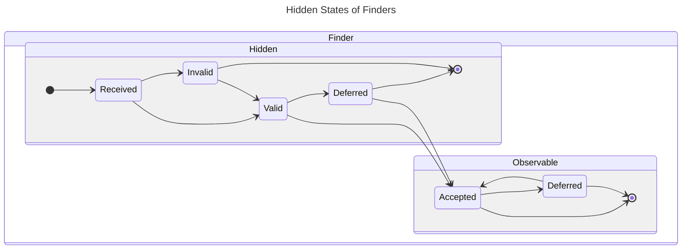
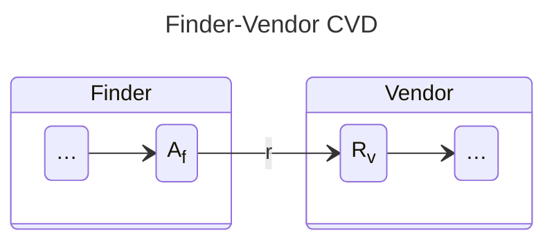
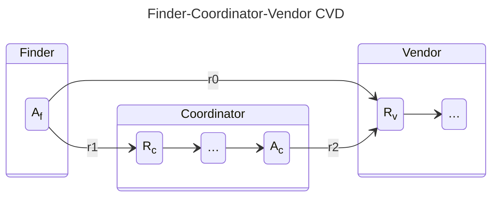
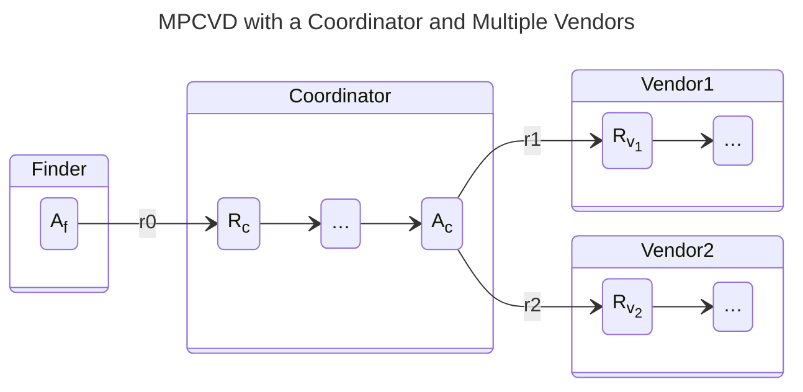
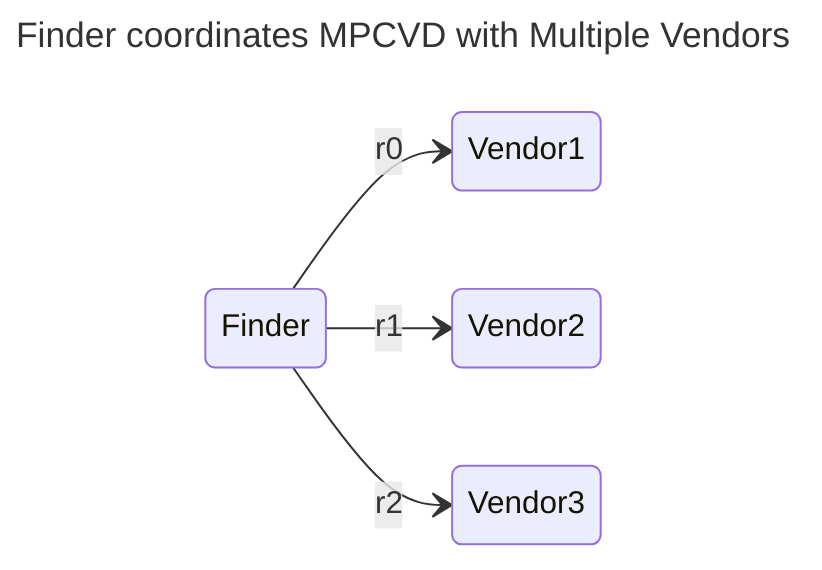
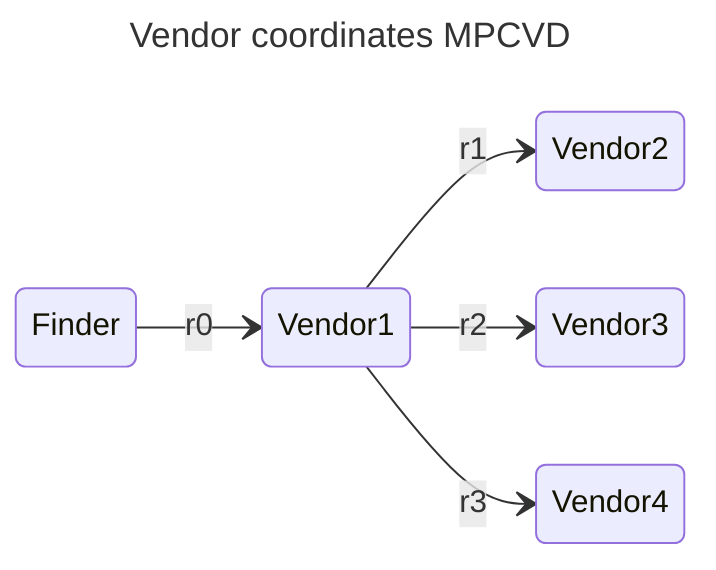
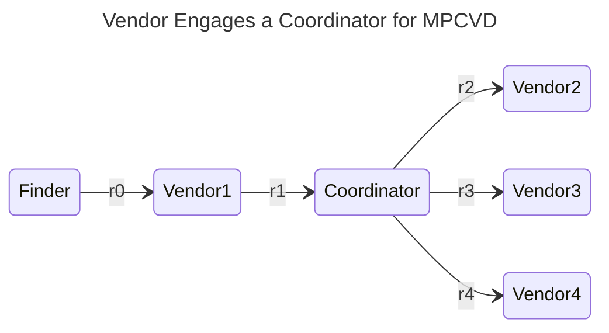
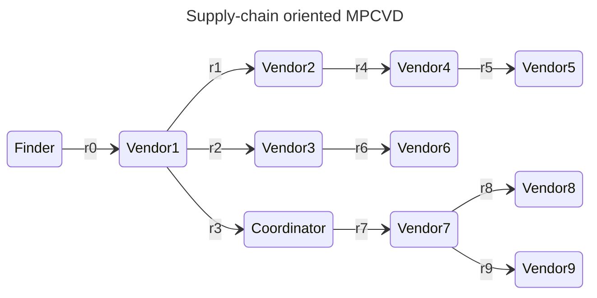

# Report Management Interactions Between CVD Participants

Each Participant in a Coordinated Vulnerability Disclosure (CVD) case has their own instance of the [Report Management (RM) state model](index.md).
Participants can change their local state independent of the state of other Participants.
Events within a CVD case may trigger a state transition in one Participant while no transition occurs in another.
For example, [participants interact from the accepted state](index.md#participants-interact-from-the-accepted-state) shows that even though the *sender* is the one taking the action, it is the *recipient*'s state that changes.
The table below lists role-based actions.

| Finder/Reporter  |      Vendor      |   Coordinator    | Action                                  |                                         RM Transition                                          |
|:----------------:|:----------------:|:----------------:|-----------------------------------------|:----------------------------------------------------------------------------------------------:|
| :material-check: |                  |                  | Discover Vulnerability (hidden)         |                           [Receive Report](index.md#receive-report)                            |
| :material-check: |                  |                  | Analyze Discovery (hidden)              |                          [Validate Report](index.md#validate-report)                           |
| :material-check: |                  |                  | Decide whether to initiate CVD (hidden) |                        [Prioritize Report](index.md#prioritize-report)                         |
| :material-check: | :material-check: | :material-check: | Notify Vendor                           | [Participants Interact from Accepted](index.md#participants-interact-from-the-accepted-state) |
| :material-check: | :material-check: | :material-check: | Notify Coordinator                      | [Participants Interact from Accepted](index.md#participants-interact-from-the-accepted-state) |
|                  | :material-check: | :material-check: | Receive Report                          |                           [Receive Report](index.md#receive-report)                            |
|                  | :material-check: | :material-check: | Validate Report                         |                          [Validate Report](index.md#validate-report)                           |
| :material-check: | :material-check: | :material-check: | Prioritize Report                       |                        [Prioritize Report](index.md#prioritize-report)                         |
| :material-check: | :material-check: | :material-check: | Pause Work                              |                        [Prioritize Report](index.md#prioritize-report)                         |
| :material-check: | :material-check: | :material-check: | Resume Work                             |                        [Prioritize Report](index.md#prioritize-report)                         |
| :material-check: | :material-check: | :material-check: | Close Report                            |                             [Case Closure](index.md#case-closure)                             |

A few examples of this model applied to common CVD and multi-party CVD case scenarios follow.

## The Secret Lives of Finders

The Finder's *Received*, *Valid*, and *Invalid* states are useful for modeling and simulation, but they are less useful as part of a CVD protocol.
For anyone else to know about the vulnerability, and for CVD to happen at all, the Finder must already have validated the report and prioritized it as worth the effort of coordinating its disclosure.
In other words, CVD only starts *after* the Finder has reached the *Accepted* state for the vulnerability being reported.
That is also the point at which a *Finder* becomes a *Reporter*.
The model keeps these states for completeness.
The formal protocol's [starting states](../../../reference/formal_protocol/states.md#starting-states) build on this: a Finder/Reporter is presumed to enter a case already in *Accepted*.

The diagram below separates the Finder's hidden states from the ones other Participants can observe.

## Finder-Vendor CVD

A simple Finder-Vendor CVD scenario is shown below.
As explained [above](#the-secret-lives-of-finders), most of the Finder's states are hidden from view until they reach the *Accepted* ($A_f$) state.
The *receive* action $A_f \xrightarrow{r} R_v$ that bridges the two Participants is an instance of [participants interacting from the accepted state](index.md#participants-interact-from-the-accepted-state).
Each Participant then continues through their own copy of the [RM state machine](index.md#rm-states), shown here as "…".

## Finder-Coordinator-Vendor CVD

A slightly more complicated scenario in which a Finder engages a Coordinator after failing to engage a Vendor is shown in the next diagram.
This scenario is very common in the experience of the CERT Coordination Center (CERT/CC).
That is no surprise, because as a Coordinator the CERT/CC does not take part in cases like the previous example.
Here there are three notification actions, each an instance of [participants interacting from the accepted state](index.md#participants-interact-from-the-accepted-state):

- First, $A_f \xrightarrow{r_0} R_v$ represents the Finder's initial attempt to reach the Vendor.
- Next, $A_f \xrightarrow{r_1} R_c$ is the Finder's subsequent attempt to engage with the Coordinator.
- Finally, the Coordinator contacts the Vendor in $A_c \xrightarrow{r_2} R_v$.

The diagram shows only the states each notification connects.

## MPCVD with a Coordinator and Multiple Vendors

A small Multi-Party Coordinated Vulnerability Disclosure (MPCVD) scenario is shown below.
As with the other examples, each notification shown is an instance of [participants interacting from the accepted state](index.md#participants-interact-from-the-accepted-state).
Unlike the previous example, this scenario starts with the Finder contacting a Coordinator, perhaps because they recognize the increased complexity of coordinating multiple Vendors' responses.

- First, $A_f \xrightarrow{r_0} R_c$ represents the Finder's initial report to the Coordinator.
- Next, $A_c \xrightarrow{r_1} R_{v_1}$ shows the Coordinator contacting the first Vendor.
- Finally, the Coordinator contacts a second Vendor in $A_c \xrightarrow{r_2} R_{v_2}$.

The diagram shows only the states each notification connects.

## A Menagerie of MPCVD Scenarios

Other MPCVD RM interaction configurations are possible, and the following figures show a few of them.
This time each node represents a Participant's entire RM model, and each edge is a notification from one Participant's *Accepted* state to another's *Received* state.
The CERT/CC has observed all of the following interactions.
The RM model is meant to be composable enough to accommodate all such permutations.

### Finder coordinates MPCVD with Multiple Vendors

A Finder notifies multiple Vendors without engaging a Coordinator.

### Vendor coordinates MPCVD

A Finder notifies a Vendor, who, in turn, notifies other Vendors.

### Vendor Engages a Coordinator for MPCVD

A Finder notifies a Vendor, who, in turn, engages a Coordinator to reach other Vendors.

### Supply-chain oriented MPCVD

Supply-chain oriented MPCVD often has two or more tiers of Vendors, each notified by the upstream Vendors whose components they use, with or without one or more Coordinators' involvement.

## Where to go next

Once a case exists, the RM process runs alongside the [Embargo Management (EM) process](../em/index.md).
[Interactions Between the RM and EM Models](../model_interactions/rm_em.md) describes the constraints each places on the other.
