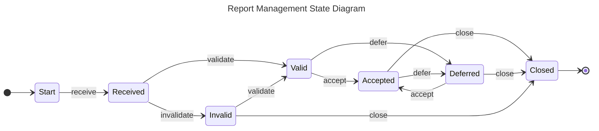

```mermaid
---
title: Report Management State Diagram
---
stateDiagram-v2
    direction LR
    S: Start
    R: Received
    I: Invalid
    V: Valid
    D: Deferred
    A: Accepted
    C: Closed

    [*] --> S
    S --> R : receive
    R --> I: invalidate
    R --> V : validate
    I --> V : validate
    V --> A : accept
    V --> D : defer
    A --> D : defer
    D --> A : accept
    A --> C : close
    D --> C : close
    I --> C : close
    C --> [*]
```
