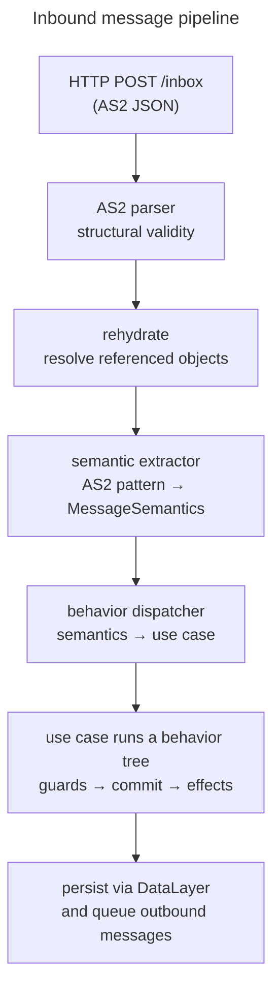

# Reference Implementation Architecture

This page explains how the Vultron reference implementation is structured.
It is written for practitioners who want to understand the code before reading it: Coordinated Vulnerability Disclosure (CVD) practitioners evaluating adoption, software developers assessing the implementation, and contributors orienting to the layout.
It answers three questions: what the hexagonal boundary means, how an incoming message flows from Hyper Text Transfer Protocol (HTTP) delivery to behavior-tree execution, and what the reference implementation supplies versus what an adopter must build.

!!! note "Reference implementation, not the protocol"

    Vultron is a reference implementation of the CVD coordination protocol.
    The structure described here — hexagonal layering, an ActivityStreams Vocabulary 2.0 (AS2) inbox pipeline, behavior-tree orchestration — is one valid way to realize the protocol.
    The [Concept Taxonomy](../reference/vultron-taxonomy.md) separates the abstract protocol (vultron-core, vultron-wire, vultron-transport) from any implementation of it.
    Other implementations may make different choices and still conform.

---

## The core, wire, and adapter boundary

The reference implementation follows **Hexagonal Architecture** (Ports and Adapters), adopted in [ADR-0009](../adr/0009-hexagonal-architecture.md).
The domain logic sits in an inner circle that knows nothing about how messages arrive, how they are formatted, or where state is stored.
Everything external reaches the domain only through **ports** — typed interface contracts — and each port is fulfilled by an **adapter** at the edge.

The codebase splits into three concentric responsibilities.

| Layer | Python package | Owns | Must not import |
|---|---|---|---|
| Core | `vultron/core/` | Domain models, state machines, use cases, ports, behavior trees | `vultron/wire/`, `vultron/adapters/`, web frameworks |
| Wire | `vultron/wire/as2/` | AS2 vocabulary, structural parser, semantic extractor, activity factories | Core domain logic, web frameworks |
| Adapters | `vultron/adapters/` | HTTP inbox, CLI, persistence, outbound delivery, connectors | Core domain rules |

The wire format is a separate concern from the domain, not a subset of it.
AS2 was chosen because it maps cleanly to Vultron semantics ([ADR-0005](../adr/0005-activitystreams-vocabulary-as-vultron-message-format.md)), but that alignment does not make it a domain dependency.
Domain objects and their wire counterparts share a common base but form two structurally distinct branches: a strict core branch and a lenient wire branch ([ADR-0017](../adr/0017-domain-wire-object-separation.md)).
The core branch is authoritative and represents every field the wire can carry; the wire branch tolerates the loose, optional shapes that arrive over the network.

We keep this boundary for two reasons.
Wire formats change, and the domain logic should not have to change with them.
Parsing and shape validation are edge concerns, so pushing them out of the core keeps the state-machine logic small and testable.
The rule that core carries no wire or framework imports (ARCH-01-001) is enforced by ratchet tests under `test/architecture/`, so a violation fails continuous integration rather than merely drawing a review comment.

!!! note "vultron-core the concept versus `vultron/core/` the package"

    [vultron-core](../reference/vultron-taxonomy.md#vultron-core) names the abstract protocol.
    `vultron/core/` names the Python package that implements it here.
    The package is the reference realization of the concept, not the concept itself.

---

## From HTTP delivery to behavior tree: the inbox pipeline

An incoming message crosses every layer of the hexagon in one pass.
It arrives as AS2 JavaScript Object Notation (JSON) at an HTTP endpoint and leaves as a committed state change with any resulting messages queued for delivery.
The stages below each do one job and hand off to the next.

A driving adapter receives the request.
The HTTP inbox lives in `vultron/adapters/driving/fastapi/`, returns `202 Accepted` immediately, and runs the pipeline as a background task so the sender is never blocked.

The wire layer turns bytes into meaning.
The AS2 parser checks structural validity, `rehydrate()` resolves referenced objects into full inline objects, and the semantic extractor (`vultron/wire/as2/extractor/`) matches the activity against an ordered pattern registry to produce a domain-level `MessageSemantics` value.
The semantic extractor is the single place where AS2 structure becomes domain intent (ARCH-03-001), so the rest of the core never inspects wire shapes.

The core layer decides what to do.
The behavior dispatcher (`vultron/core/dispatcher.py`) maps the extracted semantics to a use case through a table lookup, and the use case runs the appropriate behavior tree.
Routing all inbound case activity through the [Case Actor](case_model.md#caseactor) is what lets a single behavior-tree execution produce a canonically ordered ledger entry ([ADR-0021](../adr/0021-caseactor-inbox-routing-canonical-ledger.md), [ADR-0022](../adr/0022-single-bt-execution-for-received-side-case-actor-routing.md)).
The design that moves this orchestration into a core module behind a typed `process_payload` seam is recorded in [ADR-0020](../adr/0020-inbox-bt-orchestration.md).

For the protocol-level view of what these messages mean to a participant, see [Protocol Event Flow](protocol_flow.md).

---

## Sending messages: the outbox

Outbound messages follow the mirror path.
A use case constructs a domain object, an activity factory in `vultron/wire/as2/factories/` renders it to a conformant AS2 activity, and a driven delivery adapter puts it on the wire.

Every actor communicates with every other actor over HTTP.
The reference implementation retired an earlier in-process shortcut so that co-located actors talk to each other exactly as remote actors would ([ADR-0042](../adr/0042-http-only-inter-actor-delivery.md)).
This keeps the transport uniform: the same JSON payload is deliverable whether the recipient is in the same process or across the internet.

Delivery is treated as unreliable and bounded.
The outbox retries with backoff, classifies `4xx` responses as terminal, and moves an activity to a dead-letter store once its per-activity attempt budget is exhausted rather than retrying forever ([ADR-0066](../adr/0066-outbox-terminal-state.md)).
An outbound activity always carries a non-empty `to:` field (OX-08-001) and full inline objects, because a recipient can only act on what it has received — it cannot read the sender's store (see the [Actor Knowledge Model](actor-knowledge-model.md)).

---

## Behavior trees drive the state transitions

Inside a use case, protocol-significant work runs as a **behavior tree** (BT).
A behavior tree is a hierarchy of nodes ticked from the root; each node returns *Success*, *Failure*, or *Running*, and the control-flow nodes above them compose those results into higher-level behavior.
Vultron uses this structure because CVD activities compose the same way: validate a report, propose an embargo, publish an advisory — each is a small tree that slots into a larger one ([ADR-0002](../adr/0002-model-processes-with-behavior-trees.md)).

On the received side, a tree runs guards first, commits the ledger entry, then fires effects, in that order (CLP-10-006).
A read or write of Report Management (RM), Embargo Management (EM), or Case State (CS) goes through a dedicated state node rather than touching state inline, which keeps every transition auditable.

This page stays at the summary level by design.
The [Behavior Logic](behavior_logic/index.md) section develops the trees in depth: the canonical tree structure, the per-domain subtrees for RM, EM, and the Do Work behaviors, and the node notation.
The behavior trees illustrate one conformant implementation; the protocol does not require an adopter to use them.

---

## Call-out points: where implementers plug in

A behavior tree can reach a step it cannot decide on its own: whether a report is credible, whether to accept an embargo proposal, or whether it is time to publish.
These are **call-out points** — locations where automated execution pauses and waits for an answer from an external service.

During development and simulation, a call-out point is filled by a **Fuzzer Node** that returns a probabilistic success or failure.
In production, an adopter replaces that stub with a real service that satisfies one of five **capability shapes** — Sentinel, Evaluator, Retriever, Composer, or Actuator ([ADR-0024](../adr/0024-coordination-agent-taxonomy.md)).
In the hexagonal layout, a capability shape is a port and a concrete capability is the adapter that fulfills it.

Not every external question is a call-out point.
A question that needs a decision from *another actor* — for example, whether the Case Owner approves a change — cannot be answered while the tree is running, so the actor sends a request and finishes instead of pausing (see [when an actor must ask permission](protocol_flow.md#when-an-actor-must-ask-permission)).

The [Capability Model](capability_model/index.md) page is the full taxonomy: the two integration surfaces, the five shapes, and the catalog of known call-out points by domain.

---

## What the reference implementation provides, and what you supply

The extension boundary is the set of ports.
The reference implementation provides the protocol machinery: the five state machines, the wire vocabulary and its semantic mapping, the inbox and outbox pipelines, the behavior trees that orchestrate transitions, and the persistence and delivery adapters that make a local actor run.
What an adopter supplies are the capabilities behind the call-out points — the judgment and the connections to outside systems that the protocol deliberately leaves open.

This division tracks the protocol's conformance levels.
Correct message syntax and correct state transitions (levels L1 and L2) come from using a conformant serializer and implementing the state machines.
Correct observable behavior (L3) is stated by the behavioral conformance specifications.
Correct internal decision structure — precondition checks before state writes before effects, audit-log ordering, idempotency — is level L4, which is only demonstrable through a reference implementation, and the `vultron/core/behaviors/` behavior-tree layer is that demonstration.
The [Process Implementation Notes](../howto/process_implementation.md#conformance-levels) how-to develops the L1–L4 framing and how to map the protocol onto an existing workflow system.

An adopter therefore has a spectrum of choices.
A minimal participant reuses the protocol machinery and supplies only the capabilities it needs.
A different-language implementation reuses the concepts — the boundary, the pipeline stages, the port seam — without reusing this code at all.

---

## Further reading

- [The Case Model](case_model.md) — the domain objects the pipeline reads and writes
- [Protocol Event Flow](protocol_flow.md) — what the messages mean to a participant
- [Behavior Logic](behavior_logic/index.md) — the behavior trees in depth
- [Capability Model](capability_model/index.md) — the call-out point taxonomy and how to build a capability
- [Concept Taxonomy](../reference/vultron-taxonomy.md) — vultron-core, vultron-wire, and vultron-transport as distinct concepts
- [Process Implementation Notes](../howto/process_implementation.md) — integrating the protocol into an existing workflow system
- [ADR-0009](../adr/0009-hexagonal-architecture.md) — Adopt Hexagonal Architecture
- [ADR-0017](../adr/0017-domain-wire-object-separation.md) — Domain/Wire Object Separation
