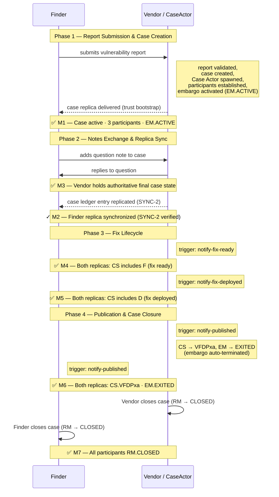

# Tutorial: Run the FV Demo

In this tutorial, we will run the **FV CVD demo** end-to-end using
Docker Compose. This demo models a complete Coordinated Vulnerability
Disclosure (CVD) workflow between a Finder (vulnerability reporter) and a
Vendor (software maintainer).

By the end of this tutorial, we will have:

- started a multi-container Vultron stack (Finder, Vendor, Coordinator,
  Case Actor, and Vendor2) representing distinct CVD participants,
- watched the actors exchange ActivityStreams messages across container
  boundaries driven by trigger-based puppeteering, and
- followed the case through all seven milestones: report submission, case
  bootstrap, replica sync, notes exchange, fix lifecycle, public disclosure,
  and case closure.

!!! info "What we will learn"

    The FV demo exercises the **full VFDPxa lifecycle**: a case moves
    from report submission all the way through fix-ready, fix-deployed, public
    disclosure, embargo teardown, and case closure on both participant replicas.

    The demo runner calls trigger endpoints on each actor's own container so
    that each actor's behavior tree and outbox logic are exercised end-to-end.
    Activities flow from sender outbox to receiver inbox over HTTP across the
    Docker network — this is the full Vultron Protocol, not a simulation.

---

## Prerequisites

We need the following tools installed before we begin:

- [Docker](https://docs.docker.com/get-docker/){:target="_blank"} (version
  20.10 or later)
- [Docker Compose](https://docs.docker.com/compose/install/){:target="_blank"}
  (version 2.x; included with Docker Desktop)
- Git (to clone the repository)

We do **not** need Python installed locally; the containers include everything
required.

---

## Step 1 — Clone the repository

First, let's get a local copy of the Vultron project:

```bash
git clone https://github.com/CERTCC/Vultron.git
cd Vultron
```

!!! tip

    If you already have a local clone, `cd` into the repository root and run
    `git pull` to make sure you are up to date.

---

## Step 2 — Create the environment file

Before running any `docker compose` command, create a local `.env` file from
the provided example:

```bash
cp docker/.env.example docker/.env
```

This sets the Docker Compose project name and is required for container,
network, and volume naming to work correctly.

---

## Step 3 — Run the demo

From the repository root, run:

```bash
docker compose -f docker/docker-compose-multi-actor.yml \
    up --abort-on-container-exit demo-runner
```

The FV scenario is the **default** — no `DEMO` environment variable is
required.

Docker builds the images on the first run (this takes a few minutes). On
subsequent runs, it reuses the cached images and starts immediately.

Once running, the demo runner:

1. waits for all actor containers to pass their health checks,
2. resets container state and seeds actor records,
3. steps through the six demo phases, logging progress and verifying each
   milestone, and
4. exits with code `0` on success or non-zero on failure.

!!! success "Success indicator"

    Look for this line at the end of the output:

    ```text
    TWO-ACTOR DEMO COMPLETE ✓  (VFDPxa full lifecycle)
    ```

---

## What happens: the four narrative phases

The demo progresses through **four narrative phases**, verified by seven
milestones (M1–M7). The sequence diagram below shows the key protocol state
changes at each phase.

### Sequence diagram



### Phase 1 — Report submission and case creation (M1)

The Finder submits a vulnerability report to the Vendor. The Vendor's behavior
tree validates the report, creates a `VulnerabilityCase`, spawns a Case Actor,
adds the Finder and Case Actor as participants, and activates the default
embargo (EM → ACTIVE). The Vendor delivers a case replica to the Finder via
trust bootstrap.

**M1 verified when:**
Vendor and Finder containers each hold a case record with at least three
participants (Vendor, Finder, Case Actor) and an active embargo.

### Phase 2 — Notes exchange and replica sync (M3, M2)

The Finder sends a question note to the case, which the Case Actor broadcasts
to all participants. The Vendor replies, and the Case Actor broadcasts the
reply back.

**M3 verified when:** Vendor container holds the authoritative final case
state after the notes exchange.

Next, the demo runner triggers the Vendor to commit a `CaseLedgerEntry` and
deliver it to the Finder via the outbox (SYNC-2 replication verification).
The Finder waits for the log entry to appear in its DataLayer.

!!! note "Milestone order in the log output"

    M3 appears in the log **before** M2. The notes-exchange phase runs first,
    then SYNC-2 verification runs immediately after.

**M2 verified when:** Finder's DataLayer contains the replicated log entry.

### Phase 3 — Fix lifecycle (M4–M5)

The demo runner triggers the Vendor to report two successive fix-status
transitions:

1. **Fix ready** (`CS.VFd`) — the Vendor's participant status is updated
   and both replicas are verified.
2. **Fix deployed** (`CS.VFD`) — the Vendor's participant status is updated
   again and both replicas are re-verified.

**M4 verified when:** Both replicas show the case state includes `F`
(fix ready).

**M5 verified when:** Both replicas show the case state includes `D`
(fix deployed).

### Phase 4 — Publication and case closure (M6–M7)

The Vendor notifies that the vulnerability has been publicly disclosed
(`CS.VFDPxa`). The Case Actor detects the `CS.P` event from the Case Owner
and automatically terminates the embargo (EM → EXITED). The Finder then also
triggers `notify-published`, updating its own participant status to `CS.VFDPxa`.
Both replicas are verified.

The Vendor then closes its case (RM → CLOSED) and the Finder closes its
replica (RM → CLOSED). The Case Actor auto-closes when all participants are
closed.

**M6 verified when:** Both replicas show `CS.VFDPxa` and `EM.EXITED`.

**M7 verified when:** All participants on both replicas are `RM.CLOSED`.

---

## Reading the activity log

The demo runner logs all activity to stdout with structured markers. Use the
milestone lines as anchor points when reading the output.

| Marker | What it means |
|:-------|:--------------|
| `✅ M1:` | Case active: required participants and EM.ACTIVE confirmed on both replicas |
| `✅ M3:` | Vendor container holds the authoritative final case state |
| `✓ M2:` | Finder DataLayer synchronized (SYNC-2 verified) |
| `✅ M4:` | Both replicas show CS includes F (fix ready) |
| `✅ M5:` | Both replicas show CS includes D (fix deployed) |
| `✅ M6:` | Both replicas: CS.VFDPxa and EM.EXITED confirmed |
| `✅ M7:` | All participants RM.CLOSED on both replicas |

!!! note "M3 appears before M2"

    The notes-exchange phase (M3) runs before the SYNC-2 verification phase
    (M2) in the demo execution order, so `✅ M3:` will appear in the log
    before `✓ M2:`.

Between milestones, look for these log line prefixes:

| Prefix | Meaning |
|:-------|:--------|
| `🚥 <description>` | A demo step is starting |
| `🟢 <description>` | A demo step completed successfully |
| `🔴 <description>` | A demo step failed (see Troubleshooting) |
| `📋 <description>` | A demo check is starting |
| `✅ <description>` | A demo check passed |
| `❌ <description>` | A demo check failed (see Troubleshooting) |

A successful run ends with:

```text
================================================================================
TWO-ACTOR DEMO COMPLETE ✓  (VFDPxa full lifecycle)
================================================================================
```

---

## Troubleshooting

### The demo-runner exits immediately with an error

The actor containers may not have finished starting up. Verify all five
actor services are healthy:

```bash
docker compose -f docker/docker-compose-multi-actor.yml \
    ps finder vendor coordinator case-actor vendor2
```

All five should show `healthy` status. If any service shows `starting` or
`unhealthy`, wait a moment and retry.

### A milestone check fails with `❌`

Read the failure message for the check that failed. Check the demo-runner
and actor logs for errors:

```bash
docker compose -f docker/docker-compose-multi-actor.yml logs demo-runner
docker compose -f docker/docker-compose-multi-actor.yml logs vendor
docker compose -f docker/docker-compose-multi-actor.yml logs finder
docker compose -f docker/docker-compose-multi-actor.yml logs coordinator
```

Look for `ERROR` or `500` status lines that correspond to the failing step.

### Docker images are stale after a code change

Force a rebuild:

```bash
docker compose -f docker/docker-compose-multi-actor.yml \
    build --no-cache demo-runner
```

### The demo fails partway through and leaves volumes dirty

Clean up volumes before retrying:

```bash
docker compose -f docker/docker-compose-multi-actor.yml down -v
```

---

## Step 4 — Clean up

Named Docker volumes persist the SQLite databases between runs. Remove all
volumes after a session to start fresh next time:

```bash
docker compose -f docker/docker-compose-multi-actor.yml down -v
```

---

## What we accomplished

We have:

- cloned the Vultron repository and started a multi-container Vultron stack
  (Finder, Vendor, Coordinator, Case Actor, and Vendor2),
- run a complete CVD workflow from report submission through case closure,
  exercising the full VFDPxa lifecycle, and
- observed the seven milestones (M1–M7) logged and verified by the demo
  runner in real time.

---

## Next steps

- **Run the other container scenarios** — see
  [Running the Multi-Actor Container Demos](container_demos.md) to run
  three-actor and multi-vendor workflows.
- **Understand the message-level protocol** — the
  [FV Demo Protocol Reference](../reference/fv-demo-protocol.md)
  documents every ActivityStreams activity exchanged during this demo,
  including sequence diagrams, per-phase narratives, and example AS2 JSON
  payloads.
- **Read the scenario source** — the demo script is at
  `vultron/demo/scenario/fv_demo.py`; shared helpers are in
  `vultron/demo/helpers/`.
- **Explore the single-container demos** — see
  [Run the Receive-Report Demo](receive_report_demo.md) and
  [Running the Other Demos](other_demos.md) to step through individual
  protocol activities.
