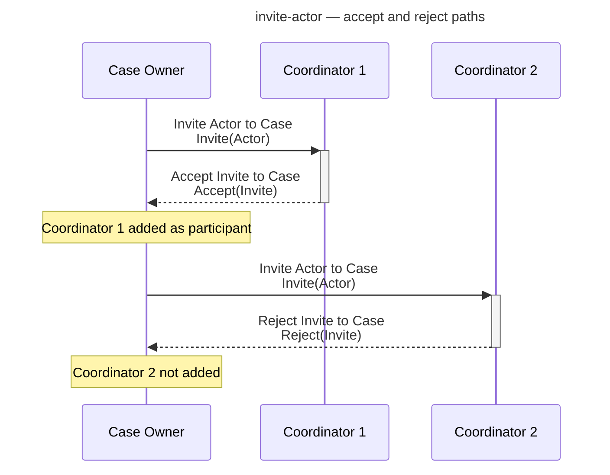
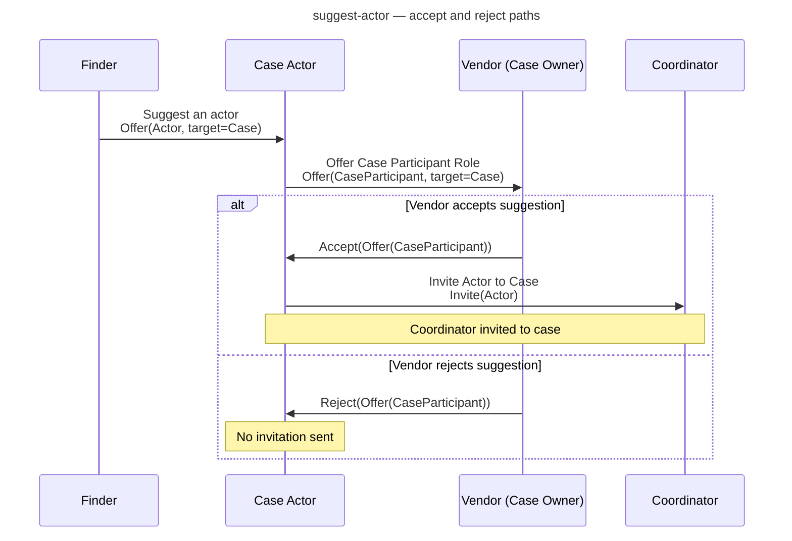
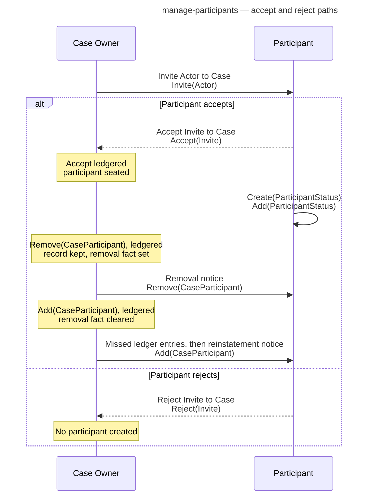
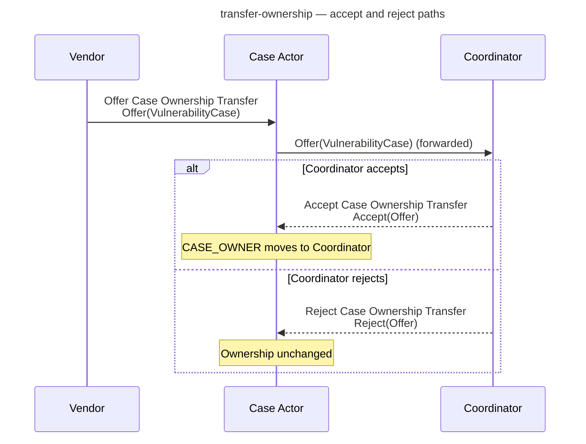
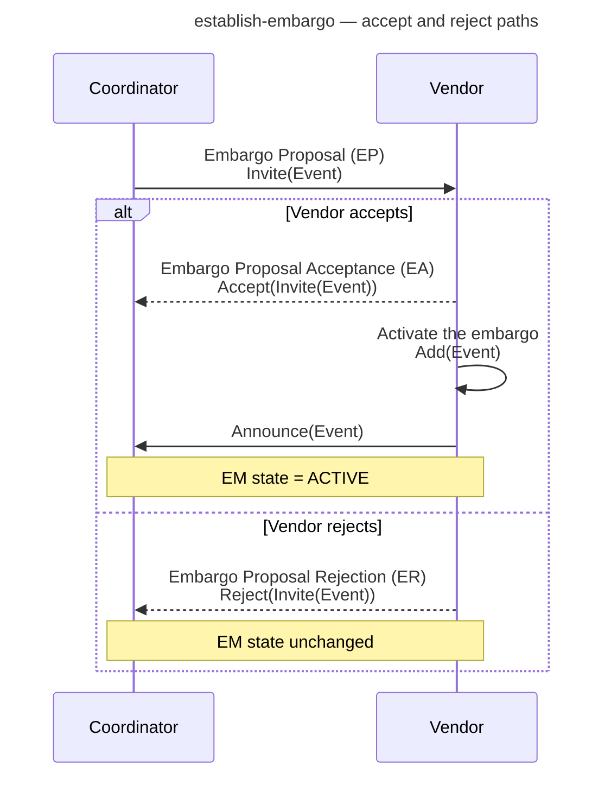
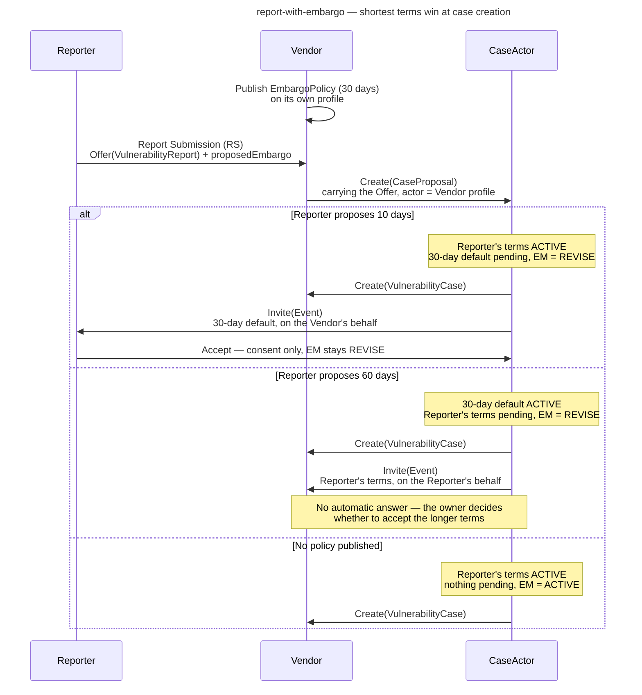
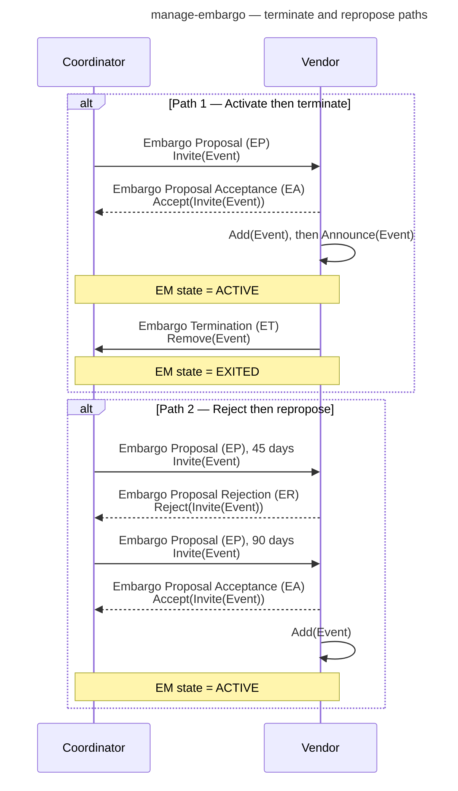
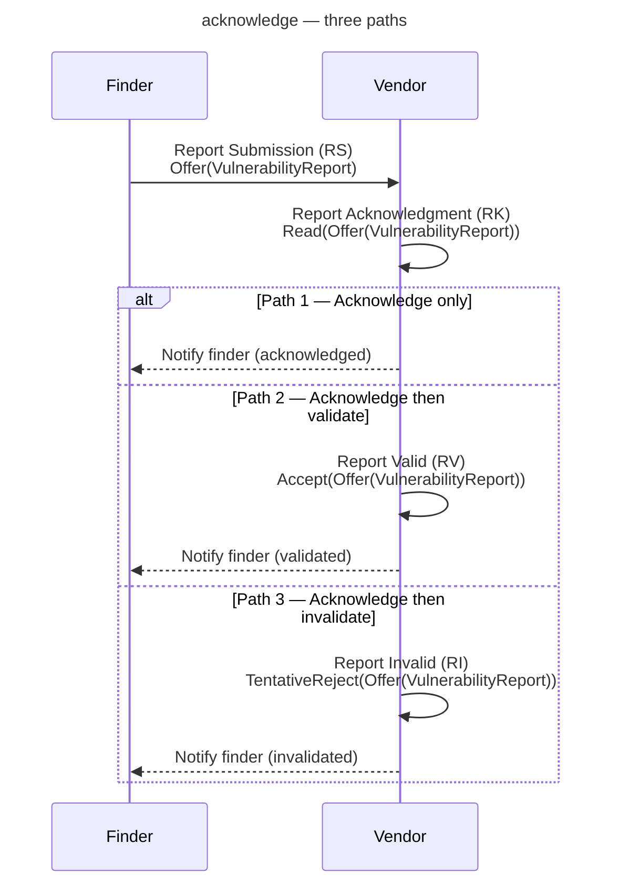
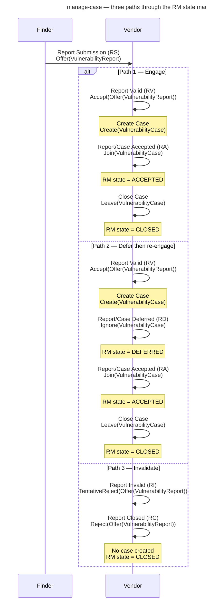

# Tutorial: Running the Other Demos

In this tutorial, we will run the remaining Vultron demo sub-commands end to end inside the demo container.
By the end of this tutorial, we will have explored:

- case initialization and participant management,
- actor invitation, suggestion, and ownership transfer,
- embargo establishment and lifecycle management,
- acknowledgment, status updates, and notes,
- the full Report Management (RM) case lifecycle, and
- the trigger endpoints an actor uses to act on its own initiative.

!!! info "What we will learn"

    Each demo sub-command exercises a focused slice of the Vultron Protocol.
    This tutorial introduces all of them except `receive-report`, which is covered in [Run the Receive-Report Demo](receive_report_demo.md).
    Each exchange is named here by its formal protocol message and its ActivityStreams wire form, the same names the [How-to guides](../howto/activitypub/activities/index.md) use, so you can move between the log output and the guides.

---

## Prerequisites

You need the following tools installed before we begin:

- [Docker](https://docs.docker.com/get-docker/){:target="_blank"} (version 20.10 or later)
- [Docker Compose](https://docs.docker.com/compose/install/){:target="_blank"} (version 2.x; included with Docker Desktop)
- Git (to clone the repository)

You do **not** need Python installed locally; the containers include everything required.

This tutorial continues from [Run the Receive-Report Demo](receive_report_demo.md), which clones the repository and opens a shell in the demo container.
If you still have that container shell open, skip Step 1.

---

## Step 1 — Start the demo container

If you exited the container after the previous tutorial, start it again from the repository root:

```bash
docker compose -f docker/docker-compose.yml run --rm demo
```

After the images are built and the API server is healthy, you should see a container shell prompt:

```text
root@<container-id>:/app#
```

All commands in the remaining steps are run inside this container shell.

---

## Step 2 — Case initialization

### initialize-case

```bash
vultron-demo initialize-case
```

This demo walks through the steps a vendor takes to open a new case after receiving a report: create the case, which seats the vendor as Case Owner and CASE_MANAGER, link the report to the case, and invite the finder, which joins when it accepts.

See [How to Initialize a Case](../howto/activitypub/activities/initialize_case.md) for the full activity-by-activity walkthrough.

### initialize-participant

```bash
vultron-demo initialize-participant
```

This demo shows how a participant joins an existing case.
The vendor asks the CaseActor to invite a coordinator, and the coordinator joins by accepting the Invite.
Notice how the vendor's own copy of the case gains the coordinator from the ledger entry for the `Accept`, with no other message.

See [How to Seat a Participant on an Existing Case](../howto/activitypub/activities/initialize_participant.md) for details.

---

## Step 3 — Actor management

### invite-actor

```bash
vultron-demo invite-actor
```

This demo shows two invitation outcomes.
The Case Owner invites a coordinator, who **accepts** and is added to the case; then it invites a second coordinator, who **rejects** and is not added.
Notice the log lines showing the Invite Actor to Case, `Invite(Actor)`, and the answering `Accept(Invite)` or `Reject(Invite)`.



In a multi-actor deployment the invitation is sent by the Case Actor on the owner's behalf, and the answer goes back to the Case Actor.
See [How to Invite an Actor to a Case](../howto/activitypub/activities/invite_actor.md) for that exchange.

### suggest-actor

```bash
vultron-demo suggest-actor
```

This demo shows a finder *suggesting* a coordinator for the case.
The suggestion goes to the Case Actor, which forwards it to the Case Owner as a proposed participant.
Two paths are demonstrated: the vendor **accepts** the suggestion, and the Case Actor invites the coordinator; or the vendor **rejects** it, and no invitation is sent.



See [How to Suggest an Actor for a Case](../howto/activitypub/activities/suggest_actor.md) for the corresponding activity descriptions.

### manage-participants

```bash
vultron-demo manage-participants
```

This demo combines the full participant lifecycle: invite, accept, record a participant status, remove the participant from active participation, and reinstate it.
The vendor is both Case Owner and CASE_MANAGER here, so the removal and the reinstatement are the owner's requests to itself.
The participant receives the CASE_MANAGER's direct notice of each, and its record stays on the case throughout.
A second path shows the rejection outcome.
Each step is logged so we can follow the state changes.



See [How to Manage a Case Roster](../howto/activitypub/activities/manage_participants.md) for details.

### transfer-ownership

```bash
vultron-demo transfer-ownership
```

This demo shows case ownership transfer.
The current owner (the vendor) offers the case to a coordinator, who either **accepts**, so the case's `attributedTo` moves to the coordinator, or **rejects**, so ownership stays with the vendor.

Every message goes through the Case Actor, which holds the CASE_MANAGER role, so that the ledger records the transfer and every participant learns of it.



See [Ownership Transfer](../topics/case_lifecycle/ownership_transfer.md) for why the transfer is routed this way, and [Case Management Messages](../reference/messages/case_management.md) for the wire format.

---

## Step 4 — Embargo management

### establish-embargo

```bash
vultron-demo establish-embargo
```

This demo exercises embargo negotiation.
A coordinator proposes embargo terms with an Embargo Proposal (EP), `Invite(Event)`.
The vendor either **accepts** with an Embargo Proposal Acceptance (EA), `Accept(Invite(Event))`, then activates the embargo on the case with `Add(Event)` and announces it with `Announce(Event)`, so the Embargo Management (EM) state becomes `ACTIVE`; or **rejects** with an Embargo Proposal Rejection (ER), `Reject(Invite(Event))`, and the EM state does not change.



See [How to Establish an Embargo](../howto/activitypub/activities/establish_embargo.md) for background.

### report-with-embargo

```bash
vultron-demo report-with-embargo
```

This demo exercises the negotiated embargo path, which no other demo reaches.
The Reporter proposes embargo terms *with* the report: the Report Submission (RS), `Offer(VulnerabilityReport)`, carries a proposed `EmbargoEvent` as `proposedEmbargo`, sent through the `submit-report` trigger's `proposed_embargo_end_time`.
The recipient's default is the `EmbargoPolicy` on its own actor profile, published through `PUT /actors/{actor_id}/embargo-policy` (EP-04-003).
The recipient sends that profile inline as the `actor` of its case proposal, and the CaseActor reads the default from there (CP-01-010).
When the case is created, the shorter of the two becomes the active embargo and the longer is left pending as a revision, so the EM state is `REVISE`; when the recipient has published no default, the Reporter's terms apply at their stated length and the EM state is `ACTIVE`.
No proposal exchange precedes the case: the comparison is settled at case creation.
The CaseActor then relays the pending revision to the party whose terms won, on behalf of the party whose terms lost (EP-04-011).
When the Reporter proposed 60 days, that party is the Vendor, the case owner.
The protocol requires no automatic answer, so the Vendor's 30-day default stays active and the Reporter's longer terms stay pending until the owner answers; the case stays at `REVISE`.
When the Reporter proposed 10 days, the Reporter is invited instead, and its acceptance only records consent, so the case also stays at `REVISE`.



See [How to Report a Vulnerability](../howto/activitypub/activities/report_vulnerability.md#submit-a-report) for the Offer that carries the terms, and [Default Embargoes](../topics/process_models/em/defaults.md) for why the shorter terms win.

### manage-embargo

```bash
vultron-demo manage-embargo
```

This demo continues from an active embargo.
Two paths are shown:

1. **Activate and terminate**: the coordinator proposes, the vendor accepts and activates, and the vendor then ends the embargo with an Embargo Termination (ET), `Remove(Event)`, which moves the EM state to `EXITED`.
2. **Reject and repropose**: the coordinator proposes 45-day terms, the vendor rejects them, the coordinator proposes 90-day terms as a new proposal, and the vendor accepts and activates.



The second proposal in Path 2 is a new Embargo Proposal (EP) rather than an Embargo Revision Proposal (EV), because there is no active embargo to revise when it is sent.

See [How to Revise or Terminate an Embargo](../howto/activitypub/activities/manage_embargo.md) for details.

---

## Step 5 — Acknowledgment, status, and notes

### acknowledge

```bash
vultron-demo acknowledge
```

This demo shows how a vendor acknowledges receipt of a report without committing to an outcome, using a Report Acknowledgment (RK), `Read(Offer(VulnerabilityReport))`.
Three paths are demonstrated:

1. **Acknowledge only** — acknowledge, then notify the finder.
2. **Acknowledge then validate** — acknowledge, then a Report Valid (RV), `Accept(Offer(VulnerabilityReport))`, then notify the finder.
3. **Acknowledge then invalidate** — acknowledge, then a Report Invalid (RI), `TentativeReject(Offer(VulnerabilityReport))`, then notify the finder.



See [Acknowledge a Report](../howto/activitypub/activities/acknowledge.md) for the corresponding activity descriptions.

### status-updates

```bash
vultron-demo status-updates
```

This demo shows two workflows for updating a case record:

1. **Notes** — the vendor creates a `Note`, adds it to the case with `Add(Note)`, and then removes it again with `Remove(Note)`.
2. **Status** — the vendor creates a `CaseStatus` and adds it to the case, then creates a `ParticipantStatus` and adds it to its own participant record with `Add(ParticipantStatus)`.

A participant status update is how an actor reports its own Case State (CS) progress: Vendor Awareness (CV), Fix Readiness (CF), and Fix Deployed (CD) are all `Add(ParticipantStatus)` activities.

See [How to Post a Status Update or a Case Note](../howto/activitypub/activities/status_updates.md) for details.

---

## Step 6 — Full RM case lifecycle

### manage-case

```bash
vultron-demo manage-case
```

This demo exercises the Report Management (RM) state machine from submission through closure.
Three paths are shown:

1. **Engage path** — submit, validate, create the case, engage, close.
2. **Defer and re-engage path** — submit, validate, create the case, defer, re-engage, close.
3. **Invalidate path** — submit, invalidate, close the report.

Notice the RM state transitions logged at each step, and notice that the two closures differ: a case is closed with `Leave(VulnerabilityCase)`, while a report that never became a case is closed with a Report Closed (RC), `Reject(Offer(VulnerabilityReport))`.



See [Manage a Case](../howto/activitypub/activities/manage_case.md) for the corresponding activity descriptions and the RM state ladder.

---

## Step 7 — Trigger endpoints

### trigger

```bash
vultron-demo trigger
```

Every demo so far posted activities to an inbox, which is how an actor *reacts* to another actor.
This demo shows the other direction: an actor *initiates* a protocol behavior from its own state by calling one of its trigger endpoints, and the actor's behavior tree builds the activity and queues it for delivery.
Two workflows are shown:

1. **Validate and engage** — the finder submits a report; the vendor then calls `POST /actors/{actor_id}/trigger/validate-report` and `POST /actors/{actor_id}/trigger/engage-case`.
2. **Invalidate and close** — the finder submits a second report; the vendor calls `trigger/invalidate-report` and then `trigger/close-report`.

Notice that each trigger response carries the ActivityStreams activity the actor produced, and that the activity appears in the vendor's outbox.
This is the mechanism the multi-actor container demos use to drive every actor; see [Running the Multi-Actor Container Demos](container_demos.md).

See the [Trigger API](../reference/trigger-api.md) reference for every trigger endpoint.

---

## Step 8 — Run all demos in sequence

To run every demo in the standard order, use the `all` sub-command:

```bash
vultron-demo all
```

The `all` sub-command runs each demo in turn and prints a summary table when it finishes:

```text
==================================================
Demo Summary
==================================================
  receive-report                        ✅ PASS
  initialize-case                       ✅ PASS
  ...
  trigger                               ✅ PASS
==================================================
  <passed>/<total> demos passed
==================================================
```

A demo that raised an exception is listed as `❌ FAIL` with the error.

---

## Step 9 — Exit the container

When you are finished, type `exit` to leave the container shell:

```bash
exit
```

Stop the API server with:

```bash
docker compose -f docker/docker-compose.yml down
```

---

## What we accomplished

We have:

- run every remaining Vultron demo sub-command, covering the major protocol workflows,
- observed how the Vultron Protocol handles case initialization, actor management, embargo negotiation, the RM state machine, and trigger-driven behavior, and
- run the complete demo suite in one shot using `vultron-demo all`.

---

## Next steps

- **Understand the protocol** — browse the [Vultron AS Activity Guides](../howto/activitypub/activities/index.md) for task guides covering everything we observed.
- **See the protocol run across containers** — [Running the Multi-Actor Container Demos](container_demos.md) drives whole cases across isolated actors using the trigger endpoints.
- **Explore the demo scripts** — the exchange demos are in `vultron/demo/exchange/`; shared utilities are in `vultron/demo/utils.py`.
- **Read the demo README** — `vultron/demo/README.md` describes the demo architecture and available sub-commands.
