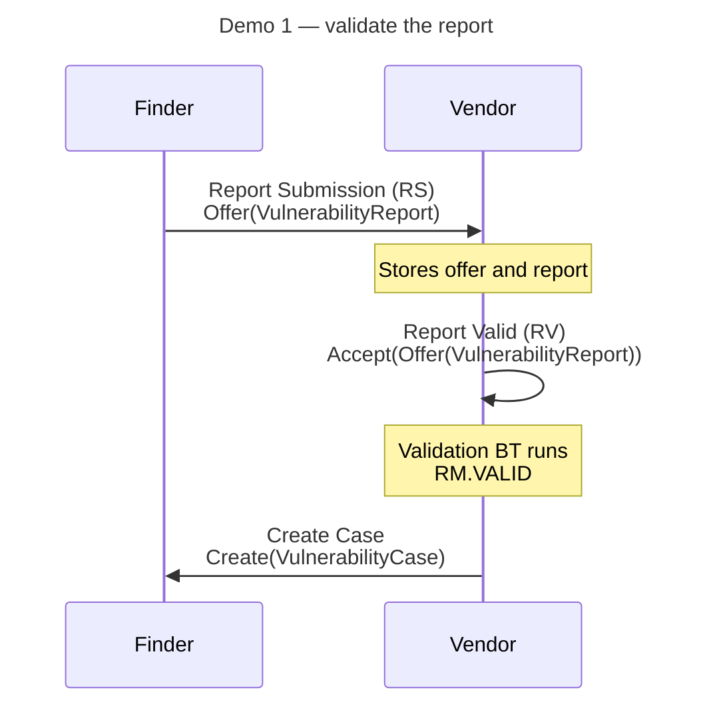
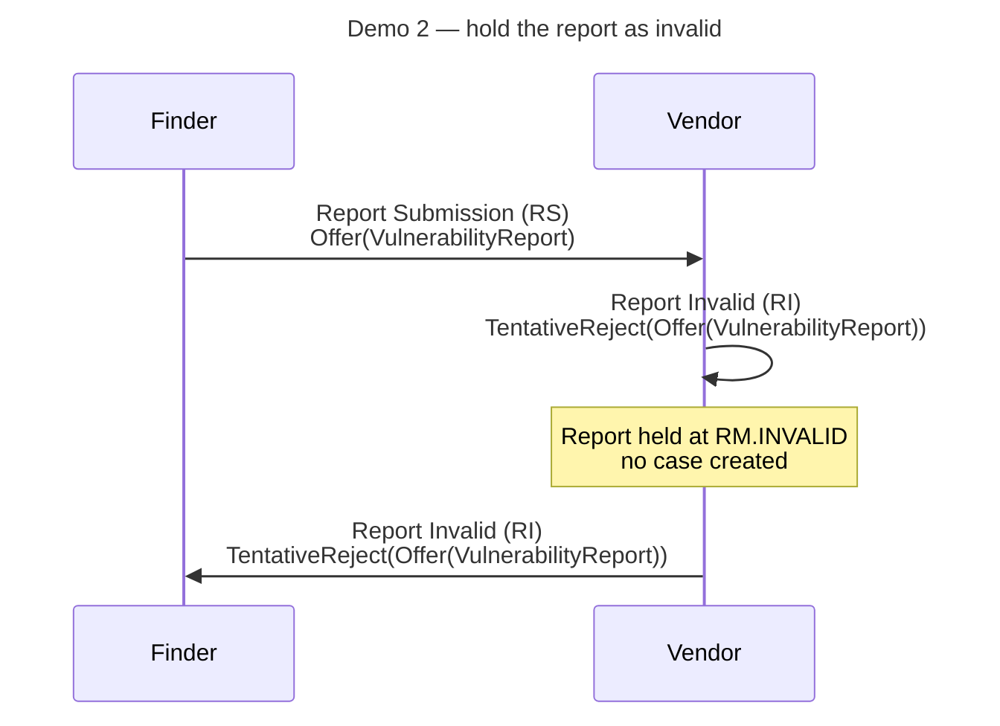
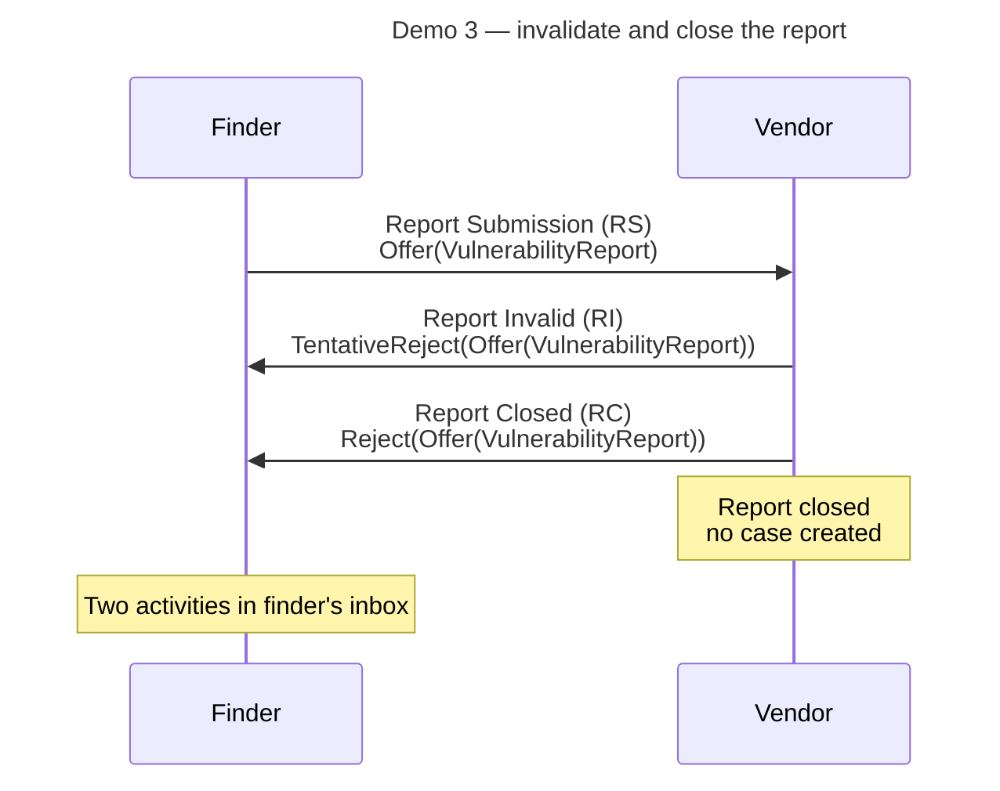

# Tutorial: Run the Receive-Report Demo

In this tutorial, we will run the Vultron `receive-report` demo end-to-end
using Docker Compose. By the end of this tutorial, we will have:

- started a local Vultron API server,
- run three vulnerability-report workflows, and
- observed how a vendor accepts, invalidates, and closes reports in the
  Vultron protocol.

!!! info "What we will learn"

    This tutorial focuses on the *receive-report* workflow: a finder submits a vulnerability report to a vendor, and the vendor decides what to do with it.
    We will run all three outcomes — accept (validate), hold (invalidate), and reject-and-close — and read the structured log output to understand what happened at each step.
    The vendor's decision is a move in the [Report Management (RM)](../topics/process_models/rm/index.md) state machine, and each move has a formal message name and an ActivityStreams wire form.
    The demo log prints the wire form; this page names both.

---

## Prerequisites

We need the following tools installed before we begin:

- [Docker](https://docs.docker.com/get-docker/){:target="_blank"} (version
  20.10 or later)
- [Docker Compose](https://docs.docker.com/compose/install/){:target="_blank"}
  (version 2.x; included with Docker Desktop)
- Git (to clone the repository)

We do **not** need Python installed locally; the containers include everything
required.

---

## Step 1 — Clone the repository

First, let's get a local copy of the Vultron project:

```bash
git clone https://github.com/CERTCC/Vultron.git
cd Vultron
```

!!! tip

    If you already have a local clone, `cd` into the repository root and run
    `git pull` to make sure you are up to date.

---

## Step 2 — Start the demo container

The `demo` container depends on the `api-dev` container. Docker Compose starts
both automatically and waits until the API server is healthy before launching
the demo shell.

```bash
docker compose -f docker/docker-compose.yml run --rm demo
```

After the images are built (this takes a few minutes the first time), we
should see a shell prompt inside the container:

```text
root@<container-id>:/app#
```

Notice that both the `api-dev` and `demo` containers are now running.
The `api-dev` container exposes the Vultron API at
`http://localhost:7999/api/v2`.

---

## Step 3 — Run the receive-report demo

Inside the container shell, run:

```bash
vultron-demo receive-report
```

The demo runs three separate workflows in sequence.
Each step begins with a `🚥` marker and ends with either `🟢` (success) or `🔴` (failure).
Verification checks are marked with `📋` (start) and `✅` (pass) or `❌` (fail).

Each workflow ends with its own completion line, for example:

```text
✅ DEMO 1 COMPLETE: Report validated, case created, and finder notified via inbox.
```

If any step or check failed, the demo prints a failure summary after the last workflow.

---

## Step 4 — Read the output

Let's look at what happened in each workflow.

### Demo 1: Validate Report

```text
DEMO 1: Validate Report and Create Case
```

1. **Step 1** — The *finder* actor creates a `VulnerabilityReport` object and posts a Report Submission (RS), `Offer(VulnerabilityReport)`, to the *vendor*'s inbox.
   Notice the log lines showing that the offer and the report are both stored in the DataLayer.

2. **Step 2** — The *vendor* posts a Report Valid (RV), `Accept(Offer(VulnerabilityReport))`, to its own inbox, which runs the validation behavior tree and moves the report to `RM.VALID`.
   Notice the log line confirming the activity was stored.

3. **Step 3** — The vendor looks up the case that was opened for the report and posts a Create Case, `Create(VulnerabilityCase)`, to the *finder*'s inbox to tell the finder that a case now exists.
   Notice the final ✅ confirming the activity appears in the finder's inbox.



### Demo 2: Invalidate Report

```text
DEMO 2: Invalidate Report (Hold for Reconsideration)
```

The finder submits a second, separate report.
The vendor responds with a Report Invalid (RI), `TentativeReject(Offer(VulnerabilityReport))`, meaning the report is held open for further investigation rather than closed outright.
The report sits at `RM.INVALID`, and the vendor sends the same activity to the finder so the finder learns the decision.
Notice that no case is created this time: in this demo the vendor opens a case only for a report it has found valid (Demo 1, Step 3).



### Demo 3: Invalidate and Close Report

A third report is submitted.
The vendor first invalidates it with a Report Invalid (RI) and then closes it with a Report Closed (RC), `Reject(Offer(VulnerabilityReport))`, which is a full rejection.
`RM.CLOSED` is terminal, so this report is finished.
Notice that two separate activities appear in the finder's inbox at the end.



---

## Step 5 — Exit the container

When we are finished, type `exit` to leave the container shell:

```bash
exit
```

The `--rm` flag we passed in Step 2 ensures the container is removed
automatically on exit. The `api-dev` container will continue running;
stop it with:

```bash
docker compose -f docker/docker-compose.yml down
```

---

## What we accomplished

We have:

- started the Vultron API server and demo container with a single
  `docker compose run` command,
- run three vulnerability-report workflows covering the three main outcomes
  defined in the Report Management (RM) state machine, and
- read structured log output showing each step and verification check.

---

## Next steps

- **Run more demos** — see
  [Tutorial: Running the Other Demos](other_demos.md) to explore case
  initialization, embargo management, actor invitation, and more.
- **Understand the protocol** — read
  [How to Report a Vulnerability](../howto/activitypub/activities/report_vulnerability.md)
  for a detailed walkthrough of the activities we observed.
- **Explore the demo scripts** — the source for this demo is in
  `vultron/demo/exchange/receive_report_demo.py`; the shared utilities are in
  `vultron/demo/utils.py`.
- **See the formal names** — [Report Management (RM) Messages](../reference/messages/rm.md)
  maps each RM message to its ActivityStreams wire form.
- **Run all demos at once** — inside the demo container, run
  `vultron-demo all` to execute every demo in sequence.
