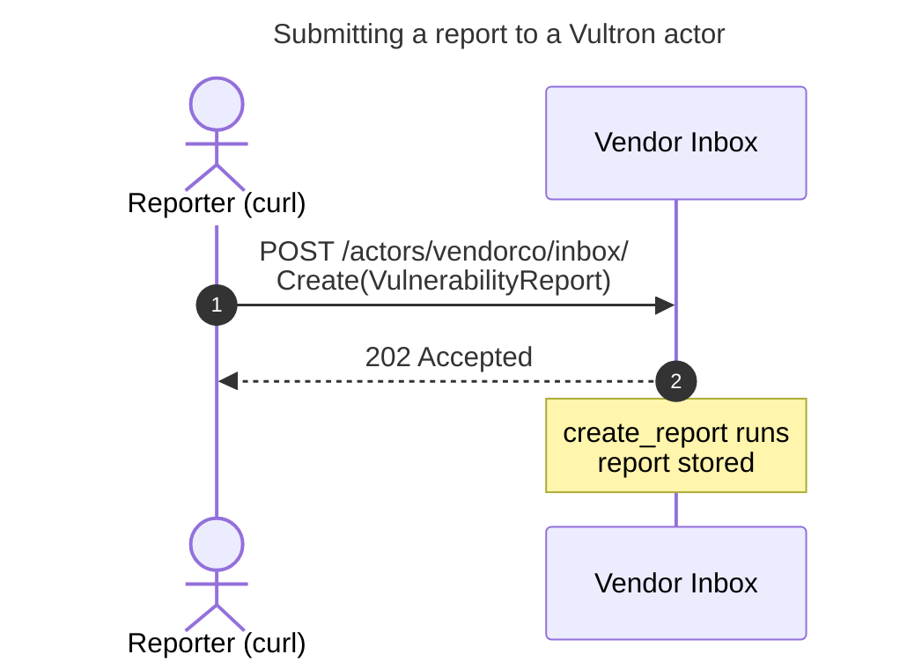

# Tutorial: Submit a report to a Vultron actor

In this tutorial, we will submit a vulnerability report to a running Vultron
actor and confirm that the actor received it.
We will start the reference implementation, create an actor to play the part of
a vendor, send that actor a `Create(VulnerabilityReport)` message, and read the
report back out of the actor's store.
This tutorial is for a developer who wants to see, first-hand, what it takes to
speak to a Vultron actor over the wire.

!!! info "What we will learn"

    Vultron actors exchange [ActivityStreams](../reference/glossary.md) messages
    over HTTP.
    We will construct one such message, post it to an actor's
    [Inbox](../reference/glossary.md), and watch the report land in the
    receiving actor's store.
    We will not cover the full report-management lifecycle here; the
    [Reporting a Vulnerability](../howto/activitypub/activities/report_vulnerability.md)
    how-to guide takes the story further.

    The commands and the message on this page are rendered from
    `vultron.wire.as2.vocab.examples.submit_report_tutorial`, the same module a
    test drives end-to-end, so what you copy here is what the code actually does.

---

## Prerequisites

You need the following before we begin:

- [uv](https://docs.astral.sh/uv/getting-started/installation/){:target="_blank"}
  (the project's Python runner; it manages its own virtual environment)
- [`curl`](https://curl.se/){:target="_blank"} (to send HTTP requests from a
  second terminal)
- Git (to clone the repository)

You do **not** need to install Python or any dependencies by hand; `uv run`
resolves them on first use.

---

## Step 1 — Clone the repository

First, get a local copy of the Vultron project:

```bash
git clone https://github.com/CERTCC/Vultron.git
cd Vultron
```

!!! tip

    If you already have a local clone, `cd` into the repository root and run
    `git pull` so you are up to date.

---

## Step 2 — Start the Vultron API server

From the repository root, start the reference API server:

```python exec="true" idprefix=""
from vultron.wire.as2.vocab.examples.submit_report_tutorial import render_server_command
print(render_server_command())
```

The first run downloads dependencies, so it may take a moment.
When the server is ready, you should see:

```text
INFO:     Application startup complete.
INFO:     Uvicorn running on http://127.0.0.1:7999 (Press CTRL+C to quit)
```

Leave this terminal running.
The server now serves the Vultron API at `http://localhost:7999/api/v2`.

Open a **second terminal** and confirm the server is live:

```python exec="true" idprefix=""
from vultron.wire.as2.vocab.examples.submit_report_tutorial import render_health_check
print(render_health_check())
```

The server responds with:

```json
{"status":"ok"}
```

!!! tip "Prefer containers?"

    You can also start the same API server with Docker Compose by running
    `docker compose -f docker/docker-compose.yml up api-dev`, which exposes the
    API at the same `http://localhost:7999/api/v2` address.
    The remaining steps are identical.
    See [Run the Receive-Report Demo](receive_report_demo.md) for the
    container-based tour.

---

## Step 3 — Create an actor to receive the report

A report has to be sent *to* someone, so we first create an actor to play the
part of a vendor.
Run this in the second terminal:

```python exec="true" idprefix=""
from vultron.wire.as2.vocab.examples.submit_report_tutorial import render_create_actor
print(render_create_actor())
```

The server responds with `201 Created` and the new actor record:

```json
{"id":"http://localhost:7999/api/v2/actors/vendorco","type":"Organization","name":"VendorCo","published":"2026-01-01T00:00:00+00:00","updated":"2026-01-01T00:00:00+00:00"}
```

Your `published` and `updated` timestamps will differ; everything else matches.
Notice that the actor's `id` is the URL that reaches it.
Its Inbox — the endpoint where it receives messages — is that same URL with
`/inbox/` appended.

---

## Step 4 — Submit the report

Now we send the vendor a `Create(VulnerabilityReport)` message.
This is an ActivityStreams Vocabulary 2.0 (AS2) activity: a `Create` activity
whose `object` is the `VulnerabilityReport` we are reporting.
The `to` field addresses the message to our vendor by its short id, `vendorco`:

```python exec="true" idprefix=""
from vultron.wire.as2.vocab.examples.submit_report_tutorial import render_payload
print(render_payload())
```

Post it to the vendor's Inbox:

```python exec="true" idprefix=""
from vultron.wire.as2.vocab.examples.submit_report_tutorial import render_submit_report
print(render_submit_report())
```

The server responds with `202 Accepted`:

```text
HTTP/1.1 202 Accepted
```

The `202 Accepted` status is the actor's acknowledgement.
It means the actor received the message and accepted it for processing.
Processing then happens in the background, so the response body is empty.

Switch to the terminal running the server.
You should see the actor process the report:

```text
INFO:     Dispatching activity of type 'VulnerabilityReport' with semantics 'create_report'
INFO:     BT execution completed: Status.SUCCESS after 1 ticks -
INFO:     Dispatch: dispatched create_report activity_id=urn:uuid:11111111-1111-1111-1111-111111111111
```

The following diagram shows the exchange we just completed: a reporter posts the
report to the vendor's Inbox, and the vendor acknowledges it.



---

## Step 5 — Confirm the actor received the report

The `202 Accepted` told us the actor accepted the message.
Let's confirm the vendor actually stored the report by reading its store back:

```python exec="true" idprefix=""
from vultron.wire.as2.vocab.examples.submit_report_tutorial import render_verify
print(render_verify())
```

The vendor returns the report we submitted, keyed by its `id`:

```python exec="true" idprefix=""
from vultron.wire.as2.vocab.examples.submit_report_tutorial import render_stored_report
print(render_stored_report())
```

The report, with our `content` of "I found a vulnerability!", is now in the
vendor's store.
The vendor received our report.

---

## Step 6 — Stop the server

When you are finished, return to the first terminal and press ++ctrl+c++ to stop
the server.

---

## What we accomplished

We have:

- started the Vultron reference implementation with a single `uv run` command,
- created an actor to receive a report,
- constructed a `Create(VulnerabilityReport)` AS2 message and posted it to that
  actor's Inbox, and
- confirmed, by reading the actor's store, that the report was received.

---

## Next steps

- **Go deeper on report submission** — read
  [Reporting a Vulnerability](../howto/activitypub/activities/report_vulnerability.md)
  to see how a report is validated, accepted, and turned into a Case, and how
  the `Offer(Report)` activity fits alongside `Create(Report)`.
- **See the full workflow run for you** — follow
  [Run the Receive-Report Demo](receive_report_demo.md) to watch a finder and a
  vendor exchange reports end-to-end with the demo CLI.
- **Read the source of these examples** — the commands and the message above
  come from `vultron/wire/as2/vocab/examples/submit_report_tutorial.py`, and the
  flow is verified end-to-end in
  `test/demo/test_submit_report_tutorial.py`.
